MMUM - Otázky k SZZ pro akademický rok 2018/19

1) Multimédia a jejich parametry, barevné modely, vzorkování, základní formáty obrazu, vlastnosti obrazu (statistická a psychovizuální redundance).
===================================================================================================================================================

Digitálny obraz
---------------

-   Reprezentuje obraz. informácie v digitálnej podobe

-   Môže byť vyjadrený vektorovou alebo bitmapovou grafikou

Vektorová grafika
-----------------

-   Zložená zo zákl. geometrických útvarov (body, krivky, priamky,
    mnohouholníky) ktoré môžu mať definovanú výplň a stroke

-   Základným stavebným blokom je Beziérova krivka (krivka spájajúca
    kotviace body)

-   Použitie v animáciách, ilustráciach, formáty PostScript (.eps), PDF
    (.pdf), SVG (.svg), etc.

-   Malá pamäťová náročnosť, scaling bez straty kvality

Bitmapová grafika
-----------------

-   Zložená z pixelov (farebné body), usporiadané do mriežky o určitej
    veľkosti

-   Každý bod má hodnotu (farbu), hodnota záleží od použitého farebného
    modelu

-   Formáty: PNG, JPEG, BMP, GIF, etc...

### **Parametry obrazu**

-   Jas a bitová hĺbka

    -   Jas je svietivosť pixelu (čierna 0, biela 255 ak je 8 bpp)

    -   Bitová hĺbka udáva zjednodušene rozlíženie hodnoty pixelu (8
        pits per pixel je max 255, etc)

    -   1 bpp (čierna a biela)

    -   2 bpp (4 odtiene)

    -   4 bpp (16 odtieňov)

    -   8 bpp (256 odtieňov)

    -   24 bpp je RGB (8 bitov na kanál)

    -   32 bpp je RGBA (RGB + Alpha kanál)

-   Rozlíšenie

    -   Udáva šírku a výšku obrazu + DPI

-   Kontrast a dynamický rozsah

    -   Kontrast je podiel medzi najsvetlejšími a najtmavšími oblasťami

    -   Podiel medzi najsvetlejším a najtmavším jasom je dynamický
        rozsah

Farebné modely
--------------

Najčastejšie používané sú RGB, CMYK, HSV, YUV, YCbCr

### RGB

-   Aditívne miešanie troch farieb (R, G, B), používané na displejoch

-   Varianta je ARGB, resp. RGBA kde je pridaný kanál s priehľadnosťou
    snímku

### YUV

-   Používaný v analógových video formátoch PAL alebo NTSC

-   Y je jasová zložka (vyjadruje čiernobielu)

-   U a V sú farbonosné zložky

### YCbCr

-   Vychádza zmodelu YUV, používa sa v digitálnych formátoch

-   Vzorkovanie rovnako ako YUV

Vzorkovanie (YUV + YCbCr)

Keďže ľudské oko je menej citlivé na farebné zložky než na jasové, vieme
pri vzorkovaní obrazu trochu potlačiť farebné zložky a ušetriť dáta,
vzorkovanie prebieha podľa rôznych modelov.

Model 4:4:4 zachováva všetky zložky

Model 4:2:2 zachováva jasovú zložku a podvzorkuje horizontálne
rozlíšenie farebnosti na polovicu

Model 4:2:0 zachováva jasovú zložku a podvzorkuje horizontálne aj
vertikálne rozlíšenie farbonosných zložiek na polovicu

Model 4:1:1 zachováva jasovú zložku, podvzorkuje horizontálne farbonosné
na štvrtinu

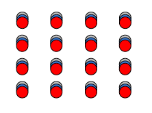{width="1.9375in"
height="1.71875in"}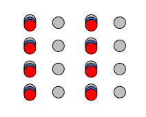{width="2.2083333333333335in"
height="1.78125in"}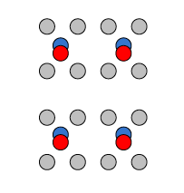{width="2.1145833333333335in"
height="2.21875in"}

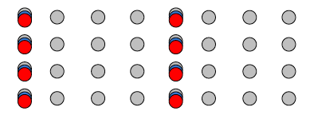{width="4.052083333333333in"
height="1.5520833333333333in"}

Digitálne video
---------------

-   Definované sériou po sebe idúcich snímkov, zobrazovaných s určitou
    periódou (frame rate, eg. 24fps, 60fps)

### Parametre videa

-   Snímková frekvencia

-   Prekladanie - snímok sa rozdelí na dva polsnímky, jeden obsahuje
    párne riadky, druhý nepárne, používa sa aby bol obraz viac smooth a
    ľudské oko ho nazaznamenávalo ako trhané

Štatistická a psychovizuálna redundancia

Obraz a video obsahujú informácie ktoré sú pre človeka viac a menej
dôležité. Menej dôležité môžu byť odstránené ak to nenaruší subjektívny
vnem oka.

Štatistická redundancia

-   Redundancia medzi pixelmi

    -   Susedné pixely sú často podobné a korelované v priestore i v
        čase

    -   Používa sa run-length encoding u statického obrazu, kde je
        hodnota pixelu predikovaná

    -   Run length = symbol + počet symbolov v rade

-   Kódová redundancia

    -   Používa sa na odstránenie Huffman encoding u JPEG

Psychovizuálna redundancia

Vychádza z ľudského zrakového systému (HVS), redundancia sa dá redukovať
pomocou:

-   Jasové maskovanie

    -   Ak je rozdiel medzi jasmi veľmi malý, tak ich oko nedokáže
        rozpoznať

-   Priestorové maskovanie

    -   Založené na tom že vady obrazu sú viditeľné na spojitých
        plochách

-   Frekvenčné maskovanie

    -   Ľudský zrak je náchylnejší na nízkofrekvenčné zložky obrazu,
        takže vysokofrekvenčné sa môžu potlačovať

-   Dočasné maskovanie

    -   Použiteľné u videosekvencií kde pri zmene scény ľudské oko na
        určitú dobu plne nevníma detaily

-   Maskovanie farieb

    -   Farbonosné zložky sa podvzorkujú (lebo oko je citlivejšie na jas
        ako na farbu)

2) Predikční kódování a skalární kvantizace (lineární, nelineární), vektorová kvantizace.
=========================================================================================

Predikčné kódovanie

Princípom je odstránenie redundancie medzi po sebe idúcimi prvkami.
Kóduje sa iba nová informácia. Využíva sa podobnosť susedov, každý prvok
je kódovaný ako rozdiel medzi jeho aktuálnou hodnotou a predpovedanou
hodnotou ktorá bola vypočítaná v predchádzajúcom kroku. Príkladom je
DPCM modulácia (Differential Pulse Code Modulation)

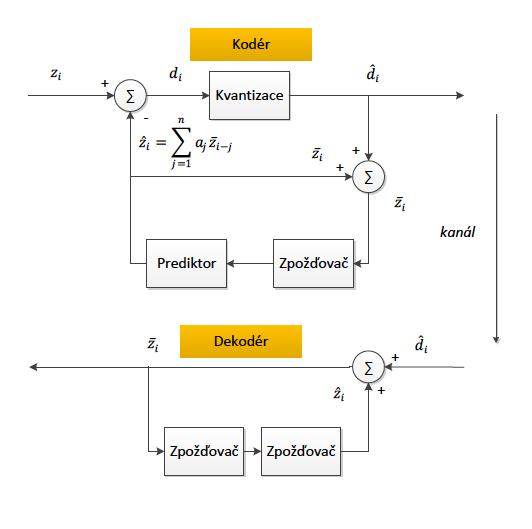{width="3.5989588801399823in"
height="3.585628827646544in"}

Pri použití basic DPCM kódera dochádza k akumulácii kvantizačnej chyby.
Využíva sa u JPEG, MPEG, H.26x, etc..

1D DPCM - pre predikciu sa používajú pixely na rovnakom riadku (bitmap)

2D DPCM - pre predikciu sa používajú pixely na rovnakom alebo predch.
riadkoch (bitmap)

3D DPCM - rovnako ako 3D DPCM, ale používajú sa aj predchádzajúce snímky
(video)

Kvantizácia

Kvantizér delí rozsah vstupných hodnôt signály na intervaly
identifikované určitým kódom. Kvantizácia ovplyvňuje kompresný pomer a
kvalitu výsledku. Pri vhodnom nastavení kvantizačných hladín je ťažké
rozoznať degradáciu obrazu.

-   Skalárna

    -   Uniformná (linear)

    -   Neuniformná (nelineárna)

-   Vektorová

**Lineárna skalárna kvantizácia**

Šírka kvantizačných krokov je rovnaká.

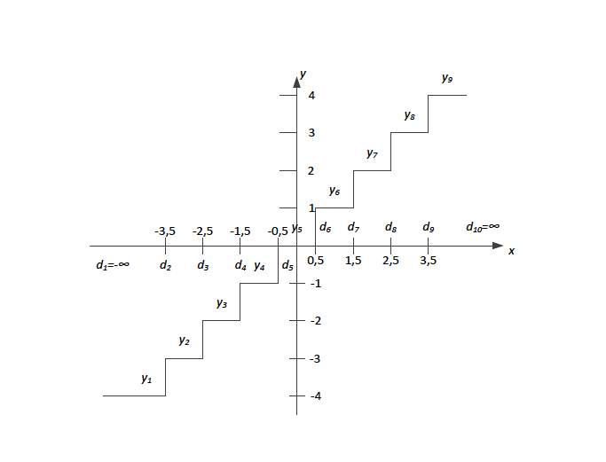{width="4.854166666666667in"
height="3.9895833333333335in"}

Os x predstavuje vstup do kvantizéru, os y je výstup kvantizéru. Pri
kvantizácii môže dojsť ku kvantizačnej chybe v rozsahu \<0;0,5\>
kvantizačného kroku.

**Nelineárna skalárna kvantizácia**

Veľkosť kvantizačných krokov je v celom intervale rôzna. Tento typ
kvantizácie sa používa pri audio kompresii, u obrazu sa nevyužíva.

**Vektorová kvantizácia**

U vektorovej kvantizácie nekvantizujeme symbol po symbole, ale sekvenciu
symbolov, čo z nej robí kvantizáciu efektívnejšiu ako skalárnu. Delíme
zdrojové dáta do blokov (vektorov).

U obr. dát to znamená že zoskupíme *L* pixelov do jedného bloku
(vektoru) o veľkosti *L*. Tento vektor je potom braný ako vstup do
vektorového kvantizéru. Kóder aj dekóder využívajúci vektorovú
kvantizáciu musia obsahovať kódovú knihu, čo je množina vektorov o
veľkosti *L*. Každý vektor je reprezentovaný binárnym indexom. Pri
kódovaní sa vstupný vektor porovná s vektormi v kódovej knihe a vyberie
sa najbližší podobný. Výstup je jeho index. Pri dekódovaní sa vezme
index a výstup je vektor pod týmto
indexom.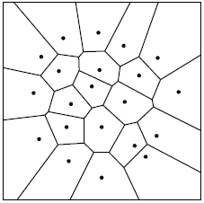{width="2.3645833333333335in"
height="2.3541666666666665in"}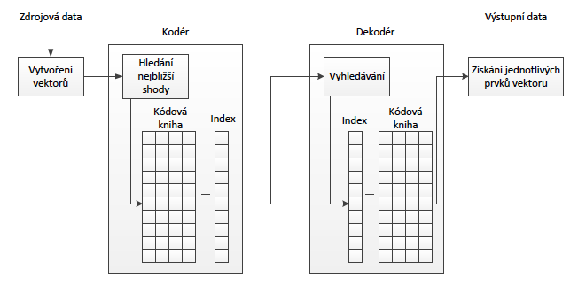{width="6.5in"
height="3.3055555555555554in"}

Visual: plochy zobrazujú skupiny pixelov a bodky zobrazujú výstupnú
hodnotu kódera po spracovaní dát.

Existuje algoritmus LBG (*Linde-Buzo-Gray*) ktorý slúži k automatickej
optimalizácii kódovej knihy.

3) Užívané metody pro odhad a kompenzaci pohybu u videu a jejich principy (FULL SEARCH THREE STEP SEARCH, LOGARITMIC SEARCH), subpixelová přesnost při vyhledávání.
===================================================================================================================================================================

Používa sa podobnosti susedných snímkov pre zvýšenie efektivity
kódovania a zníženie bitrate. Na druhú stranu to zvyšuje výpočtovú
náročnosť hlavne na strane kódera. Základný princíp spočíva v odčítaní
aktuálneho snímku od modelu vytvoreného blokom pre odhad pohybu. Tým
vznikne rozdielovy snímok ktorý je kódovaný a ďalej prenášaný do
dekódera spoločne s vektormi pohybu ktoré presne špecifikujú pohyb
jednotlivých blokov v snímku.

Rekonštrukcia prebieha tak že prenášaný rozdielový snímok je pripočítaný
k vytvorenému modelu. Snímok sa po rekonštrukcii stáva referenčným pre
ďalší kódovaný. Čím nesie rozdielový snímok menej informácií a čím
menšia je informácia o vektoroch pohybu, tým je algoritmus efektívnejší.

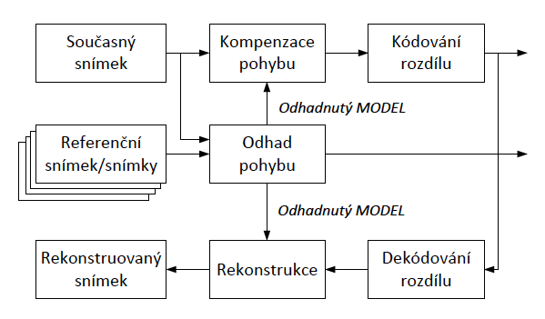{width="6.239583333333333in"
height="3.65625in"}

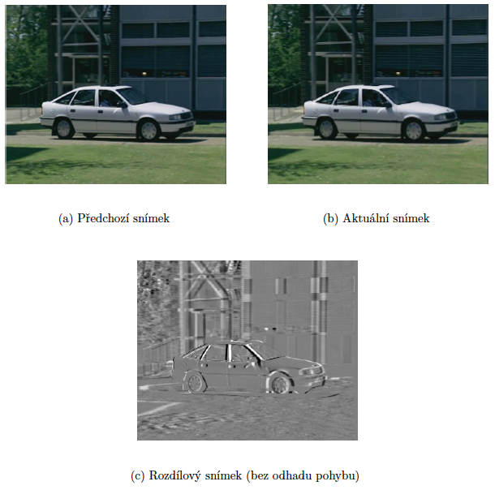{width="6.354166666666667in"
height="6.291666666666667in"}

Běžné standardy pro kódování video sekvencí (H.261, H.263, MPEG-4 AVC
(H.264),

MPEG-1, MPEG-2, MPEG-4 Visual) využívají pro odhad a kompenzaci pohybu
bloky o

velikostech 2x2, 4x4, 8x8 nebo 16x16 pixelů. Odhad pohybu je vždy
prováděn pouze na

jasové složce 𝑌
.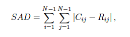{width="2.7291666666666665in"
height="0.7916666666666666in"}

Pri odhade pohybu sa hľadá najpodobnejší blok v referenčnom snímku (v
určitej oblasti), pomocou SAD (Sum of Absolute Difference).

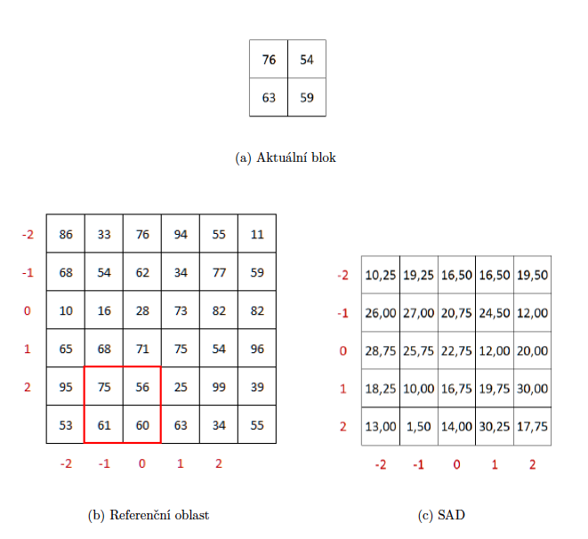{width="5.979166666666667in"
height="5.5in"}

Pri kódovaní videa:

1.  Výpočet SAD medzi aktuaálnym blokom a množinou susedných

2.  Výber bloku s najmenšou chybou.

3.  Odčítanie vybraného bloku v referenčnom snímku od bloku v aktuálnom
    snímku - vytvorenie rozdielového bloku (chyby predikcie)

4.  Kódovanie a prenos rozdielového bloku

5.  Kódovanie a prenos vektorov pohybu indikujúcich pozíciu vybraného
    bloku v referenčnom snímku vzťažne k pozícii bloku aktuálne
    kódovaného snímku

Dekódovanie videa:

1.  Dekódovanie rozdielového bloku a vektorov pohybu.

2.  Pričítanie rozdielového bloku k vybranému bloku referenčného snímku.
    Výber sa robí podľa pohybových vektorov.

Pre odhad pohybu sa používa viacero algoritmov.

**FULL SEARCH**

Prehľadáva celé prehľadávacie okno v referenčnom snímku, tým sa docieli
že vybraný blok je skutočne napodobnejším blokom v aktuálnom snímku.

Algoritmus nie je praktický z dôvodu že vyžaduje mnoho operácií
(porovnaní). V praxi sa moc nepoužíva, hlavne u SW kodekov ktoré musia
pracovať real-time a Full Search je náročný na výpočet.

V praxi je prehľadávacie okno vystredené na pozíciu bloku v aktuálnom
snímku.

Optimálna veľkosť prehľadávacieho okna záleží na: rozlíšenie, typ scény,
dostupné zdroje pre výpočet.

Pri prechode vyhľ. okna môže používa algoritmus rastrové prechádzanie,
alebo špirálové. Pri špirálovom je väčšia pravdepodobnosť že sa najlepší
blok nájde ešte pred prejdením celého okna, čo urýchli výpočet (pretože
najlepší je väčšinou blízko stredu)

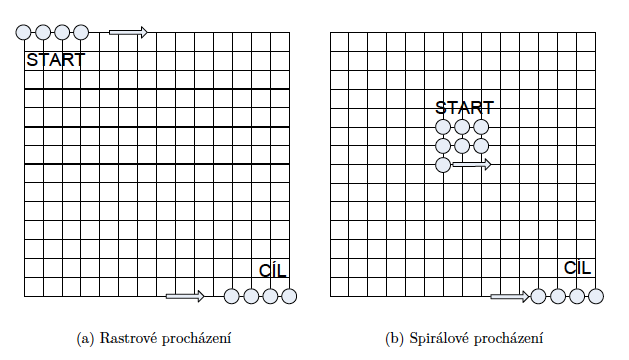{width="6.5in"
height="3.7222222222222223in"}

**THREE STEP SEARCH**

Vyhľadáva blok v troch krokoch. Ak je vykonaných viac krokov, nazýva sa
N-STE SEARCH. Vyhľadávacie okno má veľkosť *+-(2^N^ - 1)* od stredu
oblasti.

Postup:

1.  Nájdenie pozície (0,0)

2.  Nastavenie S = 2^N^ - 1 (veľkosť kroku)

3.  Nájdenie 8 pozícií +-S pixelov okolo (0,0)

4.  Výber z týchto 8 pozícií tej, ktorá má najnižšie SAD

5.  Nastavenie S = S/2

6.  Opakovanie bodov 3-5 do tej doby, kým S \>= 1.

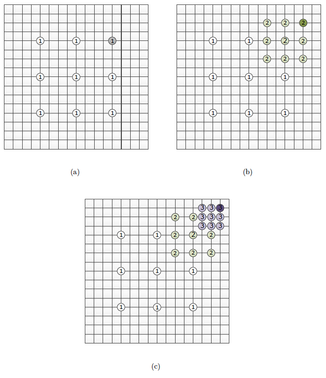{width="6.5in"
height="7.527777777777778in"}

Všeobecne platí že je urobených (8N + 1) krokov pri hľadaní. 3-step
search = 25 krokov

**LOGARITHMIC SEARCH**

Kroky:

1.  Nájdenie stredovej pozície (0,0) a nastavenie počiatočného kroku S

2.  Nájdenie 4 pozícií v horizontálnom a vertikálnom smere. 5 pozícií
    vytvorí tvar +

3.  Nastavenie nového stredového bodu do najlepšej pozície z týchto
    piatich.\
    Ak je najlepší bod stredový, tak S = S/2, ináč S ostáva nezmenené.\
    Stred bloku s najlepším SAD sa stáva stedom pre nasledujúce kroky.

4.  Ak S = 1, prechádza sa do bodu 5, ináč do bodu 2

5.  Vyhľadanie 8 pozícií v okolí poslednej stredovej pozície. Nájdenie
    bloku s najmenším SAD z 9 prehľadávaných.

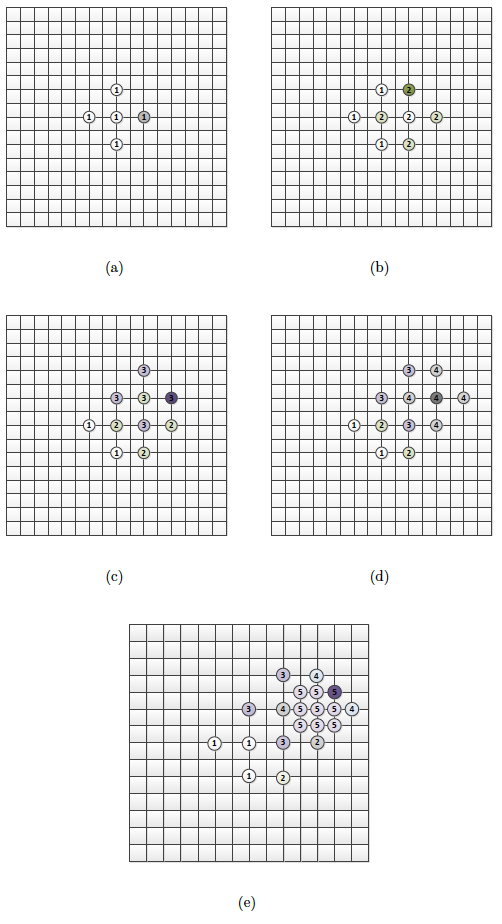{width="3.562720909886264in"
height="6.578125546806649in"}

4) Entropické kódování (Aritmetické, LZW, Huffmanovo) princip a jejich využití při kompresi multimediálních dat.
================================================================================================================

**Huffmanovo kódovanie**

Symboly ktoré sa vyskytujú častejšie majú kratšie kódové slová ako tie
ktoré sa vyskytujú menej často. Huffmanov kód sa dá vytvoriť s
pravdepodbnostným modelom zdroja, alebo aj bez neho. Kódové slová pre
najmenej často vyskytujúce sa dva symboly majú rovnakú dĺžku a líšia sa
iba v poslednom bite.

Použitie u JPEG.

Pr.

• 𝑃(𝑐𝑒𝑟𝑣𝑒𝑛𝑎) = 𝑃(𝑧𝑒𝑙𝑒𝑛𝑎) = 0, 2,

• 𝑃(𝑚𝑜𝑑𝑟𝑎) = 0, 4,

• 𝑃(𝑏𝑖𝑙𝑎) = 𝑃(𝑐𝑒𝑟𝑛𝑎) = 0, 1.

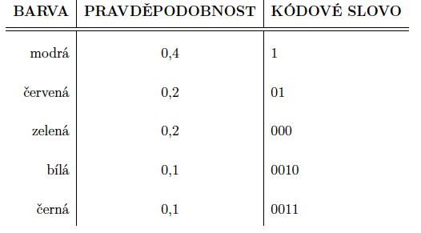{width="5.479166666666667in"
height="3.03125in"}

Step 1

P(blue) = 0,4 \[c(blue)\]

P(red) = 0,2 \[c(red)\]

P(green) = 0,2 \[c(green)\]

P(white) = 0,1 \[a~1~ 0\]

P(black) = 0,1 \[a^1^ 1\]

Step 2

P(blue) = 0,4 \[c(blue)\]

P(red) = 0,2 \[c(red)\]

P(green) = 0,2 \[a~2~ 0\]

P(white + black) = 0,2 \[a~2~ 1\]

Step 3

P(blue) = 0,4 \[c(blue)\]

P(green + white + black) = 0,4 \[a~3~ 0\]

P(red) = 0,2 \[a~3~ 1\]

Step 4

P(green + white + čierna + red) = 0,6 \[a~3~\]

P(blue) = 0,4 \[c(blue)\]

Kedže ostávajú už len 2 koeficienty, tak priradíme kódové slová,

a~3~ = 0

c(blue) = 1

Step 5

P(blue) = 0,4 \[1\]

P(red) = 0,2 \[01\]

P(green) = 0,2 \[000\]

P(white) = 0,1 \[0010\]

P(black) = 0,1 \[0011\]

**LZW78 kódovanie**

Slovníková metóda kódovania. Adaptívny slovník.

Nechť kódujeme úsek

𝑤𝑎𝑏𝑏𝑎𝑝𝑤𝑎𝑏𝑏𝑎𝑝𝑤𝑎𝑏𝑏𝑎𝑝𝑤𝑎𝑏𝑏𝑎𝑝𝑤𝑜𝑜𝑝𝑤𝑜𝑜𝑝𝑤𝑜𝑜

metodou LZ78, kde 𝑝 značí mezery v textu:

Na počátku pá.zdný slovník se naplní prvními symboly k\'dovanými
hodnotou indexu

nastavenou na 0. První tři výstupy jsou \<0, C(w)\>, \<0, C(a)\>, \<0,
C(b)\>. Čtvrtým znakem je 𝑏, které již je na třetí pozici slovníku.
Pokud k němu připojíme následující symbol, dostaneme úsek 𝑏𝑎, který již
ve slovníku není. Tuto dvojici zakódujeme jako \<3,C(a)\> a přidáme
výraz 𝑎𝑏 na čtvrtou pozici slovníku. Tento postup opakujeme až do

úplného zakódování řetězu (tabulka 6.8). Při často se opakujících se
výrazech, například

v písních, může slovník obsahovat i delší text.

Výstup kodéru je potom \<0, C(w)\>, \<0, C(a)\>, \<0, C(b)\>, \<3,
C(a)\>, \<0, C(p)\>,

\<1, C(a)\>, \<3, C(b)\>, \<2, C(p)\>, \<6, C(b)\>, \<4, C(p)\>, \<9,
C(b)\>, \<8, C(w)\>, \<0,

C(o)\>, \<13, C(p)\>, \<1, C(o)\>, \<14, C(w)\>, \<13, C(o)\>.

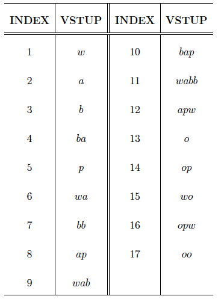{width="2.9427088801399823in"
height="4.065266841644794in"}

**LZW**

Vylepšenie LZ78, ktoré odstráňuje nutnosť kódovania druhého člena
dvojice \<o, l\>. Kóder posiela iba index výrazu v slovníku. Slovník
musí po inicializácii obsahovať všetky písmená zdroja. Pri následnom
pridávaní musí byť posledné písmeno každého výrazu počiatočné písmeno
výrazu nasledujúceho.

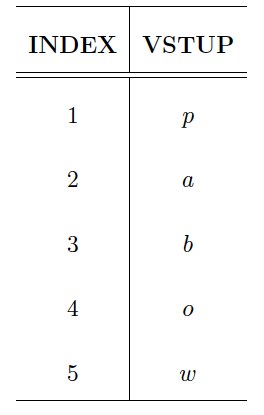{width="1.4600295275590551in"
height="2.2968755468066493in"}

Pr. - kódovanie

𝑤𝑎𝑏𝑏𝑎𝑝𝑤𝑎𝑏𝑏𝑎𝑝𝑤𝑎𝑏𝑏𝑎𝑝𝑤𝑎𝑏𝑏𝑎𝑝𝑤𝑜𝑜𝑝𝑤𝑜𝑜𝑝𝑤𝑜𝑜

Abeceda zdroje obsahuje znaky 𝑝, 𝑎, 𝑏, 𝑜,𝑤.

Slovník po inicializácii (prvý obrázok).

Kodér nejprve čte písmeno 𝑤, které je ve slovníku pod indexem 5. Sloučí
ho s dalším
a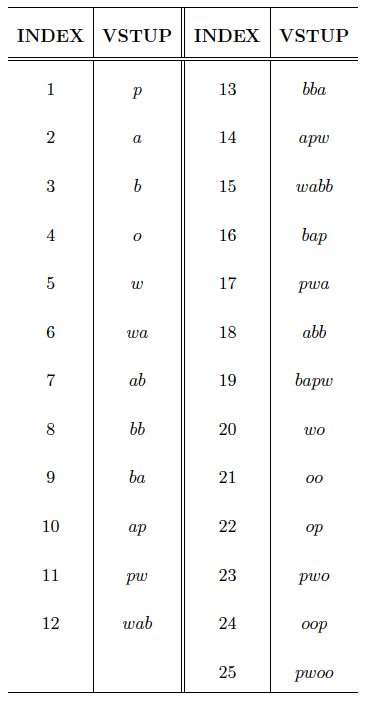{width="2.5364588801399823in"
height="4.825457130358705in"}

dostane výraz 𝑤𝑎, který ještě ve slovníku není. Písmeno 𝑤 tedy zakóduje
s indexem 5 a

výraz 𝑤𝑎 přidá do slovníku pod indexem 6. V kódování pokračuje písmenem
𝑎. I to je ve

slovníku pod indexem 2. Písmeno 𝑎 tedy spojí s následujícím písmenem 𝑏 a
získá se výraz

𝑎𝑏. Ten opět není ve slovníku, tudíž 𝑎 zakóduje indexem 2 a výraz 𝑎𝑏
přidá jako sedmou

položku slovníku. Dále kodér pokračuje stejným způsobem a vytváří tak
dvoupísmenová

spojení, dokud nenarazí na další 𝑤 v druhém slově 𝑤𝑎𝑏𝑏𝑎. V tomto stavu
se výstup skládá z indexů: 5 2 3 3 2 1.

Další písmeno v kódovaném výrazu je 𝑎. Kodér ho spojí s předchozím 𝑤 a
dostane výraz 𝑤𝑎. Ten ale ve slovníku již existuje, proto ho spojí s
následujícím písmenem 𝑏. Získá výraz 𝑤𝑎𝑏, který se již ve slovníku
nevyskytuje. Spojení 𝑎𝑏 se tedy zakóduje indexem 6, výraz 𝑤𝑎𝑏 je zapsán
do slovníku pod indexem 12 a kodér pokračuje v kódování písmene 𝑏. Po
sérii dvojic jsou tedy zapisovány do slovníku trojice. Při dalším
pokračování délka výrazů ve slovníku stále roste. Slovník na konci
kódování vypadá stejně, jak je naznačeno v tabulce 7.8. Všimněme si, že
od indexu 12 po index 19 jsou výrazy tří až čtyř písmenné. Poté kodér
poprvé narazí na výraz woo a do slovníku jsou zapsány opět pouze
dvou-písmenné výrazy, po kterých ale opět nastane nárůst délky.

Výstupem kodéru je potom sekvence indexů 5 2 3 3 2 1 6 8 10 12 9 11 7 16
5 4 4 11 21

23 4.

Slovník + encoded sekvencia sa pošle do dekódera, tam sa poskladá
reťazec zo slovníka.

LZW je neúčinné pri niektorých sekvenciách, napr *abababab*... sa
poserie slovník.

Aritmetické kódovanie

Problémem Huffmanova kódování je fakt, že kóduje s přesností na jeden
bit. Huffmanovo

kódování je tedy vhodné použít pouze v případech, kdy pravděpodobnost
výskytu symbolů

je mocninou hodnoty −2 (např. 1/2, 1/4, 1/8 apod.).

Problém s přesností na jednotky bitů aritmetické kódování eliminuje tím,
že kódové slovo

nepřiřazuje jednomu symbolu, ale celé vstupní posloupnosti. Aritmetické
kódování je zahájeno v jednom intervalu čtením vstupní sekvence symbol
po symbolu. Při tom pracuje s pravděpodobností jednotlivých symbolů a
původní interval zužuje. Specifikace užšího intervalu potřebuje větší
počet bitů, který při postupném kódování všech symbolů postupně narůstá.
Interval je specifikován spodní a horní hranicí, inicializační interval
je zpravidla \< 0, 1). Výstupem aritmetického kódování je číslo
spadající do intervalu \< 0,
1).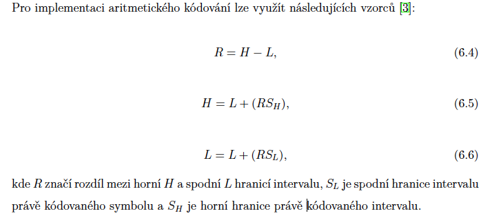{width="6.5in"
height="2.9166666666666665in"}

Príklad - GARRY BABBAGE

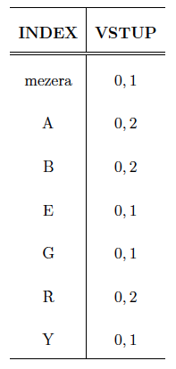{width="2.0520833333333335in"
height="4.3125in"}

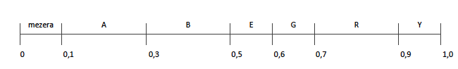{width="6.5in"
height="0.9861111111111112in"}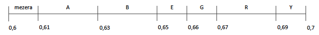{width="6.5in"
height="0.7361111111111112in"}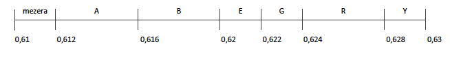{width="6.5in"
height="0.8333333333333334in"}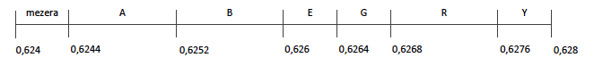{width="6.5in"
height="0.8194444444444444in"}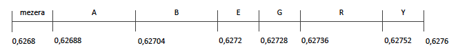{width="6.5in"
height="0.75in"}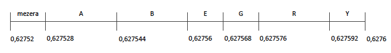{width="6.5in"
height="0.8888888888888888in"}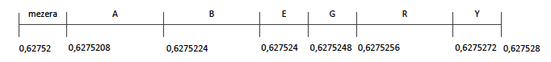{width="6.5in"
height="0.7361111111111112in"}

Atď, atď. Výsledok je akékoľvek číslo v intervale \< 0, 627522678144; 0,
6275226781696).

5) Transformace obrazových dat (DCT, DWT, WHT) - základní princip.
==================================================================

Transformačné kódovanie - vzorky z priestorovej oblasti sú
transformované do inej reprezentácie (transformačnej domény). Používa sa
hlavne z toho dôvodu, že vzorky z priestorovej časti sú vysoko
korelované a celková energia snímku je rozložená do celého snímku. Pri
vhodnej transformácii sa dáta lepšie komprimujú bez znateľnej straty na
kvalite. Transformačné kódovanie koncentruje energiu do malého počtu
vzorkov, ktoré sú však veľmi dôležité - dekoreluje vstupné dáta.

Transformácie sú lineárne a používajú transformačné matice pre doprednú
a spätnú transformáciu. Sú navzájom inverzné (𝐴𝐵 = 𝐵𝐴 = 𝐼, kde 𝐼 je
jednotková matica). U obrazu sa používajú 2D matice.

𝜃 - sekvencia transformovaných koeficientov

𝑥 - vstupné hodnoty

𝜃 = 𝐴𝑥

𝑥 = 𝐵𝜃

Kde *A* a *B* sú matice o veľkosti *N x N.*

**DCT (Discrete Cosine Transformation)**

Je aplikovaná na menšie bloky (napr. 8x8 px), používa sa hlavne u JPEG,
H.261, H.263, H.263+, MPEG-2, MPEG-3.

Dokáže transformovať obraz do podoby ktorá je vhodná ku kompresii a
zároveň k SW a HW implementácii.

Základná matica pre 2D-DCT o veľkosti bloku 8x8:

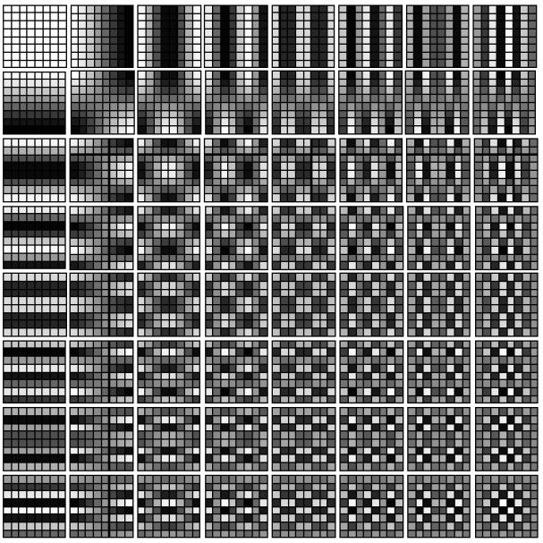{width="3.744792213473316in"
height="3.744792213473316in"}

Pozri videá z otázky 7 (jpeg), je to tam super vysvetlené.

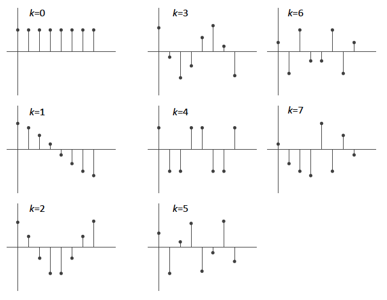{width="4.046875546806649in"
height="3.1475699912510935in"}

Obraz sa rozdelí na bloky 8x8 px ku ktorým sa hľadá najbližší koeficient
DCT matice, resp. Kombinácia koeficientou s určitou váhou. Blok sa
reprezentuje transformačnou maticou, v ktorej sú váhy (basically ako
veľmi daný blok zo základnej matice prispieva k celkovému obrazu)

**DWHT (Discrete Walsh-Hadamard Transformation)**

Aplikovaná na menšie bloky (napr. 8x8 px), používa sa napr. u H.264.

Transformačná matica je tvorená diskrétnou hadamardovou maticou *H* o
veľkosti *N x N* a platí že 𝐻𝐻^𝑇^ = 𝑁𝐼, kde 𝐼 je identická matica
rozmerov 𝑁 x 𝑁. Rozmer Hadamardovej matice môže byť iba mocnina
2.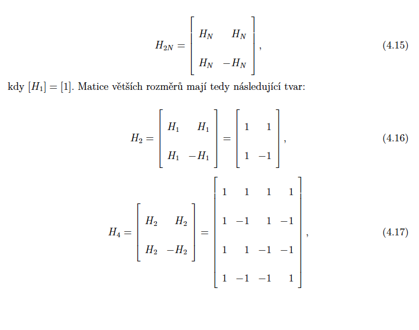{width="5.140625546806649in"
height="4.049058398950131in"}

Transformačná matica pre DWHT sa získa normalizáciou hadamardových matíc
koeficientom $\frac{1}{\sqrt{N}}$

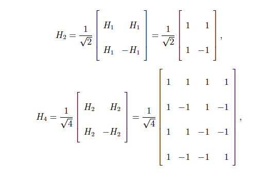{width="5.34375in"
height="3.7083333333333335in"}

DWHT sa vďaka svojej jednoduchosti používa hlavne tam, kde je potreba
minimalizovať výpočtovú náročnosť.

**DWT (Discrete wavelet transformation)**

Some Indian wisdom first:

[[https://www.youtube.com/watch?v=QX1-xGVFqmw]{.underline}](https://www.youtube.com/watch?v=QX1-xGVFqmw)

[[https://www.youtube.com/watch?v=F7Lg-nFYooU]{.underline}](https://www.youtube.com/watch?v=F7Lg-nFYooU)

Obvykle používaná na väčšie plochy obrazu, alebo celý obraz, používa sa
v JPEG-2000, MPEG-4 pre statické obrazy. Dobrá na kompresiu alebo
denoise obrázkov. Ide v podstate o to že obrázky ktoré majú často ostré
farebné alebo jasové prechody (transienty) sa lepšie reprezentujú
vlnkovou transformáciou, ako furiérovou transformáciou.

Tomuto ani kokot nerozumiem.

6) Metody SPIHT a EZW.
======================

Typy entropického kódovania (rovnako ako huffman alebo LZW).

**EZW**

Zaisťuje kvantovanie a kódovanie vychádzajúce z vlastností vlnkovej
transformácie. Využíva fakt, že koeficienty v jednotlivých sub-pásmach
reprezentujú rovnakú priestorovú oblasť. Pri kompresii reálneho obrazu a
rozklade týmto spôsobom sa najviac energie sústredí do pásiem s nízkou
prekvenciou.

Cieľom je poslať najprv dôležité informácie a mať možnosť ukončenia
kódovania a dekódovania keydkoľvek, mať v dobe ukončenia tie najlepšie
výsledky.

Kódovanie má 2 kroky:

-   Kódovanie významných koeficientov

-   Upresnenie

Ani kokot tomuto nechápem. Neznášam vlnky.

**SPIHT**

Je kódovanie pdoobné EZW, na rozdiel od neho však kóduje na princípe
rodič-potomok. Koeficient s najnižšou frekvenciou nemá žiadneho potomka
a všetky ostatné koeficienty majú 4 potomkov. Má narozdiel od EZW
binárnu presnosť.

Transformuje koeficienty DWT do toku bitov. Počtu bitov odpovedá kvalita
obrazu.

Tiež ani kokot tomuto nechápem. Dopiči s vyjebanými štátnicami.

7) Podrobný popis standardu pro kompresi obrazu JPEG.
=====================================================

Tieto videá od Computerphile. Period.

[[https://www.youtube.com/watch?v=LFXN9PiOGtY]{.underline}](https://www.youtube.com/watch?v=LFXN9PiOGtY)
(len color space základy)

[[https://www.youtube.com/watch?v=n\_uNPbdenRs]{.underline}](https://www.youtube.com/watch?v=n_uNPbdenRs)
(JPEG pt1)

[[https://www.youtube.com/watch?v=Q2aEzeMDHMA]{.underline}](https://www.youtube.com/watch?v=Q2aEzeMDHMA)
(JPEG pt2)

JPEG sa spolieha na to že ľudské oko je menej citlivé na farby a
vysokofrekvenčné zložky obrazu.

JPEG postup:

1.  Prevod do YCbCr

2.  Downsampling farebných zložiek

3.  DCT transformácia každej farebnej zložky, 8x8 bloky

-   Zahŕňa padding pixel hodnôt (-128 ak je 8bpp color space, aby sa
    dala DCT vypočítať)

-   Dostaneme 2D DCT transformačnú tabuľku v ktorej sú koeficienty
    (váhy) každej cosine funkcie ktoré znamenajú, ktoré cosine funkcie
    sa ako veľmi podieľajú na zobrazení tohto 8x8 bloku

4.  Kvantizácia

    a.  Výsledné hodnoty transformačnej tabuľky sa kvantizujú podľa
        kvantizačnej tabuľky (každý SW má inú, každá nastavená kvalita
        JPEG má inú) väčšinou to býva tak, že nízkofrekvenčné
        koeficienty ktoré sú na začiatku majú oveľa väčšie hodnoty ako
        vysokofrekvenčné koeficienty na konci, takže po kvantizácii sa
        väčšina vysokofrekvenčných stratí (má veľmi malú hodnotu).

    b.  Kvantizácia prebieha tak že hodnoty v DCT transformačnej tabuľke
        sa podelia hodnotami kvantizačnej tabuľky, ktoré sú u vyšších
        frekvencií vyššie, takže sa stratia

    c.  Potom sa kvantizované hodnoty zoserializujú Zig-Zag jak na
        obrázku, takže na konci budú nuly, to sa potom ľahko kóduje
        huffanovým kódovaním

5.  Kódovanie

    d.  Huffman

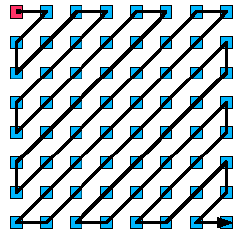{width="2.5208333333333335in"
height="2.4270833333333335in"}

8) Standardy MPEG-1 a MPEG-2, programový a transportní stream.
==============================================================

**MPEG-1**

Učený na kompresiu videa na bitrate do 1,5 Mbps s dosiahnuteľným
kompresným pomerom 150:1. Pracuje s neprekladanými snímkami. Používa sa
na záznamy na CD-ROM, videotelefóny, videokonferencie, etc. Pre vysoké
kompresie používa formát SIF (Source Input Format) 4:2:0.

Preberá väčšinu princípov z JPEG (DCT, kvantovanie, entropické
kódovanie) a naviac používa:

-   DPCM s predikciou a využitím vektoru pihybu, k zníženiu redundancie
    v časovej oblasti.\
    U DPCM je signál spracovnávaný v makroblokoch, pre Y (luminančnú
    zložku) sú to 4 bloky (16x16) a 2 bloky chrominančných signálov.

-   Definuje 3 typy snímkov

    -   Snímky I (Interframe Coded Frames)\
        Opakujú sa po 12 snímkoch, sú spracované pomocou DCT bez DPCM,
        sú teda úplné a je k nim priamy prístup

    -   Snímky P (Predicated Frames)\
        Prenáša sa u nich iba rozdiel aktuálneho snímku voči
        predchádzajúcemu snímku P alebo I. Táto jednosmerná dopredná
        predikcia znižuje bitovú rýchlosť dvakrát.

    -   Snímky B (Bidirectionally Coded Frames)\
        Prenáša sa rozdiel aktuálneho snímku B interpoláciou priemeru
        predchádzajúceho a nasledujúceho snímku I alebo P. Touto
        obojsmernou predikciou sa znižuje bitová rýchlosť až 8x. Pre
        predikciu musia buť uložené v pamäti snímky z ktorých sa
        predpovedá, preto je nutné zmeniť poradie odosielania oproti
        snímaniu.

    -   Snímky D\
        Obsahujú iba DC koeficienty blokov pre rýchly seeking videom

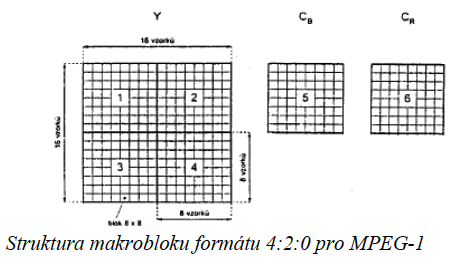{width="4.802083333333333in"
height="2.7291666666666665in"}

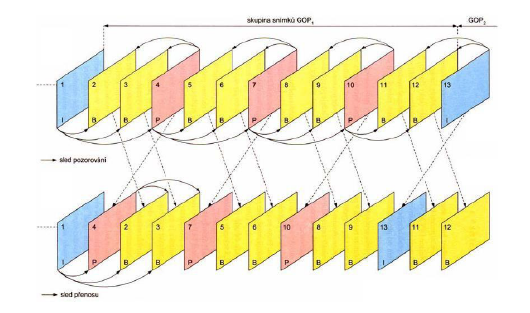{width="5.520833333333333in"
height="3.2604166666666665in"}

**GOP** (Group of Pictures) je skupina 12 snímkov ktorá začína I
snímkom. Aby mal dekóder signálu východzí bod pre svoju činnosť.

Vektor pohybu sa určuje vyhľadávaním pohybu voči predchádzajúcemu snímku
cez makrobloky. Vektor pohybu má formu súradníc ktoré reprezentujú
rozdiel polohy oboch makroblokov. Vyhľadávacie okno má veľkosť +/- 15,5
vzorky horizontálne

a +/- 7.5 vzorky vertikálne. Ak sa nenájde makroblok ktorý odpovedá
povolenej tolerancii, tak sa makroblok kóduje ako makroblok snímku I. V
prípade B snímku sa prehľadáva aj nasledujúci snímok, vektor pohybu teda
obsahuje dve súradnice, pre predchádzajúci a nasledujúci snímok.

**Vyrovnávacia pamäť** zaisťuje aby nedošlo k podtečeniu alebo
pretečeniu bufferu, v ideálnom prípade by mal byť buffer vždy plný. Jej
rovnomerné zaplnenie zausťuje riadené kvantovanie =\> konštantná bitová
rýchlosť výstupného dátového toku.

Bitový tok má 6 vrstiev a je multiplexovaný. Každá vrstva (okrem 6.) má
záhlavie, ktoré nesie údaje nutné pre demultiplexovanie na prijímacej
strane.

Vrstvy:

1.  Sekvencia

2.  GOP

3.  Snímok

4.  Slice

5.  Makroblok

6.  Blok

{width="5.458333333333333in"
height="5.34375in"}

**MPEG-2**

Formát vzorkovania 4:2:2, používa sa na DVD, bitová rýchlosť 4 až 100
Mbps, presnejšie vyjadrenie DC zložky a maximálna veľkosť slice je jeden
riadok. Umožňuje voliť metódu skenovania DCT koeficientov a voliť
nastavenie kvantizácie. Používa rovnaké princípy komprimácie ako MPEG-1.

Oproti MPEG-1

-   Používa väčšie makrobloky - keďže používa 4:2:2 podvzorkovanie, sú
    chrominančné marrobloky väčšie

-   Nelineárne kvantovanie spektrálnych koeficientov v 4 úsekoch (0-255,
    256-511, 512-1023, 1024-2048)

-   Časovú predikciu je možné uskutočňovať v celosnímkovom alebo
    polsnímkovom móde

-   Kombinácia kódovaní pre rôzne aplikácie

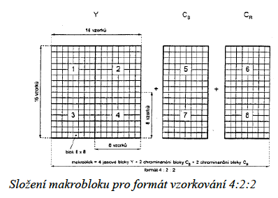{width="4.145833333333333in"
height="2.9583333333333335in"}

Predikcia s vektormi pohybu

-   Celosnímkový mód -- oba půlsnímky náleží stejnému snímku a jsou
    stejného typu I, P nebo B. Celosnímková predikce je stejná jako u
    MPEG-1, kdy pro P je jeden vektor pohybu a pro B dva vektory pohybu.
    Celosnímková predikce je vhodná pro statické obrazy. Pro
    půlsnímkovou predikci je makroblok rozdělen do dvou částí 16x8 a pro
    každou část je jeden vektor pohybu. U této predikce je zapotřebí
    dvojnásobný počet vektorů pohybu.

-   Půlsnímkový mód -- oba půlsnímky jsou považovány za samostatné
    snímky I, P, B. V každém půlsnímku se používá predikce jako u
    MPEG-1. Je vhodný pro pohyblivé obrazy

Má viacero profilov, každý má inú prenosovú rýchlosť.

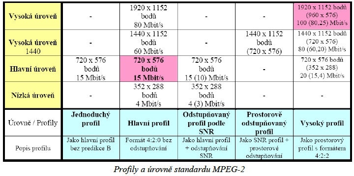{width="6.5in"
height="3.236111111111111in"}

Základná datová štruktúra - PES (Packetized Elementaty Stream)

-   Skladá sa z elementárnych dátových streamov

-   Každý stream nesie iba jeden typ dát (audio, video)

2 typy streamov

-   Program Stream

    -   Rôzne veľké pakety

    -   Vhodný pre SW založené bezstratové prostredie

    -   Skladá sa z jedného alebo viacerých multiplexovaných PES

-   Transport Stream

    -   Pakety pevnej dĺžky 188 B

    -   Navrhnuté pre prostredie s možným výskytom chýb (DVB, ATSC)

    -   Jeden alebo viacero programov v jednom streame

    -   Môžu byť pomocou neho prenášané aj iné dáta než MPEG-2, napr.
        MPEG-4, H.264

    -   Na začiatku každého paketu je PID

        -   Určije dekóderu čo robiť s paketom

Funkcia MPEG-2 transport stream

-   Prispôsobenie bitového toku fyzickej vrstve

-   Multiprogramová podpora

-   Podpora šifrovania

-   Copyright identifikácia

-   Schopnosť riadenia bitrate pomocou tretej strany

9) Nové metody užívané při kompresích za použití standardů MPEG-4, H.264.
=========================================================================

MPEG-4 vychádza z MPEG-2. Zdokonalená efektivita kompresie, flexibilita.
Má pokokot veľa profilov. Základný kóder je založený na rovnakom
princípe ako u MPEG-2.

Upustenie od tradičného pohľadu na video sekvenciu pravouhlých snímkov.
MPEG-4 definuje tzv. sekvenciu objektov videa. Je to určitá oblasť vo
video scéne ktorá má určitú veľkosť a existuje v určitý časový okamžik
(VO - video object). Instancia VO v určitom čase (časová súvisloť VO) sa
nazýva VOP (Video Object Plane). Takto vie MPEG-4 kódovať určité objekty
vo videu vyššiou kvalitou ako menej dôležité (napr. herec a statické
pozadie).

VO je charakterizovaný svojim tvarom, textúrou a pohybom. Scéna je
zložená z niekoľkých VO. Každý VO sa kóduje samostatne. Súvisiace VO sú
združované do skupín. Každá VOP je zakódovaná do niekoľkých obrazových
objektových vrstiev VOL (Video Object Layer).

Kompresný algoritmus používa pre každú VOP sekvenciu blokovo založenú
DPCM ako v predch. štandardoch MPEG (I, P B snímky).

Každá VOP je rozdelená do makroblokov 4:2:0, makrobloky podliehajú DCT
transformácii a koeficienty DCT sú kvantované, následne sa Zig-Zag
koeficienty prečítajú a kódujú entropickým kódovaním. Používa sa
vyrovnávacia pamäť a všetko ostatné z predch. MPEG.

Kódovanie tvaru, textúru a kompenzácia pohybu

Standard MPEG-4 podporuje dvě metody kódováni tvaru -- binární kódování
a šedotónové kódování. Obsahuje-li tvarová informace šedotónové hodnoty
je kódovaná ve dvou částech -- vytváří se binární maska a přidružené
hodnoty intenzity. Obraz se dále dělí na binární alfa bloky BAB o
velikosti 16 x 16 pixelů, které jsou pak samostatně kódovány,

hodnoty intenzity mohou být kódovány jako textura nebo průměrem hodnot
intenzity pixelů náležících objektu, dále pak lineárně nebo filtrováním.

Texturou se v případě I-VOP rozumí informace o jasových a chrominančních
hodnotách pixelů makrobloků VOP, v případě P-VOP a B-VOP pak chyby v
pohybové kompenzaci. Pro kódování textury se používá DCT (případně její
další adaptivní modifikace). Odhad pohybu a jeho kompenzace se provádí
mezi bloky nebo makrobloky P-VOP a B-VOP a postup je velmi podobný jako
v předchozích standardech MPEG, jen s rozšířením na objekty libovolného
tvaru. Makrobloky se dělí na obrysové a vnitřní, kompenzace pracuje
pouze s makrobloky vnitřními.

Štandard MPEG-4 AVC (H.264)

Standard H.264 je momentálně „nejstandardnějším" ze všech moderních
širokopásmových videoformátů. Standardizován byl ITU pod názvem H.264 ve
spolupráci s ISO/IEC Moving Picture Experts Group, kde byl pojmenován
MPEG-4 Part 10 (formálně jako SO/IEC 14496-10). Zkratka AVC značí
Advenced Video Coding a vztahuje se k standardizaci MPEG skupinou.

Tato dvojí identická standardizace má svůj význam. H.264 se díky tomu
dostává jak na mobilní telefony (jako formát 3GP), tak na další rádiové
technologie prostřednictvím evropského standardizátora ITU -- například
do vysílání DVB nebo do předpokládané evropské TV s vysokým rozlišením
(HDTV). Prostřednictvím standardizace v MPEG skupině se zase H.264
dostává jako podporovaný formát budoucích vysokorozlišitelných DVD -- ať
již HD DVD nebo Blue-Ray.

Z hlediska technické perspektivy lze H.264 pokládat za do budoucna
nejrozšířenější formát.

Pri použití kodeku sú k\'dované dáta rozdelené do dvoch hladín:

1.  VCL (Video Coding Layer) - sekvencia bitov reprezentujúca kódované
    video data

2.  NAL (Network Abstraction Layer) - vrstva obsahujúca datové jednotky
    pre prenos alebo uloženie

Každý kodér i dekodér obsahuje dva seznamy referenčních snímků -- seznam
0 a seznam

1\. Pro predikci může být vždy použít jeden nebo dva snímky z těchto
seznamů. Na rozdíl

od předešlých standardů se soubor referenčních snímků rozšířil z I a P
na S, P, B, SP a SI:

-   Snímek I obsahuje pouze makrobloky I (Každý blok nebo makroblok je
    predikován z již k.dovaných ve stejném proužku

-   Snímek P obsahuje makrobloky predikované ze seznamu referenčních
    snímků 0 a/nebo z makrobloků I.

-   Snímek B obsahuje makrobloky B predikované ze seznamu referenčních
    snímků 0 a/nebo 1 a/nebo z makrobloků I

-   Snímek SP umožňuje přepínání mezi různě k.dovanými streamy, obsahuje
    P a/nebo I makrobloky

-   Snímek SI umožňuje přepínání mezi různě k.dovanými streamy, obsahuje
    speciální typy makrobloků -- makrobloky SI

10) Protokoly používané pro přenos multimediálních dat - RTP, RTCP, SDP.
========================================================================

Protokol RTP (Real-time Transport Protocol) prenáša dáta, protokol RTCP
(Real-time Control Protocol) je signalizačný protokol.

RTP (Real-time Transport Protocol)

Protokol aplikačnej vrstvy, slúži výhradne na prenos multimediálnych
dát. IPTV, alebo VoD.

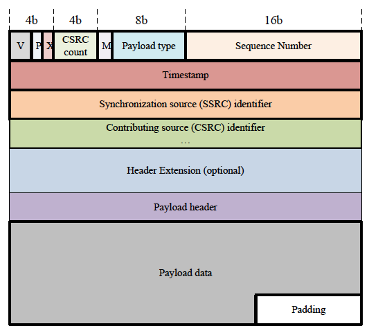{width="4.203125546806649in"
height="3.8167213473315837in"}

Verzia (2b) - verzia protokolu, momentálne je to 2

Padding (výplň, 1b) - indikuje výskyt paddingu za payloadom

Extension (1b) - ak je 1, tak sa štandardná hlavička dopĺňa doplnkovou
hlavičkou ktorá je optional

CSRC count (4b) - počet CSRC indikátorov ktoré rozširujú základnú
hlavičku

Marker (1b) - Interpretácia tohto bitu je daná profilom (napr. oznámenie
že sa repnáša posledný paket, etc.)

Payload Type (7b) - typ prenášaného payloadu, definované v
štandardizovanej tabuľke, hodnoty 96-127 sú reserved

Sequence number (16 b) - sekvenčné číslo paketu, prijímač tak môže
detekovať stratené pakety alebo ich poradie, keď dosiahne max. Hodnotu
tak sa nuluje, preto by sa naň nemalo spoliehať, 16b je málo a resetuje
sa cca raz za 20 minút ak sa posiela jeden paket každých 20ms.

Timestamp (32b) - okamžik prvého oktetu dát v pakete, využíva sa pri
plánovaní prehrávania (kedy má decoder poslať snímok na zobrazenie\...
proste\... timestamp prichádzajúcich snímkov)

Synchronization Source Identifier (SSRC, 32b) - identifikuje
jednotlivých účastníkov RTP relácie. Je generované lokálne, čo môže
spôsobiť kolíziu. Ak nastane kolízia tak musí klient ukončiť reláciu a
nadviazať ju nanovo.

Contributing Source Identifier (CSRC, 32b) - za normálnych okolností sú
dáta v pakete generované jedným zdrojom, v prípade viacerých zdrojov za
použitia mixéra môže paket niesť dáta z viacerých zdrojov. Počet týchto
záznamov je definovaný v poli CSRC count

Header Extension (min. 32b) - Rozšírená hlavička, ak je Extension field
1

Payload Header (32b) - Hlavička payloadu

Payload Data - samotný payload

RTCP (Real-time Control Protocol)

Používa sa na kontrolu a riadenie multimediálnej relácie. Zaisťuje:

-   Kvalitu zlužieb a kontrolu zahltenia\
    Poskytuje spútnú väzbu na kvalitu distribúcie RTP paketov. Sender
    Reports (SR) umožňujú prijímaču odhadovať prenosovú rýchlosť a
    kvalitu prenosu. Receiver Reports (RR) nesú info o problémoch v
    prijímači, čísla stratených paketov, info o jitteri a delayi

-   Identifikáciu\
    RTCP pakety nesú info o zdroji RTP (Canonical Name) - CNAME ktoré
    musí byť oproti identifikátoru SSRC RPT paketu jedinečné. Prijímacie
    stanice to využívajú k identifikáciá a zoskupení viacerých streamov
    od jedného usera

-   Odhad veľkosti relácie\
    Každý účastník posiela periodicky info sám o sebe. S navyšujúcim sa
    počtom účastníkov rastie interval zasielania týchto správ, z čoho sa
    dá odhadnúť veľkosť relácie. U sedenia s malým počtom účastníkov sa
    posiela cca každých 5 sekúnd. RTCP pakety by mali zaťažiť linku max.
    5% z celkovej prenosovej rýchlosti relácie

Formáty paketov

-   Sender Report (SR)

-   Receiver Report (RR)

-   Source Description (SDES)

-   Goodbye (BYE) - indikuje odchod účastníka z relácie

-   Application specific (APP)

SDP (Session Description Protocol)

Zaisťuje prenos detailov o prenášaných dátach potrebných pri naväzovaní
spojenia v multimediálnych konferenciách, VoIP hovoroch, streamovaní
videa či iných spojeniach. Napr. WebRTC používa tiež.

SDP nie je transportný protokol, k jeho prenosu sa používajú protokoly
SAP (session announcment protocol), SIP (session initiation protocol),
RTSP (real time streaming protocol), HTTP, websocket... etc, záleží na
konkrétnej implementácii.

Popis relácie obsahuje

-   Názov relácie a jej účel

-   Čas po ktorý je relácia aktívna

-   Média obsiahnuté v relácii

-   Info potrebné k prijímu (adresy, porty, formáty, etc)

-   Info o šírke pásma

-   Kontaktné informácie

Je textovo orientovaný, používa UTF-8, popis protokolu je zložený z
niekoľkých riadkov vo formáte \<TYP\> = \<HODNOTA\>

Napr.

v = (protocol version)

s = (session name)

b = (bandwidth info)

k = (encryption key)

t = (time the session is active)

m = (media name and transport adress)

Skúsiť dať príklad z WebRTC

SDP offers

SDP answers
