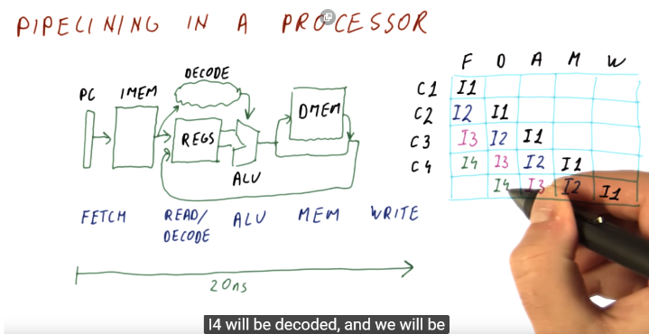
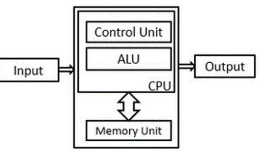
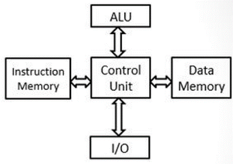
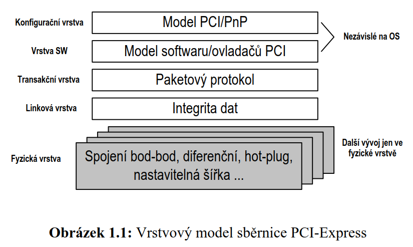
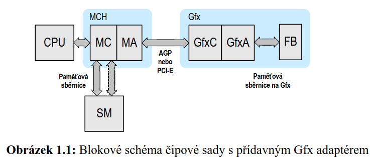
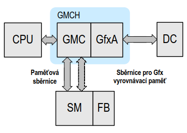
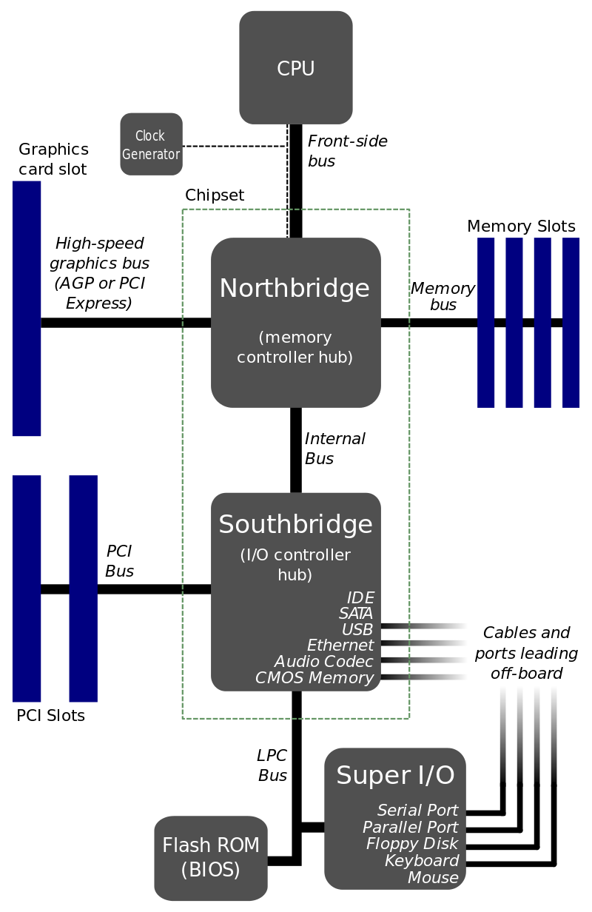

Základní pojmy z počítačové techniky, architektury, úzké profily. 
==================================================================

**Počítač --** stroj pre číslicové alebo logické spracovanie dát.
Pracuje samostatne podľa programu ktorý je vložený do pamäti. Skladá sa
z CPU, main memory a I/O zariadení (klávesnica, myš, monitor)

Rozdelenie:

-   Mainframe (stacionárne) -- tzv. sálové počítače, sú veľmi výkonné
    a treba špec. Personál na obsluhu

-   Supercomputer -- väčšie a výkonnejšie ako mainframe.

-   Minicomputer -- menšie ako mainframe a menej výkonné a lacnejšie,
    treba špec. Obsluhu, moc sa nepouživajú lebo ich vytláčajú PC

-   Mikrocomputer (Personal Computer, MAC) -- multiúčelový počítač,
    ktorý je určený pre použitie jednou osobou (okrem hrania, tam ich
    môže byť aj viac). Obsahuje jeden alebo viac monolitických CPU (viac
    jadier = viac CPU alebo „cores").

**Procesor** -- časť systému určená na postupné spracovávanie vstupov na
výstupy (lat. processor = spracovávateľ). Je to subsystém spracovania
dát. Často sa označením myslí CPU

**Central Processor Unit** - CPU, mozog počítača, ktorý robí základné
aritmetické a logické operácie a obsluhuje vstupy a výstupy programov
ktoré vykonáva.

Zloženie:

-   ALU (*Arithmetic-Logic Unit*) - aritmetické a logické operácie

-   FPU (*Floating Point Unit*) -- operácie s desatinnými číslami

-   Radič (Controller, Control unit) -- riadi vykonávanie operácii
    a chod celého CPU podľa inštrukcii programu

    -   Sada registrov - uchovávanie operačného kódu inštrukcii

    -   Dekóder -- dekóduje binárny kód na inštrukcie

**Mikroprocesor** -- Obsahuje CPU, GPU a rôzne obvody ktoré sú
integrované v 1 čipe.

**Pseudomikroprocesor (emulátor) =** niečo čo sa chová ako mikroprocesor
ale nie je to mikroprocesor = iba ho to emuluje.

**Řezova sada (slide set) --** názov súboru obvodov ktore realizujú
processor. Každý z rezov môže realizovať oeprácie nad danou dĺžkou slova
(word). Spojovaním slide set je možné realizovať operácie nad akoukoľvek
dĺžkou slova.

**Doba** je časový úsek (perioda) mezi stejnolehlými body dvou po sobě
následujících hodinových impulsů odvozených od pracovního kmitočtu
procesoru.

**Fáze** je označení pro jeden ze stavů řadiče, kterými prochází při
vykonávání strojové instrukce.

**Strojový cyklus** představuje jednu dobu nebo častěji několik dob,
cyklus se skládá z několika fází.

**Mikrooperace** je činnost procesoru nebo jeho logicky ohraničené části
během jedné fáze.

**Mikroinstrukce** je kódovaný příkaz pro uskutečnění mikrooperace
procesorem. Mikroinstrukce má obvykle dvě části: mikrooperční znak a
adresu další mikrooperace.

**Mikroprogramování** je sestavování mikroprogramu z mikroinstrukcí
podle algoritmu požadované operace.

**Strojová instrukce (instrukce)** je kódovaný příkaz k vykonání
strojové operace. Úplný soubor strojových instrukcí tvoří strojový kód
(binární nebo hexadecimální kód -- kvôli kompaktnosti je lepší hexa
kód). Proto se častěji programuje v jazyce symbolických adres
(symbolických instrukcí) -- na ten treba potom prekladač do binárky.

**Assembler** **(jazyk symbolickych inštrukcii)** je ľudsky čitateľná
reprezentácia strojového kódu, ktorú je ale potrebné pred použitím
skompilvoať do strojového kód cez assembler

**Pseudoinstrukce (direktiva**) je příkaz symbolického programovacího
jazyku, který se přímo nepřekládá do strojového kódu, ale ovlivňuje
funkci překladače.

**Makroinstrukce** je pokyn pro překladač, aby do cílového programu
zařadil předem definovanou posloupnost instrukcí, tzv. rozvoj
makroinstrukce.

**Přesahování (overlapping)** spočívá v tom, že vykonávání některých
instrukcí se v procesoru dokončuje v době náležící již další instrukci.
=uplne nechápem, našiel som iba k tomu že sa môže overlapping IO
inštrukcia a „normálna" inštrukcia.

**Window overlapping --** pri vykonávaní programu sa pre každý
vykonávanú časť (modul -- obsahuje registre a inštrukciu) dajú rozdeliť
registre na 3 časti , tú poslednú je potom možné použiť ako input pre
parameter register ´dalšieho modulu

{width="3.265972222222222in"
height="1.6819444444444445in"}

**Pipelining** zvyšuje priepustnosť inštrukcii = nemôžu pracovať s na
sebe závislými operandami

Během vykonávání jedné instrukce je možné načítat další instrukci do
registru instrukce - **pipelining** nebo-li překrývání (zřetězení)
instrukcí.

**Čipová sada (chipset)**-- komunikačný hub, trafic control centre (dáva
dokopy rôzne komponenty ako CPU, GPU, storage\... ), skladá sa z north
bridge (CPU,GPU + DDR + všetkyc high speed veci, ethernet) a south
bridge (prepojený na south bridge, stará sa o pomalé i/o ako usb, hdd,
ssd/m2\....). PCI express a DDR(X)

su v podstate rovnaké, chipset ale predpisuje socket pre CPU (Intel,
AMD\...)

***Pamäť***

*[Registre]{.underline} -- najrýchlejšie pamäte, malá kapacita. Desiatky
až stovky registrov podľa typu CPU.*

*[Cache]{.underline} -- pomalšia ako register. Kapacita kB až MB. Býva
blízko CPU. Býva realizovaná ako SRAM. Slúži na to že si do nej odkladám
data a potom ich naraz zapíšem do pamäte.*

*[Operačná pamäť]{.underline} = pomalšia ako buffer, býva realizovaná
ako DRAM*

*Vonkajšia pamät = SSD, HDD (GB/TB)*

***Radič (Unit Controller)***

*[Mikroprogramový (Microprogrammed)]{.underline} = je jednotka
s mikroinštrukciami v control memory ktorá generuje riadiace signály --
je pomalší ako obvodový a pridanie inštrukcie je iba pridanie
mikroinštrukcie do pamäti -- použitie CISC*

*[Obodový(Hardwired)]{.underline} = je sekvenčne riadený obvod ktorý
generuje riadiace signály na základe dekódovaných inštrukcii --
z princípu je rýchly, a pridanie inštrukcie znamená fyzické pridanie
súčiastok do obvodu = použitie RISC*

***ISA (Instruction Set Architecture)***

-   ***CISC Complex intruction Set Computer =*** Intel x86 a odvodené.
    Rôzne inštrukcie trvajú rôznu dobu (cyklov) Radič je zväčša
    mikroprogramový -- špecialne inštrukcie sú využívané veľmi málo 80%
    aplikácii používa 15-20% možnych inštrukcii. Výkon sa zvyšuje
    pridaním nových inštrukcii

-   ***RISC reduced intruction Set Computer =*** Má málo inštrukcii
    (pretože 80% inštrukcii je skok. Čítanie a zápis) ktoré sú výkonné
    a majú pevnú dĺžku (cykly). Pevná dĺžka umožnuje pipelining
    inštrukcii. Majú veľa registrov -- medzivýsledky sa ukladajú do
    registrov.

{width="2.3256944444444443in"
height="1.395138888888889in"}

***Von Neumannova architektura počítače:***

-   Minimální hardwarové požadavky -- realizace počítače musí být co
    možná nejjednodušší.

-   Univerzální architektura pro různé úlohy --architektura je
    univerzální, změna architektury pro jinou úlohu je nežádoucí.

-   Počítač pracuje sekvenčně -- 2. inštrukia sa začne vykonávať až po
    dokončení 1. inštrukcie

-   špecifická tým že je program(inštrukcie) a data(operandy) uložené v
    1 pamäti. Pamäť je RAM (skrz L1 L2 a L3 cache)

-   **Nevýhody -** nedostatok paralelizmu (iba jedna činnosť v čase =
    nevie pipelining), pomalá práca s pamäťou (1 common zbernica pre
    pamäť -- vie načítať iba data alebo iba inštrukciu, **nemožný
    pipelining inštrukcii**)

{width="2.1020833333333333in"
height="1.4777777777777779in"}

***Harwardská architektura počítače:***

> • **Znásobení všech sběrnic** -- Má pre každú z funkčných zberníc
> vlastné fyzickú zbernice (viac adresných, viac dátovych\...). týmto je
> umožné načítať inštrukciu a dáta z pamäte naraz -- **umožnuje to teda
> pipelining** (viz vyššie)
>
> • **Pamäť je rozdelená** - pre data a pre inštrukcie -- týmto je možné
> načítať data a inštrukciu na 1 cyklus.

Hardwardská architektúra je podstatne HW náročnejšia ale rieši
bottlenecky VN architektúru. Dnešné PC používajú kombináciu oboch na
rôznych úrovniach - po úroveň L1 cache je to viac menej Hardwardská
architektúra a od L1 vyššie (L2, L3, RAM) je to VonNemanova
architektúra.

**Bottlenecks Úzke profily pre Von Neumanovu architektúru**

-   [Pevne zapojená alu]{.underline} = v čase t môže vykonávať iba 1
    a relatívne jednoduchú inštrukciu. Je to spôsobené multiplexovaným
    vstupom ALU.

-   [Pomalý čítajúci cyklus]{.underline} = počas čítania inštrukcie sa
    číta iba 1 inštrukčné slovo

-   [Po vykonaní akcie nie je nachystané ďalšie slovo s nasledovnou
    inštrukciou]{.underline}

-   [Pre viac operandov je porebné viac cyklov]{.underline} -- na 1
    cyklus sa dá načítať z pamäti iba jedno slovo. = inštrukcie bývajú
    výrazne dlhšie.

**Dnes sa to všetko mieša a je z toho jeden guláš a toto teoretické
rozdelenie je naozaj iba teoretické -- CPU využívajú kombináciu oboch
architektúry a obe inštrukčné sady (CISC a RISC -- cpu obsahujú dekódery
pre CISC do RISC)\...**

Mikroprocesory 8086, 80286, chráněný režim, adresace v chráněném režimu. 
=========================================================================

Založili architektúru x86 ktorá je typu CISC, dnes sa snažia túto
architektúru preklopiť na RISC (čiže reálne je to jeden guláš).

**8086** (1 generácia) = 16 bitový mikroprocessor (word size), obal to
má ako šváb, 104 inštrukcii, skladá sa z 2 častí:

**[Execution unit]{.underline}** obsahuje ALU a general purpose
registers a zákaldne pointre = stack pointer, index pointer.., a timing
a control unit

**[Bus interface unit]{.underline}** = handluje všetky prenosy dát
a adries. Konvertuje logické adresy na fyzické adresy, stará sa
o pipelining

**[Flags Register =]{.underline}** obsahujú info o aktuálnom stave
microprosessora a zároveň obsahujú informácie ktoré kontrolujú operácie
mikroprocessora.

**[Hlavné výhody:]{.underline}** Má instruction queue ktorá umožnuje
uložiť 6 inštrukčných bajtov čo umožnuje rýchlejšie spracovanie.

Prvý 16 bitový processor, **používa 2 stavy pipeliningu (zreťazenia)** =
**fetch** a **execution**. Fetch stage umožnuje prefetch 6

bajtov inštrukcii a uložiť ich do queue. Môže adresovať 1 MB fyzickych
adries

**[Adresové režimy]{.underline}** -- register alebo RAM pomocou
efektívnej adresy. Pre adresovanie sa používa segment:offset. [
]{.underline}

**80286** -- nástupca 8086 (stále 16 bitový),používal **P**in **G**rid
**A**rray púzdro = kalsické ako je dnes, podporuje multitasking,
virtuálnu pamäť a môže pracovať v 2 režimoch.

**mód reálnej pamäti (reálny režim)** = pracuje bez virtualne pamäti
a bez ochrany, v podstate rovnako ako 8086 iba rýchlejšie (vďaka
optimalizáciam -- cca 5x). Adresa je určená **Segment:Offset**

Registre sú zhodné s 8086 až na Flags register

**Mód chránenej virtualnej pamäti (Chránený režim)** -- môže využívať až
1GB virtualneho adresneho miesta. **Používa segmentáciu** Tento chránený
mód slúži na spoluprácu s OS. Adresa je určená **Selektor:Offset**

Funguje to tak že data sú zo sekundárnej pamäte nahrávané do hlavnej
pamäte po segmentoch ktoré sa vykonávajú po sebe. Ak sa presúva celý
spiaci proces do sekundárneho úložiska nazýva sa to swapping unswapping.
Časom sa zistili že presúvať celý proces je debilina, tak sa dnes
presúva iba časť procesov, meno však zostalo. Virtuálna pamäť sa
prideluje per úlohu. Celá virtuálna pamät 1GB je namapovaná na 16MB
fyzickej pamäte.

**Virtuálna pamäť =** kapacita adresovateľnej pamäte. Nepotrebné
segmenty sa presúvajú z RAM na disk a naopak.

Efektivita využitia RAM =\> procesu umožňujeme využiť väčší adresný
priestor, nie je obmedzený fyz. veľkosťou.

Pamäť pre proces je možné emulovať pre procesy ako lineárnu, ale
v skutočnosti je rozhádzaná po RAM a HDD.

každý proces má vlastnú pamäť (ohrádku) do ktorej mu nemôže hrabať iný
process nemusíme pri vytvorení procesu alokovať celú pamäť ktorú si
zažiada, ale prideliť pamätať až pri tom keď ju bude potrebovať (proces
si myslí že má k dispozícii celú pamäť, v skutočnosti mu to emulujeme)

**Chránený režim** = umožnuje to aby programo nezasahoval mimo svoju
vymedzenu pamät. Týmto sa umožnilo napríklad to že program nemôže
zasahovať do jadra OS. Umožnuje **multitasking**, ktorý riadi OS
a spustené procesy sa nemôžu navzájom ovplyvňovať. Jadro OS beží
v privilegovanom režime (kernel mode- ring 0) a ostatné programy
v neprivilegovanom (user mode ring 3) a musia používa systémové volania

**Adresácia v chránenom režime** = segmentácia pamäti, vyššie spomínaný
swapping a unswapping = každý program ma obmedzenú pamäťovú ohrádku mimo
ktorej nemôže ísť a táto je rozdelená na stránky a tie sa pomocou
swappingu presúvajú medzi sekundárnou pamäťou (RAM) a hlavnou pamäťou =
registre CPU.

**[Ochrana paměti a systém přístupových práv]{.underline}**

-   Nutnosť zabrániť kolíziám prístupu do pamäti && ošetriť prístup do
    pamäti zvonku.

-   Zavedena 4stupňová hierarchická ochrana paměti, je hardwarová =\>
    nespomaľuje vykonávání instrukcí.

    -   Úroveň 0 -- Jádro -- nejvyšší stupeň. Operácie řízení virtuální
        paměti, mapování úloh, komunikace mezi úlohami.

    -   Úroveň 1 -- Supervizor -- riadi I/O, plánuje globální úlohy,
        souvisí s funkcemi jádra, více však závisí na aplikacích.

    -   Úroveň 2 -- Podpora programů -- univerzálně použitelné systémové
        programy, knihovny procedur

    -   Úroveň 3 -- Uživatelské programy -- nejnižší úroveň ochrany

80286 má 4 stupne ochrany pamäti = úroveň 0 (kernel mode), úroveň 1
(drivers), úroveň 2 a úroveň 3 (user mode) v tomtom móde sa vykonávaju
uživateľské programy. Ak potrebujú niečo z nižšej úrovne (I/O, \...)
volajú to pomocou systémových volaní

Mikroprocesor 80386, stránkování, deskriptor. 
==============================================

**80386** (3 generácia) -- 32 bitový mikroprocesor 3 generácie, založil
platformu i386 \|\| x86-32 (hovorí o tej istej inštrukčnej sade),
Používa nový spôsob segmentácie =\> stránkovanie a umožnuje 4GB pre
úlohu.

-   **[Mód reálnej pamäti]{.underline}** = rovnaký ako pre 80286 ale
    pridali sa 32bit registre. Vzhľadom na použitie sa to ale prakticky
    nevyžíva.

-   [**Chránený režim**]{.underline} - **pridalo sa stránkovanie.**
    **používa 4 stavy pipeliningu (zreťazenia)** PF (prefetch), DE
    (Decode), EX (Execute), WB (Write Back) -- spätný zápis do registra.
    80386 pridáva nové vlstnosti procesoru čo umožnuje napríklad
    debbuging. Púzdro tiež PGA ale má 132 vývodov.

-   **[Virtuálny mód 8086]{.underline}** = programy (16 bit) pre 8086 tu
    pracujú ako úlohy.

Veľkosť virtuálneho adresného priestoru je v chránenom režime je 64TB.
Dostupný fyzický pamätový priestor je 4GB.

Môže pracovať so zapnutým stránkovaním alebo iba čito so segmentami = to
funguje potom ako v 80286.

**[Stránkovanie]{.underline}** = pracuje sa so segmentovo stránkovaným
virtuálnym priestorom. Zmyslom je že každá úloha má k dispozícii celý
fyzický adresový priestor 4GB. Stránkovanie je pokročilejšia segmentácia
pamäte pomocou blokov rovnakej veľkosti = stránok.

Stránkovanie na externé médiu = swapping

**Stránkovanie vs Segmentácia**

Najskôr bolo svetlo a potom segmentácia. Segment nemá fixnú dĺžku.
Segmentácia využíva pre vytvorenie virtuálnej adresy dve časti - segment
a offsetu - ich súčet ukazuje na fyzickú adresu. Strojové inštrukcie
pracujú iba s offsetom a k tabuľke segmentov nemajú prístup = tú si drží
OS. Horná hranica je vyznačená pomocou medzného offsetu ktorý je
v nejakom registry. Segmentácia má výhodu že OS môže segment premiestniť
a program o tom nič nevie. Nepoužívané segmenty môžu byť swapované.
**Nevýhoda** tohto prístupu je to že segment musí byť súvislá pamäť a že
segment môže mať premenlivú dĺžku = ak príde process ktorý potrebuje X
pamäte a tá je k dispozícii ale nie je v súvislej forme, tak je to
prdeli -- procesu nemôžeme prideliť pamäť. Tento problém (ne) rieši OS
tým že defragmentuje voľné miesto = presúva všetky segmenty za seba, čo
je veľmi náročná operácia na systémové prostriedky a preto je tento
prístup naprd a v moderných CPU sa nevyužíva. Proces vie o fragmentáci
pamäte pre proces (o segmetoch).

[*KB(toto je po starom) == KiB = kibi.. je to 2\^10 = 1024 / takto by sa
to malo používať, pretože kilobajt SI (áno kB* ‍️*)je 1000 bajtov -- je
v tom bordel (na obranu SI sústavy sa dá ľahko krátiť 5 kb/s = 5 k (b/s)
= 5000 b/s)*]{.underline}

**Stránkovanie**

Pokročilejšia technika pre virtuálnu pamäť, ktorá pracuje s blokmi
rovnakej veľkosti (4kiB) -- stránkami. Stránkovanie má tú výhodu že pre
proces sa pamäť javí ako lineárna ( pri segmentácii bolo viac segmentov
a inštrukcie potom používali offset od začiatku segmentu -- oser pre
procesy ktoré to museli nejako riešiť). Zároveň fixná veľkosť stránky
uľahčuje OS od defragmentácie voľného miesta, používajú sa totiž
jednotné bloky ktoré je možné pchať všade. Pri stránkovaní môžu
existovať logické stránky ktoré fyzicky nikde neexistujú, sú iba
označené ako neplatné. Ak proces pristúpi na takúto stránku vyhodí Page
Fault a toto musí handliť OS -- musí zistiť kde sú data, natlačiť ich do
RAM a vrátiť kontrolu procesu.

Pre zdieľanie pamäte medzi procesmi (threadmi) sa môže využiť zdieľanie
rovnakých stránok.

**pri zlom dimenzovanii stránok sú vysoké straty výkonu =\> thrashing =
ak moc často swapuje a unswapuje**

**Deskriptor =** slúži k popisu obecného segmentu. Používa sa na všetky
typy segmentov. Hovorí či je segment v fyzickej pamäti alebo je
v sekundárnej pamäti a aké má prava -- používa sa to na prístup do
pamäte. Nie je programovo dostupný.

Vyrovnávací paměť, 80486, zavedení násobných jednotek, Pentium, jednotka MMX.
=============================================================================

Vyrovnávaci pamět =\> myslená cache (imho je to úplne kokotský preklad)

Buffer = slúži na vyrovnanie rýchlosti pri 2 systémoch s rôznym
throughput (rýchlejší do pomalšieho). Je to pamäť typu FIFO. Toto je
imho vyrovnávacia pamäť.

Cache = „rýchla pamäť" (L1,L2,L3) slúži na urýchlenie **opakovaného**
prístupu do pomalého úložiska pre **určité data** (RAM). V systéme je
v podstate transparentná. Môžem si z nej vybrať čo chcem.

Stack = zásobník = LIFO (push a pop)

Processory majú oveľa vyšiu pracovnú frekvenciu ako DRAM a všetky
procesory od 3 generácie majú implementovanú cache. Cache býva SRAM
(static random access memory).

Cache slúži k uloženiu často využívaných dát / inštrukcii. Cache ovláda
memory management unit **MMU** ktorý sa stará o aktuálnosť, organizáciu
a konzistenciu dát.

Cache sa skladá z 3 častí -- MMU, Adresáru vyrovnávacej pamäte SRAM pre
ukladanie adries pre dátové položky ktoré sú v Cache a Vlastná Cache
ktorá obsahuje data (inštrukcie, a operandy)

CPU chce čítať data z pamäti, ale vždy ide cez Cache. Ak tam požadovaná
adresa je tak sa mu vrátia data a je to **HIT.** Ak nie je, je to
**MISS** a data sú načítané z RAM uložené do Cache a vrátené procesoru.
Z pohľadu processoru teda Cache ako keby neexistovala. Hodí sa najmä tam
kde sa používa opakovane rovnaké data.

Cache býva rozdelená na L1 L2 a L3 pričom L1 je najrýchlejšia a fyzicky
najbližšie k jadru procesora (býva na čipe). Novšie generácie CPU majú
L2 tiež na čipe. L3 je zdielaná pre všetky jadrá CPU a býva tiež na
čipe.

**[Pipeline Burst Cache = zhlukové spracovaní (dosť dementný preklad)
=]{.underline}**

*Burst Mode* = v skratke do cache natiahnem viac dát ako potrebujem
s tým že to ťaham z postupnej pamäte čiže viem odvodiť že offset je to
a to, tak si naťahám data pre viac adries.

*Pipelining mode* = Môžem čítať a zároveň zapisovať do pamäte.

**[Mirroring =]{.underline}** zrkadlenie dát slúži na to že L3 obsahuje
to čo L2 a L2 obsahuje to čo L1. vyššia cache má viac pamäti tak
obsahuje aj tie spodné. V praxi sa to delí ešte na
*[Write-Throught]{.underline}* a *[Write-Back]{.underline}*.

*[Write-Throught]{.underline}* funguje tak že ak sa data v L1 zmenia
automaticky sa to prepíše vyššie používajú to hlavne Intel procesory. Je
zároveň pomalší, pretože sa musí čakať na zápis na 3 úrovniach.

*[Write-back -- pri zmene dát v L1 sa]{.underline}* vyššie časti sa iba
označia ako dirty a zapisujú sa až vtedy keď je treba. Používajú to AMD
procesory

**Mikroprocesor pracuje vnútorne s logickými adresami ale a v pamäti sa
ide podľa fyzických adries**

Problém môže nastať ak pri multitaskingu používajú úlohy rovnaké
virtualne adresy = potom je potrebné pri zmene kontextu anulovať cache
(pretože každá úloha má inú tabuľku podľa ktorej sa virtuálna adresa
prevádza na fyzickú adresu).

**80486**

4 generácia, integrovaný buffer a matematický koprocessor FPU. Posledná
generácia kde prevažuje VonNemanova architektúra a CISC. Mal integrovanú
L1 cache (transparentná, fyzická) a FPU do čipu. L1 obsahovala spoločne
data a inštrukcie. Väčšia frekvencia ako 80386. Bežné inštrukcie sa
vykonávali ako RISC= v jednom inštrukčnom cykle a fungoval tu burst
Mode. Pre tento CPU už trebalo chladič, konštrukcia nebola prispôsobená
na chladenie preto to nemalo moc dobré odvodové schopnosti. L2 bola na
základnej doske a jej priepustnosť bola iba na úrovni DRAM (bolo to dané
zbernicou).

Bol tam pri nich odrb s odpaľovaním matematického koprocesora aby bolo
CPU lacnejšie.

Pipelining inštrukcii je v 5 fázach PF, D1, D2 (Decode), Ex (execute)
a WB (write back).

**Intel Pentium (5 generácia)** -- prvý mikroprocessor so znakmi
paralelného vykonávania inštrukcii (paralelné fronty pre inštrukcie)

Zduplikovali sa v ňom fronty spracovávania inštrukcii a adries. **L1 je
rozdelená pre data a inštrukcie 8+8kB (hardwardská architektúra).**
Obsahuje jednotku pre predvídanie vetvenia programu (**Branch Target
Buffer**), čo má správne odhadovať ktoré inštrukcie by sa mali načítať
pri pipelining. Predikcia môže byť bu´d statická (vyžaduje aby to
podporoval prekaldač) alebo dynamická -- (prekladač to nemusí podporovať
-- táto je používaná).

Má novú FPU ktorá je hardwired, je teda rýchlejšia. Inštrukcie sa delia
na hardwired -- jednoduché a rýchle (RISC) ktoré sa vykonajú v 1 cyckle
a komplexné na ktoré sú mikroprogramové a vykonávajú sa po dobu
viacerých cyklov. Procesor bol určený na náročné grafické UI (veľkosť
stránky bola možná pre 4kB alebo 4MB ).

Púzdro bolo prispôsobené na externé chladenie -- kov čo sa priamo dotýka
čipu a chladiča na prenos tepla. Mal už **64b dátovú zbernicu ale nie je
64b processorom.**

**Cache** je vybavená protokolom MESI
(modified/exclusive/shared/invalid) čo umožnuje zaručiť konzistenciu dát
ak niekoľko procesorov udržuje v caches kópie dátových položiek.

**Násobné jednotky** = 3 zřetězené výpočetní jednotky, 2 jednotky pro
výpočet adres, 2 fronty pracovných inštrukcii.

**MMX (Multimedia Extensions) =** jedná sa o processor (Intel Pentium
MMX) ktorý implementoval SIMD (single instruction multiple data) mal
lepšiu branch prediction a cache. MMX je obchodný názov pre SIMD na
úrovni celočíselných operácii. Touto architektúrou sa narúša univerzálna
Von Neumanova architektúra -- výrobcovia sa orientujú na vytváranie
špecializovaných modulov procesora, ktore riešia jednu špecifickú úlohu.

Superskalární architektura mikroprocesoru, mikroprocesory Pentium Pro, Pentium II, SSE, PIII. 
==============================================================================================

**SuperSkalárna architekúra**

Von neumanova dokáže z princípu spracovať iba 1 sled inštrukcii,
existuje iba jedna fronta inštrukcii. Procesor ktorý dokáže spracovať
viac než 1 frontu je superskalárny procesor. Táto architektúra teda
dokáže na 1 cyklus spracovať viacero informácii. V 6 generácii
procesorov bola odstránená zviazanosť počtu inštrukčných front s počtom
zreťazených inštrukcii a tým vznikla superskalárna architektúra. Pridané
špekulatívne vykonávanie inštrukcii (**Spectre**)
<https://www.youtube.com/watch?v=NArwG6yaWJ8>

Pri vykonávaní inštrukcii je možné preskakovať inštrukcie ak nie sú
operandy k dispozícii. Týmto vieme odložiť niekoľko inštrukcii a vykonať
iné inštrukcie (ak programuješ tak je to niečo ako async/await alebo
event loop princíp).

Architektúra je v dnešných CPU zložitá ako sviňa a je to kombo všetkých
možných architektúr a ISA sád.

Inštrukcie sa delia na MacroOps(operácie odpovedajúce x86 CISC)
a µOps(RISC operácie z ktorých sa poskladá jedna MacroOps). Výhoda
prístupu je že µOps môžu byť vykonávané mimo poradia.

**Ideálne je ak je výsledok medzi inštrukciami predávaný cez registre =
je to rýchlejšie ako cez pamäť**

**Pentium Pro** -- prvý naozaj superskalárny mikroprocesor, jeho
princípy sa využívajú až do súčastnosti. Vie vykonávať inštrukcie mimo
poradia. Tiež obsahoval dekóder pre IA32(**i386**) inštrukcii (CISC) do
micro ops (RISC) čo umožnovalo lepšiu paralelizáciu pipelining atď..

L2 sa presunula do púzdra k CPU, čo ale bol problém pri výrobe -- vysoká
zmätkovosť kusov

Architektonicky sa to používa dodnes (2013) a HW riešenie bolo nahovno,
slepá vývojová cesta (vysoká cena lebo vysoká zmätkov osť výroby)

<http://sunnyeves.blogspot.com/2009/07/intel-x86-processors-cisc-or-risc-or.html>

**Pentium 2 (6 generacia)** -- (Celeron, Xeon, Pentium) Je to spojenie
Pentium Pro a Pentium MMX.

L2 sa posunul mimo čipu mikroprocesora a bol prepojený s procesorom
pomocou DIB (Dual Independent Bus), pretože pri pentium Pro bola vysoká
zmätkovosť kusov. Táto generácia používala na procesor nejakú divnú
škatuľu (SECC). Medocino zase vrátil späť L2 cache a CPU do jednoho
púzdra a bol lacný a mal zase normálny PPGA obal.

**Pentium 3 (6 generacia) --** 1. processor s SIMD pre výpočty
s floating point (**SSE** Streaming SIMD extension). Pridaná funkcia
**Hardware Data Prefetch** ktoré umožnuje HW prefetch pre dátové položky
(doteraz to bolo iba pre inštrukcie.). Pridali sa 2 nové jednotky pre
desatinnú čiarku (Fadd a Fmul). Generacia znamenala lepšiu prácu s 3d
grafikou a videom.

Architektura Netburst, Pentium IV, multiprocessing a jeho implementace u Pentium IV, GPR registry x86-64. 
==========================================================================================================

**Pentium 4 (7 generácia)**má novú architektúru (už nie superskalárna)
**Netburst**. Architektúra je optimalizovaná na zvyšovanie frekvencie
processora. Má **veľkú hĺbu zreťazenia inštrukcii (HyperPipelined).**
Problém veľkého zreťazenie je chybný odhad branch prediction a dlhé
znovunaplneni inštrukčných front.

Zavádza mnoho nových technológii a riešení a preto pečie ako sviňa a má
zlý pomer príkon/výkon. Netburst dostal aj technológiu **Hyper
Threading**, čo je defacto **Simultaneous MultiThreading (SMT)** v rámci
jedného mikroprocesoru x86.

Tento procesor umožnil aj **hardwarovú virtualizáciu**, ktorá umožnuje
využívať viacerým OS hw prostriedky jedného železa. Nové časti ako SSE2
pre desatinné čísla (opustenie x87 FPU) a SSE3 pre grafické spracovanie.

Architektúra NETburst bola opustená -- intel začal neskôr používať 6
generáciu a tú vylepšoval s dobrý vlastnosťami NetBurstu.

Pentium 4 pomocou EM64T podporovalo aj 64 bitový režim (nazvali ho
x86-64). V x86-64 nie je podporovaný reálny a virtuálny režim už nie je
podporovaný.

**Multiprocessing** bol pred pentium 4 podporovaný iba softvérovo
pomocou **SMP čo musel robiť OS**. Procesory boli od seba HW vždy
oddelené. Čiže motherboard mal vyše socketov na CPU. Pri tomto spôsobe

[**SMP**(**Symetrical multi processing**]{.underline}) je spôsob
založený na tom že v PC je viacero fyzických procesorov, ktoré zdielajú
rovankú operačnú pamäť. Ak aplikácia podporuje SMP môže rozdeliť výpočet
medzi 2 vlákna a tie spustiť symetricky na 2 fyzických procesoroch.
Zároveň vieme určiť ktorá aplikácia pobeží na ktorom procesore. **Týka
sa to fyzických procesorov.**

**SMT (Symetrical multi threading**) je súčastné vykonávanie viacerých
vlákien. V skratke to isté čo SMP, ale netreba mať viacero fyzických
procesorov. **Týka sa to logických procesorov.** OS nerozlišuje fyzické
a logické procesory = používa sa to na rozlíšenie SMP a SMT.

Intel vo svojej múdrosti zase vymyslel originálne meno pre SMT - **Hyper
Threading Technology. HTT** zvyšuje minimálne vyťaženosť čipu, pretože
OS sa k tomu chová ako k 2 procesorom.

Pentium 4 implementovalo **SMP** v 2 variantách =
[**v púzdre**]{.underline} -- spravili z toho dvojjadro, problém je
tepelný odvod.

[**Druhý spôsob je v čipe**,]{.underline} čiže vśyledný čip bol
dvojnásobne väčší. Nevýhoda je tiež tepelný odvod. Výhoda bola že sa
dali spraviť optimalizácie pre toto usporiadanie a tým zvýšiť výkon
mikroprocesoru = hlavne zdielanie dát medzi mikroprocesormi.

Oba spôsoby mali nevýhodu že procesory si museli data zdieľať cez RAM.

**GPR (General Purporse Registers)** =používalo sa to na kompatibilitu s
x86-64 architektúrou (skripta strana 89-90) nepobral som to

Architektura mikroprocesorů AMD64, APU a jeho implementace, Mikroarchitektura Core a Core iX, jednotka AVX. 
============================================================================================================

**AMD64** Prvý processor čo umožnuje pomocou DCA (Direct Connect
Architecture) prepojovanie mikroprocessorov medzi sebou. Bol to prvý 64
bitový processor pre PC, podporoval aj x86 inštrukčnú sadu a tým založil
architektúru **x86-64** alebo na nasratie Intelu **AMD64**

AMD Athlon 64 mal **niekoľko** **dedikovaných zberníc** pre pripojenie
k iným procesorom a k mostu a má samostatné zbernice pre pripojenie
pamätí. Umožnil nadčasovú implementáciu viacprocesorových systémov bez
vzniku bottleneckov. Táto architektúra sa volá **DCA**. Tento
mikroprocessor preberá funkcionalitu north bridge takže ho už nie je
treba. K8 generácia bola vybavená technológiu že ak sa procesor
prehrieval tak sa zníži jeho napájanie a pracovná frekvencia aby
sa nepoškodil. Implementoval technológiu **XD Bit (eXecute Disable)** čo
dovoľuje OS označiť data ako non Executable a tým mikroprocesoru povedať
že teito data sa nemôžu vykonať (je to kvôli bezpečnosti). **AMDV je
obdoba** virtualizácie akú ma intel. SSE, SSE2, SSE3

**Manchester čo** je 2 jadro od AMD bolo lepšie ako intel pretože nemalo
bottlenecky a bolo jenoduché na výrobu -- vďaka zmenám architekúry
v generácii V8. Toto umožnilo firme AMD prešťať Intel v počet logických
procesorov (intel 8 fyz a 16 logických a AMD 16 fyzických)

**Intel Core (8 generácia) -- Prvý** 2jadrový cpu od intelu, zdielal L2
cache o veľkosti 4MB.

Intel Pentium vychádza z 6 generácie (pentium 2 a 3) a na ňom j založený
Core. Intel Core Duo mal dve.

Pridalo sa zase pochuja portov na všetko, všetko sa zväčšilo, všetky
vylepšenia majú v názve intel\..., fakt sa to nedá zapamätať.

Core nepodporuje SMT vo forme HTT. Obsahuje LSD (Loop Stream Detector)
pre detekciu vetvení pri slučkách. **L2** je 24 cestná = zvýšenie
throughput. Je tiež možné previesť 3 operácie XY naraz (celočíslené ,
desatinné, 128bit vektorové).

Intel začal rozdeľovať postup výroby pre jeden mikroprocesor a pre
viacprocesorové. Od teraz je príslušnosť ku generácii určená
mikroarchitektúrou jadra a líšia sa od seba zapojením do systému
a súčasťami implementovanými na čipe.

**iX označenie** slúži pre označenie mobilných a desktopových procesorov

**XEON** je pre servere

Procesory už majú aj L3 ktoré je zdieľané medzi jadrami. Na čipe je tiež
radič pre PCIExpress 2.0 čo umožnuje pripojiť grafický adaptér Gfx. Tiež
tieto procesory nepotrebujú podporu 2 mostov na základnej doske pretože
funkcionalitu **I/O Hub** má mikroprocesor. Mikroprocesor je teda možné
pripojiť na PCH (Platform controller HUB). Týmto sa zjednodušuje
a zlacňuje PC.

Grafika je teda pripojená napriamo k CPU. **Intel Turbo Boost** všetko
je rýchlejšie.

Ďalšie generácie umožnili pridať GPU do mikroprocesora.

**AVX (advanced Vector eXtensions)-** slúži na vektorové výpočty
(skripta 148)

Operační paměť, parametry, typy operačních pamětí, synchronní paměti DRAM (DDR, DDR2, DDR3, DDR4), parametry a vlastnosti, paměťové moduly. 
============================================================================================================================================

-   Slouží k ukládání informací, kde je základním požadavkem, aby tento
    subsystém umožňoval přístup mikroprocesoru k informacím s minimálním
    zpožděním a v co možná nejkratším čase.

-   S operační pamětí je propojen sběrnicí. Tento subsystém má
    rozhodující vliv na výpočetní výkon celého počítače

CPU je s RAM prepojený zbernicou. Tento subsytém je rozhodujúci pre
výpočetný výkon. CPu by mal dostať informácie s minimálnym onerskorením.

**Vybavovacia doba** doba za ktoru pamäť prečíta/zapíše požadované data,
udáva sa v ns.

**Cyklus pamäti** -- minimálny čas medzi dvoma požiadavkami na
zápis/čítanie.

**Kapacita pamäti -** definuje koľko Byte pamäť uchováva

**Prenosová rýchlosť** -- počet dátových jednotiek prenášaných z alebo
do pamäte. Je to defacto kapacita zbernice.

**Chybovosť pamäti** -- počet chýb za 1000h.

**Poruchovosť pamäti** -- popisovaná strednou dobou medzi poruchami
(MTBF)

**Volatívna pamäť** -- po odpojení napájania sa obsah vymaže

**Zapisovateľnosť -** ROM (Read Only Memory) a RAM (Random Access
Memory)

-   **[Delíme na 2 druhy Statické vs Dynamické]{.underline}**

    -   SRAM = static RAM

        -   základom je KO, ktorý drží logický stav 0/1.

        -   Súčasť každého KO je aj riadiaca jednotka.

        -   KO má 3 vodiče, data (zápis), negované dáta(čítanie), adresa
            (privedená 1 ak chcem R\|\|W)

        -   Výhody =\> malá vybavovacia doba

        -   nevýhody =\> zložitosť, vysoký príkon (teplo).

    -   DRAM = dynamic RAM

        -   Základom je tranzistor MOS a jeho parazitná kapacita

        -   Má 2 vodiče -- adresový a dátový

        -   Výhody: vyššia pamäťová hustota ako SRAM = cca 16x, nižšia
            cena a lacnejšia obsluha

        -   Nevýhody: deštruktívne čítanie, potreba obnovy každých pár
            ms (refresh), čítanie 1,5x pomalšie ako zápis

-   **[Princíp prístupu do pamäte:]{.underline}**

    -   Pamäť koncipovaná ako matica -- riadky sú prepojené adresovými
        vodičmi, stĺpce dátovými.

    -   Na riadky pripojený demultiplexor, na stĺpce multiplexor

    -   Pamäť obsahuje riadkový a stĺpcový zásobník

    -   K stĺpcom pripojený sens-amplifiers (vybavovací tranzistory =
        zesilovače), které slouží k zesílení signálu vytvořeného na
        základě relativně slabého náboje a současně zajišťují refresh
        obsahu paměti.

    -   K funkci nutné generátory dvou signálů, těmito dvěma signály je
        řízena funkce paměti:

        -   CAS (Column Address Strobe nebo Select) - sloupcové snímací
            impulsy,

        -   RAS (Row Address Strobe nebo Select) - řádkové snímací
            impulsy.

        -   Tyto signály jsou dvoustavové a rozlišuje se u nich nízký
            (aktivní) a vysoký (neaktivní) stav.

    -   Ak sa nastaví RAS na nízku(aktívnu) úroveň, je na výstupe
        riadkového stacku vybratý ten adresný vodič na ktorom je
        nastavená logická 1. Súčasne s RAS sú aktivované vybavovacie
        trazistory. Pri čítaní sa spraví bitový & medzi adresným
        (riadkovým) s dátovými (stĺpcovimi) vodičmi a po nastavení CAS
        na nízky(aktívny) sa výsledok naplní do výstupného (dátového)
        zásobníku.Pri zápise je na výstupe stĺpcového (dátového)
        zásobníku spravený výber a signály z vybratých vodičov sú
        zosilnené vybavovacími tranzistormi a následne sú zapísané na
        danom riadku hodnoty 1 a 0 - podľa hodnôt z dátového zásobníka

Timing -- frekvencia = povie koľko dát môže presunúť ramka za s = 2133 =
17064MB/s

15-16-16-35

15 -- **Column Access Strobe (CAS)** latency = čas za ktorý začne modul
reagovať na požiadavku na data (lower je lepšie)

16 **-- Row Address To Column Address Delay (TRCD) -** ram je ako grid =
potrebuješ dostať na základe súradníc row a cloumn a toto je delay ktorý
trvá nájdenie správneho row

16 -- **Row Precharge Ti me (TRP)** -- čas pre ovorenie nového riadku

35 -- minimálny počet cycles pre kontrolu či sa prečítalo alebo zapísalo
správne

Sběrnice, parametry, typy, hierarchie, interní sběrnice PC, sběrnice PCI, port AGP, sběrnice PCI-Express, sběrnice HyperTransport, sběrnice QPI. 
=================================================================================================================================================

[Zbernica]{.underline} =\> ***slúži na prenos dát a riadiacich povelov
viacerých zariadení (modulov) ktoré sú pripojené na zbernicu pomocou
radičov. Zbernicu ovláda tzv. arbiter ktory určuje podľa priority ktorý
z radičov bude master a bude riadiť prenos. V danom okamihu môžu
komunikovať 2 zariadenia.***

**PCI**

-   Vyvinuté Intelom pre Pentium, podporovaná až do súčastnosti
    (súčasťou čipovej sady musí byť PCI radič)

-   oddělený systém sběrnice

-   Podpora bus-mastering && PnP autokonfigurace && burst režimu

-   Viacero verzii - PCI 1.0, PCI 2.2, PCX, PCI-X 2.0 (podpora DDR) =\>
    špecifické parametre si nájdem na tajnej stránke
    <http://www.justfuckinggoogleit.com/>

**Grafický port AGP**

-   Slúži výhradně k připojení grafické karty k čipové sadě.

-   **Nejedná se o sběrnici!!!**

-   Dôvody sú zvyšovanie rýchlosti (3D\...) a to že graf. karty museli
    do tej doby obsahovať FB (frame buffer), a TB (texture buffer) =\>
    veľmi drahé karty

-   Zjednodušuje usporiadanie grafickej karty, aby nemusela obsahovať
    pamäť pre textúry.

-   TB je realizovaná ako vyhradená časť RAM a prístup grafickej karty
    je realizovaný pomocou AGP a zbernice.

-   paralelní uspořádání šířky 32b, 66Mhz

-   Podporuje AGP Video Pipelining, které umožňuje zřetězené čtení dat z
    paměti, a GART (Graphics Address Remapping Table) -- čítanie dát z
    pamäti

-   Vyhrazení paměti pro textury v operační paměti se nastavuje
    parametrem Aperture size.

{width="3.8159722222222223in"
height="2.279861111111111in"}

**Sběrnice 3GIO** **== (PCI-Express)**

-   Má byť náhrada PCI a AGP, zjednocuje všetky typy interných zberníc
    (PC, servery, mobilné zariadenia).

-   Podpora různých druhů připojení (čip-čip, karta-karta přes konektor
    nebo kabel).

-   Zachování současného softwarového modelu && Podpora nových funkcí

-   Nízká režie, vysoká kapacita sběrnice na pin

-   podpora různých datových typů a pravidel pro přenosy dat

-   Podpora Quality of Service =\> Izochronní datový tok (je požadován
    nezávislý datový tok v závislosti na čase)

-   HotPlug a HotSwap (připojení či výměna zařízení za běhu systému)

-   Podpora detekce chyb na linkové vrstvě jak v datech tak i v
    paketech.

-   Nezávislost na typu přenosového média a napěťových úrovních &&
    podpora testovacího mechanizmu

-   nejedná se tedy o sběrnici v původním slova smyslu, má architekturu
    odpovídající lokální síti LAN.

-   Architektura typu peer-to-peer umožňuje nezávislou komunikaci mezi
    jednotlivými zařízeními, kdy jedno zařízení nemusí čekat na uvolnění
    sběrnice při vzniku požadavku na komunikaci s jiným zařízením, jak
    tomu bylo u PCI. Pochopitelně komunikace neprobíhá pouze jedním
    směrem, ale oběma - rozhraní je plně duplexní.

**Hypertransport:**

-   je speciální vysokorychlostní propojení spojené s x86 mikroprocesory
    AMD a Transmeta počínaje jejich 8 generací

-   Má za cieľ nahradiť FSB používanú intelom a staršími AMD (FSB
    umožnuje propojenie iných zariadení iba prostredníctvom mostu,
    komplikované pripojenie viacerých CPU do jednoho PC )

-   obousměrné sério-paralelní propojení (link) bod-bod

-   propojení je složeno ze dvou linek o šířce 2 až 32 bitů, 32bitová
    linka maximální šířky na maximálním kmitočtu 3,2 GHz má kapacitu
    25,6 GB/s pro jeden směr a 51,2 GB/s pro oba směry (3,2 GHz \* 32/8
    B \* 2 linky \* 2 směry).

-   HT linka je sice 32bitová, ale mikroprocesory AMD umí pracovat pouze
    s 16bitovou linkou!

-   data se po propojení přenášejí ve formě paketů (sériový přenos) a
    více paketů současně (paralelní přenos), každý paket se skládá ze
    sady 32bitových slov

-   **Verzie:**

-   HT v1.0 -- kmitočet max. 800 MHz, 1600 MT/s, kapacita 6,4 GB/s v
    jednom směru, pro AMD 3,2 GB/s v jednom směru,

-   o HT v1.x -- stejně jako HTT 1.0,

-   o HT v2.0 -- kmitočet max. 1400 MHz, 2800 MT/s, kapacita 11,2 GB/s v
    jednom směru, pro AMD 5,6 GB/s v jednom směru,

-   o HT v3.0 - kmitočet max. 2600 MHz, 5200 MT/s, kapacita 20,8 GB/s v
    jednom směru, pro AMD 10,4 GB/s v jednom směru, vyspělé řízení
    spotřeby,

-   o HT v3.1 - kmitočet max. 3200 MHz, 6400 MT/s, kapacita 25,6 GB/s v
    jednom směru, pro AMD 12,8 GB/s v jednom směru, vyspělé řízení
    spotřeby.

**QPI**

-   vysokorychlostní pripojenie pre mikroarchitekturou Core první
    generace

-   Základní princip funkce je velice podobný HT

-   Jedná se opět o obousměrné sério- paralelní propojení, které se
    skládá vždy z 20 datových obousměrných (full-duplex) spojení
    bod-bod.

-   Aktuální verze QPI může mít v jednom směru kapacitu 4800 (2,4) až
    6400 (3,2) MT/s (GHz), čemuž odpovídají kapacity 9,6 GB/s (2,4
    GHz \* 4 B) až 12,8 GB/s (3,2 GHz \* 4 B) v jednom směru (druhý údaj
    odpovídá přesně HT v3.1 pro 16bitovou linku).

Čipová sada, parametry a vlastnosti, typy, hierarchie, vývoj čipových sad. 
===========================================================================

-   Soubor integrovaných obvodů, které spolu vytvářejí podporu
    mikroprocesoru a jsou fyzicky přítomny na tzv. základní desce
    počítače.

-   Prepojenie všech sběrnic a rozhraní (môžu mať aj rôzne rýchlosti),
    které jsou nutné pro realizaci požadovaných vlastností a parametrů
    počítače jako celku -- je to podporná jednotka, kt. sa ale zásadne
    podieľa na výkone pc.

-   Ak nemá integrovanú grafiku nazýva čip najvyššej úrovne aj MCU =\>
    memory controller hub. Ak má grafiku tak GMCU.

čipová sada (sada integrovaných obvodů, které zajišťují propojení mezi
zařízeními a sběrnicemi)

dva čipy: severní most (North Bridge)

> jižní most (South Bridge)

(do P2) MCH (Memory Controler Hub)

ICH (I/O Controler Hub)

-   Propojení pomocí standardní nebo lokální sběrnice

    -    NorthBridge

    -    SouthBridge

    -    Čip SIO pre pripojenie pomalý zariadení

-   Speciální propojení = čip nejvyšší a střední úrovně je propojen
    propojením k tomuto účelu výhradně určeným.

    -   Rozbočovač řadiče paměti MCH (Memory Controller Hub) -- čip
        nejvyšší úrovně,

    -   Rozbočovač řadiče V/V operací ICH (I/O Controller Hub) -- čip
        střední úrovně,

    -   Rozbočovač firmwaru FWH -- čip nejnižší úrovně, čip SIO zůstává
        součástí sady, ale neuvádí se.

-   Podľa počtu čipov

    -   **S velkým počtem čipů** -- zejména 1. generaci mikroprocesorů,
        téměř každá funkcionalita čipové sady byla realizována
        samostatným čipem. Výroba základní desky byla technologicky i
        finančně náročná.

    -   **S omezeným počtem čipů** -- nejobvyklejší způsob realizace.
        Funkcionality sdružovány do čipů s velmi vysokou integrací.
        Typický počet tří čipů odpovídá výše uvedené hierarchii čipové
        sady.

    -   **Jednočip** -- funkcionality realizovány jedním čipem =\> výraz
        čipová sada ztrácí svůj význam. Nejekonomičtější řešení jak z
        pohledu návrhu základní desky tak z finančního pohledu.
        Průkopníkem firma Nvidia.

-   **Bez grafického adaptéru** -- čipová sada realizuje funkcionality,
    jejíž součástí je implementace sběrnice nebo rozhraní pro grafický
    adaptér na čipu nejvyšší úrovně. Je použit standardní rozbočovač
    paměti MCH.

-   **S integrovaným grafickým** adaptérem bez možnosti alternativního
    grafického adaptéru - součástí čipu nejvyšší úrovně je také grafický
    adaptér, pro který se také používá název IGP (Integrated Graphics
    Processor). Pak se čip nejvyšší úrovně nejmenuje MCH, ale GMCH
    (Graphic & Memory Controller Hub). K základní desce již není možné
    připojit alternativní grafický adaptér.

-   **Integrovaný grafický adaptér** **nemá vlastní paměť** pro grafické
    operace, pro tento účel slouží vyhrazená část operační paměti
    počítače. Integrovaný grafický adaptér nemá implementovánu sběrnici
    pro připojení paměti pro grafické operace.

-   {width="3.8979166666666667in"
    height="1.6506944444444445in"}{width="2.015277777777778in"
    height="1.4319444444444445in"}**S integrovaným grafickým adaptérem**
    s možností alternativního grafického adaptéru -- tento typ čipové
    sady odpovídá předcházejícímu typu s tím rozdílem, že je možné k
    čipu nejvyšší úrovně připojit alternativní grafický adaptér a
    integrovaný grafický adaptér je pak možné vyřadit z činnosti.

Bonus
=====

{width="3.0240004374453195in"
height="4.655042650918635in"}
