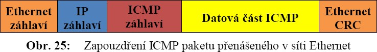
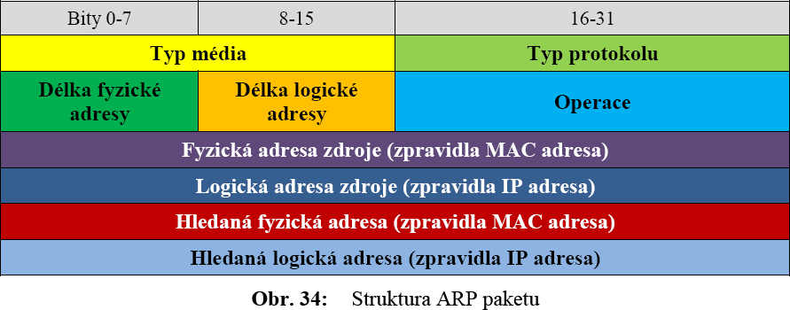

1. TCP/IP: Vazba mezi RM ISO/OSI a TCP/IP. Filozofie vzájemného propojování sítí. Souběh aplikací a zapouzdřování. 
===================================================================================================================

Vazba mezi RM OSI a TCP/IP
--------------------------

TCP/IP je stejně jako RM ISO/OSI síťovou architekturou. Hlavní
odlišnosti mezi referenčním modelem ISO/OSI a TCP/IP vyplývají především
z rozdílných výchozích předpokladů a postoji jejich tvůrčí. Při
koncipování referenčního modelu **ISO/OSI** měli hlavní slovo zástupci
spojových organizací, kteří kladli **důraz na vlastnosti sítě**
(především spojovaný a spolehlivý charakter služeb) s tím, že k síti
**připojované hostitelské počítače** budou mít **relativně jednoduchou
úlohu**.

Později se ale ukázal problém v zajištění spolehlivosti -- vyšší vrstvy
nemohou považovat spolehlivou komunikační síť za dostatečně spolehlivou
pro své potřeby, a tak se snaží zajistit si požadovanou míru
spolehlivosti vlastními silami. V důsledku toho se pak zajišťováním
spolehlivosti do určité míry zabývá vlastně každá vrstva referenčního
modelu ISO/OSI.

{width="4.756722440944882in"
height="3.041353893263342in"}

Tvůrci protokolů TCP/IP 1 naopak vycházeli z předpokladu, že zajištění
spolehlivosti je problémem koncových účastníků komunikace, a mělo by
tedy být řešeno až na úrovni [transportní vrstvy]{.underline}.
Komunikační síť pak podle této představy nemusí ztrácet část své
přenosové kapacity na zajišťování spolehlivosti (na potvrzování, opětné
vysílání poškozených paketů atd.), a může ji naopak plně využít pro
vlastní datový přenos.

V komunikační síti může docházet ke ztrátám přenášených paketů, a to bez
varování a bez snahy o nápravu. Komunikační síť by ovšem *neměla*
zahazovat pakety bezdůvodně. Měla by naopak vyvíjet maximální snahu
přenášené pakety doručit (***best effort***), a zahazovat pakety až
tehdy, když je skutečně nemůže doručit - tedy např. když dojde k jejich
poškození při

přenosu, když pro ně není dostatek místa ve vyrovnávací paměti pro
dočasné uložení, v případě výpadku spojení apod.

Na rozdíl od referenčního modelu ISO/OSI tedy **TCP/IP předpokládá
jednoduchou a rychlou komunikační podsíť, ke které se připojují
inteligentní hostitelské počítače.** TCP/IP předpokládá nespojovaný
charakter přenosu v komunikační síti -- tedy jednoduchou diagramovou
službu a obsahuje jen čtyři vrstvy (viz **Obr. 10**).

***Filozofie vzájemného propojování sítí***

Řešení vzájemného propojování sítí je jedním z prvotních příčin vzniku
celé soustavy protokolů TCP/IP. Filosofie TCP/IP od začátku usiluje o co
nejuniverzálnější propojení sítí různých typů -- od lokálních sítí typu
Ethernet, Token Ring apod., přes veřejné datové sítě, až po rozlehlé
sítě celosvětového dosahu. Klade si přitom za cíl umožnit každému
počítači komunikovat s kterýmkoli jiným počítačem, bez ohledu na to, zda
mezi nimi existuje přímé spojení, nebo zda jsou například tyto uzly v
různých sítích, které jsou vzájemně propojeny jednou nebo několika
dalšími sítěmi.

Výsledkem je pak jediná soustava vzájemně propojených sítí, v
terminologii TCP/IP označovaná obecně jako *Internetworking*. Z pohledu
uživatele by vnitřní struktura této soustavy sítí měla být irelevantní -
uživatelé, resp. jejich aplikační programy, se mohou na celý
*Internetworking* dívat jako na jedinou velkou síť, ke které jsou
připojeny jednotlivé koncové počítače - v terminologii TCP/IP označované
jako hostitelské počítače (*host computers, hosts*). Ve skutečnosti je
výsledná soustava (*Internet*) tedy jen konglomerátem (dílčích) sítí
stejného či různého typu, vzájemně propojených na úrovni síťové vrstvy
pomocí zařízení označených někdy nesprávně jako brány (*gateway*),
správně termínem *IP router* (tj. IP směrovač).

Výhodou IP protokolu je, že zavádí jednotný formát adres a způsob
adresování i jednotný formát přenášených dat na úrovni síťové vrstvy. Na
**Obr. 11** je ukázka propojení dvou stanic přes Internet (Host A resp.
Host B, kteří sídlí na lokální sítí LAN A resp. LAN B). V dolní části
**Obr. 11** je vidět na jakých vrstvách jednotlivé prvky pracují,
spojitá čára značí reálný průchod dat sítí od Hosta A k Hostu B,
přerušovaná čára značí virtuální spoje na jednotlivých vrstvách.
(Přerušované čáry vedoucí ze směrovačů v horní části značí cesty k
dalším částem Internetu, které v obrázku nejsou pro zjednodušení
nakresleny.)

{width="6.127992125984252in"
height="2.4848950131233596in"}

***Souběh aplikací a zapouzdřování***

Na **Obr. 15** jsou jako př. znázorněny tři současně běžící aplikace,
www prohlížeč, emailový klient a ftp klient. Každá z těchto aplikací
využívá příslušný **aplikační protokol**, při této volbě služeb jsou to
HTTP, např. IMAP a FTP, které jsou schopny uživatelovy požadavky
zformulovat do zprávy, kterou bude následně schopna druhá strana
komunikace zpracovat, tzv. Application PDU (*Protocol Data Unit*), tedy
protokolová datová jednotka aplikační vrstvy, jednoduše nazývána
**data**.

Tyto údaje (pocházející z libovolného z aplikačních protokolů) jsou
předávány **transportní vrstvě**, při volbě protokolů HTTP, IMAP a FTP
pouze protokolu TCP, protokol UDP by byl použit v případě volby jiných
aplikací. Přidáním hlavičky TCP vznikne TCP PDU, tedy protokolová datová
jednotka transportní vrstvy, též nazývaná **segment**. Transportní
vrstva takto vzniklou jednotku předá **Internetové vrstvě**, v našem
příkladu IP protokolu a přidáním IP hlavičky vznikne IP datagram,
zkráceně **paket**. Další postup závisí na použitém **síťovém
rozhraní**, tedy v případě připojení stanice (hosta) na LAN se paketu
přidá LAN záhlaví (*header*) a LAN zápatí (*trailer*) a vznikne
**rámec**. Tomuto
{width="5.017202537182852in"
height="1.9124989063867017in"}{width="4.492361111111111in"
height="3.28125in"}ději se říká zapouzdřování (*encapsulation*) a
struktura výsledné jednotky (rámce) je patrná z **Obr. 16**.

2. Úloha IPv4 (Internet Protocol verze 4) vrstvy. IPv4 adresy. IPv4 datagram. IP tunelování. Protokol ICMPv4 (Internet Control Message Protocol verze 4). 
==========================================================================================================================================================

IPv4
----

Síťová vrstva (resp. internetová vrstva realizovaná protokolem IP) v
síťovém modelu TCP/IP zajišťuje potřebné směrování mezi jednotlivými
dílčími sítěmi, a vyšším vrstvám tak vytváří iluzi jediné homogenní
sítě. Sama však musí pracovat se skutečnou vnitřní strukturou resp.
způsobem vzájemného propojení.

Síťová vrstva se musí vyrovnávat i s konkrétními odlišnostmi
jednotlivých dílčích sítí

-- například s odlišným charakterem adres, s různou maximální velikostí
přenášených paketů resp. rámců a jejich formátem, s odlišným charakterem
poskytovaných přenosových služeb (spojovaných či nespojovaných) apod.

Ovladač na úrovni vrstvy síťového rozhraní dokáže odstínit síťovou
vrstvu od konkrétního způsobu ovládání příslušné sítě a přesného formátu
datových rámců. Není ovšem již v jeho silách zastřít před síťovou
vrstvou rozdíl v používaném mechanizmu adresování, resp. zajistit
používání jednotných adres ve všech dílčích sítích. Tento jednotný
způsob adresování může zajistit až **síťová vrstva**, která **provádí**
tzv. **jednotnou abstrakci**, tedy sjednocení **v**:

{width="6.0e-2in"
height="5.999890638670166e-2in"}***způsob adresování (IP adresy),***

Adresy, které protokol IP zavádí (IP adresy), jsou 32-bitové (u
protokolu IP verze 4). Z pohledu transportní a aplikační vrstvy je lze
interpretovat jako lineární (resp. jednosložkové) adresy - což odpovídá
představě jediné homogenní sítě. Na úrovni síťové vrstvy se ale
interpretují jako dvousložkové, tvořené číslem resp. adresou
hostitelského počítače, a číslem resp. adresou (dílčí) sítě, ve které se
tento hostitelský počítač nachází.

IP adresy jsou pouze abstraktními adresami, které musí být posléze
převedeny na skutečné fyzické adresy, protože ovladač na úrovni vrstvy
síťového rozhraní, pokud dostane nějaká data k odeslání, musí spolu s
nimi dostat i konkrétní fyzickou adresu, na kterou je má odeslat. Sám
totiž s IP adresami nepracuje. Jde-li například o lokální síť typu
Ethernet, dostane síťová vrstva (od vrstvy transportní) adresu cílového
hostitelského počítače ve formě 32-bitové IP adresy, ale příslušný
ovladač vrstvy síťového rozhraní musí získat 48-bitovou Ethernetovou
adresu. K mechanizmu, jakým se v TCP/IP sítích zjišťuje korespondence
mezi IP adresami a konkrétními fyzickými adresami, která se věnuje
protokolu ARP.

**Update:** Z důvodu nedostatku IPv4 adres se zavedlo IPv6.

{width="6.0e-2in"
height="5.999890638670166e-2in"}***formát datových paketů používaných na
síťové vrstvě (IP datagramy),***

Podobně jako jednotný formát adres a způsob adresování, zavádí protokol
IP i jednotný formát přenášených dat na úrovni síťové vrstvy - již
zmíněné IP datagramy. Jde o datové pakety, označované jako datagramy
proto, že jsou přenášeny pomocí nespojované (datagramové) síťové
přenosové služby. Na úrovni vrstvy síťového rozhraní jsou tyto datagramy
přenášeny pomocí takových rámců, se kterými příslušná dílčí síť pracuje.
Tyto se ovšem mohou obecně síť od sítě lišit.

{width="6.0e-2in"
height="5.999890638670166e-2in"}***nespolehlivá nespojovaná přenosová
služba z pohledu vyšších vrstev*** (transportní a aplikační).

IPv4 adresy
-----------

***Zápis***

32-bitové IP adresy lze vyjadřovat jako celá dvojková čísla. Pro člověka
to ale není příliš srozumitelné, a tak se pro symbolický zápis IP adres
zavedla konvence, označovaná jako tečkovaná desítková notace (*dotted
decimal notation*). Spočívá v tom, že 32 bitů IP adresy se rozdělí na
čtyři části po osmi bitech (oktety), a každá část se pak vyjádří jako
celé desítkové číslo bez znaménka (s použitím tečky jako oddělovače
jednotlivých částí).

**Příklad 4.1**

Například nepříliš snadno zapamatovatelný tvar:

10010011 11100101 10010111 00000001

tak dostává podobu:

147.229.151.1

***Maska***

Jak již bylo uvedeno, IP adresy jsou dvousložkové, tj. tvořené číslem
resp. adresou (dílčí) sítě, ve které se hostitelský počítač nachází, a
číslem resp. adresou tohoto hostitelského počítače. Jestliže všechny
bity, které jsou vyhrazeny pro adresu sítě, budou nahrazeny binární

„1" a převedeme takto vzniklé číslo na desítkové číslo podobně jako v
předchozím příkladu, dostaneme masku sítě.

**Příklad 4.2**

Adresa IP -- 147.229.151.1

Adresa sítě (dekadicky) -- 147.229.0.0 (proč je toto adresa sítě viz
***Příklad 4.3***.)

Adresa sítě (binárně) -- 10010011 11100101 00000000 00000000

Maska sítě (binárně) -- 11111111 11111111 00000000 00000000

Maska sítě (dekadicky) -- 255.255.0.0

Maska sítě se taktéž často zapisuje tzv. **délkou prefixu**, která
vyjadřuje počet jedniček v masce a píše se s lomítkem za adresu IP.
Prefix představuje začátek adresy, který vyjadřuje adresu sítě.

Totožné zápisy IP adresy a masky, resp. délky prefixu tedy jsou:
147.229.151.1 255.255.0.0

147.229.151.1 / 16

***Třídy IP adres***

Podle počtu bitů (z 32 celkem) využívaných pro adresu sítě a tedy i
počtu bitů zbývajících pro uvažované stanice v rámci sítě dělíme IP
adresy na třídy, viz **Tab. 1**. Původní filozofie TCP/IP počítá s
malými (C), středními (B) a velkými sítěmi (A). Toto rozdělení se
později ukázalo jako příliš hrubé a neefektivní, efektivnější řešení je
možné vyčíst v kap.

4.8.3 o podsíťování.

{width="4.656738845144357in"
height="1.6417913385826772in"}

***Speciální IP adresy***

***Adresa sítě*** (často označována jako prefix) vznikne tak, že se
všechny bity z části pro adresu hosta nahradí binární „0", jedná se o
první adresu v rámci dané sítě. Matematicky se tato operace dá popsat
logickým součinem jednotlivých bitů IP adresy a masky sítě.

**Příklad 4.3**

Dána IP adresa 151.147.229.1; je patrné, že je zetřídy B. Její
standardní (výchozí) maska je 255.255.0.0, tedy adresa sítě je
151.147.0.0. Výpočet:

Adresa IP -- 151.147.229.1

IP binárně -- 10010111 10010011 11100101 00000001

Maska sítě (dekadicky) -- 255.255.0.0

Maska sítě (binárně) -- 11111111 11111111 00000000 00000000

Adresa sítě (binárně) -- 10010111 10010011 00000000 00000000

Adresa sítě (dekadicky) -- 151.147.0.0

***Všesměrová (broadcast) adresa***, je taková IP adresa, jejichž
použitím lze poslat paket zároveň všem stanicím v rámci dané sítě.
Vznikne tak, že všechny bity tvořící adresu hosta v rámci IP adresy se
nahradí binární „1", jedná se tedy o poslední adresu v rámci dané sítě.

***Adresy použitelné pro koncové stanice v síti**,* jsou všechny adresy
v rámci dané sítě v rozsahu mezi adresou sítě a všesměrovou adresou.

***Lokální smyčka (loopback)***, je to softwarová smyčka uvnitř
počítače, adresy 127.x.x.x. Pakety s touto adresou nikdy neopustí
počítač, vhodné např. pro mezi procesovou komunikaci.

Veřejné adresy musí být v rámci celého Internetu unikátní a to je důvod,
proč je jich nedostatek (v případě IPv4).

Rozsahy vyčleněné pro privátní adresy jsou:

{width="6.0e-2in"
height="5.999890638670166e-2in"}Třída **A** 10.0.0.0 -- 10.255.255.255
(1 síť o 16 777 214 možných hostech)

{width="6.0e-2in"
height="5.999890638670166e-2in"}Třída **B** 172.16.0.0 -- 172.31.255.255
(16 sítí o 65 534 možných hostech)

{width="5.333223972003499e-2in"
height="5.333333333333334e-2in"}Třída **C** 192.168.0.0 --
192.168.255.255 (256 sítí o 254 možných hostech)

***Lokální linkové adresy***, rozsah 169.254.0.0 až 169.254.255.255. V
případě, že se stanici nepodaří konfigurovat IP, např. v případě že
nefunguje DHCP server, sama si nastaví IP z uvedeného rozsahu.

IPv4 datagram
-------------

Jak již bylo uvedeno, síťová vrstva zavádí jednotnou abstrakci i v
případě formátu datových jednotek používaných na této vrstvě, tzv. IP
[datagramy]{.underline}, též nazývané pakety. IP paket je na úrovni
síťového rozhraní vždy zabalen do rámce příslušné technologie (Ethernet,

{width="5.305097331583552in"
height="2.5471872265966753in"}...), který se mění, tak jak paket
prochází přes dílčí sítě. Zabalený paket však zůstává ve stejném formátu
a nemění se, tedy s výjimkou proměnných polí, jako je hodnota čítače,
která vyjadřuje životnost paketu (viz dále). *Základní struktura paketu
je naznačena:*

**Verze** (*version*) -- 4 bity, obsahuje verzi protokolu IP a
zajišťuje, aby ostatní systémy, které zpracovávají datagram během
přenosu, mohly různá pole datagramu správně použít. Verze IPv4 zde má
samozřejmě hodnotu 4.

**Délka záhlaví** (*headerlength*) -- 4 bity, musí se uvádět, protože
záhlaví může mít proměnnou délku v násobcích 32 bitů, kvůli volitelným
položkám. Minimum je 5 slov (5 × 32 bitů = 20 bajtů) délky záhlaví,
maximum 60 bajtů, nevyužité pozice musí být „vycpány" daty bez významu.

**Typ služby**(*type ofservice*, *ToS*) -- 8 bitů, položka měla sloužit
ke specifikaci požadované kvality přenosu IP datagramu. Směrování pak
mělo brát ohled na hodnotuToS a volit z alternativních tras tu, která
nejlépe odpovídala požadavkům datagramu. V současnosti se položka
používá k podobným účelům -- nese značku pro mechanizmy zajišťující
služby s definovanou kvalitou služby (*QoS*).

**Celková délka IP datagramu** (*totallength*) -- 16 bitů, definuje
úplnou délku datagramu včetně záhlaví a uživatelských dat. Maximum je
65536 bajtů.

**Identifikace IP datagramu** (*identification*) -- 16 bitů, primárně
určeno k identifikaci k sobě patřících fragmentů, vždy přiděleno
odesílatelem.

**Příznaky** (*flags*) -- 3 bity, používají se dva: DF-bit (*don't
fragment*) označuje případný požadavek na nepoužít fragmentace, tj.
dodatečného dělení paketu na menší části. MF-bit (*more fragments*)
říká, že datagram byl fragmentován a že bude následovat další část.

**Posunutí fragmentu od počátku** (*fragment offset*) -- 13 bitů,
indikuje pozici obsahu dat datagramu vzhledem k začátku původního
(rozdělovaného) paketu.

**Doba životadatagramu** (*Time To Live* - TTL) -- 8 bitů, tato hodnota
definuje maximální počet skoků (*hops*), každý směrovač sníží při
zpracování hodnotu položky o 1. Pokud již nelze hodnotu snížit, je paket
zahozen.

**Protokol vyšší vrstvy** (*protocol*) -- 8 bitů, obsahuje číselnou
identifikaci protokolu vyšší vrstvy, který využívá IP datagram ke svému
přenosu.

**Kontrolní součet záhlaví datagramu** (*headercheck sum*) -- 16 bitů,
je použit na záhlaví datagramu, pokud se při kontrole zjistí, že součet
nesedí (došlo k chybě), paket se zahodí.

**IP adresa odesílatele/příjemce paketu** (*source/destination address*)
-- každá 32 bitů, jedná se o logickou adresu v rámci IP protokolu.

**Volitelné položky záhlaví** (*options*) -- volitelně až do délky 40
bajtů, nevyužívá se příliš často, některé jsou dokonce zakázány. Např.:

-   zaznamenej směrovače (*recordroute*) -- zjištění kudy paket
    procházel,

-   zaznamenej čas (*timestamp*),

-   explicitní směrování (*loose source routing*) -- umožňuje výslovně
    zadat, přes které směrovače má být IP datagram dopravován (nemusí
    být uvedeny všechny),

-   striktní explicitní směrování (*strict source routing*) -- musí být
    zadány všechny mezilehlé směrovače.

**Přenášená data** (*payload*) -- teoreticky až do 65536 bajtů délky (v
součtu se záhlavím), jsou to údaje, které IP vrstvě předal protokol
vyšší vrstvy, tedy např. TCP segment.

IP tunelování
-------------

Existují situace, kdy je nutné umožnit komunikaci počítačů ve vnitřních
(firemních) sítích přes veřejný Internet, tj. je nutno **propojit
několik VPN sítí** (*Virtual Private Network*). Tunelování zapouzdřuje
původní IP paket do nového IP paketu, který má novou cílovou adresu,
zpravidla bránu druhé VPN. Tato brána IP paket „opouzdří" a zašle
skutečné cílové stanici.

Tunelování prováděné ve spolupráci s IPsec protokolem zvyšuje bezpečnost
VPN spojení. IP adresy bran na hranicích privátních a veřejných sítí
jsou užity ke směrování. Celý obsah paketu včetně vnitřní IP adresy
zdroje a cíle hostitelského počítače vnitřní sítě je skrytý vnějšímu
světu.

{width="5.622031933508311in"
height="2.51875in"}{width="5.0644050743657045in"
height="2.181770559930009in"}IP tunelování je velmi užitečné v situaci,
kdy jsou dvě počítačové sítě používající stejný síťový protokol (např.
IPv4) navzájem propojené sítí s odlišnou verzí protokolu IP, tedy IPv6,
případně naopak. (O protokolu IPv6 je pojednáno v kap. 5.) Mezilehlá
(transportní) síť pak musí přenášet pakety zabalené do nového záhlaví,
aby byla schopna s nimi správně pracovat. Dochází tedy k tunelování
původních paketů IPv4.

Protokol ICMPv4
---------------

Verze ICMP pro IPv4 je známá jako ICMPv4. IPv6 používá obdobný protokol
ICMPv6.

{width="4.462031933508311in"
height="0.61625in"}Protokol ICMP (*Internet Control Message Protocol*-
doslova protokol služebních hlášení) je služební protokol, což znamená,
že [nepřenáší **žádná** uživatelská data]{.underline}. Jedná se o
klasický příklad aplikace typu klient-server. ICMP je součástí sady
TCP/IP protokolů a slouží k signalizaci mimořádných událostí v síti.
Jeho obsah se přenáší přímo v IP datagramech, viz **Obr. 25**
znázorňující zapouzdřování ICMP v prostředí Ethernetu.

ICMP je určen pro informování o nějakém nestandardním stavu při
doručování IP datagramů. Generují se např. při zahození datagramu, kdy
se IP nestará o nápravu, ale pouze informuje odesílatele, že se tak
stalo.

{width="4.292361111111111in"
height="2.022222222222222in"}Vybrané druhy ICMP zpráv shrnuje **Tab.
6**.

3. Protokol UDP (User Datagram Protocol). Protokol TCP (Transmission Control Protocol). 
========================================================================================

Protokol UDP
------------

UDP je jednoduchý protokol umožňující **nespojovaný** (*connectionless*)
a **nespolehlivý** (nepotvrzovaný) přenos dat ***best effort***.
Jednotlivým přenášeným jednotkám se při použití protokolu UDP říká
obvykle [datagramy]{.underline}. Pokud je potřeba potvrzovat doručení,
musí to být řešeno na úrovni aplikačního protokolu.

Typickým příkladem přenosu využívajícího UDP je technika **VoIP**
(*Voiceover IP*). Při přenosu hlasových dat není až tak důležité, aby
byl doručen úplně každý datagram. Zpravidla totiž obsahuje jen malou
část slova a jeho velikost by zbytečně narostla, kdyby měl každý z nich
obsahovat mnoha-položkové záhlaví protokolu. Stejně tak je zbytečné, aby
se přenášel datagram opakovaně, protože čekání na opakovaný přenos by
komunikaci jen zpomalilo. **Záhlaví UDP** je tedy maximálně jednoduché,
jak je patrné z **Obr. 26**

{width="5.349946412948381in"
height="1.214374453193351in"}

Protokol TCP
------------

{width="5.336323272090989in"
height="2.4348950131233598in"}TCP je na rozdíl od UDP spojově
orientovaný (*connectionoriented*) a spolehlivý (potvrzovaný přenos)
protokol.

Mezi komunikujícími stranami nejdříve naváže spojení, až poté zahájí
přenos dat. Datové jednotce na úrovni transportní vrstvy a využívající
TCP se říká *segment*. Ztracený nebo poškozený segment je přenášen
opakovaně.

**Zdrojový port** (*source port*) -- 16 bitů, hodnota indikuje port na
straně odesílatele segmentu, vybrané hodnoty portů viz dále.

**Cílový port** (*destination port*) -- 16 bitů, hodnota indikuje port
na straně příjemce segmentu, není zpravidla shodná se zdrojovým.

**Pořadové číslo odesílaného bajtu** (*semence number*-- **SEQ**) -- 32
bitů, odesílané bajty se číslují, pole obsahuje pořadové číslo prvního z
odesílaných v segmentu.

**Pořadové číslo potvrzovaného bajtu** (*acknowledgment number*--
**ACK**) -- 32 bitů, jestliže máme obousměrnou komunikaci (což je
většina případů), tak strana, která odesílá data, má možnost v rámci
hlavičky těchto dat potvrdit přijetí dat od protistrany. Uvádí se
hodnota dalšího očekávaného bajtu, tj. např. když poslední správně
přijatý bajt je číslován jako 100, pole obsahuje 101.

**Délka záhlaví** (*headerlength*) -- 4 bity, délka záhlaví v bajtech.

**Příznakové bity** (*flags*) -- 6 bitů, význam jejich nastavení na „1"
je:

{width="6.0e-2in"
height="5.999890638670166e-2in"}**URG** (*urgent*) -- segment nese
naléhavá data

{width="6.0e-2in"
height="5.999890638670166e-2in"}**ACK** (*acknowledgment*) -- indikuje,
že hodnota uvedená v poli potvrzovaného bajtu je platná (tj. že segment
zároveň i potvrzuje přijetí dat).

{width="6.0e-2in"
height="5.999890638670166e-2in"}**PSH** (*pushfunction*) -- signalizace,
že data mají být ihned po přijetí předány aplikaci a nemá se čekat na
přijetí dalších segmentů.

{width="6.0e-2in"
height="5.999890638670166e-2in"}**RST** (*reset theconnection*) -- pro
řešení situace s duplikáty navazovacích segmentů, k odmítnutí spojení.

{width="6.0e-2in"
height="5.999890638670166e-2in"}**SYN** (*synchronizesequencenumber*) --
odesílatel začíná novou sekvenci číslování bajtů, využíváno při
navazování spojení, viz dále.

{width="6.0e-2in"
height="5.999890638670166e-2in"}**FIN** (*no more data fromsender*) --
odesílatel ukončil přenos dat, využíváno při uzavírání spojení, viz
dále.

**Délka okna** (*windowsize*) -- 16 bitů, vyjadřuje maximální počet
bajtů, které může vysílač odeslat, aniž by čekal na potvrzení od
přijímače.

**Kontrolní součet** (*TCP checksum*) -- 16 bitů.

**Ukazatel naléhavých dat** (*urgent pointer*) -- 16 bitů, pole vyplněno
jen když je příznakový bit URG nastaven na „1".

**Volitelné položky záhlaví** (*options*) -- pole nemusí být přítomna,
jejich délku lze odvodit z celkové délky záhlaví uvedené v příslušné
pozici.

4. Překlad logických a fyzických adres, Protokol ARP (Address Resolution Protocol). 
====================================================================================

Preklad logických a fyzických adries:

-   pomocou PRIAMEHO PREVODU --pomocou vhodnej transformačnej funkcie
    (možné pokial si zriadovateľ siete môže sám určovať fyzické adresy)

-   pomocou DYNAMICKEJ VAZBY -- fyzické adresy su dané výrobcom napevno
    a komunikujúci uzol rieši Adress Resolution Problem pomocou
    protokolu ARP/RARP vytvorením dynamickej tabuľky, ktorá sa
    aktualizuje v závislosti na aktuálnom stave v sieti

ARP
---

Základní vlastnosti ARP Address Resolution Protocol
---------------------------------------------------

-   dynamický, distribuovaný protokol, schopný reagovat na změny v síti,

-   určen k posílání datagramů na určitý uzel (koncovou stanici nebo
    směrovač) v lokální síti, kde neznáme její fyzickou/linkovou (MAC)
    adresu, ale známe adresu IP; v obecném případě zjištění adresy druhé
    úrovně na základě znalosti adresy třetí úrovně.

-   informace o odpovídajících si adresách se ukládají do tabulky, podle
    potřeby se obnovují, položky jsou zpravidla uloženy pouze dočasně na
    několik minut a pak vymazány, protože se mohly stát neaktuální anebo
    již nejsou potřeba,

-   ARP pracuje „mezi" linkovou a síťovou vrstvou, používá rámce
    linkové, např. u Ethernetu je v položce *typ* hodnota indikující ARP
    rovna 0x0806.

{width="5.291649168853893in"
height="2.0781244531933507in"}

**Typ média** (*Hardware type*) -- 16 bitů, hodnota indikující typ
použitého média, např. pro Ethernet je hodnota 0x0001, ATM má 0x0010.

**Typ protokolu** (*Protocol type*) -- 16 bitů, hodnota indikuje typ
vyššího protokolu, v rámci něhož se logická adresa používá, pro IP je
hodnota 0x8000.

**Délka fyzické adresy** (*Hardware length*) -- 8 bitů, délka fyzické
adresy v bajtech, pro Ethernet 0x06.

**Délka logické adresy** (*Protocol length*) -- 8 bitů, délka logické
adresy taktéž v bajtech, pro IPv4 adresu 0x04.

**Operace** (*Operation*) -- 8 bitů, specifikuje operaci, kterou
odesílatel paketu provedl -- hodnota 0x0001 pro požadavek na zjištění
fyzické adresy, hodnota 0x0002 pro odpověď.

**Fyzická adresa zdroje / hledaná** (*Sender / target hardware address*)
-- délka je specifikována v poli *délka fyzické adresy*, obsahuje
fyzickou adresu zdroje / hledanou.

**Logická adresa zdroje / hledaná** (*Sender / target logical address*)
-- délka je specifikována v poli *délka logické adresy*, obsahuje
logickou adresu zdroje / hledanou.

5. Protokol DHCP (Dynamic Host Configuration Protocol). Překlad adres -- NAT (Network Address Translation). 
============================================================================================================

DHCP protokol
-------------

DHCP je aplikační protokol pro [dynamické nastavení parametrů
sítě]{.underline} (IP adresa, maska sítě, výchozí brána, DNS servery,
...). Funguje na principu klient-server. DHCP server

„propůjčí" tyto parametry sítě síťové stanici na určitou dobu *Lease
Time*. Po této době musí stanice žádat o adresu znovu. DHCP server u
každého klienta eviduje IP adresu a čas, do kdy ji klient smí používat
(doba zapůjčení, *lease time*).

DHCP protokol je rozšířením staršího BOOTP protokolu, který přiděloval
IP adresy na neomezenou dobu. DHCP je s BOOTP obousměrně kompatibilní.
To znamená, že DHCP klienti dovedou získat nastavení z BOOTP serveru a
DHCP server může přidělit IP adresu BOOTP klientovi (zde je třeba
opatrnosti, protože BOOTP klient bude jednou přidělenou IP adresu
používat už navždy).

DHCP využívá transportního protokolu UDP, klient komunikuje na UDP portu
68, server naslouchá na UDP portu 67.

### Princip fungování

**DHCP** Na **Obr. 37** je naznačen průběh komunikace při použití
protokolu DHCP. Po připojení do sítě klient vyšle broadcastem
DHCP\_DISCOVERY paket. Na ten odpoví DHCP server paketem DHCP\_OFFER s
nabídkou IP adresy. Klient si z nabídek (teoreticky od několika DHCP
serverů v rámci sítě) vybere jednu IP adresu a o tu požádá paketem
DHCP\_REQUEST (taktéž broadcast). Server mu ji vzápětí potvrdí odpovědí
DHCP\_ACK. Jakmile klient obdrží DHCP\_ACK, může už IP adresu a zbylá
nastavení používat.

{width="3.643371609798775in"
height="4.942083333333334in"}Klient musí před uplynutím doby zapůjčení
uvedené v DHCP\_ACK obnovit svou IP adresu. To se provádí zkráceně,
zasláním DHCP\_REQUEST zprávy (přímo DHCP serveru) a server následně
odpoví DHCP\_ACK s novou dobou zapůjčení. Pokud lhůta uplyne, aniž by
klient dostal nové potvrzení, musí IP adresu přestat používat.

Protokol definuje i roli tzv. *DHCP relay agenta*. Používá se v situaci,
kdy existují dvě nebo více sítí oddělené směrovačem a jen jedna síť má
DHCP server. V takovém případě správce na směrovači zapne *relay agenta*
a nastaví jej tak, aby všesměrové (broadcast) DHCP dotazy ze sítí bez
DHCP serveru přeposílal do té sítě, která ho má. Agent k přeposílanému
dotazu přidá masku té sítě, kde klienta „zaslechl", aby DHCP server
poznal, ze kterého adresního rozsahu má klientovi adresu přiřadit.

Překlad adres -- NAT Network Address Translation
------------------------------------------------

NAT, česky *překlad síťových adres*, je funkce směrovače pro změnu IP
adres paketů jím procházejících, kdy se zdrojová nebo cílová IP adresa
převádí mezi různými rozsahy. Nejběžnější formou je, když **směrovač IP
adresy z nějakého rozsahu mění na svoji IP adresu a naopak** -- tím
umožňuje, aby počítače ve vnitřní síti (LAN) [vystupovaly v
Internetu]{.underline} [pod jedinou IP adresou]{.underline}. Tuto funkci
podporují prakticky všechny běžné směrovače. Technika překladu (IP)
adres tedy umožňuje oddělit intranet od Internetu, což může být z
bezpečnostního hlediska výhodné.

Směrovač, na kterém běží NAT, musí být schopen navenek nějakým způsobem
odlišit provoz jednotlivých stanic z vnitřní sítě do Internetu. To
provádí na základě tabulky překladu adres, kterou si po celou dobu
spojení drží v paměti. Ve většině případů má k dispozici jen jednu
(veřejnou) IP adresu, která je přiřazena na jeho tzv. **WAN** (*Wide
Area Network*) port a ve vnitřní sítí je hromada (privátních) IP adres.
V tomto případě si směrovač nevystačí pouze se síťovými adresami a musí
použít i vyšší (transportní) adresy -- porty.

V případě využití kombinace **IP adres a portů** není název NAT úplně
správný, v takové situaci se jedná o kombinaci služeb NAT s **PAT**
(*Port Address Translation*), někdy označovanou NAPT (*Network Address
Port Translation*). Název NAT se však v tomto významu běžně používá.

{width="5.484202755905512in"
height="3.44375in"}

***NAT můžeme dělit na dva základní druhy:***

**SNAT** = *Source NAT*, překlad zdrojové IP adresy a případně portu.
Překlad byl zahájen záměnou zdrojové IP (a portu). Následná záměna
cílové IP (a portu) už pouze souvisí s první provedenou změnou a je
nezbytná pro správné fungování přenosu.

**DNAT** = *Destination NAT*, překlad cílové IP adresy a případně portu.
**Primárně se používá k**

**„zveřejnění" služby z interní sítě** na veřejně přístupnou IP.

Technika NAT může byt použita při přenosu paketu i **vícekrát**. Z
jednoho bodu v komunikačním řetězci nelze stanovit, zda po trase někde k
překladu dojde nebo ne. Překlad adres může probíhat i mezi verzemi
protokolu IP (IPv4 a IPv6) -- **PT** = *protokol translation*, častěji
se však setkáme s technikou **IP tunelování.**

**Překlad nemusí být vždy nutně mezi veřejnou a privátní IP**, může
probíhat i tak, že se změní veřejná IP na jinou veřejnou IP adresu,
pokud je to výhodné. Stejně tak se může změnit privátní adresa na jinou
privátní. Vždy však platí, že jsou zaměňovány adresy ze dvou různých
sítí, případně dvou různých podsítí.

V některých zdrojích je možné nalézt ještě **další způsoby rozdělení**,
obecně lze konstatovat, že druhů NAT je definováno mnoho. Častým
případem je, že jeden konkrétní výrobce hardware implementuje NAT s
nějakým konkrétním vylepšením a marketingově ho označí upraveným názvem.
Toto však z našeho pohledu není podstatné.

### Problémy a výhody NATu

Z předcházejícího textu je zřejmé, že NAT přináší i jistá omezení.
Problém spočívá v tom, že při použití techniky NAT ztrácíme jednu ze
základních předností Internetových sítí postavených na sadě TCP/IP --
obousměrnou konektivitu typu *end-to-end*. **Přímé spojení dvou
koncových uzlů je s použitím techniky NAT vždy nějakým způsobem
omezeno.** To může být problematické pro některé Internetové protokoly,
např. FTP (více viz kap. 7.2.1.2). Nejvíce problematická je situace, kdy
oba koncové systémy jsou odděleny od vnějších sítí prostřednictvím NATu.

Za určitou nevýhodu je možné považovat i určité **časové zpoždění,**
které s NATem nutně souvisí.

Bezpečnostní výhody **NAT**u již byly uvedeny. V případě použití SNAT
Secure NAT může komunikace vzejít pouze z vnitřní sítě. Z vnějšku nemůže
být spojení zahájeno (to lze pouze s DNAT), což **uživatele ochrání před
mnohými škodlivými útoky**. Za velmi podstatnou výhodu se také v případě
IPv4 sítí považuje **úspora veřejného adresního prostoru**.

6. Jmenný systém DNS (Domain Name System): důvody existence, popis fungování protokolu, úloha resolveru, kořenové servery DNS. Firewally dle vrstev filtrování. 
================================================================================================================================================================

Jmenný systém DNS
-----------------

DNS je **aplikační protokol** využívající transportní porty UDP/53 i
TCP/53. Jak bylo uvedeno dříve, IP adresy představují abstrakci na
úrovni síťové vrstvy. Větší počet těchto adres je však pro člověka jen
[těžko zapamatovatelný]{.underline}. **DNS** tak **vytváří** ještě
**vyšší úroveň abstrakce**, konkrétně na aplikační úrovni. **Síťovým IP
adresám je přiřazeno** relativně snadno zapamatovatelné **jméno** (DNS
název). Výjimka z tohoto systému je zřejmá -- samotný DNS server musí
být zadán IP adresou, aby bylo možné s ním komunikovat. DNS primárně
zajišťuje (decentralizovaným způsobem) překlad jména hostitele
(počítače) na jeho IP adresu a naopak.

Systém je založen **na principu klient -- server**, jedná se o
distribuovanou datovou službu. Server DNS není pouze jeden, jsou
organizovány hierarchicky, stejně jako jsou hierarchicky tvořeny názvy
domén, viz **Obr. 41**. Vazby mezi jmény počítačů a IP adresami jsou
uloženy v **DNS databázi**, která je celosvětově distribuována. Základní
jednotkou systému je tzv. jmenný server (*name server*), často nazývaný
DNS server.

{width="4.534059492563429in"
height="2.7516666666666665in"}

### Domény a doménová jména

Počítače jsou organizovány v **hierarchii domén,** viz **Obr. 41**.
Doménou je skupina počítačů, které jsou v nějakém vztahu vůči sobě (buď
tvoří nějakou organizační jednotku, nebo jsou geograficky blízko sebe).
Např. doména .edu je vyhrazena pro americké univerzity, naproti tomu
.czsdružuje počítače patřící do České republiky. V doméně se mohou
vyskytovat jak koncové počítače, tak **subdomény** (FirmaA.cz), které se
opět mohou dělit (FirmaA.cz −\> Marketing, Vyroba, Vyvoj), kvůli lepší
údržbě a snazší symbolické identifikaci. Doménové jméno se vždy
vyhodnocuje **zprava doleva**, od nejvyšší úrovně (root) po nejnižší.

Každý uživatel Internetu dnes považuje za samozřejmé, že doménový název
je tvořen několika řetězci znaků oddělených tečkami. V základním systému
DNS platí, že celková délka jména může být **maximálně 255 znaků** a
jeden dílčí řetězec maximálně 63 znaky. Takto dlouhé jména se však
používají jen v ojedinělých případech, většinou jsou řetězce dlouhé 4 až
10 znaků (*utko*, *vutbr*, *seznam* atd.), s výjimkou *root* zóny, kde
jsou řetězce dlouhé 2 až 4 znaky (*cz*, *int*, *eu*, *arpa* atd).
Povolené znaky jsou **pouze písmena** (bez diakritiky a nezáleží, zda
velká nebo malá), **číslice a pomlčky**. Platí pravidlo, že pomlčka
nemůže být na začátku ani na konci řetězce. Existují i rozšíření, která
umožňují používat v systému DNS další znaky. Jestliže se však budeme
držet těchto základních pravidel, vyhneme se zbytečným problémům.

### Způsob komunikace v DNS systému

Stanice, která chce komunikovat s [*www.vutbr.cz*](http://www.vutbr.cz/)
vyšle dotaz na DNS server (*name server*), ten se podívá do svých
záznamů a v odpovědi zašle IP adresu. Stanice pak již může přímo
kontaktovat požadovaný stroj. Pokud DNS server

nenalezne potřebný záznam ve své paměti, kontaktuje nadřazený DNS server
(pokud takový existuje) nebo kořenový (root) DNS server. Tato komunikace
je však klientovi systému DNS skryta a probíhá přímo mezi servery DNS.

{width="2.720240594925634in"
height="1.793535651793526in"}

Resolver
--------

Ve skutečnosti je fungování překladu mírně složitější, než bylo popsáno
výše. V rámci operačního systémů existuje tzv. ***resolver***. Je to
klient, který zprostředkovává stanici (všem aplikacím -- ftp, www,
telnet atd) případné dotazy na DNS servery. Než resolver kontaktuje DNS
server, vždy prověří, zda není požadovaný překlad definován staticky,
případně zda daný překlad již nebyl v nedávné době proveden a není
uložen v lokální dočasné paměti (*cache*). Dotazování na DNS server je
zpravidla vícenásobné i při jediném překladu.

***Věty RR***

DNS záznamy, tj. informace (nejen) o doménových jménech a odpovídajících
IP adresách, jsou uloženy v záznamech nazývaných věty **RR** (*Resource
Records*). V případě, že resolver (DNS klient) požaduje po serveru
získání informací, pak požaduje po DNS serveru věty RR podle svých
požadavků.

***Vybrané typy vět RR jsou***

**A** (*A host address*) -- 32-bitová IPv4 adresa, slouží jako výsledek
překladu.

**NS** (*Authoritativename server*) -- doménové jméno DNS serveru, který
je autoritou pro danou doménu, používá se k přesměrování na jiný DNS
server.

**PTR** (*Domainname pointer*) -- přenos doménového jména, využito k
reverznímu překladu.

**AAAA** (*IPv6 address*) -- 128-bitová IPv6 adresa, slouží jako
výsledek překladu.

{width="5.4761067366579175in"
height="0.7805205599300088in"}**CNAME** (*Canonicalnameforan alias*) --
doménové aliasy (další možné názvy domény, které odkazují na stejný
stroj). Na typu věty RR je závislá pouze datová část DNS zprávy, záhlaví
má obecný formát, jenž je naznačen na následujícím **Obr. 44**.

***Formát DNS paketu***

DNS protokol definuje pouze několik typů operací. Především se jedná o
**DNS QUERY** a **DNS QUERY RESPONSE**. Význam je zřejmý, první typ je
dotazem na překlad, druhý je odpověď.

DNS využívá stejný formát paketu jak pro dotaz (*query*), tak pro
odpověď (*query response*). Délka je proměnná, základních polí může být
až pět, povinné je však pouze jedno. Jsou to:

**HEADER** (záhlaví) , **QUERY** (dotaz/dotazy) , **ANSWER**
(odpověď/odpovědi),

**AUTHORITY** (autoritativní DNS servery) ,**ADDITIONAL** (doplňující
informace).

Korenove DNS servery
--------------------

Kořenové DNS servery obsluhují nejvyšší (root) DNS zónu a jejich úkolem
jepředevším přesměrovávat dotazy na DNS servery do jednotlivých TLD
domén (.com, .cz, .int,...). Jedná se o 13 serverů provozovaných 12-ti
organizacemi. ve skutečnosti serverů není 13, ale přibližně 600.Určitá
skupina DNS serverů se vzhledem ke svým uživatelům tváří jako jeden
server, jedistribuována. Rekurzivní resolver komunikuje zpravidla s tím
DNS serverem, který je muz pohledu směrovacích protokolů nejblíže
(anycast).

Firewally podla vrstiev filtrovania

Firewall funguje ako sietovy filter. Jeho ucelom je zabránit nechtěné
komunikaci z jedné sítě (zóny) dojiné sítě (zóny) a opačně. Rozlišení,
která komunikace bude povolena či zakázána, je řízeno bezpečnostní
politikou.

-   **síťová vrstva** -- nejrychlejší a zpravidla také nejméně nákladná
    varianta firewallu. Filtruje jen velmi hrubě, pouze na základě
    zdrojové nebo cílové IP adresy obsažené v záhlaví analyzovaného
    paketu.

-   **Transportna vrstva -- bezstavovy firewall** - kromě údajů ze
    síťové vrstvy (IP adresy) bere v úvahu i hodnoty transportních
    portů. velmi rychly a běžně bývá označovány jako paketovy firewall,
    přestože filtruje de facto na úrovni segmentů.

-   **Transporta vrstva -- stavovy firewall** - oproti bezestavovému
    dokáže rozlišit již navázané spojení od ostatního provozu a k němu
    přidruženou komunikaci snáze propustí. Funguje to tak, že každý
    paket je nejdříve posuzován vzhledem k seznamu existujících (a již
    povolených) spojení. Pokud k některému patří, je propuštěn bez další
    analýzy. Pokud ne, prochází standardním paketovým filtrem a může být
    propuštěn nebo zahozen. Efektivna filtracia TCP komunikacie, avšak
    pomalsie jako bezstavovy.

-   **Aplikačná vrstva** - Tyto firewally zpravidla plně „rozumí"
    fungování aplikací a protokolů a jsou schopny detekovat např.
    případy jejich nestandardního chování apod. Filtrují velmi jemně, za
    cenu nižší rychlosti. Nejvhodnější je použít je až na koncové
    stanice. Firewall pracující na aplikační vrstvě může být označován
    jako proxy firewall, teda prostrednik v ramci komunikacie.

{width="5.141666666666667in"
height="2.0290955818022747in"}

7. Princip protokolů zálohování výchozí brány. 
===============================================

Páteřní (tranzitní) počítačové sítě jsou od svých počátků budovány tak,
že v topologii existuje mezi dvěma uzly více než jedna cesta. V případě
výpadku by tak měla existovat vždy záložní trasa. Toho lze zpravidla
docílit prostřednictvím zvýšeného počtu linek a také aktivních prvků.

Protokoly pro zálohování výchozí brány lokální sítě představují důležitý
mechanizmus [zajištění dostupnosti brány]{.underline}. Protokoly
umožňují snadno nakonfigurovat více fyzických směrovačů jako jeden (nebo
i více) virtuálních.

Výpadek jednoho směrovače pak způsobí zpravidla pouze krátký (ne žádný)
výpadek komunikace, který souvisí s přechodem na druhou bránu.
Nejčastěji se můžeme setkat s protokoly:

-   Hot Standby Router Protocol (**HSRP**),

-   Virtual Router Redundancy Protocol (**VRRP**),

-   Gateway Load Balancing Protocol (**GLBP**).

První dva protokoly umožňují v základní konfiguraci pouze zálohování
dostupnosti výchozí brány, zatímco třetí pak i rozdělování zátěže mezi
aktivní členy skupiny.

Všechny protokoly spojuje využívání **multicastového** přenosu dat pro
komunikaci mezi členy skupiny a také speciálních tvarů MAC adres.

Smerovace v skupine si musia pravidelne vymienat spravy za ucelom
zistenia dostupnosti smerovaca. Sluzia na to spravy hello posielane
kazde 3 sekundy, a pokial pocas hold intervalu 10sekund neprijde odpověď
od smerovaca, povazuje sa za nedostupny a prevadzku prebera smerovaca
ktory odosielal spravu hello (protokol HSRP a GLBP). U protokolu VRRP su
tieto intervaly 1 a 3 sekundy.

8. Autonomní systémy. Protokoly IGP (Interior Gateway Protocol) a EGP (Exterior Gateway Protocol). Základní charakteristika protokolu BGP (Border Gateway Protocol). Multihoming, peering a tranzit. 
=====================================================================================================================================================================================================

Autonomní systémy
-----------------

Autonomní systém představuje souhrn sítí pod společnou správou, kde se
používá společná směrovací strategie. Celý AS se obvykle skládá z
menších oblastí (sítí). Každý autonomní systém musí mít přiřazeno
unikátní 16-bitové číslo (přiděluje organizace IANA). V rozsahu
16-bitového čísla může být teoreticky maximálně pouze 65536 autonomních
systémů. AS čísla 64512 -- 65534 jsou navíc vyhrazeny pro privátní
účely, takže jejich použití v rámci Internetu není možné. AS 0, 54272 --
64511 a 65535 jsou vyhrazeny organizací IANA a není taktéžmožné je
použít v běžném prostředí Internetu.

Zbývá tedy mnohem méně než 65536 možných autonomních systémů a tento
počet se blíží svému vyčerpání. Proto IANA začala nedávno alokovat i
32-bitové čísla autonomních systémů, ve formě X.Y, kde X je 16-bitové
číslo, stejně tak jako Y. Původní autonomní systémy se tak stávají 0.Y,
kde Y je původní číslo autonomního systému v 16-bitovém prostředí.
Přechod na 32-bitové prostředí však vyžaduje podporu (nejen) směrovacích
protokolů, které informace o AS přenášejí.

Aby mělo rozdělení na AS smysl, musí mezi nimi existovat jednotný systém
předávání směrovacích informací, v pevně daném formátu. Lze to jednoduše
shrnout slovy: v rámci svého vlastního (autonomního) systému má každý
možnost zajistit si přenos a aktualizaci směrovacích údajů podle svého,
ale navenek musí všichni postupovat jednotně.

IGP protokoly
-------------

Všechny protokoly, používané pro **přenos směrovacích informací** mezi
jednotlivými bránami (směrovači) **uvnitř autonomního systému**, se
souhrnně označují jako protokoly **IGP (Interior Gateway Protocol).**
Mezi používané IGP protokoly patří např.:

-   **RIPv2** (*RoutingInformationProtocol*verze 2),

-   **EIGRP** (*EnhancedInteriorGatewayRoutingProtocol*),

-   **OSPF** (*Open ShortestPathFirst*),

-   **IS-IS** (*IntermediateSystem to IntermediateSystem*).

EGP protokoly
-------------

Pro vzájemnou komunikaci **mezi autonomními systémy** byl navržen
protokol **EGP** (***Exterior**GatewayProtocol*). Ten vychází z
představy, že v rámci každého autonomního systému je minimálně jedna
brána pověřena předáváním směrovacích informací navenek. Tato brána,
jejíž výběr je plně v moci správce příslušného autonomního systému, je
pak označována jako **externí brána** (*exteriorgateway*).

Prostřednictvím protokolu EGP pak tato brána komunikuje s externími
bránami jiných autonomních systémů. **Hlavním úkolem protokolu EGP**
však **je pravidelný přenos směrovacích údajů a informací o průběžných
změnách mezi autonomními systémy.**

***BGP protokol***

Protokol EGP je v současné době nahrazen protokolem **BGP**
(***Border**GatewayProtocol*), aktuálně ve verzi 4. Protokol BGP je pro
fungování Internetu jako celku nesmírně důležitý, přestože se s ním
běžný **koncový uživatel nesetkává**. Spojení mezi hraničními směrovači
je nakonfigurováno **ručně** (nevzniká automaticky, je nezbytný zásah
administrátora) a pro přenos se využívá spolehlivý protokol **TCP port
179**. Protokol BGP je tedy **aplikačním** protokolem.

BGP je schopné provozu v plně decentralizovaném prostředí současného
Internetu a podporuje přenos směrovacích informací o sítích s
**beztřídní** (*classless*) maskou, tj. i o podsítích vzniklých
rozdělením původních tříd *A*, *B*, *C*.

BGP může být využito i ke směrování **v rámci autonomního systému**,
potom se nazývá **vnitřní** (*Internal*) BGP -- **iBGP**. Nejčastějším
případem interního použití je potřeba přenosu směrovacích informací mezi
dvěma nebo více externími (hraničními) branami v rámci jednoho AS.

**Zpráva BGP**

{width="3.8618952318460193in"
height="0.5699989063867017in"}Zpráva protokolu BGP může mít maximální
délku až 4096 B, nejkratší zprávou je typ *keep-alive*, která má pouze
19 B (pouze základní záhlaví protokolu, žádná datová část).

**Marker**-- 16 B pole, přítomno z důvodů kompatibility se staršími
verzemi, vyplněno binárními jedničkami. **Délka** (*length*) -- 2 B,
celková délka zprávy v bajtech, včetně záhlaví. Jak již bylo uvedeno,
maximální povolená hodnota je 4096, minimální 19. **Datová část** --
nepovinná část délky až (4096 -- 19) = 4077 B. **Typ** (type) -- 1 B,
zde je uložen kód reprezentující typ zprávy. Ve standardu definované
typy jsou následující čtyři:

**Open , Update, Notification, KeepAlive Směrování u BGP**

Protokol BGP si v paměti směrovače vytváří svoji vlastní směrovací
tabulku nazývanou **Loc-RIB** (*LocalRoutingInformation Base*), odděleně
od hlavní směrovací tabulky směrovače, kde mohou být uloženy případně i
záznamy dodané jiným směrovacím protokolem. Pro ***každého*** svého
souseda, s kterým má BGP router navázané spojení si udržuje tabulku
**Adj-RIB-In** (*AdjacentRoutingInformation Base, Incoming*), která
obsahuje NLRI obdržené od tohoto souseda (resp. pouze ty záznamy, které
dosud nebyly zpracovány) a také udržuje tabulku **Adj-RIB-
Out**(*AdjacentRoutingInformation Base, Outgoing*), kde se nachází
průběžně připravované NLRI k odeslání tomuto sousedovi.

Jestliže do tabulky Adj-RIB-In při komunikaci se sousedním směrovačem
přibude nová cesta do určité destinace, proces BGP se musí rozhodnout,
zda aktualizovat starší záznam v Loc- RIB (pokud se tam již nějaký
nachází). Rozhodovací proces souvisí s parametry, které jsou popsány
níže. **Základním testem**, na základě kterého může BGP přidat cestu
přijatou v NLRI Update do Loc-RIB, **je dostupnost následujícího uzlu**
(NEXT\_HOP), který je uveden v této zprávě.

Protokol BGP využívá **k rozhodnutí o směrování tyto parametry**: **druh
cesty k dané síti** -- počet procházených AS -- parametr AS\_PATH.

**Skupina administrátorem definovaných pravidel:**

**váha** (*weight*), **místní preference** (*local preference*),
**výstupní diskriminátor -- MED** (Multi Exit Discriminator)

Atributy **váha** a **místní preference** ovlivňují, kudy půjde provoz
**ven** z konfigurované sítě (stejně jako **AS\_PATH**), parametr
**MED** ovlivňuje, kudy půjde provoz **dovnitř** konfigurované sítě.

Největším problémem BGP pravděpodobně je exponenciální růst
**Internetové směrovací tabulky**, se kterou pracují nejvýznamnější
směrovače v Internetu. Internetovou směrovací tabulkou, neboli
**globální BGP tabulkou** se myslí souhrn všech autonomních systémů,
které nepotřebují ke správnému fungování směrovacího procesu mít
nakonfigurovanou také **výchozí bránu**, která by se použila v případě,
že by žádný exaktní záznam ve směrovací tabulce nevyhovoval při hledání
cesty do cílové destinace. Těmto autonomním systémům se často říká
***default-free zone***(DFT). Neznamená to však, že by směrovače v této
zóně měly ve svých směrovacích tabulkách cesty do všech sítí Internetu a
že by ve všech těchto směrovačích byla směrovací tabulka stejná.

Díky technikám jako je **filtrování cest**(ekonomické, bezpečnostní,
technické důvody) a **agregace cest** se daří udržet velikost tabulek v
rozumných hodnotách (cca 320k zaznamů).Agregace spočívá v shrnutí
několika směrovacích informací do jedné souhrnné.

Multihoming
-----------

Multihoming je technika zajišťující **zvýšení spolehlivosti Internetové
konektivity** pro konkrétní síť, většinou koncového zákazníka, nikoliv
poskytovatele služeb. Patří do problematiky velkých sítí. Multihoming se
zpravidla nenasazuje u domácích uživatelů, ale u velkých firem,
institucí apod. Prostřednictvím multihomingu se snažíme eliminovat
možnost ztráty konektivity, ke které by mohlo dojít prostřednictvím
**chyby jediného bodu** (*single point offailure = **SPOF***).

Peering
-------

Peering je další z technik souvisejících s problematikou velkých sítí.
Peering představuje pojem pro **přímé propojení samostatných sítí**,
zpravidla propojení nezávislých autonomních systémů. Typickým příkladem
jsou poskytovatelé Internetového připojení (ISP = *Internet Service
Provider*). Hlavním důvodem tohoto propojení je umožnit **výměnu dat
mezi uživateli propojených sítí**, což je vzájemně výhodné. Základním
předpokladem k peeringu dvou sítí je jejich fyzické propojení a dohoda o
výměně směrovacích informací, zpravidla prostřednictvím protokolu
**BGP.**

Peering datových sítí se liší od propojování sítí v telekomunikacích ve
způsobu **financování**. V telekomunikacích jsou běžné poměrně vysoké
propojovací poplatky, které mají pokrýt náklady související s přenosem
hovoru v jiné síti, účtované na základě délky hovoru. Při peeringu se
žádné poplatky přímo za přenášený datový provoz z/do jiné sítě
**neúčtují**.

### Peering se dělí na dva druhy:

-   **veřejný peering** (*public peering*) -- propojení **více než dvou
    stran**, na úrovni druhé vrstvy, často je využit Ethernet. Tyto
    místa se nazývají ***exchange points*** nebo častěji *Internet
    exchanges* (IX). Do těchto uzlů jsou pak připojeny až stovky sítí
    (autonomních systémů). Uzel může být v nejjednodušším případě tvořen
    pouze jedním přepínačem, ve skutečnosti je však zpravidla topologie
    „uzlu" mnohem složitější.

V situaci, kdy je připojeno velké množství sítí do jednoho bodu, je
zřejmé, že nemůže být nikdy dosaženo maximálních hodnot přenosových
rychlostí. Veřejný peering je tedy vhodný především pro snadné propojení
s velkým množstvím (často menších) sítí.

-   **privátní peering** (*priváte peering*) -- přímé propojení **pouze
    dvou sítí**, zpravidla také na druhé vrstvě. Propojovací linka je v
    tomto případě vyhrazena pouze pro jedno konkrétní spojení a není
    sdílena dalším stranám.

Přímé spojení má význam, jestliže je mezi dvěma konkrétními sítěmi velký
datový provoz, kvůli kterému stojí za to provozovat přímé propojení.
**Není však možné, aby byly všechny autonomní systémy propojeny navzájem
privátně, počet spojení by byl totiž obrovský.**

Tranzit
-------

Tranzit spočívá v představě, že všechny „koncové" autonomní systémy jsou
připojeny k velké páteřní síti, která zajišťuje tranzit datového provozu
a přímé propojení těchto (koncových) sítí neexistuje. Páteřní síť je
také autonomním systémem, ktory poskytuje pripojenie medzi pripojenymi
autonomními systemami. Tranzit teda zabezpecuje inbound a outbound
traffic. Rozdílnost od peeringu spočívá v tom, že přes peeringové
spojení dvou ISP prochází pouze přenos mezi zákazníky těchto dvou sítí,
zatímco při tranzitu přes toto propojení může procházet i přenos
směřující z/do jiného autonomního systému.

9. IPv6 (Internet Protocol verze 6): vlastnosti a důvody existence, přechodové mechanizmy, datagram, adresace, funkce ICMPv6 protokolu, popis automatické konfigurace v IPv6 síti, fungování multicastu v IPv6. 
================================================================================================================================================================================================================

IPv6
----

Implementace IPv6 je velmi pozvolná a probíhá jen v některých sítích,
protože díky mnoha vylepšením, rozšířením a úpravě managementu adresace
(NAT) je IPv4 stále poměrně konkurenceschopné a uspokojuje většinu
současných požadavků. Nejzásadnějším problémem je očekávané [vyčerpání
adresního prostoru.]{.underline}

Základní překážkou v rychlém zavádění IPv6 je především jeho
**nekompatibilita s IPv4**. Bylo proto navrženo několik mechanizmů
umožňujících hladký přechod od IPv4 k protokolu IPv6. Souvisí zejména s
následujícími technikami:

**Souběh Internetových protokolů IPv6 a IPv4** (*dual stack*) --
software a hardware podporuje plně oboje. To samozřejmě vede ke zvýšení
nákladů na vývoj zařízení, ladění a tím pádem i koncovou cenu. Problémem
však zůstává neustávající potřeba adres IPv4, stanice mají totiž adresy
obojího typu (IPv4 i IPv6).

**Tunelování**, tedy většinou zapouzdření IPv6 paketu do IPv4 --
existují dva základní typy tunelů a to **explicitně konfigurované** a
**automaticky vytvářené**. Jak název napovídá, explicitní tunel musí
správce ručně nakonfigurovat a zprovoznit, např. pro konkrétní
požadovanou trasu, zatímco automatický tunel se vytváří samočinným
mechanizmem, bez přímého zásahu administrátora. Nejznámějším zástupcem
automaticky vytvářeného tunelu je technika **6to4**.

**Překlad adres** podobný technice NAT, s tím rozdílem, že při překladu
se zaměňuje IPv4 adresa za IPv6 adresu nebo opačně. Technika se nazývá
NAT-PT.

***Datagram***

{width="5.3091447944007in"
height="3.4556244531933507in"}Struktura základního záhlaví IPv6 je
schematicky naznačena na **Obr. 46**.

**Verze** (*version*) -- 4 bity, stejně jako u IPv4 obsahuje verzi a
zajišťuje, aby ostatní systémy, které zpracovávají datagram během
přenosu, mohly různé pole datagramu správně použít. Verze IPv6 zde má
samozřejmě hodnotu 6.

**Třída provozu** (*traffic class*) -- 8 bitů, toto pole umožňuje
nastavit prioritu paketu -- přepravní třídu. Cílem je, aby
prostřednictvím této položky dokázala IP síť zaručovat kvalitu služeb.

**Identifikace toku dat** (*flow label*) -- 20 bitů, označení toku dat,
umožňuje zjednodušení směrování, protože spolu související pakety mají
nastavenou stejnou hodnotu a na jejím základě může tedy směrovač paket
odeslat stejnou cestou jako předcházející.

**Celková délka přenášených dat** (*payload length*) -- 16 bitů, délka
přenášených dat bez velikosti základního záhlaví. Informace je o počtu
bajtů. Maximální délka tedy může být až 64 kB.

**Další záhlaví** (*next header*) -- 8 bitů, informace o vnořeném
záhlaví, např. rozšiřující záhlaví pro přenos informace mezi směrovači,
které (volitelně) následuje za IPv6 adresami (konec základní hlavičky).

**Limit počtu skoků** (*hop limit*) -- 8 bitů, odpovídá položce TTL u
IPv4. Maximální počet skoků, které smí paket absolvovat, směrovače tuto
hodnotu postupně dekrementují.

**IPv6 adresa odesílatele/příjemce paketu**
(*source/destinationaddress*) -- každá 128 bitů.

Z popisu je zřejmé, že celková délka základního záhlaví je 40 B. Tato
délka je pevně dána, na rozdíl od protokolu IPv4, kde byla délka
proměnná. Základní část záhlaví IPv4 má délku 20 B, což je polovina
velikosti IPv6 záhlaví. Vzhledem ke čtyřikrát delším adresám u IPv6 to
však neznamená velký nárůst.

**Kontrolní součet** na IP vrstvě verze 6 již není prováděn vůbec.
Výpočet a jeho kontrola v každém uzlu zbytečně zpomalovaly směrovací
proces. Za dostatečnou je považována kontrola, která je standardně
prováděna na linkové vrstvě.

Adresace
--------

Sada IPv6 rozšiřuje adresní prostor na 2^128^. Podstatnou změnou v IPv6
je, že **jedno rozhraní** běžně využívá více než jednu IPv6 adresu. V
IPv6 jsou definovány tři druhy adresování, které mají odlišné chování:

1.  **individuální** (*unicast*) -- adresy identifikující jednotlivá
    síťová rozhraní, tak aby na ně mohly být zasílány pakety.

2.  **skupinové** (*multicast*) -- jsou určeny pro adresování skupin.
    Platí, že pakety odeslané na tuto adresu by měly být doručeny všem
    členům skupiny. Tyto adresy zastupují i

3.  **všesměrové** (*broadcast*) adresy, které nejsou v rámci IPv6
    definovány samostatně. V rámci adresního prostoru jsou definovány
    speciální skupiny, které reprezentují např. všechny uzly na dané
    lince atd.

4.  **výběrové** (*anycast*) -- také označují skupinu adresátů, rozdíl
    je však v tom, že pakety se posílají pouze jedinému jejímu členu,
    zpravidla tomu, který je „nejblíže". Tento typ existuje i v IPv4.

IPv6 adresy jsou zapisovány jako 8 skupin 4 hexadecimálních číslic
oddělených dvojtečkou např:

**8000:0000:0000:0000:0ABC:DEF1:0345:789A** resp. zkrácený zápis

**8000::0ABC:DEF1:0345:789A**

Některé z přechodových mechanizmů mezi IPv4 a IPv6 vyžadují možnost
zapsat do IPv6 adresního pole IPv4 adresu. Tyto adresy se nazývají
IPv4-mapované adresy. Pravidlo pro jejich

zápis je takové, že prvních 80 bitů jsou nuly, dalších 16 bitů „1―,
zbývajících 32 bitů je IPv4 adresa. Formální zápis je tedy např.:

**::FFFF:192.168.65.12**

Podobně jako u IPv4 je i u IPv6 definován tzv. prefix, tj. začátek
adresy, který představuje adresu sítě (nebo podsítě). Jeho délka se pak
běžně zapisuje za lomítko umístěné za IP adresou, např.

**8000::ABC:DEF1:345:789A / 64**

**Povinné adresy IPv6**

**U koncové stanice jsou povinné** tyto IPv6 adresy:

-   **Lokální linková adresa** pro každé rozhraní,

-   všechny **individuální a výběrové adresy**, které byly přiděleny,

-   **lokální smyčka ::1/128**

-   **skupinové adresy** pro všechny uzly, což je registrovaná adresa,
    na kterou uzly pravidelně posílají zprávy, že stále chtějí multicast
    přenos přijímat,

<!-- -->

-   **skupinová adresa pro vyzývaný uzel** pro všechny přidělené
    individuální a výběrové adresy; adresa, na které daný uzel přijímá
    multicast,

-   všechny **skupinové adresy, jejichž je členem**.

ICMPv6
------

ICMP (*Internet ControlMessageProtocol*) je i ve verzi 6 režijním
(servisním) protokolem Internetu. Nepřenáší žádná uživatelská data, jeho
zavedení je ve všech implementacích a aktivních prvcích s podporou IPv6
[povinná]{.underline}. Protokol ICMP se využívá pro ohlašování chybových
stavů, testování dostupnosti síťové vrstvy a také k výměně určitých
provozních informací.

V rámci IPv6 se tento protokol používá také k tzv. objevování , podpoře
správy multicastových skupin, překladu adres a zajištění mobility.

{width="5.673578302712161in"
height="1.3472911198600175in"}Základní formát ICMPv6 zprávy je naznačen
na **Obr. 51**. Položka typ určuje základní druh zprávy, další položka
(kód) pak umožňuje tento typ blíže specifikovat -- vytváří se tzv.
podtypy. Položka „tělo zprávy" pak závisí na konkrétním typu a délka
tohoto pole je tudíž proměnná.

**ICMPv6** má po mnoha negativních zkušenostech s ICMP protokolem ze
sítí IPv4 přímo implementovaná i určitá **bezpečnostní opatření**.
Implementace ICMPv6 protokolu by správcům měla umožňovat nastavit určité
kvantitativní parametry protokolu. Jsou to povolený průměrný počet ICMP
zpráv za jednotku času anebo maximální podíl zpráv ICMP na celkové šířce
pásma. Prostřednictvím těchto nastavení lze zabránit zahlcení prvku nebo
linky. Další možností je, že ICMP zpráva může mít bezpečnostní záhlaví,
které poskytuje možnost autentizace komunikující strany.

*Neighbour Discovery* (**ND**) - překlad logických adres na skutečné,
který je v sítích IPv4 zajišťován samostatným protokolem ARP. Fyzické
adresy potřebujeme, abychom byli schopni komunikovat v rámci lokální
sítě.

Automatická konfigurace
-----------------------

Sada IPv6 přichází s poměrně revoluční myšlenkou, jak automaticky
konfigurovat koncové stanice. Zcela novou myšlenkou IPv6 je však
**bezestavová konfigurace**. Základním principem je, že směrovač do sítě
vysílá opakovaně (ale v náhodně stanovených okamžicích)

potřebné informace pomocí ICMPv6 zprávy *134 -- ohlášení směrovače*.
Stanice má možnost o tyto informace i aktivně požádat, opět pomocí
ICMPv6 zprávy, konkrétně „výzvy směrovači" (133). Stanici si pak na
základě těchto informací sama stanoví svoji (globální) IPv6 adresu,
resp. její část -- identifikátor rozhraní (nejnižších 64 bitů).

DHCPv6
------

Protokol DHCP (*Dynamic Host Configuration Protocol*) **zajišťuje
koncovým** stanicím **stavovou konfiguraci potřebných síťových
parametrů**. U nového DHCPv6 se nevyužívají broadcastové adresy. Systém
je podle očekávání postaven na multicastu, tak jako většina hromadných
služeb v IPv6. Identifikace stanic je u DHCPv6 postavena na tzv.
**DUID** (*DHCP Unique IDentifier*). Tento identifikátor by měl být
jednoznačný a stálý pro všechny klienty a servery. Pro rozlišení
jednotlivých rozhraní v rámci jednoho klienta je pak využíván další
identifikátor -- **IA** (*Identity Association*). IA představuje shluk
konfiguračních informací přidělených jednomu rozhraní. Tento shluk je
opatřen jednoznačným identifikátorem **IAID**.

První zpráva, kterou při aktivaci DHCPv6 systému stanice vyšle na první
z multicastových adres (ff02::1:2), je **výzva** (*solicit*). Tato
zpráva má stejný význam jako *DHCP discovery* z verze 4. K odeslání
stanice použije svoji lokální linkovou IPv6 adresu, kterou si generuje
sama. Odpověď na tuto výzvu se jmenuje **ohlášení serveru**
(*advertise*). V tomto ohlášení jsou již obsaženy konfigurační
parametry, které je server ochoten následně klientovi přidělit. Těchto
ohlášení může klient obdržet i více a následně si z nabídek vybírá.
Přednost by měl dát nabídkám od serverů s nejvyšší prioritou, pokud je
takových nabídek více, tak si může vybrat podle potřeby.

V další fázi klient zašle **žádost** (*request*) o jím vybranou nabídku.
Tato žádost se opět zasílá na skupinovou adresu ff02::1:2. Server, který
nabízel vybranou konfiguraci, odpoví (*reply*). Tato zpráva obsahuje
definitivní konfigurační parametry a povoluje stanici tyto parametry
použít. Stejně jako u DHCPv4 i zde je časová platnost parametrů omezena
a klient musí před jejím uplynutím žádat o obnovení.

10. Teorie konečných automatů, způsoby reprezentace, použití.
=============================================================

Každý systém lze popsat pomocí stavů vstupních veličin *X*, kde *X* se
mění v závislosti na čase, a pomocí výstupních veličin *Y*, jejichž
hodnoty jsou zpravidla závislé na vstupních veličinách. Skupinu
vstupních veličin *X* označme jako vstupní vektor, podobně skupinu
výstupních veličin *Y* jako výstupní vektor systému.

U našeho systému zároveň předpokládáme obecné vnitřní stavy, tj. stavy,
ve kterých se systém aktuálně nachází, značené *Q*. Počet vstupních a
výstupních proměnných, stejně tak jako vnitřních stavů je konečné
diskrétní číslo, v obrázku značeno *m* pro počet vstupních veličin, *n*
pro počet výstupních veličin a *r* pro počet možných vnitřních stavů.

{width="3.1931200787401575in"
height="1.2760411198600174in"}

Dva základní typy systémů můžeme rozlišit pomocí *kombinačních sítí* a
*sekvenčních sítí*:

-   **Kombinační sítě** (**Obr. 97**) jsou charakterizovány jednoznačným
    přiřazením výstupní kombinace na každou vstupní kombinaci. Systémy
    popsané pomocí kombinační sítě tedy nemají definované žádné vnitřní
    stavy a skládají se pouze z:

    -   {width="3.425in"
        height="1.4875in"}**Vstupů**, které jsou tvořeny vstupním
        vektorem *X* = (*x*~1~, *x*~2~, ..., *x*~m~)

    -   **Výstupů**, které jsou tvořeny výstupním vektorem *Y* =
        (*y*~1~, *y*~2~, ..., *y*~n~)

    -   **Funkce** *f*, která určuje jednoznačný převod vstupního
        vektoru *X* na výstupní vektor

*Y*. Funkce může být definována matematicky, převodní tabulkou apod.

-   **Sekvenční sítě**, na rozdíl od kombinačních, mají nějakým způsobem
    zakomponovanou vnitřní paměť, která jim umožňuje udržovat si
    informaci o vnitřním stavu systému *Q*. Hodnoty výstupního vektoru
    (12.4) pak nezávisí pouze na vstupním vektoru, ale zároveň i na
    stavu systému. Z logiky věci vyplývá, že sekvenční systém musí
    pracovat diskrétně, nelze ho uvažovat jako spojitý. Systém pracuje
    sekvenčně, tj. po krocích, označíme-li např. vektor jeho vnitřního
    stavu *Q*~n~ v kroku *n*, v dalším kroku bude vnitřním stavem
    *Q*~n+1~, atd. Algoritmus **sekvenční sítě musí mít následující
    vlastnosti**:

    -   {width="3.029166666666667in"
        height="1.882638888888889in"}***Determinismus*** -- poskytované
        řešení musí být jednoznačné

    -   ***Hromadnost*** -- musí poskytovat možnost řešení (třídy)
        skupiny úloh

    -   ***Konečnost*** -- počet vnitřních stavů je omezen. Skupina
        dříve uvedených veličin (*X*, *Y*, *Q*, *f*~1~, *f*~2~) bývá
        ještě poměrně často doplněna o šestý symbol -- *počáteční stav
        S*~0~, který popisuje stav systému (sekvenční sítě) na počátku.

***Spôsoby reprezentácie***

Konečné automaty môžeme zapisovať pomocou tabuliek, alebo pomocou
grafov. Zápis pomocou grafu má tú výhodu že má lepšiu prehľadnosť a
čitateľnosť

Graf sa skladá z

-   {width="3.3041666666666667in"
    height="2.4402777777777778in"}Uzlů -- které jsou zaznačeny kroužky a
    reprezentují jednotlivé vnitřní stavy Qi, případně i hodnotu
    výstupního vektoru Yi (viz dále)

-   Orientovaných spojnic -- spojují vždy jednosměrně dva uzly

2 typy Mealyho automat a Mooreho automat. Moorov sa lepšie číta.

Stavovým automatom môžeme napríklad popísať chovanie DHCP klienta alebo
TCP pri naväzovaní spojenia. Má to výhodu v tom že je to grafické --
ľahké na pochopenie oproti prečítaniu RFC špecifikácie. *Viac info
skripta str. 164*

BONUS - Multicastový přenos dat: typy přenosu (unicast, broadcast, multicast, anycast), výhody a nevýhody multicastového přenosu dat, podpůrné protokoly multicastu, principy směrování multicastového provozu.
===============================================================================================================================================================================================================

**Multicast v IPv4**

Multicast je tradičně přenos z jednoho zdroje ke skupině příjemců. Může
však nastat situace, kdy je zdrojů více. Přenos je praktikován s
maximální možnou efektivitou, co se týká spotřeby pásma, jelikož se od
zdroje vysílá pouze jedna kopie dat, která se postupně cestou k
adresátům podle potřeby větví vytvářením [kopií]{.underline}. Vytváření
kopií je úlohou směrovačů a přepínačů, které musí pro správné fungování
celého systému multicast [podporovat]{.underline}.

Multicastové aplikace zpravidla jako transportní využívají protokol
**UDP**, tj. přenos bez spojení a potvrzování o doručení
**(*best-effort*)**. Z principu není možné použít protokol TCP, který je
postaven na mechanizmu budování spojení mezi dvěma komunikujícími
stranami.

**Adresování multicastu v IPv4**

{width="6.021868985126859in"
height="1.75in"}Pro účely multicastu je v adresním prostoru IPv4
vyhrazena celá třída D s rozsahem 244.0.0.0 až 239.255.255.255. V
binární podobě jsou první čtyři bity vždy rovny „1110―. Tato skupina je
členěna na tři základní skupiny, viz **Tab. 10**. V tabulce lze nalézt i
dva příklady lokálně platných multicastových adres. Pakety adresované
první skupině multicastových adres nikdy neopustí lokální síť, bez
ohledu na hodnotu TTL, přestože bývá většinou nastavena na jednotkovou
hodnotu.

Multicastové adresy mají tedy uplatnění na **síťové (internetové)
vrstvě**. Multicastové adresování je však důležité i na nižší vrstvě při
technikách pro stanovení správných fyzických adres.

V případě klasické **unicastové** adresy se pomocí protokolu ARP a za
pomoci adresátovy IP adresy zjistí odpovídající fyzická adresa
(zpravidla MAC adresa).

V případě, že chceme paket poslat více adresátům, nejjednodušší metodou
je **broadcast**, který odpovídá MAC adrese ff:ff:ff:ff:ff:ff. Zřejmou
[nevýhodou]{.underline} je, že zprávu obdrží všechny stanice, tedy i ty,
které o přenos nemají zájem. Proto byla vyvinuta technika jak z
multicastové IP adresy vytvořit multicastovou MAC adresu.

Jak již bylo popsáno dříve, MAC adresa se skládá ze dvou stejně dlouhých
částí, kódu výrobce a kódu karty. MAC adresa tedy může vypadat např.
takto: 00:22:15:9F:1B:48, kód výrobce je v tomto případě 00:22:15.

Pro **multicast IPv4** je vyhrazen speciální kód „výrobce" ―
**01:00:5e**. Navíc platí, že další [(25.) bit musí být
nula]{.underline}. Podle tohoto kódu se snadno pozná, že se jedná o
multicastový paket. Zbývá zaplnit zbývajících 23 bitů, do kterých se
namapuje IP adresa multicastové skupiny, resp. pouze její část. IPv4
adresa má 32 bitů, ale u multicastové adresy platí, že první čtyři bity
jsou vždy stejné (1110) a není tedy třeba je mapovat do fyzické adresy.
Ve skutečnosti je tedy potřeba mapovat 28 bitů IPv4 adresy do 23 bitů
MAC adresy.

Je zřejmé, že nelze mapovat adresy v režimu 1:1, poměr je takový, že 32
multicastových IP adres je reprezentováno jedinou MAC adresou. Konverze
funguje tak, že nejnižších 23 bitů IP adresy se vezme a beze změny
převede do MAC adresy, vyšších 5 bitů je ztraceno. Stanice tedy v
případě přijetí multicastového rámce nedokáže pouze na základě MAC
adresy ihned určit, zda je paket určen i pro ni a musí prověřit i vyšší
vrstvy (cílovou IPv4 adresu v paketu). Tento způsob je přes všechny
uvedené nevýhody **lepší** než pakety odesílat broadcastem a zahlcovat
všechny stanice bez rozdílů.

**Protokoly multicastu**

Nejdůležitějšími protokoly jsou **IGMP** (*Internet Group Management
Protocol*) a **PIM** (*Protocol Independent Multicast*). Nejzásadnější
rozdíl mezi těmito protokoly je že IGMP je určen na výměnu informací
mezi koncovými stanicemi a směrovači, zatímco PIM na komunikaci mezi
směrovači, jak je vidět z příkladu na **Obr. 37**.

Základní úlohou protokolu **IGMP** je umožnit koncovým stanicím
připojení [do]{.underline} [multicastové skupiny]{.underline}. Protokol
tedy slouží ke komunikaci mezi stanicemi a směrovači. Zprávy protokolu
IGMP nejsou směrovány internetem, jejich platnost je **omezena pouze na
lokální síť**. Protokol IGMP existuje v současné době ve třech verzích,
přičemž verze 1 je dnes již historická, používá se převážně verze 2.
Tyto dvě verze mohou spolu za určitých okolností koexistovat. Verze 3 je
plně funkční -- prakticky obdoba IGMP pro IPv6.

**PIM** je jeden z nejpoužívanějších multicastových směrovacích
protokolů, který je výrobci směrovačů poměrně dobře podporován. Hlavním
úkolem PIM je [tvorba distribučních stromů]{.underline}, jak sdíleného
typu, tak nejkratší cesty. Protokol PIM neobsahuje žádný vlastní
mechanizmus na zjišťování topologie sítě, ale využívá informace
standardních **unicastových** směrovacích protokolů. PIM tedy nezasílá
mezi směrovači žádné multicastové směrovací aktualizace tabulek apod.
