**Otázky k SZZ pro akademický rok 2018/19**

**1. Základní architektura AVR mikroprocesorů, rozdělení AVR
mikroprocesorů, dostupné periférie, základy práce s registry -- binární
zápis, hexadecimální, bitový posun, nulování příznaku.**

**Architektúra AVR a dostupné periférie**

-   8-bit microcontroller

-   Modifikovaná harvardská architektúra

-   RISC

-   Integrovaná Flash pamäť

-   Integrovaná SRAM

-   Integrovaná EEPROM

-   A/D prevodníky (10 alebo 12-bit)

-   Vnútorný RC oscilátor, vstupy pre externý oscilátor

-   Sériové rozhranie USART, SPI a I2C

-   8 alebo 16 bit časovače

-   PWM

-   GPIO piny

**Rozdelenie**

-   ATtiny

-   ATmega

-   ATxmega

-   ...

Číslo v názve znamená veľkosť flash pamäte, napr. ATmega328p má 32kB

**Binárny zápis** - 0b01001011

**Hex zápis** - 0x4b

**Bitový posun** - 0x4b \<\< 1

**Nulovanie príznaku** - 0b01001011 & 11111110 = 0b01001010

Jednotlivé bity registorv majú svoje mená

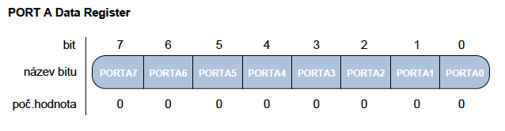{width="3.7864588801399823in"
height="0.9890912073490814in"}

Takže vieme nastavovať príznaky aj pomocou but shiftu: PORTA \|= (1 \<\<
PORTA2)

**IO porty**

8-bit registre PORT A-G, každý port má asociaované 3 registre

**PORTn** - slúži na uloženie výstupných hodnôt

**DDRn** - data direction register - zapísaním 1 nastavíme ako výstup, 0
ako bstup

**PINn** - sôúži pre načítanie hodnôt zo vstupných zariadení

**2. Pamětní prostor mikroprocesoru AVR - FLASH paměť, SRAM paměť,
EEPROM paměť.**

AVR využíva harvardskú architektúru, takže je oddelená pamäť pre program
a dáta.

Program je uložený vo flash (non-volatile), dáta sú v RAM (volatile).
EEPROM je non-volatile pamäť kde si vieme ukladať napr. Config.

**Flash**

Veľkosť sa líši čip od čipu... 32 kB, 64 kB, 128 kB, ...

Keďže sú všetky AVR inštrukcie 16-bitové, programová pamäť je
organizovaná po 16 bitoch. Pre flash pamäť zaručuje Atmel minimálne
10000 programovacích cyklov.

**SRAM**

Ukladajú sa premenné, proste RAMka, stack programu, halda, etc...

SRAM začína niekoľkými bajtami vyhradenými pre GPIO registre, ďalej
bajty pre I/O pamäť, nejaké B pre externú I/O pamäť, ďalší blok 8 kB je
vyhradený pre samotnú SRAM

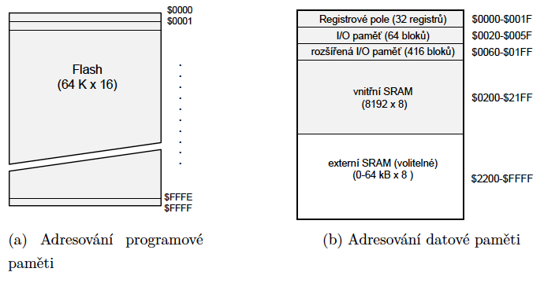{width="5.977882764654418in"
height="3.1093755468066493in"}

Veľkosti SRAM sa pohybujú od 2 kB (ATmega 328) do 32 kB (ATxmega rada)

**EEPROM** (Electricaly Erasable PROM)

Non volatile, je pomalšia na zápis a čítanie, ale zachováva dáta, takže
je dobrá na uloženie konfigurácie, etc. ATmega1281 má 4 kB, ATmega328P
má 1 kB, obmedzený počet zápisov, cca 10 000.

**3. Sériový přenos dat. Sběrnice USART, parametry komunikace, parita,
baudrate, asynchronní versus synchronní režim, přenosové rychlosti.**

**Sběrnice SPI, základní charakteristika, propojení dvou SPI zařízení.
Sběrnice I2C,základní charakteristika, adresování zařízení.**

**Synchrónny vs. asynchrónny režim**

Synchrónny režim znamená, že sa na synchornizáciu používa clock signál
(SPI, I2C), u asynchrónneho módu sa používa start a stop bit (USART).

**USART**

Sériové rozhranie, dáta sú posielané bit za bitom po jednom spoji.
Používa dve linky, Rx a Tx. Full duplex. Je asynchrónny, pre rozpoznanie
štartu a konca vysielania používajú start a stop bity indikujúce
začiatok a koniec rámca.

Komunikujú iba dve zariadenie. Rýchlosti, common 9600 - 115200 bps.

Parity bit

-   Error checking

<!-- -->

-   Posledný bit prenášaných dát nahradím paritnýb bitom (nepošlem bajt
    > ale 7 bitov + jeden parirný bit)

-   Ak je to 1, znamená to že som preniesol párny počet jednotiek
    > (vrátane parity bitu)

-   Ak je to 0, znamená to že že som preniesol nepárny počet jednotiek

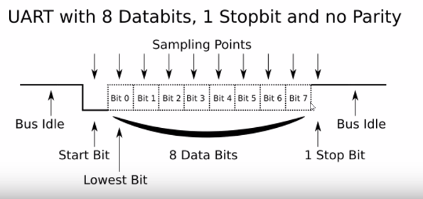{width="4.557292213473316in"
height="2.144607392825897in"}

**SPI**

Zbernica pre vysokorýchlostný prenos medzi mikrokontrolérom a
perifériami. V prípade že druhá strana API nemá, dá sa nakonfigurovať
USART do SPI módu. Je synchrónny, používa sa clock signál. Má celkovo 3
vodiče, jeden dva dátové pre oba smery a jeden pre hodinový signál.
Master-slave konfigurácia. Používa sa ešte slave-select pin na select
zariadenie s ktorým idem komunikovať. Programovateľné rýchlosti až do
2MB/s. Full duplex.

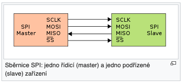{width="3.7916666666666665in"
height="1.7708333333333333in"}

SCLK - clock

MOSI - master out slave in

MISO - master in slave out

SS - slave select

Priebeh komunikácie

1.  Najprv master selectne slave tak že nastaví SS na log. 0

2.  Potom master začne enerovať clock signal

3.  Prebieha výmena dát cez MOSI a MISO

4.  Master ukončí komunikáciu takže prestane generovať clock signal a
    > zdvihne SS na log. 1

**I2C** (TWI, Two Wire Interface)

Phillips Semiconductor. Dvojvodičová obojsmerná zbernica podporujúca až
128 zariadení dohromady. Každé zariadenie komunikujúce po zbernici má
vlastnú adresu. Môže byť pripojených viacero masterov (MCUs) a vlacero
slaves (senzorov, diplejov, etc.). Master generuje hodinový signál. SDA
sa môže meniť iba ak je SCL v log. 0. Výnimkou je začiatok a koniec
prenosu, kedy sa SCL najprv zdvihne na 1 a potom sa indikuje cez SDL
začiatok alebo koniec prenosu nástupnou alebo zostupnou hranou, tzn. že
kontrolné dáta sa posielajú ak je SCL 1. Používajú sa ACK bity na
indikáciu prijatých
dát.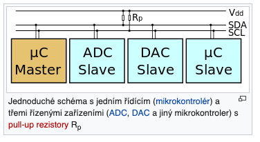{width="3.070790682414698in"
height="1.671875546806649in"}

Priebeh:

1.  Master najprv vyšle start bit

2.  Potom vyšle 7b adresu

3.  Potom vyšle R/W bit (1 read, 0 write)

4.  Ak zariadenie rozpozná svoju adresu, posiela späť ACK bit.

5.  Nasledujú 8b data rámce, každý potvrdený ACK bitom.

Adresa 0x00 je broadcast adresa.

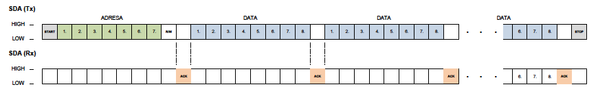{width="6.5in"
height="1.0972222222222223in"}

**4. Princip čítače s přetečením, princip čítače s přerušením.
Rozlišovací schopnost čítačů. Pulsně šířková modulace, střída.**

Odmeranie časového úseku sa realizuje napočítaním impulzov z časovača.

AVR má 8bit (0-255) a 16bit (0-65535) časovače. Časovač je voľne bežiaci
register (free running counter) a vlastnú hodnotu dokáže inkrementovať v
intervale špecifikovanom užívateľom. Register zvyšuje svoju hodnotu
každým prichádzajúcom impulzom. Vďaka tomu že časovač pracuje nezávisle
na procesore, dokáže meriať čas/frekvencu s vysokou presnosťou. Časovače
sa používajú aj na PWM.

**Čítač s pretečením**

Založený na vyvolaní prerušenia v prípade, že obsah časového registra
odpovedá jeho maximálnej kapacite. Prerušenie je vyvolané po pretečení.
Potom začne register čítať impulzy odznova.

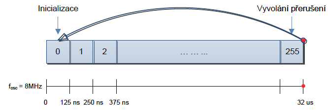{width="4.130208880139983in"
height="1.3962642169728783in"}

Ak je mikrokontrolér taktovaný an 8 MHz, tak jeden impulz trvá 125ns a
register sa naplní každých 32 us. K spomalení čítania hodnôt sa používa
preddelička.

**Čítač s porovnaním**

Umožňuje definovať vlastný interval pomocou komparátora. Voľne bežiaci
cítač v každom cykle kontroluje vlastnú hodnotu s hodnotou uloženou v
komparačnom registri a v prípade zhody oznámi túto udalosť prerušením.
Potom sa čítač nuluje číta znova od nuly.

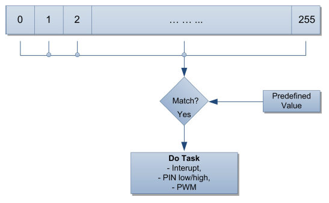{width="5.697916666666667in"
height="3.5208333333333335in"}

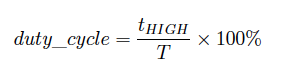{width="3.0in"
height="0.7395833333333334in"}

**PWM** (Pulse Width Modulation)

Časovače sa používajú ku generovaniu signálov s premennou úrovňou
napätia. Zníženie napätia sa dá dosiehnúť pulznom moduláciou (PWM). PWM
slúži k modulovaní střídy signálu, čo je percento času, v ktorom signál
je v stave HIGH v pomere k dĺže periódy
signálu.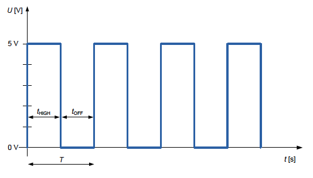{width="3.9563801399825023in"
height="2.2597298775153107in"}

**Rozlišovacia schopnosť časovača**

Záleží na frekvencii časovača a použití predeličky. Vyššia frekvencia má
vyššiu presnosť keďže sa impulzy generujú častejšie =\> prerušenie sa
deje častejšie.

**5. Rozdělení senzorů, princip senzoru teploty, popis negistoru, popis
zapojení měřícího přípravku s negistorem . ADC převod-vzorkování,
kvantování, kódování, kvantizační chyba. Princip AD převodníku s
postupnou aproximací. Chybovost převodníku, chyba nastavení nuly, chyba
zisku, integrální a diferenciální nelinearita.**

**ADC prevod**

**Vzorkovanie**

-   Zisťovanie úrovne analógového signálu v pravidelných intervaloch

-   Spravidla 0 - Ucc

-   Nyquistov teorém - f~vz~ \>= 2 \* f~sig~ (ak vzorkujem signál v
    > rozmedzí 20 Hz až 4 kHz tak musím vzorkovať s frekvenciou aspoň 8
    > kHz)

**Kvantovanie**

-   Prevod vzorky ku kvantizačnej úrovni

-   Počet úrovní záleží od ADC v mikrokontroléri, u atmelu je to 10/12
    > bitov (1024, 4096 úrovní)

-   Rozlíšenie prevodníka sa dá vypočítať ako pomer rozdielu úrovní
    > napätia a počtu kvantizačných hodnôt

-   V prípade rozsahu napätia 0 - 3,3 V je rozlíšenie 10b prevodníka
    > 3,22 mV

-   U lineárneho kvantizátora je kvantizačná chyba +- polovica
    > rozlíšenia (+- 1,61 mV)

**Kódovanie**

-   Vyjadrenie kvantizačnej úrovne v binárnej podobe

-   Signál je reprezentovaný postupnos ťou 10 bit d\'hodnôt (u 10b ADC)

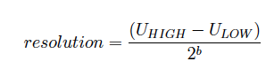{width="3.1041666666666665in"
height="0.8125in"}

**ADC prevod s postupnou aproximáciou**

Konkrétna implementácia prevodníka. Pri tejto metóde je použitý DA
konvertor, kontrolér a aproximátor.

{width="4.958333333333333in"
height="2.9375in"}

Na jeden vstup komparátoru je přiveden vstupní měřený analogový signál
𝑈in a na druhý vstup je přiveden signál s referenčním napětím 𝑈in. Celý
proces převodu analogové hodnoty na digitální spočívá v porovnávání
vstupního signálu s poměrovaným referenčním signálem. Počet porovnání je
závislé na počtu bitů převodníku. Níže je uveden příklad převodu pro
referenční napětí 5 V.

Na začátku převodu je společně se vstupním signálem na komparátor
přivedena hodnota 1/2 𝑈ref. V případě 10-bit převodníku je tato hodnota
vyjádřena jako 1000000000. DA konvertor tedy nastaví na nejvýznamnějš.m
MSB bitu (Most Significant Bit) hodnotu 1, převede tuto digitální
hodnotu na analogovou a porovná se vstupním napětím. Logická hodnota 1
pouze na MSB bitu tedy odpovídá hodnotě 512. V případě rozsahu 210 =
1024, odpovídá tato hodnota polovičnímu rozsahu napětí, pro rozsah 0 - 5
V je vygenerována hodnota referenčního napětí 2,5 V. Komparátor tedy
porovná obě napěťové úrovně a pokud je vstupní signál vetší než
referenční signál (𝑈in \> 𝑈ref) kontrolér předá DA konvertoru logickou
hodnotu 1 na prvním MSB. V opačném případě je na pozici MSB vygenerována
hodnota 0. V dalším kroku je k nastavené logické úrovni na MSB bitu
přidána logická 1 na druhý MSB bit a opět je provedeno porovnání
vstupního signálu s novou referenční napěťovou úrovní. V případě, že je
napěťová úroveň vstupního signálu větší než referenčního, ponechá se
opět na druhém místě logická 1, jinak se nastaví logická 0. Tímto
způsobem je porovnáno všech 10 bitů referenčního signálu. Po kontrole
10tého bitu je na výstupu kontroléru vyvedena posloupnost nastavených
bitů. Tímto způsobem je proveden převod analogového signálu na digitální
pomocí postupné aproximace k nejbližší hodnotě. Na Obrázku 5.3 je
znázorněn proces pro převod analogového signálu s napěťovou úrovní 3,328
V. Výstupem převodu je binární hodnota 1010101001, která odpovídá
hodnotě

napětí 3,325 V. Chyba převodu je tedy 3 mV. V tabulce 5.1 jsou uvedeny
průběžné výpočtu převodu. Rozlišovací schopnost metody s postupnou
aproximací je velmi vysoká, ovšem jeho přesnost je závislá na přesnosti
DA převodníku.

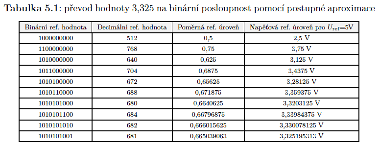{width="6.5in"
height="2.5555555555555554in"}

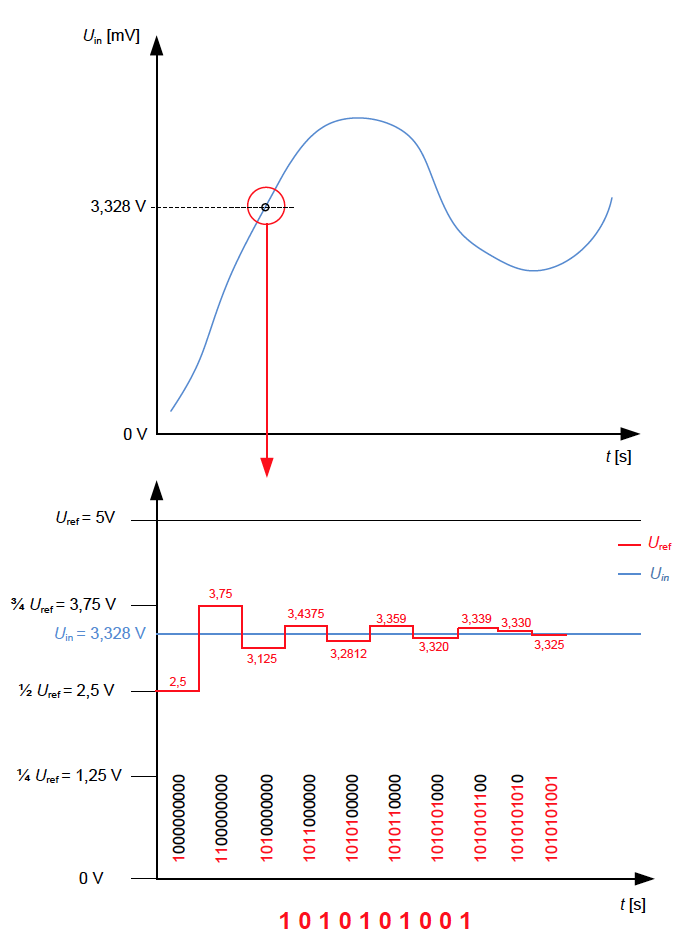{width="6.5in"
height="8.86111111111111in"}

**Chybovosť AD prevodníka**

**Chyba nastavenia nuly** (Offset)

-   Hodnota napätia vstupného signálu, pri ktorej je výstupná binárna
    > hodnota prevodníka rovná nule

-   V prípade že je výstup prevodníka 0 pri nenulovom napätí, je toto
    > napätie označované ako chyba offsetu, alebo chyba nastavenia nuly

**Chyba zisku** (Gain Error)

-   Popisuje napäťový rozdiel posledného AD prevodu od ideálnej
    > charakteristiky

**Integrálna nelinearita** (INL)

-   Maximálny zaznamenaný rozdiel aktuálneho a ideálneho priebehu
    > prevodu

**Diferenciálna nelinearita** (DNL)

-   Maximálny rozsah napätia v ktorom došlo k zmene binárnej hodnoty

{width="6.5in"
height="5.430555555555555in"}

**Rozdelenie senzorov**

Senzor je zariadenie ktoré prevádza akýkoľvek druh energie na
elektrickú.

**Priame a komplexné senzory**

-   Priamy senzok konvertuje energiu priamo na elektrický signál (napr.
    > termistor ktorý mení svoj odpor vzhľadom na teplotu)

-   Komplexný senzor obsahuje priamy senzor a aspoň jeden prevodník
    > (napr. chemický senzor ktorý najprv prevedie podnet na chemickú
    > reakciu na tepelnú energiu a potom prevedie tepelnú energiu na
    > elektrickú)

**Aktívne a pasívne senzory**

-   U pasívneho senzoru je nutné elektrickú veličinu odpor, kapacita,
    > indukčnosť ďalej previesť na prúdový signál (termistor), väčšin
    > pasívnych senzorov sú priame senzory

-   U aktívneho senzoru sa samotný senzor stáva zdrojom elektrického
    > signálu (fotodióda)

**Absolútne a relatívne senzory**

-   Absolútne merajú veličinu vzhľadom k určitej absolútnej hodnote, ako
    > u teplotných senzorov napr. voči 0∘C (termistor)

-   Termočlánok napr. generuje elektrický prúd ako reakciu na zmenu
    > teploty, čiže reaguje na zmenu meranej veličiny

**Senzory teploty**

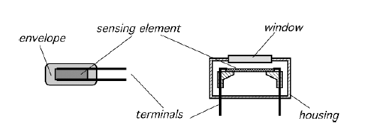{width="5.364583333333333in"
height="2.0520833333333335in"}

Skladá sa zo znímacieho elementu, kontaktov a obalu. Snímací element je
zodpovedný za zmenu jeho vlastnej teploty z pôvodnej na snímanú, vhodný
material pre snímací element a obal má vysokú tepelnú vodivosť a
citlivosť. Môže byť kotaktný a bezkontaktný.

**Termistor NTC (**Negative Temprerature Coefficient, **Negistor)**

Je prvok ktorého elektrický odpor klesá s rastúcou teplotou - má
negatívny teplotný koeficient. Závíslosť medzi odporom a teplotou je
nelineárna funkcia.

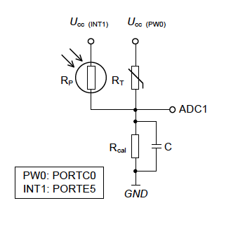{width="3.4270833333333335in"
height="3.0625in"}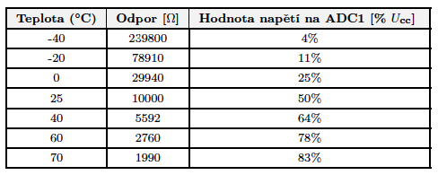{width="5.083333333333333in"
height="2.03125in"}

**6. Princip šíření rádiového signálu prostředím, výkonová úroveň
přijatého signálu a její závislost na vzdálenosti, popis logaritmického
útlumového modelu, převod dBm na mW, vliv frekvence na výkonovou úroveň
signálu, zisk antény, čtvrtvlnné antény.**

Elektromagnetické vlny. Pri použití všesmerovej antény klesá intenzita
vyžarovaného signálu s kvadrátom vzdialenosti (inverse square law).

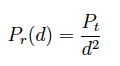{width="1.25in" height="0.6875in"}

Výkonová úroveň je vzťahovaná k výkonu 1 mW, potom používame jednotku
dBm. V dBm je výkonová úroveň úrčená ako logaritmický pomer prijatého
výkonu P~r~ \[W\] vzhľadom k referenčnej hodnote 1 mW, preto je
základnou veličinou výkonovej úrovne decibel miliwatt - **dBm.**

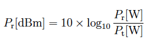{width="2.8229166666666665in"
height="0.8125in"}

Výkonová úroveň 0 dBm potom odpovedá pomeru Pr/Pt = 1, výkon je teda Pr
= 1 mW.

{width="2.5833333333333335in"
height="3.5in"}

Prepočet z dBm na mW

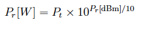{width="2.53125in"
height="0.5520833333333334in"}

**Logaritmický útlmový model**

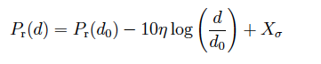{width="3.7604166666666665in"
height="0.75in"}

Dá sa využiť pre odhad komunikačnej vzdialenosti na základe výkonovej
úrovne prijatého signálu šíreným reálnym rádiovým prostredím. Úroveň
prijatého signálu Pr(d) vo vzdialenosti d je závislá na

1.  Úrovni signálu Pr(d0) v referenčnej vzdialenosti d0

2.  Pomere koncovej a referencnej vzdialenosti

3.  Na útlmovom činiteli

4.  Na parametri X ktorý je náhodná premenná s rozptylom 𝜎 ktorá v
    > podstate predstavuje predom neznámy útlm signálu vzniknutý
    > prechodom prekážok, odrazom, difrakciou, či ohýbom

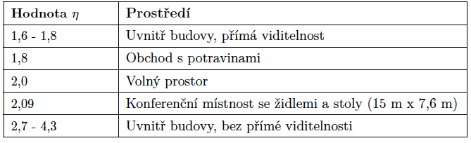{width="4.880208880139983in"
height="1.4937817147856518in"}

**Vplyv frekvencie na výkonovú úroveň signálu**

Vyššia frekvencia má vyšší výkon? V skriptách to neni.

**Zisk antény**

Uvádza sa väčšinou pre smerové antény a a užívateľovi vraví, koľkokrát
vyšší výkon v najsilnejšom smere radiácie má smerová anténa oproti
anténe všesmerovej. Jednotka dBi (i - isotropic). Ideálna izotropická
anténa vyžaruje vo všetkých smeroch rovnakým výkonom. Zisk nie je
vzťažený len k prijímu ale aj vysielaniu. Ak má anténa zisk G = 3 dBi
tak bude sila prijatého alebo odoslaného signálu v najsilnejšom smere
radiácie o 3 dB viac ako pri všesmerovej anténe.

**Štvrťvlnné antény**

Dipólová a monopólová anténa. Najčastejšie používané antény v
bezdrôtových sieťach. Monopólova anténa je zložená z dvoch drôtov,
pričom každý drôt má dĺžku odpovedajúcu štvrtine vlnovej dĺžky 𝜆/4. U
dipólovej je celková dĺžka antény 𝜆/2.

**7. Standard IEEE 802.15. a jeho rozdělení. Definice fyzické vrstvy dle
IEEE 802.15.4, použitá frekvenční pásma, modulace, přenosové
rychlosti.**

**Problematika koexistence standardu IEEE 802.15.4 s ostatními
bezdrátovými technologiemi. Detekce energie na kanále, parametr RSSI,
parametr LQI, formát rámce na fyzické vrstvě IEEE 802.15.4**

WPAN technológie sú definované štandardom IEEE 802.15. Práca na
definícii štandardov je rozdelená medzi 6 pracovných skupín 802.15.1 až
802.15.7.

**802.15.1**

-   Bluetooth

**802.15.2**

-   rieši koexistenciu WPAN s ostatnými technológiami (prevažne 802.11 -
    > wifi)

**802.15.3** a **802.15.4**

-   Špecifikuje parametre fyzickej (PHY) a linkovej (MAC) vrstvy pre
    > bezdrôtové zariadenia s krátkym dosahom a zameraním na nízku
    > spotrebu

-   802.15.3 - **High Rate** WPAN (11-55 Mbps)

-   802.15.4 - **Low Rate** WPAN (pomalé, low energy)

**802.15.5**

-   Špecifikuje technológie umožňujúce čiastočnú a plnú mesh komunikáciu

**802.15.7**

-   Má na starosti návrh štandardov pre zariadenia komunikújuce pomocou
    > technológie **VLC** (Visible Light Communication)

**Definícia fyzickej vrstvy podľa 802.15.4**

Fyzická vrstva má na starosti

-   Vypnutie a zapnutie rádiového prijímača

-   Prenos a príjem dát

-   Výber frekvenčného kanálu

-   Detekciu energie na kanále (energy detection, carrier sense?)

-   Zistenie voľného kanálu (Clear Channel Assesment)

-   Zistenie kvality prijímaných dát pomocou LQI parametre (Link Quality
    > Indication)

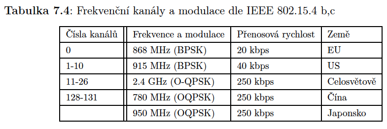{width="6.5in"
height="2.1666666666666665in"}

{width="6.5in" height="1.75in"}

WPAN zdieľa u kanálov 11-26 2,4 GHz pásmo s 802.11 (wifi). Pre 802.11 v
európe bolo vydané doporučenie používať len kanály 1, 7 a 13, z čoho
vyplýva, že jediné voľné kanály u WPAN ktoré by sa nemali kryť s WiFi sú
15, 16, 21 a 22. Takto sa teoreticky minimalizuje prekrytie týchto
štandardov, ale v realite je to aj tak bordel a prekrývanie je stále
problém. Šírka WPAN kanálu býva 600 kHz.

**RSSI**

Hodnota indikujúca úroveň prijatého výkonu na kanále. Jednotka je dBm.
Zvykne byť uložená v status registri rádioveho čipu, alebo za prijatým
paketom (CC1101).

**Detekcia energie na kanále**

Slúži na zamedzeniu vzniku kolízií pri vysielaní viacerých zariadení v
rádiovom dosahu. IEEE 802.15.4 definuje využitie prístup. metódy CSMA-CA
(collision avoidance). Meria sa energia na kanále. Podľa toho device
vie, či môže vysielať, alebo má počkať kým sa neuvoľní kanál. V prípade
že je rozdiel medzi detekovanou energiou a citlivosťou prijímača väčší
ako stanovená hranica (40 dBm u AT86RF230), oznamuje sa linkovej vrstve
že je kanál obsadený.

IEEE 802.15.4 definuje 3 modely pre rozhodnutie o obsadenosti kanálu
(CCA - Clear Channel Assesment)

1.  CCA Mode 1 - iba energy detection (citlivosť +40 dBm)

2.  CCA Mode 2 - detekcia nosnej, rozhoduje sa o obsadenosti detekovaním
    > nosného signálu (ak sa detekuje signál ktorý bol vysielaný a
    > rozprestrený rovnakými technikami ako na prijímacej strane, v
    > prípade 802.15.4 to môže byť BPSK a O-QPSK spoločne s metódou
    > rozprestreného spektra DSSS)

3.  CCA Mode 3 - kombinácia predchádzajúcich dvoch módov

**LQI** (Link Quality Indicator)

Metrika pre určenie kvality bezdrôtového spoja. Nabýva hodnoty 0 - 255.
0 je najmenšia kvalita a 255 je najvyššia kvalita linky. Hodnotu LQI
môžeme interpretovať ako chybovosť prijímaných dát (PER - packet error
ratio). PER = 1 - ani jeden paket nebol prijatý správne.

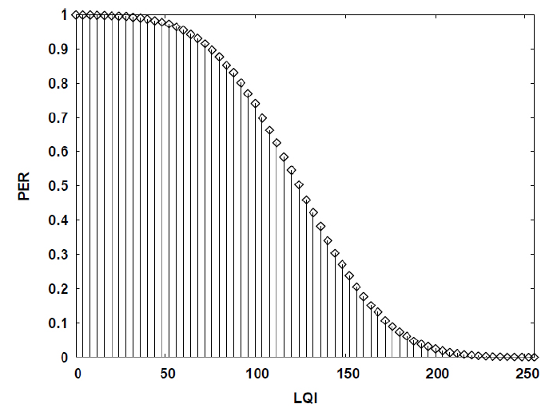{width="6.5in"
height="4.763888888888889in"}

Hodnota LQI sa určije vždy až po úplnom prijatí rámca a skontrolovaní
integrity cez CRC. LQI sa používa napr. u ZigBee protokolu k nájdení
najspoľahlivejšej cesty medzi dvoma bezdrôtovými jednotkami.

**Formát rámca na fyzickej vrstve 802.15.4**

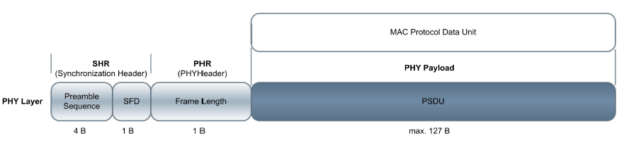{width="6.5in"
height="1.4722222222222223in"}

Max veľkosť synchronizačnej hlavičky (**SHR** - Synchronization Header)
je 6B a max veľkosť payloadu je 127 B.

SHR začína 4B preambulou vyplnenou nulami, za ňou nasleduje SFD (Start
of Frame Delimiter) s konštantou 0xA7. Potom nasleduje byte označujúci
dĺžku payloadu v bajtoch (používa sa iba 7 bitov, keďže max dĺžka
payloadu je 127 B).

Payload sa potom predáva linkovej vrstve.

**8. Definice linkové vrstvy dle IEEE 802.15.4 , formát rámce, struktura
superrámce, typy zařízení, mezirámcové intervaly, synchronizovaná a
nesynchronizované metoda CSMA/CA.**

Linková vrstva je označovaná ako MAC (Media Access Control), je
zodpovedná za

-   Definícia typu zriadenia (RFD/FFD)

    -   802.15.4 definuje dve typy zariadení - **FFD** (Fully Function
        > Device) a **RFD** (Reduced Function Device)

    -   **FFD** môže slúžiť ako PAN-C (koordinátor siete), Router, alebo
        > ED (End Device). Smerovač je schopný smerovať dáta k iným
        > prvkom siete. Koordinátor siete riadi celú sieť a má jedinečnú
        > adresu 0x00 a väčšinou funguje ako brána do iných sietí.

    -   **RFD** je komunikačné a senzorické zariadenie ktoré nedisponuje
        > funkciou smerovania dát

-   Adresovanie zariadení

    -   Každé zariadenie má unikátnu adresu ktorá sa dá nakonfigurovať
        > alebo je pridelená koordinátorom siete

    -   802.15.4 definuje základný 16bit formát adresy alebo rozšírený
        > 64b formát

-   Definícia topológie (hviezda alebo peer-to-peer)

-   Generovanie beacon rámcov v prípade že je device koordinátor siete

-   Synchronizácia zariadení podľa hodnôt v beacon rámci

-   Vyhradzovanie časových intervalov pre komunikácie (GTS - Guarantee
    > Time Slots)

-   Vkladanie medzirámcových intervalov

-   Vykonávanie CSMA-CA

-   Asociovanie zariadení do siete a ich odpájanie

**Superrámec**

Koordinátor môže synchronizovať sieť zasielaním Beacon rámcov. Interval
beacon rámcov definuje dobu trvania jedného Superrámca (Superframe).
Superrámec sa delí na viacero častí, ktoré definujú, kedy môže
zariadenie vysielať a kedy má byť neaktívne (vypnuté radio, sleep mode).
Superrámec je teda **časový okamžik ohraničený dvoma Beacon rámcami**.

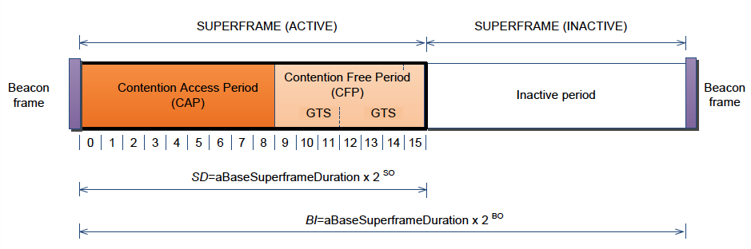{width="6.5in"
height="2.1666666666666665in"}

Superrámec je rozdelený do troch časových intervalov.

**CAP (Contention Access Period)** - po túto dobu môžu zariadenia voľne
vysielať za použitia CSMA-CA

**CFP (Contention Free Period)** - v tomto intervale sa nesúperí o
médium, tento interval je rozdelený do garantovaných časových slotov
**GTS (Guaranteed Time Slots)** pre tie zariadenia, ktoré si o vyhradené
časy zažiadali u koordinátora. Počet GTS intervalov je obmedzený na 7 a
každý GTS môže obsadzovať ľubovoľný počet time slotov.

**Inactive period** - tu sa nevysiela, vypnuté radio

**CAP** a **CFP** majú dĺžku dokopy 16 časových slotov premennej dĺžky.
Dĺžka slotov závisí na dĺžke trvania aktívnej doby superrámca.

Po zapnutí si zariadenie vyžiada beacon rámec od koordinátora. V beacon
rámcoch sú prenášané hodnoty podľa ktorých si zariadenia vypočítajú kedy
končí aktívna doba (prejsť do režimu spánku) a kedy sa zas majú prebudiť
pre prijatie ďalšieho beacon rámca.

**BI** - beacon interval - interval prenášania beacon rámca

**SD** (superframe duration) - doba trvania aktívnej časti superrámca

𝐵𝐼 = 𝑎𝐵𝑎𝑠𝑒𝑆𝑢𝑝𝑒𝑟𝑓𝑟𝑎𝑚𝑒𝐷𝑢𝑟𝑎𝑡𝑖𝑜𝑛 x 2^𝐵𝑂^

𝑆𝐷 = 𝑎𝐵𝑎𝑠𝑒𝑆𝑢𝑝𝑒𝑟𝑓𝑟𝑎𝑚𝑒𝐷𝑢𝑟𝑎𝑡𝑖𝑜𝑛 x 2^𝑆𝑂^

**BO** a **SO** sú prenášané v beacon rámci.

𝑎𝐵𝑎𝑠𝑒𝑆𝑢𝑝𝑒𝑟𝑓𝑟𝑎𝑚𝑒𝐷𝑢𝑟𝑎𝑡𝑖𝑜𝑛 je definované štandardom ako doba trvania 960
symbolov, jeden symbol obsahuje 4 bity. Pri prenosovej rýchlosti 250
kbps je to 15,36 ms

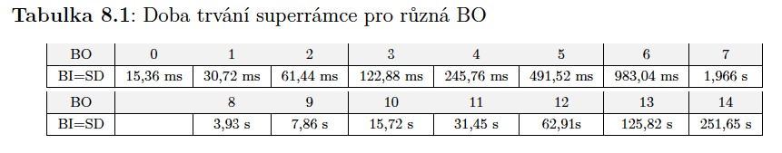{width="6.5in"
height="1.2777777777777777in"}

**Medzirámcové intervaly**

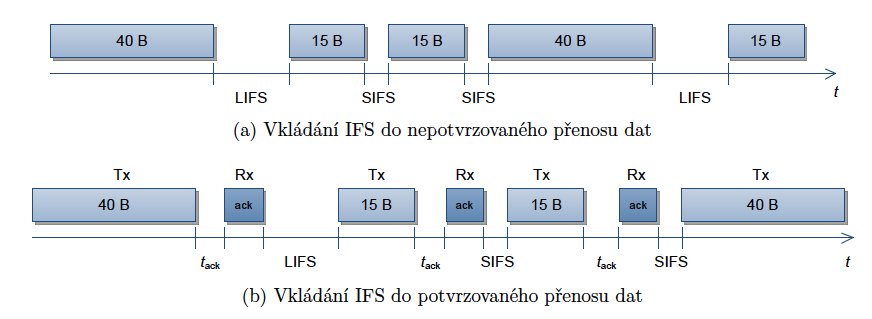{width="6.5in" height="2.375in"}

Medzirámcové intervaly sú vkladané za každým prenosom z dôvodu
zohľadnenia delaye na fyzickej vrstve. Po dobu ich trvania nie je možné
zahájiť komunikáciu. Ak je prenesených viac ako 18 B, vkladá sa LIFS
(Long Inter Frame Spacing) dlhý 40 symbolov, ináč sa vkladá SIFS (Short
Inter Frame Spacing) dlhý 12 symbolov.

Ak sa používa acknowledgement rámcov tak je medzirámcový interval
vložený až po prijatí potvrdenia.

**CSMA-CA**

Základnou metódou prístupu na médium u 802.15.4 je detekcia nosnej v
kombinácii s CSMA-CA. Používajú FFD aj RFD typy zariadení.

Existujú tu dva režimy CSMA-CA. **Zarovnaná metóda CSMA-CA** (Slotted
CSMA-CA) sa používa v synchornizaovanej sieti. Je spúšťaná v
definovaných backoff slotoch vnútri jedného zo 16 časových slotov
aktívnej doby superrámca. **Nezarovnaná metóda CSMA-CA** sa používa v
nesynchronizovanej sieti a môže sa spustiť hocikedy.

**Štruktúra MAC rámca**

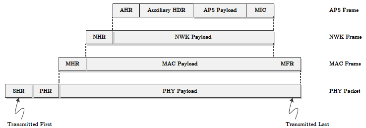{width="6.5in"
height="2.2777777777777777in"}

IEEE 802.15.4 definuje na linkovej vrstve 4 typy správ

-   Beacon rámec

-   Dátový rámec

-   Príkazový rámec

-   Potvrdzovací rámec

Všeobecne sa rámec skladá z 3 častí

-   MHR - MAC Header

-   MAC Payload - samotný payload

-   MFR - MAC Footer

**Frame Control**

-   **Frame Type** - typ rámca (beacon, data, príkaz, ack)

-   **Security Enabled** - ak je nastavené, tak bude obsah šifrovaný a
    > použije sa hlavička auxiliary header s info o šifrovaní

-   **Frame Pending** - zariadenie oznamuje že má k dispozícii data,
    > dátový rámec sa potom generuje ak si iné zariadenie požiada o dáta
    > cez Data Request

-   **Ack Request** - ak sa požaduje ACK pre tento rámec

-   **PAN ID** - ID PAN siete, duh

-   **Dest. Addressing Mode** a **Source Addressing Mode** - určuje či
    > sa jedná o 16 bit alebo 64 bit adresovanie

-   **Frame Version** - verzia 802.15.4 štandardu

**Sequence Numbe**r - definuje sekvenčné číslo rámca

**Dest PAN ID** - self explanatory

**Dest Addr** - self explanatory

**Source PAN ID** - self explanatory

**Source Addr** - self explanatory

**FCS** - Frame Control Sequence, kontrolný súčet CRC

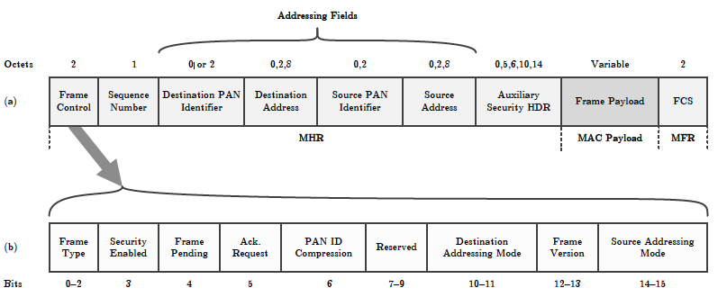{width="6.064009186351706in"
height="2.5052088801399823in"}

**9. Protokol Zigbee, definice síťové vrstvy, směrování v mesh síti
pomocí AODV, směrování ve stromové struktuře.Aplikační vrstva protokolu
Zigbee, aplikační profily, koncové body (endpoints), zabezpečení
komunikace.**

**Zigbee**

Protokol založený na IEEE 802.15.4, definuje vyššiu sieťovú vrstvu (NWK
Layer) a aplikačnú vrstvu (APS Layer) a služby pre zabezpečenie
komunikácie.

Jednou z úloh je rozšíriť jednoskokovú komunikáciu do modelu, kde môžu
komunikovať dve zariadenia bez toho aby boli v rádiovom dosahu pomocou
multi-hop komunikácie.

Ďalšou úlohou je zabezpečenie komunikácie šifrovaním, definovanie
aplikačných profilov, etc. Uplatňuje sa prevažne v domácej
automatizácii.

Typy zariadení

-   Zigbee Coordinator (IEEE 802.15.4 - PAN-C (FFD))

-   Zigbee Router (IEEE 802.15.4 - Router (FFD))

-   Zigbee End Device (IEEE 802.15.4 - Device (RFD))

**Sieťová vrstva** (NWK layer)

Implementácia Zigbee musi zaručiť že hociktoér zariadenie bude vedieť
komunikovať s hociktorým bez toho aby bolo potreba zvýšiť rádiový dosah
komunikačnej jednotky. Sieťová vrstva definuje princípy multihop
komunikácie medzi jednotlivými uzlami.

Hlavné úlohy vrstvy

-   Config nového zariadenia (nová jednotka v sieti môže byť router
    > alebo end device)

-   Spustenie siete (prvé zariadenie v sieti musí byť PAN-C)

-   Pripojenie do siete a odpojenie od siete

-   Zabezpečenie sieťovej vrstvy

-   Smerovanie v sieti

-   Udržiavanie smerovacích tabuliek

-   Vytváranie tabuliek susedných uzlov

Zigbee definuje

-   Unicast

-   Broadcast (adresa 0xffff)

-   Multicast

**Stromová štruktúra uzlov a smerovanie**

Pri vložení uzlu do siete je mu priradená 16bit adresa (alebo si ju user
nakonfiguruje sám). Zigbee coordinator je koreň stromu. Hĺbka uzlu
označuje koľko hopov paket vyslaný uzlom absolvuje, kým kým je prijatý
koordinátorom. Stupeň uzlu je parameter označujúci počet ostatných
zariadení v rádiovom dosahu daného uzlu. Stupeň celej siete je primerný
počet stupňov všetkých uzlov.

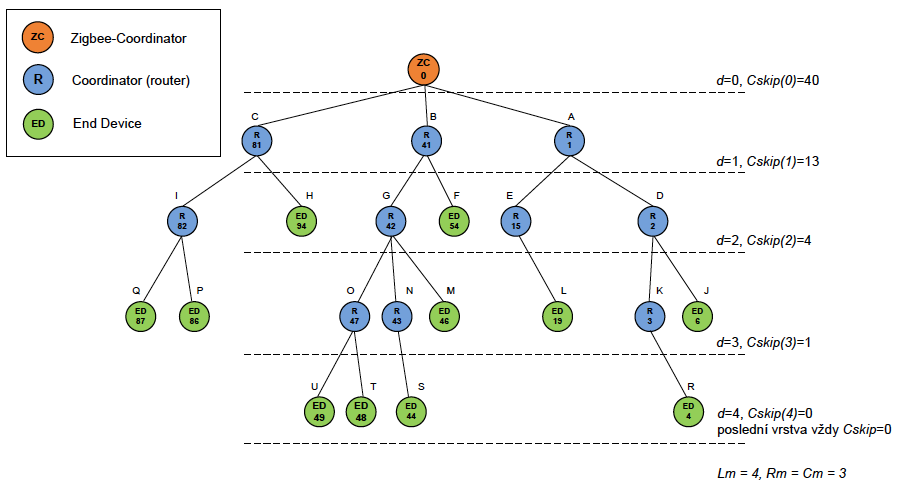{width="5.348958880139983in"
height="2.937288932633421in"}

Funkcia *Cskip* a hodnoty adries zariadení sú v stromovej topológii
využité pri smerovaní dát. Smerovač ktorý prijal dáta najprv skontroluje
či je koreňom v ceste paketu. Ak áno, je paket preposlaný ďalšiemu uzlu.
Ak nie, vypočíta sa adresa uzlu pre ďalší skok podľa
kurvanezapamätateľnej rovnice.

**Smerovanie v mesh topológii pomocou AODV protokolu**

Ad-hoc On Demand Vector protocol. Prenosová cesta býva väčšinou
vytváraná na vyžiadanie anemusí byť symetrická (tzn. cesty tam a späť
nemusia byť rovnaké.

Smerovanie je proces výberu medziľahlých uzlov pre doručenie správy k
požadovanému príjemcovi. Zigbee koordinátor a Zigbee smerovače zostavujú
smerovacie cesty.

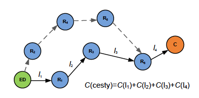{width="4.197916666666667in"
height="2.0729166666666665in"}

Dĺžka cesty L je počet uzlov v prenosovej ceste (incl. odosielateľ a
príjemca).

Optimálna cesta sa volí na základe kvality spoja, počtu skokov a
energetickej náročnosti, rozhoduje teda **cena spoja**. Čím je cena
vyššia, tým je menšia pravdepodobnosť úspešného prijatia paketu. Cena
spoja nenadobýva vyšších hodnôt ako 7.

Rovnica na výpočet ceny spoja na základe pravdepodobnosti prijatia
paketu 75%:

{width="3.2291666666666665in"
height="1.8020833333333333in"}

Pravdepodobnosť prijatia paketu je založená na LQI. LQI škála sa rozdelí
do 7 rozsahov, kde každý rozdah LQI odpovedá konkrétnej hodnote P. Cena
spoja sa vypočíta zo súčtu pravdepodobností všetkých spojov na ceste.

Router a Coordinator si držia smerovacie tabuľky. Cieľom tabuľky je
nájsť ďalší hop. Ak router nemá záznam o príjemcovi, paket zahadzuje.

Okrem smerovacej tabuľky majú devices aj dočasnú smerovaciu tabuľku
ktorú používajú pri poslaní a potvrdení smerom k zariadeniu ktoré
požadovalo zostavenie cesty. Dočasná tabuľka sa ruší po zostavení cesty
alebo vypršaní konkrétneho časového úseku.

Všetky zariadenia majú tabuľku susedov, ktorá je aktualizovaná stále ak
zariadenie prijíme od suseda v rádiovom dosahu paket. Sú uložené info o
adrese, kvalite spoja, typu zariadenia, etc.

**Aplikačná vrstva**

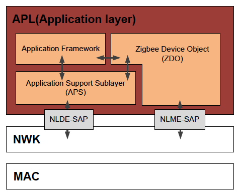{width="5.010416666666667in"
height="4.03125in"}

APS vytvára rozhranie medzi sieťovou a aplikačnou vrstvou. V AF sú
uložené aplikačné profily Zigbee zariadení. Jedno Zigbee zariadenie môže
hostovať až 240 aplikácií. Každá aplikácia má unikátne číslo 1-240.
Tento identifikátor sa nazýva **endpoint**. Endpoint 0 je vyhradený pre
ZDO vrstvu. ZDO vytvára rozhranie medzi blokom APS a aAF a má na
starosti konfiguráciu zariadení, napr. Konfiguráciu funkcie
(coordinator, router, end device).

Ak adresovaniu individuálnych aplikácií sa používa endpoint.

**Aplikačné profily**

Zaručujú kombatibilitu zariadení rôznych výrobcov pre rovnaké aplikačné
využitie. Napr. komunikačné zariadenia výrobcu A dokážu aktivovať čidlo
od výrobcu B, ak tieto zariadenia majú rovnaký Zigbee profil. Profil je
identifikovaný 16bit číslom. Rozdah profilov 0x0000 - 0x7fff je
vyhradený pre verejné profily definované Zigbee alianciou.

V roku 2013 tieto profily

-   Zigbee Building Automation

<!-- -->

-   Zigbee Remote Control

-   Zigbee Smart Energy

-   Zigbee Health Care

-   Zigbee Home Automation

-   Zigbee Input Device

-   Zigbee Light Link

-   Zigbee Retail Service

-   Zigbee Telecom Services

-   Zigbee Network Devices

Každý profil obsahuje niekoľko clusterov, každý má vlastné 16bit číslo,
každý cluster obsahuje množinu atribútov (atribút má tiež 16bit ID).
Atribúty slúžia pre uloženie dát (napr. Teplotné čidlo ukladá nameranú
hodnotu do jedného z atribútov)

**Zabezpečenie prenosu**

Zigbee používa 128bit AES. Šifrovací kľúč je predkonfigurovaný
užívateľom.

Pre zabezpečenie prenosu sú použité dva typy kľúčov. **Linkový kľúč**
pre unicast prenosy a **sieťový kľúč** pre broadcast prenosy. Ak user
nenakonfiguruje kľúč, tak môže byť distribuovaný pomocou tzv. **Trust
Center** (napr. coordinator) pomocou key-transport kľúča. Tento kľúč ale
už musí byť predkonfigurovaný užívateľom. Výhodou tohto spôsobu je že
kľúč môže byť často menený z dôvodu zvýšenia bezpečnosti.

**10. Lokalizace bezdrátových uzlů, energetická spotřeba při přenosu
dat.**

Proces lokalizácie je proces určenia polohy prvku v definovanom
priestore. Ak aplikácia vyžaduje znaloť polohy zariadenia (napr. získaj
dáta z južnej časti senzorov, etc.).

Existujú 3 spôsoby

1.  Manuálna konfigurácia polohy užívateľom. Výhodou je že v sieti
    > enmusí prebehnúť distribuovaný lokalizačný proces a šetrí sa
    > energia. Nevýhodou je neflexibilita.

2.  GPS - nevýhodou je závislosť na externom HW a prevažne tiež vysoká
    > spotreba energie

3.  Implementácia optimálneho lokalizačného algoritmu. Základným
    > princípom je určenie vzdialenosti k zariadeniam, ktoré už poznajú
    > svoju polohu

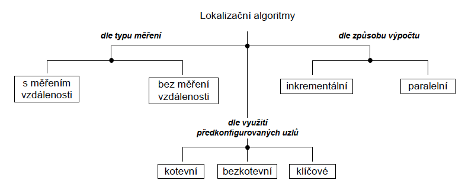{width="6.5in"
height="2.6527777777777777in"}

Existujú dva typy lokalizačných algoritmov

1.  S meraním vzdialenosti

2.  Bez merania vzdialenosti

    a.  K vyjadreniu vzdialenosti sa používa počet hopov medzi dvoma
        > uzlami

Ak je v sieti skupina zariadení ktoré majú preddefinovanú polohu (tzv.
kotvy), vravíme o kotviacich algoritmoch. Kotvy, které nemusí znát svojí
polohu vysílají v pravidelných intervalech signál na různých frekvencích
a s různým vysílacím výkonem.

Před samotnou lokalizací je zapotřebí provést měření v prostoru a
vytvořit databázi s

informacemi o místě, frekvenci a síle signálu. Lokalizace pak probíhá na
základě porovnání klíče (frekvence a síla signálu) s informacemi v
databázi. V tomto případě hovoříme o kl.čových lokalizačních
algoritmech.

Odhad vzdialenosti pomocou RSSI, Time of Arrival, Angle of Arrival
