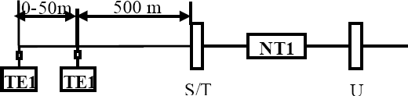

1) Komunikační služby, druhy komunikačních služeb. Datové služby. Telematické služby, textové služby, obrazové služby, kombinované služby, audiovizuální služby. 
=================================================================================================================================================================

Komunikační služby
------------------

Definice komunikačních služeb se zakládá na pojmu služba, pod kterým se
obecne chápe schopnost uspokojit predem stanovené nebo dohodnuté
požadavky, příp. potřeby. Komunikační službu můžeme definovat jako
hodnotitelkou schopnost komunikačního systému, resp. síte, poskytovanou
k uspokojení uživatele komunikačního systému, resp. účastníku síte.

Komunikace muže probíhat na omezené ploše, pak hovoříme o místní nebo
lokální komunikaci, nebo v rámci metropole (metropolitní komunikace), v
rámci regionu (regionální komunikace), státu (celostátní komunikace)
nebo dokonce v mezinárodním ci celosvětovém měřítku (globální
komunikace). Jakmile komunikace přesáhne řádové kilometrovou vzdálenost,
což jsou případy počínaje metropolí, nazývá se telekomunikací.

Druhy komunikačních služeb
--------------------------

1.  Z hlediska regulace v telekomunikacích

    -   rezervovaná oblast -- monopolní služby (např. telefonní služba)

    -   regulovaná oblast -- provozování konkurence při dohledu státu
        (datové služby, mobilní, telematické)

    -   oblast volné soutěže -- nejsou stanovena téměř žádná pravidla,
        pouze dodržování normy a předpisů

2.  Z hlediska sítě, jejímž prostřednictvím se služba poskytuje

    -   Základní -- telefon

    -   přídavné -- datové, faximilní, teletexocá, videotexová

    -   doplňkové -- identifikace čísla, informace o zpoplatňování

3.  Z hlediska počtu uživatelů komunikujících současně

    -   Dvoubodové

    -   Mnohabodové

4.  Z hlediska způsobu generovaných a přenášených signálu

    -   úzkopásmové služby (telefon, do 20 kbit/s v telefonním pásmu, u
        ISDN 64 kbit/s)

    -   středněpásmové služby (rádove desítky a stovky kbit/s)

    -   širokopásmové služby (rádove Mbit/s a desítky Mbit/s)

    -   nadširokopásmové služby (stovky Mbit/s až Gbit/s)

Datové služby
-------------

Datovou službou se rozumí služba pro úcely komunikace pocítacu,
terminálu a ostatních prostredku zpracování dat. Vetšinou jde o
prenosovou službu, ale pokud se v jejím rámci provádí kódová konverze,
šifrování, pozdržený prenos a další operace, které prímo nesouvisejí s
vlastním prenosem, jde o zlepšenou datovou službu poskytovanou vyššími
vrstvami sítové architektury, pocínaje transportní. Za zlepšenou se však
nepovažuje datová služba poskytovaná prostrednictvím paketové datové
síte, protože z podstaty prepojování paketu vyplývá rychlostní konverze,
docasný záznam datových jednotek v prepojovacích uzlech a jejich
následné vysílaní smerem k adresátovy.

Telematické služby
------------------

Telematické služby jsou všechny telekomunikacní služby mimo služby
telefonní, telegrafní a prenosu dat. Jedná se o výhodné spojení
výpocetní a telekomunikacní techniky pro zkvalitnení stávajících služeb
a pro zavádení nových služeb v telekomunikacích. Telematické služby se
delí podle druhu prenášené a zpracovávané informace na textové,
obrazové, kombinované, audiovizuální a další, které nelze do nekteré z
techto skupin zahrnout.

a)  **Textové služby --** Textová telekomunikace je založena na rozkladu
    prenášeného textu na jednotlivé textové prvky (znaky), jimž se
    prirazují elektrické signály (znacky). Ty se prenášejí
    telekomunikacní cestou na prijímací stranu, kde se vyhodnocují a
    skládají do puvodního textu. Mezinárodní úcastnická telematická
    služba **teletex** umožnuje uživatelum výmenu korespondence po
    telekomunikacních sítích. Je slucitelná se službou telex, ale je
    dokonalejší. Využívá plné možnosti klávesnice psacího stroje,
    možnosti lokálního zpracování textu, možnosti príjmu a vyslání textu
    bez prítomnosti obsluhy a vyznacuje se vysokou prenosovou rychlostí
    (2400 bit/s i více), spolehlivostí, malou chybovostí a tichým
    provozem, který umožnuje umístení koncové ho zarízení v míste vzniku
    dat. Proto se používá pro tuto službu také termín kancelárský
    dálnopis. Prenos je synchronní, prenosová rychlost 2400 bit/s (tj.
    300 zn/s proti 6,6 zn/s u telexu) po telefonní síti nebo VDS, nebo
    vetší (po VDS a ISDN). Hostitelskou sítí pro teletexovou službu muže
    být jak telefonní sít,tak i VDS, komutacní nebo paketová.

b)  **Obrazové Služby -- Faksimilní služby** jsou službami poskytovanými
    za účelem přenosu dokumentu (nepohyblivých obrázku) mezi
    faksimilními koncovými zarízeními. Prenos obrazu lze uskutecnovat po
    verejné telefonní síti, VDS i ISDN. Podstatou snímání dokumentu je
    rozložení stránky na rádky (3,85 nebo 7,7 rádku na milimetr) a
    rozklad rádku na obrazové prvky. Informace o obrazových prvcích se
    prostrednictvím elektrických signálu prenáší na prijímací stranu,
    kde dochází k jejich skládání do puvodního obrazu a k jeho záznamu.
    Postupně se standardizovali 4 skupiny. G1 a G2 patří mezi analogové
    metody bez komprese a dnes se již nepoužívají. Další skupiny G3
    (telefonní síť) a G4 (ISDN) jsou digitální a dokáží sejmout dokument
    za méně než minutu v ISDN při rychlosti 64kbit/s je to několik
    sekund.Digitální zpracování obrazového signálu používá pro kódování
    elektrických velicin úmerných průběhu optické hustoty ve smeru
    rozkladu rádku císla se zakódovanou délkou cerného úseku, které se
    strídá s císlem se zakódovanou délkou bílého úseku. Tím se snižuje
    počet bitů potřebných na přenesení informace.

c)  **Kombinované textové a obrazové služby -- Textfax** je úcastnická
    telekomunikacní služba ve VDS a ISDN pro prenos dokumentu
    obsahujících text i obraz. Pro prenos textu se používá princip
    teletexu a pro prenos obrazu princip telefax 4. Služba **dálkové
    psaní (telewriting, telescript)** umožnuje prenos grafické, rucne
    psané informace, která je na prijímací strane obvykle zobrazována v
    reálném case (kopíruje se pohyb pri psaní nebo kreslení). Jedná se o
    interaktivní obousmernou komunikaci. Dálkové psaní se používá v
    sítích ISDN, je ji však možno realizovat i v telefonní síti.

d)  **Audiovizuální služby --** Telekonference má dve dílcí formy:
    audiografickou a videovou. Audiografická konference dovoluje
    prenášet krome hlasové informace další nehovorové informace (data,
    text, nepohyblivé obrazy, ne však videosignál nebo signalizaci).
    Videokonference umožňuje krome hlasové a grafické informace prenášet
    obrazové informace (identifikace zúčastněných apod.

2) Koncepce ISDN. Referenční model ISDN, konfigurace účastnické přípojky, napájení terminálů, struktura rámce. 
===============================================================================================================

ISDN
----

ISDN (Integrated Services Digital Network -- digitální sít integrovaných
služeb) je založena na digitální spojovací technice telefonní síte a
jejím cílem je spojení (integrace) všech služeb do jediné univerzální
síte. ISDN jsou všechny služby prenášeny rychlostí 64 kb/s. Každá
jednoduchá prípojka má k dispozici dva signálové kanály provozované na
bežném medeném dvouvodicovém úcastnickém vedení. Sít ISDN má pro
úcastníka výhodu v tom, že všechny telekomunikacní služby je možné
provozovat na jediné prípojce, a tím i na jediném vedení. V Evropě bylo
po prvních počátečních problémech v kompatibilitě zavedeno tzv.
EURO-ISDN které zaručuje shodnou implementaci ISDN v celé Evropě. V
Evropě se tedy pod pojmem ISDN myslí vždy EURO-ISDN.

**Všechny specifikace vycházejí z následující charakteristiky:**

-   základem prenosu zpráv všeho druhu (rec, text, data a obraz) jsou
    transportní kanály s prenosovou rychlostí 64 kb/s. Tyto kanály se
    digitálne propojují (v koncovém provozu)

-   úcastnická prípojka má k dispozici dva transportní kanály 64 kb/s a
    jeden signalizacní kanál 16 kb/s (platí pro základní úcastnickou
    prípojku).

-   pro úcastnickou prípojku za sítovým zakoncením NT je specifikováno
    jednotné rozhraní So. Na rozhraní So mohou být pres jednotnou
    zásuvku pripojeny libovolné hovorové, textové i datové terminály.

-   každá prípojka má jedno volací císlo, nezávisle na poctu a druhu
    pripojených terminálu. Pri službe s vícenásobným úcastnickým císlem
    MSN (Multiple Subscriber Number) však muže mít úcastník více císel
    ISDN.

-   signalizace a procedury pracují podle standardizovaných protokolu

**ISDN nabízí dva typy přípojek:**

-   **BRI** -- Basic Rate Interface, je účastnická přípojka na kterou
    lze připojit až 8 koncových zařízení (telefon, fax, modem, ...). Je
    označována jako 2B + D

-   **PRI** -- Primary Rate Interface, tento typ přípojky je určený k
    připojení pobočkových ústředen, nelze ho využívat pro připojení
    koncových účastnických zařízení. Je označována jako 30B + D v Evropě
    a Austrálii. V Severní Americe a Japonsku je to pouze 23B + D.

Přípojka 2B + D (základní přístup) znamená tedy dva nezávislé B kanály o
rychlosti 64 kbit/s určené pro přenos hlasu, faxu, obrazu, dat atd. a
jednoho D kanálu o rychlosti

16 kbit/s určeného pro přenos signalizace.

Přípojka 30B + D (primární přístup) znamená tedy třicet nezávislých B
kanálů o rychlosti 64 kbit/s (DS0) a jeden D kanál také o rychlosti 64
kbit/s určený pro přenos signalizace.

Kanály lze používat zcela nezávisle např. u 2B + D je možno současně
jedním B kanálem telefonovat a druhým přenášet fax. Možné je i
sdružování kanálů například při přístupu na internet.

{width="3.708778433945757in"
height="1.313332239720035in"}{width="3.353140857392826in"
height="1.3578116797900261in"}Pro přenos signalizace se v ISDN používá
účastnická signalizace DSS1 a SS7 pro signalizaci mezi ústřednami. ISDN
umožňuje pomocí doplňkových služeb identifikaci volajícího, tarifikační
informace, atd.

**Přenosové služby s prepojováním okruhu:**

-   neomezený prenos 64 kb/s (pro datové prenosy prímo pres rozhraní So
    nebo přes terminálový adaptér X.21/X21.bis)

-   3,1 kHz audio (pro telefonní službu a službu s rozhraním a/b)

-   telefonní prenos z analogové síte

-   datový prenos pres terminálové adaptéry a modemy

-   telefax (skupiny 2 a 3) pres terminálový adaptér pro rozhraní a/b

-   telefonní hovor

**Přenosové služby s prepojováním paketu:**

-   prístup pres prepojovací okruhy do paketové síte v kanále B podle
    ITU-T X.31

-   prístup na obslužnou jednotku pro paketovou komunikaci (Packet
    Handler) v ISDN přes kanály B nebo D

**Standartní služby:**

-   telefonní hovor ISDN se šírí pásma 3,1 kHz nebo 7 kHz

-   teletex ISDN s prenosovou rychlostí 64 kb/s

-   telefax ISDN -- prístroje skupiny 4

-   smíšený mód ISDN -- datový prenos textu s obrazy

-   videotelefonní prenos

-   komunikacní služby s pocítacem -- datové komunikace (napr. prenos
    souboru)

**V EURO-ISDN mohou být použity tyto služební a sítové prechody:**

-   „3,1 kHz audio" k analogové telefonní síti

-   „telefonní hovor" k analogové telefonní síti

-   „nosná služba prenosu rámcu" k síti Datex-P

-   „telefonní hovor" k analogové telefonní síti a rádiovým sítím
    B,C,D1,D2 a F

-   „teletexová služba" (ISDN) k teletexové službe v ISDN, službe
    Telebox, Datex-L, Datex-P a službe komutace dat v síti ISDN

-   „služba Telefax" skupiny 3 (ISDN) k analogové telefonní síti

**Doplnkové služby v ISDN:**

-   upozornení na príchozí volání (v dobe trvání hovoru jsem upozornen
    na další hovor)

-   presmerování volání: trvalé, pri neprihlášení se, pri obsazení

-   zmena služby behem jednoho spojení (telefonuji a po stejném kanále
    pak prenesu fax bez zavešení)

-   konference trí úcastníku

-   jednotné volací císlo (na jedno císlo nekolik prístroju: telefon,
    fax, modem, ...)

-   uzavrená skupina uživatelu (napr. pro prenos dat)

-   identifikace volajícího úcastníka (zejména pro zlomyslné volání)

-   prepínání externích úcastníku (lze prepínat hovor mezi dvema
    externími úcastníky aniž se navzájem slyší)

-   úplné zablokování prípojky

-   informace o tarifování

-   zobrazení císla volajícího (úcastník A) u volaného úcastníka
    (úcastník B) a obrácene

-   prenos signalizace mezi úcastníky pres D kanál

-   doklad o spojení (odkud, kam, kdo, kolik ...)

-   trvalá kontrola ISDN prípoje (je definována minimální kvalita, která
    se kontroluje)

-   seznam pricházejících volání

-   prevedení tarifování na volaného

-   automatické zpetné vyzvánení pri obsazení volaného úcastníka

-   služba nerušit

-   zmena terminálu bez zmeny služby (predám hovor nekomu jinému na jeho
    telefon)

-   potlacení prenosu císla volajícímu

Referenční model ISDN a spolupráce s okolím
-------------------------------------------

{width="5.978708442694663in"
height="2.7348950131233596in"}

Jak vidíme, referenční model obsahuje uživatelskou a řídící čast.
Uživatelská část je tvořena všemi sedmi vrstvami RM OSI. Tato část řídí
aktivity v B kanálech. Řídící část využívá jen tři spodní vrstvy RM OSI.
Tato část je zodpovědná za řízení signalizačních procesů. Řídící část
spolupracuje s příslušnou řídící částí v ústředně a prostřednictvím této
části jsou komunikující terminály propojeny. Výhodou takovéhoto oddělení
je to, že ústřena nevyhodnocuje informační tok B kanálů. Ve středu RM
OSI je ISDN ústředna, ale ve skutečnosti je tato ústředna nahrazena sítí
vzájemně propojených ústředen.

Konfigurace účastnické přípojky
-------------------------------

Účastnická přípojka může být provozována v těchto konfiguracích:

a)  {width="3.94920384951881in"
    height="0.8710411198600175in"}**Z bodu do bodu (Point-to-Point)** -
    což znamená, že v jednom časovém okamžiku může být v každém směru
    přenosu aktivní jen jeden přijímač a jeden vysílač terminálu. Úsek
    je oboustranně zakončen rezistorem 100 ohmů. Maximální vzdálenost
    1000m. Maximální útlum 6dB

b)  **Z bodu do více bodů (Point-to-Multipoint)** - formou krátké
    pasivní sběrnice. Oboustranně zakončen rezistorem 100 ohmů. Délka
    maximálně 150-200m, dodržení polarity signálových vodičů.

{width="3.822853237095363in"
height="1.013332239720035in"}

c)  **Z bodu do více bodů (Point-to-Multipoint)** - formou prodloužené
    pasivní sběrnice, tato konfigurace se nazývá "bod - hvězda".

{width="3.7966622922134734in"
height="0.8968744531933508in"}

d)  **Z bodu do více bodů (Point-to-Multipoint) -** tzv.uspořádání Y.
    Celková délka větví max. 100 m.

{width="3.8472911198600177in"
height="1.681874453193351in"}

Napájení terminálů
------------------

Napájecí napětí nutné pro činnost terminálů. Může se realizovat několika
způsoby:

-   interním napáječem v terminále, např telafaxový přístroj, PC apod.

-   ze síťového napáječe umístěného v jednotce NT, přičemž napájecí
    proud se přenáší po přenosových párech fantomním způsobem, tzv.
    zdroj typu 1.

-   ze síťového napáječe umístěného v jednotce NT, přičemž napájecí
    proud se přenáší po přídavném páru, tzv. zdroj typu 2.

-   z ústředny přes jednotku NT a rozhraní S fantomním způsobem

-   {width="5.756371391076115in"
    height="2.8020833333333335in"}ze zdroje jiného terminálu přes
    přídavný pár vodičů a jednotku NT, tzv zdroj typu 3.

Struktura rámce na rozhraní S0
------------------------------

Přenos informací mezi TE a NT probíhá duplexním způsobem v rámcích
trvajících 250us což odpovídá prenosové rychlosti 192 kbit/s. Každý
rámec obsahuje 48 bitů. Pro každý směr přenosu je jiné uspořádání těchto
bitů. Rámec začíná rámcovým synchronizačním bitem F, který je napěťově
vyrovnáván kompenzačním bitem L. Rámec obsahuje multiplex uživatelských
dat, signalizacní informace, synchronizace a dalších pomocných bitu.
Struktury rámcu pro oba smery prenosu se ponekud liší, jak ukazuje
obrázek.

{width="5.666161417322835in"
height="2.6764577865266843in"}

F ... signál rámcové signalizace

L ... kompenzační bit, kompenzace stejnosměrné složky

B ... informační kanály B, pokud se nepřenáší informace je nastavena
úroveň H D ... signalizační kanál D, pokud se nepřenáší informace je
nastavena úroveň H E ... echo kanál

A ... aktivační bit

FA .. přídavný rámcový bit

N ...N bit, N= non FA, většinou úroveň H M ...multirámcová synchronizace

Echo kanál E je D kanál ze smeru TE \> NT preložený do smeru NT \> TE.
Slouží k rízení prístupu koncových zarízení k D a B kanálum.

Rámcovou synchronizaci zajištuje Fa bit porušením strídání polarity AMI
kódu. Koncová zarízení vysílají synchronne. Casovací signál odvozují ze
signálu pricházejícího ze sítového zakoncení. Rámcová struktura je
rešena tak, že všechna koncová zarízení v daný okamžik mohou vyslat puls
pouze jedné polarity do D - kanálu, takže se nemuže stát že by si dve
koncová zarízení vyrušila pulsy tím, že by každé vyslalo puls opacné
polarity.

3) Buňka ATM, rozdělení služeb ATM do tříd. Referenční model ATM, fyzická vrstva, vrstva ATM, vrstva AAL, vyšší vrstvy. Synchronizace buněk ATM. 
=================================================================================================================================================

Využití ATM a buňka ATM
-----------------------

ATM je vlastne paketovým prenosem dat s temito odlišnostmi a vybranými
provozními vlastnostmi:

-   Prenos není zabezpecen proti chybám v každém úseku.

-   zabezpecení proti chybám v každém úseku. Služby, které vyžadují
    naprosto bezchybný prenos, mohou požívat zabezpecení proti chybám v
    koncovém provozu.

-   Rízení toku bunek není zajišteno v každém úseku.

-   Takové rízení toku bunek není možné v dusledku vysoké prenosové
    rychlosti a rychlosti zpracování paketu.

-   Provoz se sestavováním spojení.

-   Prenosová cesta bunek se pri sestavování spojení urcí prirazením
    virtuálního spoje mezi koncovými zarízeními (v koncovém provozu).
    Tím se pripraví potrebné provozní prostredky pro virtuální spojení a
    pridelí se logické kanály. Pri datovém prenosu používají všechny
    pakety (bunky) stejnou spojovací cestu. Pro vybavení spojení se
    uvolní obsazené provozní prostredky a logické kanály.

Prenos informací v režimu ATM se uskutecnuje v blocích o pevné délce,
tzv. bunkách. Bunka obsahuje informacní pole (payload) a záhlaví
(header). Záhlaví identifikuje bunky, které patrí k urcitému virtuálnímu
kanálu. Bunky se generují ve zdrojích zpráv podle potreby a v závislosti
na tom, zda zdroj má vysílat informace. Jestliže zdroj nevyžaduje v
určitém okamžiku vysílání informace, prenášejí se tzv. prázdné bunky.
Tím se dosahuje plynulého toku bunek na vedení. Tento princip se nazývá
asynchronní proto, že prenosová bitová rychlost, kterou zdroj požaduje
je nezávislá na celkové prenosové rychlosti, která je k dispozici.
Vlastní prenos bitu však presto muže probíhat synchronne.

Buňka ATM
---------

{width="4.552083333333333in"
height="1.2909722222222222in"}Základním stavebním prvkem ATM technologie
je datová jednotka o délce 53 bajtů (blok dat, označovaný jako buňka,
cells). Pevně daná délka ATM buňky umožňuje synchronní zpracování v
aktivních prvcích sítě, protože aktivní prvky předem ví, kolik prostoru
bude právě přicházející buňka zabírat v paměti, jak dlouho bude trvat
příjem, odeslání i zpracování této buňky. Důsledkem těchto faktorů
řízení aktivních prvků lze značně optimalizovat a tak zajistit rychlou
odezvu aktivních prvků \[5\]

ATM buňka se skládá ze 2 částí a to z hlavičky o délce 5 Bytů a
informačního pole o délce 48 Bytů. Informační pole je určeno pro přenos
uživatelských dat a řídicích informací signalizačního systému.
Uživatelská data jsou vytvářena a zpracována koncovými uzly sítě.
Signalizační systém je sytém určený pro řízení chodu sítě založené na
výměně signalizačních zpráv.

Hlavička ATM buňky slouží především pro označení buněk patřící k jednomu
ATM spojení. Jednotlivé buňky musí být identifikovány proto, že jejich
multiplexování se provádí asynchronně, což je velmi důležitým rozdílem
od synchronní sítě, kde se multiplexování provádí synchronně.
Asynchronní provoz znamená, že buňky může přijímač přijímat v jiném
pořadí než byly vyslány vysílačem na rozdíl od synchronního provozu.

**Rozhraní ATM**

U ATM technologie rozeznáváme 2 typy rozhraní UNI (User-to-Network
Interface) a NNI (Network-to-Network Interface). UNI je rozhraní mezi
ATM přepínačem a ATM koncovým uzlem. UNI můžeme dále rozdělit na Private
UNI a Public UNI, podle toho, zda se jedná o připojení koncového bodu v
privátní ATM síti nebo k veřejné ATM síti \[15\]. Rozhraní NNI je mezi
dvěma ATM přepínači. Opět je rozlišeno na dva typy, Private NNI a Public
NNI, podle toho, jedná-li se o propojení přepínačů v privátní nebo
veřejné ATM síti.

{width="4.152045056867892in"
height="2.025in"}

{width="4.448249125109362in"
height="2.036457786526684in"}**Struktura buňky**

**GFC** (Generic Flow Control) -- **4 bity** -- obecné řízení toku,
které může být použito pro lokální funkce, jako je identifikace
jednotlivých stanic sdílejících jedno ATM rozhraní. Pole GFC zůstává
typicky nepoužito a nastavuje se na defaultní hodnotu.

**VPI** (Virtual Path Identifier) -- **8 bitů** -- identifikátor
virtuální cesty, který spolu s VCI identifikuje další mezilehlý cíl ATM
buňky na její cestě k cílové stanici.

**VCI** (Virtual Channel Identifier) -- **16 bitů** -- identifikátor
virtuálního kanálu, který je použit spolu s VPI pro určení dalšího
mezilehlého cíle ATM buňky, putující posloupností přepínačů ke svému
cíli. Pole VPI a VCI společně tvoří PCI (Protocol Connection
Identifier). Prázdné buňky mají PCI=0 \[8\].

**PT** (také PTI, Payload Type Indicator) -- **3 bity** -- určující typ
obsahu datové části buňky. První bit PT (PT=1xx) indikuje
administrativní zprávy, druhý bit indikuje zahlcení a třetí indikuje
poslední buňku série buňek reprezentujících jeden rámec AAL5.

**CLP** (Congestion Loss Priority) -- **1 bit** -- indikuje, zda je
buňku možné při extrémním zahlcení sítě zahodit. Tím lze odlišit typy
provozu. Zatímco hlasovému provozu a přenosu videa malé výpadky nevadí,
zahození jedné buňky datového přenosu by způsobilo opakování přenosu
celého rámce. Bit CLP je také nastavován sítí při překročení domluvených
limitů \[6\].

**HEC** (Header Error Control) -- **8 bitů** -- zabezpečení CRC samotné
hlavičky buňky. Umožňuje opravit jednotlivé chyby a některé vícebitové
chyby detekovat. To je postačující

-9

při přenosu optickými vlákny, která mají v součastné době chybovost
menší než 10 .

**Spojení a adresování v ATM -** ATM technologie musí být před každým
datovým přenosem mezi dvěma koncovými uzly navázáno a vytvořeno
virtuální spojení. Toto spojení je vytvořeno buď jako PVC (Permanent
Virtual Circuit) nebo SVC (Switched Virtual Circuit). PVC je nastavováno
manuálně síťovým administrátorem (a je trvale dostupné dokud není opět
manuálně zrušeno), zatímco SVC je dynamicky nastavováno a rušeno pomocí
signalizačních protokolů bez zásahu administrátora samotnými uzly sítě
automaticky při potřebě spojení \[2\].

**Adresování a směřování -** Adresování a směřování je realizované
pomocí konceptu identifikátorů virtuálních kanálu (Virtual Channel
Identifier, VCI) a virtuálních cest (Virtual Path Identifier, VPI).
Identifikátory vytvářejí dvouúrovňovou hierarchii, kdy jedna hodnota VPI
může obsahovat více hodnot VCI.

{width="3.4653860454943133in"
height="1.838124453193351in"}

Konkrétně se při směřování ATM buněk využívá informace v polích VPI a
VCI (viz obr. 1.3). Není v nich však úplná adresa cílového koncového
bodu, ale slouží jenom jako návěští při čtení směrovacích tabulek v
síťových uzlech. V případě potřeby se může hodnota VPI/VCI po průchodu
uzlem změnit. Kvůli flexibilnosti ATM sítě bylo ATM spojení rozdělené do
dvou vrstev

-- spojení pomocí virtuálních cest (Virtual Path Conection, VPC) a
virtuálních kanálu (Virtual Channel Connection, VCC) \[1\].

**VCC spojení pomocí virtuálních cest** - Je to základní druh ATM
spojení a vytváří virtuální kanál mezi dvěma spojovacími body. Je daný
hodnotou VCI, která je jedinečná jen v jedné virtuální cestě. VCI se
může ve spojovacích uzlech měnit.

**VPC spojení pomocí virtuálních kanálů -** Virtuální cesta slučuje více
virtuálních kanálů do jednoho svazku. Je dána hodnotou VPI. Různé
virtuální kanály musí mít v rámci jedné virtuální cesty různé hodnoty
VCI, ale virtuální kanály v různých virtuálních cestách mohou mít
stejnou hodnotu VCI.

Rozdělení ATM do tříd
---------------------

Při vytváření spojení ATM sítí mohou uživatelé specifikovat následující
parametry, které se vztahují k charakteristice přenášeného provozu a
vyžadované kvalitě služby (QoS).

**PCR** (Peak Cell Rate) -- maximální okamžitá rychlost, kterou bude
uživatel vysílat buňky.

**SCR** (Sustained Cell Rate) -- rychlost vysílaní měřená v dlouhodobém
průměru.

**CLR** (Cell Loss Ratio) -- poměrné množství buněk, ztracených sítí z
důvodů chyb nebo zahlcení sítě. Protože buňky s bitem CPL=0 jsou pro
aplikace cennější, může být CLR nastavena zvlášť pro buňky s CLP=0 a pro
buňky s CLP=1.

**CTD** (Cell Transfer Delay) -- zpoždění buňky mezi vstupním a
výstupním bodem sítě. Zahrnuje dopravní zpoždění a zpoždění ve frontách

**CDV** (Cell Delay Variation) -- míra kolísání CTD.

**BT** (Burst Tolerance) -- maximální velikost nárazového provozu, který
může být zasílán maximální okamžitou rychlostí PCR.

**MCR** (Minimum Cell Rate) -- minimální rychlost, požadovaná
uživatelem.

Koncové zařízení může požadovat specifickou kvalitu přenosu -- QoS
(Quality of Service). Tyto požadavky na kvalitativní parametry přenosu
ATM spojení byly vyřešeny zavedením a definicí několika tříd služeb
(Class of Service). V současnosti jsou definované čtyři typy tříd
služeb, označované písmeny A, B, C a D nebo názvy, vyjadřujícími vztah
dané třídy služeb k přenosové rychlosti. Služby dělíme do tříd takto:

i.  **CBR** (**C**onstant **B**it **R**ate) -- konstantní bitová
    rychlost - je kategorie s nejvyšší prioritou, navržena pro aplikace
    s přesnými požadavky na přenosovou rychlost a zpoždění. Spočívá v
    tom, že při navázání spojení koncové stanice oznámí požadavky na
    přenosovou kapacitu (rychlost) a ta je jim rezervována a pak během
    celého přenosu

zaručena, spolu s definovanou mírou ztrát buněk, maximálním zpožděním a
rozptylem zpoždění. Příkladem aplikací, vhodných pro službu CBR je
přenos hlasu a videa v reálném čase. Zde by proměnná přenosová rychlost
a zpoždění způsobovaly nepřijatelné zkreslení signálu.

{width="2.8823140857392824in"
height="1.7799989063867017in"}

ii. **VBR** (**V**ariable **B**it **R**ate) -- proměnná bitová
    rychlost - koncové uzly oznámí požadovanou maximální rychlost (Peak
    Cell Rate, PCR) a tzv. udržovací či průměrnou rychlost. Jestliže
    spojení probíhá v daném rozmezí, aplikace má zaručenou postačující
    kapacitu a přenosy mohou probíhat ve shlucích (burst). VBR navíc
    nabízí dvě varianty služby, podle toho, zda je aplikace citlivá na
    zpoždění či ne. VBR v reálném čase (rt- VBR) je vhodná např. pro
    přenos hlasu a videa s kompresí, zatímco VBR bez reálného času
    (nrt-VBR) se hodí pro běžné komerční aplikace, multimediální poštu,
    atd..

{width="2.9498108048993874in"
height="1.831978346456693in"}

iii. **ABR** (**A**vailable **B**it **R**ate) -- dostupná bitová
    rychlost -- je kategorie vhodná pro aplikace, které nemají přísné
    požadavky na zpoždění buněk, ale mají definované požadavky na jejich
    ztráty. Koncové uzly se dohodnou na špičkové a minimální přenosové
    rychlosti a míře ztráty buněk při navázání spojení. Na rozdíl od
    předchozích dvou tříd není nutné časování mezi zdrojem a cílem a
    tato třída služeb se hodí tedy v těch případech, kdy nevadí jisté
    zpoždění a jisté ztráty při přenosu (ty si musí \"ohlídat\"
    protokoly vyšších vrstev). Tato služba se jeví vhodnou zejména na
    propojování lokálních sítí.

{width="3.1055621172353454in"
height="1.9171872265966754in"}

iv. **UBR** (**U**nspecified **B**it **R**ate) -- nespecifikovaná bitová
    rychlost -- tato třída má proměnnou přenosovou rychlost, nevyžaduje
    shodné časování mezi zdrojem a cílem a na rozdíl od prvních tří tříd
    služeb jde o přenos bez spojení (connectionless). V tomto případě se
    tedy uživatel spokojí s přenosovou kapacitou sítě, jaká je právě k
    dispozici, tzn. že mu síť nijak nezaručuje doručení dat k cíli
    (dojde-li k zahlcení sítě, mohou být data prostě zahozena). Je to
    obdoba práce dnešních klasických sítí, které také předem negarantují
    žádnou kvalitu přenosu.

{width="5.108245844269466in"
height="2.069166666666667in"}

**Služba typu 1 ve vrstve AAL -** Služba typu 1 se používá pro prenos
dat s konstantní prenosovou rychlostí. Pri vysílání se predávají vrstve
AAL z vyšších vrstev s konstantní délkou a s konstantními casovými
odstupy. Na prijímací strane se opet predávají se stejnými vlastnostmi
do vyšších vrstev, při cemž se k nim pridává takt. Takt muže být
generován vrstvou AAL nebo se odvozuje z prenášených dat a synchronizuje
se s místním taktem.

Užitná data musí být prenášena úplne a v generovaném poradí. Pro
zabezpecení úplnosti a správného poradí se bunky císlují. Poradové císlo
bunek se prenáší v cásti informacního pole a zabezpecuje se kontrolním
cyklickým kódem CRC.

**Služba typu 2 ve vrstve AAL -** Služba typu 2 se používá k prenosu
plynulého toku užitných dat s promennou prenosovou rychlostí, napr. pro
prenos komprimovaného videosignálu.

**Služba typu 3/4 ve vrstve AAL -** Vrstva AAL muže být rozdelena do
dílcích vrstev (sublayer): do dílcí vrstvy SAR (Segmentation and
Reassembly - rozdelování do segmentu a opetovné sestavení) a vrstvy CS
(Convergence Sublayer -- dílcí konverge ncní vrstvy). Pro službu 3/4
muže být vrstva CS dále rozdelena do dvou cástí: první cást CPCS (Common
Part Convergence Sublayer) je spolecná, cást SSCS (Service Specific
Convergence Layer) je specifická podle služeb. CPCS se využívá ve všech
aplikacích typ u služby 3/4 ve vrstve AAL, vrstva SSCS je k dispozici
jen u nekterých aplikací, nebo muže zustat nevyužita.

Protože datový formát CPCS muže být delší než informacní pole datové
jednotky SAR, je možné datovou jednotku CPCS rozdelit do více jednotek
SAR. Užitná data se zabalí do datových jednotek CPCS a poté se rozdelí
prostrednictvím SAR

na potrebný pocet bunek. U služby typu 3/4 mohou být užitná data
prenášena v maximálním objemu 44 bajtu na bunku. Tyto bunky se pak
prenášejí spodními vrstvami spolecne s ostatními bunkami jiných spojení.
Na druhé strane se potom užitná data sestaví z prijatých bunek. Doby
prenosu sítí a prenos bunek jiných spojení na stejné prípojce vedou

k promenným casum zpoždení pri datovém prenosu.

**Služba typu 5 ve vrstve AAL -** Tento typ služby je velmi podobný typu
3/4, datové jednotky mají pouze jednodušší strukturu. Duvodem pro
definování dalšího typu AAL byla snaha o vyšší efektivnost prenosu
užitných informací. Typ AAL 5 je rovnež rozdelen do dílcích vrstev CS a
SAR. Dílcí vrstva CS je opet podobne jako u typu AAL 3/4 rozdelena do
dvou dílcích vrstev, CPCS a SSCS. Vrstva CPCS je vždy k dispozici, SSCS
muže být u nekterých použita, u jiných nikoliv.

Referenční model ATM
--------------------

Referencní model ATM vychází z referencního modelu OSI. Nekteré funkce
se však nedají interpretovat na základe známých definic vrstev modelu
OSI. Vedle vrstvy 1 (prenosová vrstva nebo také fyzická vrstva) jsou v
referencním modelu OSI definovány dve velmi specifické vrstvy. Je to
vrstva ATM a adaptacní vrstva ATM. Obe jsou potrebné zvlášte pro
asynchronní prenos ATM. Vrstva ATM zjednodušuje prenos bunek a jsou v ní
vyhodnocovány funkce záhlaví. Adaptacní (prizpusobovací) vrstva ATM
zohlednuje prenos užitných dat ve tvaru bunek, tzn. jsou v ní zohlednena
všechna hlediska prizpusobení užitných dat formátu bunky ATM. Prenosová
vrstva je závislá na prenosovém médiu (napr. optický nebo koaxiální
kabel). Tato vrstva zahrnuje funkce prenosu bitu, jako jsou stanovení
prenosové rychlosti, prevod na linkový kód a zpracování synchronizacních
informací.

{width="2.8358869203849517in"
height="2.303124453193351in"}

**Řídící** -- je to strukturovaná rovina a zabezpečuje především funkce
výstavby spojení (sestavení spojení, zrušení spojení a průběh
komunikace) a dohled nad spojením pomocí signalizace

**Uživatelská** -- tato rovina zabezpečuje přenos uživatelských dat.
Zahrnuje také funkci pro

řízení toku dat a zabezpečuje data proti chybám

**Správce rovin** -- zabezpečuje řídící funkce vztažené k systému a
určuje koordinaci mezi všemi rovinami

**Správce vrstev** -- vykonává a zabezpečuje řídící funkce, které jsou
vztaženy k parametrům jednotlivých protokolů

**Fyzická** -- řídí přenos a příjem bitů po fyzickém médiu a balí buňky
do rámců pro přenos po příslušném fyzickém médiu, generuje a kontroluje
HEC a vyrovnává rychlosti transportních formátů. Fyzická vrstva je dále
rozdělena do dvou podvrstev na nižší podvrstvu fyzického média (Physical
medium sublayer, PMD) a vyšší podvrstvu přenosové konvergence
(Transmission convergence sublayer, TC).

**ATM vrstva** -- je rozhraní mezi fyzickou a adaptační vrstvou
zodpovídající za vytvoření spojení a cestu buňek sítí. V koncových
systémech ATM vrstva přijímá proud z fyzické vrstvy a předává fyzické
vrstvě buňky s novými daty nebo (pokud nejsou data) prázdné buňky. V
přepínačích ATM vrstva buňce určí podle hlavičky výstupní rozhraní a
nastaví nové hodnoty VPI a VCI a buňku na výstup předá. ATM vrstva
zajišťuje správu provozu a kontroluje, zda vytvořené spojení dodržuje
umluvené limity provozu \[15\].

AAL
---

**Adaptační vrstva AAL** -- provádí převod mezi většími datovými
jednotkami (Service Data Units, SDU) vrchních vrstev a ATM buňkami. AAL
například přímá pakety IP protokolu a rozděluje je do 48 Bytových
segmentů, které tvoří datovou část ATM buněk. Rozeznáváme 4 typy AAL
vrstvy a to AAL1, AAL2, AAL3/4 a AAL5. AAL vrstvu můžeme rozdělit na 2
podvrstvy. Je to podvrstva segmentace a zpětného sloučení (Segmentation
And Reassembley, SAR) a podvrstva konvergence (Convergence Sublayer,
CS).

Vyšší vrstvy
------------

**Vyšší vrstvy -** Horní vrstvy představují uživatelské služby zajištěné
ATM sítí. Konkrétními příklady mohou být emulace okruhů a LAN emulace
podrobněji popsané v dalších kapitolách.

Synchronizace buněk v ATM
-------------------------

{width="5.616655730533683in"
height="0.865in"}Při synchronním přenosu jsou jednotlivé datové jednotky
přenášeny v blocích bez oddělovacích znaků mezi jednotlivými jednotkami.
Před vysláním bloku datových jednotek je potřebné zajistit správnou
časovou synchronizaci mezi vysílačem a přijímačem. Proto je začátek
bloku často označen speciálním synchronizačním znakem. Správná časová
synchronizace je důležitá pro zajištění správného časového okamžiku pro
vyhodnocování jednotlivých bitů. V digitálních systémech se zpravidla
využívá časový multiplex, kde několik časově oddělených kanálů sdílí
jednu přenosovou cestu

{width="6.012037401574803in"
height="0.8830205599300087in"}Oproti synchronnímu multiplexu v případě
asynchronní přenosu mohou být jednotlivé datové jednotky přenášeny s
libovolným časovým odstupem mezi sebou. Příjemce proto předem nemůže
vědět, kdy přichází další datová jednotka a ke kterému multiplexovanému
kanálu patří. Proto musí být implementován systém pro rozpoznání a
identifikaci příchodu nové datové jednotky. Asynchronní časový multiplex
je znázorněn na Obr. XX.

4) Signalizace SS7, signalizační síť, způsoby provozu, signalizační zprávy. Technologie digitální přípojky xDSL. HDSL, VDSL. ADSL. Referenční model ADSL. 
==========================================================================================================================================================

Signalizace SS7
---------------

Při řízení výstavby spojení a při využívání služeb sítě jsou mezi
ústřednami přenášeny řídicí informace. Digitální sítě poskytují
podstatně více služeb s různými vlastnostmi než analogové sítě. V
důsledku toho je potřebné přenášet více různých informací, což nelze
hospodárně zajistit pomocí dosavadních způsobů

přenosu signalizačních informací. Z tohoto důvodu se v digitálních,
programově řízených telekomunikačních sítích používá výkonnější
signalizační systém.

**CCS 7 == SS7**

ITU-T z uvedených důvodů přijala doporučení pro systém společného
signalizačního kanálu

č. 7 -

CCS 7 (Common Channel Signaling System No. 7). který je optimální pro
digitální sítě.

**Základní vlastnosti**

-   mezinárodně uznávaný (je možná i národní varianta)

-   pro národní, mezinárodní a mezikontinentální sítě

-   pro různé komunikační služby

-   pro jednoúčelové komunikační sítě jako i pro ISDN

-   vysoká výkonnost a přizpůsobivost, jako i možnost rozšíření pro nové
    požadavky

-   vysoká spolehlivost při přenosu zpráv

-   struktura zprávy je vhodná pro zpracování na počítači

-   signalizační značky jsou přenášeny samostatným signalizačním
    kanálem, užitečné

-   kanály jsou určeny výlučně pouze pro komunikaci

-   signalizační kanál je stále k dispozici, rovněž v průběhu
    existujícího spojení

-   možnost využití signalizačního kanálu při přenosu užitečných dat

-   pro různá přenosová média (kabelové rozvody, radioreléové spoje,
    satelitní spojení)

-   využití v digitální síti 64 kbit/s

-   pro malé přenosové rychlosti a pro analogové signalizační trasy

-   automatický dohled a řízení signalizační sítě.

Signalizační síť
----------------

{width="5.091840551181102in"
height="1.8753116797900262in"}Při CCS 7 se používá samostatný kanál pro
přenos signalizačních informací, které jsou schopny obsloužit hodně
užitečných kanálů. Signalizační linky CCS 7 vzájemně propojují
signalizační body v rámci jedné komunikační sítě. Signalizační body a
signalizační linky takto vytváří jednu, funkčně samostatnou,
signalizační síť, která překrývá síť užitečných kanálů.

**Signalizační body**

Rozeznávají se:

-   signalizační koncové body SP (Signaling Point)

-   signalizační tranzitní body STP (Signaling Transfer
    Point).Signalizační koncové body SP jsou zdroji a příjemci
    signalizačního provozu. Signalizační tranzitní body STP přenášejí
    přijaté signalizační značky na základě cílové adresy jinému STP nebo
    do cílového SP. STP může být integrován společně s SP (např. v jedné
    ústředně) anebo představuje samostatný uzel STP, což závisí na
    velikosti sítě. Všechny signalizační body v signalizační síti jsou v
    rámci příslušného očíslovacího plánu zakódovány a kód je vložen do
    signalizační zprávy, což umožňuje její doručení adresátovi.

**Signalizační linky**

Jsou vytvořeny z jednoho obousměrně provozovaného signalizačního kanálu.
Jako signalizační kanál je použitý jeden z časových kanálů používaných
na přenosové trase (např. jeden z 32 časových kanálů PCM). Z důvodů
spolehlivosti je mezi dvěma SP více než jedna signalizační linka. Při
výpadku signalizační linky, funkce CCS 7 zabezpečí automatické
nasměrování signalizačního provozu na bezchybnou náhradní linku. Všechny
signalizační linky mezi dvěma SP vytváří svazek signalizačních linek
(kanálů), které nazýváme signalizační spojení (Link set).

**Způsoby provozu CCS7**

Rozeznáváme dva způsoby provozu:

a.  **Asociativní provoz** - je charakteristický tím, že signalizační
    spojení je vedeno společně s ním ovládanými užitečnými kanály. Tento
    způsob se doporučuje tehdy, když je velký provoz mezi ústřednami.
    Každý signalizační kanál vystupuje a vstupuje do signalizačního bodu
    SP vázaného vždy na příslušnou ústřednu. SP je zdrojem a příjemcem
    (cílový SP) signalizačního provozu.

{width="3.043009623797025in"
height="0.61in"}

b.  {width="3.712328302712161in"
    height="1.692082239720035in"}**U kvaziasociativního způsobu**
    probíhá signalizační spojení a příslušný svazek užitečných kanálů po
    různých cestách.

Svazek užitečných kanálů spojuje přímo SP A s cílovým SP B. Signalizace
pro tento svazek užitečných kanálů je vedena přes jeden a nebo více
pevně stanovených tranzitních signalizačních bodů STP. Interakce mezi
signalizační sítí a sítí užitečných kanálů se vzhledem k tomu, že
spojení je budováno po úsecích, realizuje jen v té ústředně, ve které
signalizační informace přechází do řízení ústředny a vydá příkaz k
nastavení spojovacího pole do příslušného směru. Tyto \"ústředny\"
signalizační sítě představují právě SP. V případě SP mluvíme o
uživatelsky orientovaném zpracování signalizační informace. V případě
STP, přes který signalizace pouze prochází, mluvíme o transportně
orientované signalizační funkci. V tomto smyslu je vytvořena i
architektura protokolů.

{width="1.563157261592301in" height="3.156665573053368in"}Signalizační zprávy
------------------------------------------------------------------------------------------------------------

Vlastní formát rámce je odlišný oproti ISDN PRI.

Na [druhé vrstve]{.underline} se prenáší tři typy zpráv (SU - Signal
Unit):

FISU (Fill-In Signal Units) = tzv. výplňové zprávy. Jsou vysílány
neustále a zajišťují pravidelnou bitovou strukturu. Jejich hlavičky se
inkrementují v případě potvrzení zprávy MSU.

LSSU (Link Status Signal Units) = zprávy o stavu linky. V poli Status je
přenášen kód identifikující stav linky. Používají se k indikaci stavu SP
a tzv. zarovnání (alignment). Jedná se o proces inicializace komunikace
na druhé vrstvě během něhož se testuje stabilita spojení.

MSU (Message Signal Units) = zprávy, které přenáší užitečnou informaci.
V LI se již přenáší délka SIF. SIO (Service Information Octet) obsahuje
typ sítě, pro kterou je určen (národní nebo mezinárodní) a prioritu
zprávy + je přenášen typ zprávy nebo cílová nadřízená vrstva. [Třetí
vrstva]{.underline} MTP (Message Transfer Part) realizuje přenos zpráv.

Zprávy 3. vrstvy určené pro vrstvu ISUP umožňují sestavovat a rušit
telefonní spojení.

IAM (Initial Address) -- žádost o spojení a adresní informace, SAM
(Subsequent Address) -- další informace,

ACM (Address Complete) -- kladná odpověď na žádost o spojení, ANM
(Answer) -- volaný účastník vyzvednul,

REL (Release) -- zrušit hovor, RLC

RLC (Release Complete) -- potvrzení zrušení, RSC RSC (Reset Circuit) --
reset spojení a další.

Pro celou technologii jsou velmi významné vlastnosti vodice. Signál je
totiž v medeném drátu utlumován, proto je maximální využitelná šírka
pásma - a z tohoto duvodu i prenosová rychlost - závislá na vzdálenosti
od ústredny k uživateli. Nejvyšší prenosové rychlosti pres 50 Mb/s je
tak dosahováno na vodicích s délkou do 300 metru.

Systémy VDSL (Very HighBit-Rate Digital Subscriber Line)
--------------------------------------------------------

jsou jednou z nejperspektivnejších technologií do budoucna. Podobne jako
technologie ADSL je i VDSL založena na asymetrickém rozložení prenosové
kapacity, pricemž pro

„downstream" je vyhrazena kapacita od 13 do 52 Mb/s, pro „upstream" je
to podstatne méne, a to 1,5 -- 2,3 Mb/s.

ADSL ,VDSL jsou názvy pro asymetrickou DSL službu a SDSL a HDSL pro
službu symetrickou. Definující charakteristikou symetrické DSL je, že
toky dat jsou vysílány ve stejné šírce pásma ve smeru k a od zákazníka.
Naopak, asymetrická DSL umožnuje rychlejší prenos dat od poskytovatele k
uživateli, a pomalejší v opacném smeru.

HDSL
----

HDSL Obr. 9.1 se používá k realizaci okruhu E1, ISDN PRI a dalších
digitálních prípojek na metalickém vedení. Pracuje na dvou ci trech
metalických párech s maximální prenosovou rychlostí 2 Mb/s. Nejvetší
možná délka vedení je 4 km (2 páry) nebo 5,5 km (3 páry) pri použití
opakovacu až 20 km. Hlavní charakteristikou této technologie je její
symetricnost, takže prenosová rychlost je stejná v obou smerech - pro
príjem i pro vysílání dat je využita stejná prenosová kapacita :

{width="5.41837489063867in"
height="1.21875in"}prenos po dvou symetrických párech s prenosovou
rychlostí 1168 kbit/s na každém páru prenos po rech symetrických párech
s prenosovou rychlostí 784 kbit/s na každém páru

Obr. 1 Princip HDSL

ADSL
----

ADSL je, jak již název napovídá, technologií asymetrickou; prenosová
rychlost je tedy v obou smerech rozdílná.. Pro prenos stací pouze jediný
metalický pár, jehož maximální délka muže být v závislosti na provedení
až 6 km bez použití opakovacu. Nejvyšší prenosová rychlost se pohybuje
ve smeru k uživateli (downstream - sestupne) od 1,5 do 9 Mb/s a smerem
od uživatele (upstream - vzestupne) od 16 do 640 kb/s. Prenosové
rychlosti se nastavují podle potreby s krokem po 32 kbit/s. ADSL je
urceno zejména pro: pripojení na Internet, distribuci digitálního
televizního signálu, zprostredkování videa na prání, vzdálený prístup k
LAN, prístup k dalším multimediálním službám, soubežný analogový
telefonní provoz.

Metalické vedení je však možno soucasne s ADSL používat pro prenos
klasického telefonního hovoru, a to díky tomu, že oba typy prenosu jsou
modulovány na jiných frekvencích (hlas na nižší, data na vyšší ). Systém
ADSL využívá frekvencní pásmo 25 kHz až 1,1 MHz. Nepracuje tedy v
základním pásmu, nýbrž v pásmu preloženém.

Pro oddelení smeru prenosu se využívá bud metoda potlacení ozveny, nebo
metoda frekvencního delení

{width="4.989087926509186in" height="2.2083333333333335in"}REFERENČNÍ MODEL ADSL
---------------------------------------------------------------------------------------------------------------

**ATU-C:** ADSL Transmission Unit - Central office. Modem ADSL na strane
ústredny. Muže být integrována do prístupového uzlu AN.

**ATU-R:** ADSL Transmission Unit -- Remote end. Modem ADSL na strane
úcastníka. Muže být integrována do servisního modulu SM.

**Domovní distribucní systém: PDN** (Premises Distribution Network). Je
to systém urcený pro propojení ATU-C s moduly služeb SM. Muže být typu
point-to-point nebo multipoint, sbernicového nebo hvezdicového typu,
aktivní nebo pasivní.

**Oddelovac: POTS splitter.** Filtr, který oddeluje hovorový signál v
pásmu 300 Hz až 3,4 kHz a ADSL signál ve vyšším pásmu. Oddelovac muže
být vnitrním nebo vnejším zarízením modemu.

**Prístupový uzel: AN (**Access Node). Zde se setkávají širokopásmová a
úzkopásmová data. Muže být umístěn prímo v ústredne nebo na vzdáleném
stanovišti v ústrednové jednotce.

**B**: pomocný datový vstup (napr. družicový) modulu služeb.

**POTS-C**: rozhraní mezi PSTN a oddelovacem na sítovém konci

**POTS-R**: rozhraní mezi telefonním prístrojem a oddelovacem na
uživatelském konci

**SM**: Modul služeb - Zajištuje prizpusobení jednotlivých koncových
zarízení

**T-SM**: rozhraní mezi ATU-R a domovní distribucní sítí.

**T**: rozhraní mezi modulem služeb a domovní distribucní sítí.

**U-C**: Rozhraní mezi smyckou a oddelovacem na sítové strane.

**U-C2**: rozhraní mezi oddelovacem a ATU-C. Kvuli technickým obtížím
není v soucasné dobe v norme ANSI T1.413 toto rozhraní specifikováno.

**U-R**: Rozhraní mezi smyckou a oddelovacem na úcastnické strane.

**VA**: Logické rozhraní mezi ATU-C a prístupovým uzlem. Toto rozhraní
casto nemá fyzické provedení. VA rozhraní muže ovládat STM, ATM nebo
jiný transportní mód. V jednoduchém prípade propojení bez koncentrace
nebo multiplexování, jsou rozhraní VA a VC totožná.

**VC**: Rozhraní mezi prístupovým uzlem a sítí. Muže mít vícenásobné
fyzické pripojení nebo muže být pripojen pouze jedním fyzickým vstupem.

**Správa síte**: Rozhraní pro správu zarízení, jejich komunikaci a
dohled nad prenosovou soustavou ADSL.

**Širokopásmová sít:** Sít je urcena pro prenosové rychlosti vyšší než
1,5 Mbit/s.

**Širokopásmová satelitní sít:** Distribucní sít digitálního vysílání.
**Úzkopásmová sít:** Sít urcená pro prenosové rychlosti nižší než 1,5
Mbit/s. **Verejná telefonní sít:** PSTN

5) Modulace v ADSL, QAM, CAP, DMT, cyklická předpona CP, rušivé vlivy v ADSL, protichybové kódy. 
=================================================================================================

QAM modulace
------------

Kvadraturní amplitudová modulace QAM je používaná v rade aplikací (napr.
Modemy v základním pásmu, mikrovlnné radiové systémy aj.). Modulace se
provádí pomocí digitálního kvadraturního modulátoru se sinusovou a
kosinusovou smešovací funkcí.

CAP- Carrierless Amplitude Phase 
---------------------------------

Amplitudová fázová modulace bez nosné CAP je velmi podobná kvadraturní
amplitudové modulaci QAM. Používá stejné dvourozmerné prenosové schéma a
má stejný typ výkonového spektra. Modulace se provádí pomocí digitálních
transverzálních pásmových filtru. Impulsní odezva techto filtru má
stejnou amplitudovou charakteristiku, ale fázová charakteristika se
navzájem liší o 90°.

CAP oproti DMT používá pouze jeden nosný kmitočet, její princip je
podobný QAM. K modulaci používá digitálních transverzálních filtrů. Její
výhoda je v jednoduchosti provedení a jednodušším potlačení ozvěny. Také
tím, že nepoužívá Fourierovou transformaci nevzniká zde zpoždění jako u
DMT.

Obecně, je však DMT schopna efektivněji využít přenosovou kapacitu
vedení a také je odolnější vůči impulsním šumům.

DMT modulace
------------

Metoda diskrétní vícetónové modulace DMT má mnohé výhody a jeví se v
systémech ADSL jako velmi perspektivní. DMT je speciálním prípadem
modulace s více nosnými. Je založena na diskrétní Fourierove
transformaci. Výhodou této metody modulace je plne digitální realizace a
pomerne nízká složitost.

**DMT-DiscreteMulti-Tone - doplneno**

Metoda diskrétní vícetónové modulace DMT má mnohé výhody a jeví se v
systémech ADSL jako velmi perspektivní. DMT je speciálním případem
modulace s více nosnými. Je založena na diskrétní Fourierově
transformaci. Výhodou této metody modulace je plně digitální realizace a
poměrně nízká složitost.

Základním principem činnosti DMT je rozdělit kmitočtové pásmo, ve kterém
jsou přenášena data, do více úzkých subkanálů. Pokud jsou tyto subkanály
dostatečně úzké lze předpokládat, že přenosová funkce každého subkanálu
je v celém jeho rozsahu přibližně lineární . V každém subkanále pak
probíhá kvadraturní amplitudová modulace QAM.

Cyklická predpona CP
--------------------

Cyklická predpona CP (Cyclic Prefix) tvorí v casové oblasti ochranný
interval mezi sousedními prenášenými DMT symboly, udržuje jejich
ortogonalitu a usnadnuje synchronizaci. Tvorí ji nekolik posledních
vzorku symbolu, které jsou zkopírovány na zacátek symbolu. V takto
vytvoreném ochranném intervalu se soustredují mezisymbolové interference
ISI, vzniklé rozptylem symbolu na prenosové ceste. Cyklická predpona se
pak v prijímaci odstraní. ISI tak nemá vliv na symboly prenášející
užitecnou informaci.

Použití cyklické predpony má i jisté nevýhody. Prináší urcitou ztrátu v
pomeru

signál/šum SNR, protože energie, kterou využívá, prenáší prebytecnou
informaci. Tato ztráta závisí na její délce. V typických ADSL systémech
neprekrocí 0,35 dB)

RUŠIVÉ VLIVY V ADSL
-------------------

Rušivé vlivy negativne pusobí na prenosovou kapacitu ADSL systému.
Jejich vliv se projevuje v pásmu prenosu. Kroucený medený pár v
prístupové síti, který je soucástí vícežilového kabelu, se chová podobne
jako anténa. Absorbuje rušivé vlivy z okolí a zároven je sám zdrojem
rušení pro ostatní páry a zarízení, které pracují ve stejném kabelu i
mimo nej.

-   vnejší rušivé vlivy:

<!-- -->

-   impulsní rušení -- má nepravidelný charakter a nelze ho předpovídat

-   vysokofrekvencní rušení -- zdrojem jsou radiové vysílače vysílající
    na dlouhých a středních vlnách (ovlivňují prakticky všechny páry v
    kabelu).

<!-- -->

-   vnitrní rušivé vlivy:

<!-- -->

-   preslech na blízkém konci -- NEXT (Near End crossTalk),

-   preslech na vzdáleném konci -- FEXT (Far End crossTalk)

-   aditivní bílý šum -- speciální šum, který má nulovou střední
    hodnotu, ploché spektrum a jeho amplitudy jsou rozloženy podle
    Gaussovy křivky pravděpodobnosti

Přeslechy NEXT a FEXT

{width="5.335416666666666in"
height="1.6555555555555554in"}Vznikají ve vícežilových kabelech, ve
kterých je provozováno více služeb, které mohou vytváret preslechové
spektrum a vzájemne se tak ovlivnovat. Jsou zpusobeny kapacitními a
induktivními vazbami mezi kroucenými medenými páry

Protichybové kódy
-----------------

Pri prenosu dat prenosovým kanálem, musí být zabezpeceno jejich
bezchybné prijetí, respektive jejich bezchybné vyhodnocení na protejší
strane. Prenosový kanál tvorí vADSL kroucený medený pár vprístupové
síti. Jako takový je soucástí vícežilového kabelu a pusobí na nej ruzné
rušivé vlivy, které jsou uvedeny vkapitole 5. Tyto rušivé vlivy mohou
zpusobit zmeny prenášeného signálu, který je pak vprijímaci chybne
vyhodnocen. Temto chybám se nelze vyhnout. Lze však vytvorit taková
protichybová opatrení, která tyto chyby dokáží minimalizovat. Hranice
maximální chybovosti BER je v ADSL stanovena na 10-7 \[14\].

Protichybová zabezpecení se provádejí v bloku dopredné korekce chyb FEC.
Protichybová zabezpecení v ADSL systémech lze podle \[15\] rozdelit na:

-   Protichybové zabezpecení zprávy:

***Reeduv -- Solomonuv (R-S) kód:***

Patrí do skupiny cyklických blokových kódu a tvorí podtrídu skupiny BCH
kódu (Bose

Ray-Chandhury Hocquenghem). R-S kód je kódem korekcním, tzn. že dokáže
opravit zjištené chyby, zvlášte pak shluky chyb, které jsou
charakteristické krátkými úseky bitového toku s velkou hustotou chyb.
Zabezpecení se provádí po blocích. Z nezabezpeceného bloku se vytvárí
blok zabezpecený pridáním zabezpecovacích prvku. Na prijímací strane
umožní R-S dekodér zpetné vyhodnocení a prípadnou detekci a korekci
vzniklých chyb. \[16\]

-   Protichybové zabezpecení modulacního procesu: Konvolucní kódy:

***Mrížový kód TC (trellis code)*** patrí do skupiny stromových
konvolucních kódu. Konvolucní kódy zabezpecují posloupnost dat a to
nikoli samostatne po blocích, jak tomu bylo u R-S kódu, ale spojite. To
znamená, že kódování úseku zprávy není dáno jen tímto blokem, ale také
predcházejícím prubehem zprávy . Vytvárí se tak ve zpráve urcitá
provázanost. Kodér musí tedy být vybaven vybavený pametí, která uchovává
predcházející cást zprávy. \[17\]

Trellis modulace:

Konvolucní kódování muže být také spojeno s kvadraturní amplitudovou
modulací QAM. Pokud tomu tak je, jde o trellis modulaci TCM (Trellis
Coded Modulation). Tato modulace zarucí vzájemnou provázanost
jednotlivých stavu kódových slov. Vznikne tedy

podmínená posloupnost poloh fázoru ve vhodne navrženém konstelacním
diagramu (fázor je casove promenný vektor, který spojuje pocátek
souradnicového systému konstelacního diagramu daným stavovým bodem).
Kódové slovo je složeno z informacních bitu a ze zabezpecovacích bitu,
které realizují provázanost posloupnosti. \[15\]+\[17\].

6) IPv6, návaznost na IPv4. Kvalita služeb QoS. 
================================================

IPv6
----

Implementace IPv6 je velmi pozvolná a probíhá jen v některých sítích,
protože díky mnoha vylepšením, rozšířením a úpravě managementu adresace
(NAT) je IPv4 stále poměrně konkurenceschopné a uspokojuje většinu
současných požadavků. Nejzásadnějším problémem je očekávané [vyčerpání
adresního prostoru.]{.underline}

Základní překážkou v rychlém zavádění IPv6 je především jeho
**nekompatibilita s IPv4**. Bylo proto navrženo několik mechanizmů
umožňujících hladký přechod od IPv4 k protokolu IPv6. Souvisí zejména s
následujícími technikami:

**Souběh Internetových protokolů IPv6 a IPv4** (*dual stack*) --
software a hardware podporuje plně oboje. To samozřejmě vede ke zvýšení
nákladů na vývoj zařízení, ladění a tím pádem i koncovou cenu. Problémem
však zůstává neustávající potřeba adres IPv4, stanice mají totiž adresy
obojího typu (IPv4 i IPv6).

**Tunelování**, tedy většinou zapouzdření IPv6 paketu do IPv4 --
existují dva základní typy tunelů a to **explicitně konfigurované** a
**automaticky vytvářené**. Jak název napovídá, explicitní tunel musí
správce ručně nakonfigurovat a zprovoznit, např. pro konkrétní
požadovanou trasu, zatímco automatický tunel se vytváří samočinným
mechanizmem, bez přímého zásahu administrátora. Nejznámějším zástupcem
automaticky vytvářeného tunelu je technika **6to4**.

**Překlad adres** podobný technice NAT, s tím rozdílem, že při překladu
se zaměňuje IPv4 adresa za IPv6 adresu nebo opačně. Technika se nazývá
NAT-PT.

***Datagram***

{width="5.3091447944007in"
height="3.4556244531933507in"}Struktura základního záhlaví IPv6 je
schematicky naznačena na **Obr. 46**.

**Verze** (*version*) -- 4 bity, stejně jako u IPv4 obsahuje verzi a
zajišťuje, aby ostatní systémy, které zpracovávají datagram během
přenosu, mohly různé pole datagramu správně použít. Verze IPv6 zde má
samozřejmě hodnotu 6.

**Třída provozu** (*traffic class*) -- 8 bitů, toto pole umožňuje
nastavit prioritu paketu -- přepravní třídu. Cílem je, aby
prostřednictvím této položky dokázala IP síť zaručovat kvalitu služeb.

**Identifikace toku dat** (*flow label*) -- 20 bitů, označení toku dat,
umožňuje zjednodušení směrování, protože spolu související pakety mají
nastavenou stejnou hodnotu a na jejím základě může tedy směrovač paket
odeslat stejnou cestou jako předcházející.

**Celková délka přenášených dat** (*payload length*) -- 16 bitů, délka
přenášených dat bez velikosti základního záhlaví. Informace je o počtu
bajtů. Maximální délka tedy může být až 64 kB.

**Další záhlaví** (*next header*) -- 8 bitů, informace o vnořeném
záhlaví, např. rozšiřující záhlaví pro přenos informace mezi směrovači,
které (volitelně) následuje za IPv6 adresami (konec základní hlavičky).

**Limit počtu skoků** (*hop limit*) -- 8 bitů, odpovídá položce TTL u
IPv4. Maximální počet skoků, které smí paket absolvovat, směrovače tuto
hodnotu postupně dekrementují.

**IPv6 adresa odesílatele/příjemce paketu**
(*source/destinationaddress*) -- každá 128 bitů.

Z popisu je zřejmé, že celková délka základního záhlaví je 40 B. Tato
délka je pevně dána, na rozdíl od protokolu IPv4, kde byla délka
proměnná. Základní část záhlaví IPv4 má délku 20 B, což je polovina
velikosti IPv6 záhlaví. Vzhledem ke čtyřikrát delším adresám u IPv6 to
však neznamená velký nárůst.

**Kontrolní součet** na IP vrstvě verze 6 již není prováděn vůbec.
Výpočet a jeho kontrola v každém uzlu zbytečně zpomalovaly směrovací
proces. Za dostatečnou je považována kontrola, která je standardně
prováděna na linkové vrstvě.

***Adresace***

Sada IPv6 rozšiřuje adresní prostor na 2^128^. Podstatnou změnou v IPv6
je, že **jedno rozhraní** běžně využívá více než jednu IPv6 adresu. V
IPv6 jsou definovány tři druhy adresování, které mají odlišné chování:

-   **individuální** (*unicast*) -- adresy identifikující jednotlivá
    síťová rozhraní, tak aby na ně mohly být zasílány pakety.

-   **skupinové** (*multicast*) -- jsou určeny pro adresování skupin.
    Platí, že pakety odeslané na tuto adresu by měly být doručeny všem
    členům skupiny. Tyto adresy zastupují i

-   **všesměrové** (*broadcast*) adresy, které nejsou v rámci IPv6
    definovány samostatně. V rámci adresního prostoru jsou definovány
    speciální skupiny, které reprezentují např. všechny uzly na dané
    lince atd.

-   **výběrové** (*anycast*) -- také označují skupinu adresátů, rozdíl
    je však v tom, že pakety se posílají pouze jedinému jejímu členu,
    zpravidla tomu, který je „nejblíže". Tento typ existuje i v IPv4.

IPv6 adresy jsou zapisovány jako 8 skupin 4 hexadecimálních číslic
oddělených dvojtečkou např:

**8000:0000:0000:0000:0ABC:DEF1:0345:789A** resp. zkrácený zápis

**8000::0ABC:DEF1:0345:789A**

Některé z přechodových mechanizmů mezi IPv4 a IPv6 vyžadují možnost
zapsat do IPv6 adresního pole IPv4 adresu. Tyto adresy se nazývají
IPv4-mapované adresy. Pravidlo pro jejich

zápis je takové, že prvních 80 bitů jsou nuly, dalších 16 bitů „1―,
zbývajících 32 bitů je IPv4 adresa. Formální zápis je tedy např.:

**::FFFF:192.168.65.12**

Podobně jako u IPv4 je i u IPv6 definován tzv. prefix, tj. začátek
adresy, který představuje adresu sítě (nebo podsítě). Jeho délka se pak
běžně zapisuje za lomítko umístěné za IP adresou, např.

**8000::ABC:DEF1:345:789A / 64**

**Povinné adresy IPv6**

**U koncové stanice jsou povinné** tyto IPv6 adresy:

-   **Lokální linková adresa** pro každé rozhraní,

-   všechny **individuální a výběrové adresy**, které byly přiděleny,

-   **lokální smyčka ::1/128**

-   **skupinové adresy** pro všechny uzly, což je registrovaná adresa,
    na kterou uzly pravidelně posílají zprávy, že stále chtějí multicast
    přenos přijímat,

<!-- -->

-   **skupinová adresa pro vyzývaný uzel** pro všechny přidělené
    individuální a výběrové adresy; adresa, na které daný uzel přijímá
    multicast,

-   všechny **skupinové adresy, jejichž je členem**.

***ICMPv6***

ICMP (*Internet ControlMessageProtocol*) je i ve verzi 6 režijním
(servisním) protokolem Internetu. Nepřenáší žádná uživatelská data, jeho
zavedení je ve všech implementacích a aktivních prvcích s podporou IPv6
[povinná]{.underline}. Protokol ICMP se využívá pro ohlašování chybových
stavů, testování dostupnosti síťové vrstvy a také k výměně určitých
provozních informací.

V rámci IPv6 se tento protokol používá také k tzv. objevování , podpoře
správy multicastových skupin, překladu adres a zajištění mobility.

{width="5.673578302712161in"
height="1.3472911198600175in"}Základní formát ICMPv6 zprávy je naznačen
na **Obr. 51**. Položka typ určuje základní druh zprávy, další položka
(kód) pak umožňuje tento typ blíže specifikovat -- vytváří se tzv.
podtypy. Položka „tělo zprávy" pak závisí na konkrétním typu a délka
tohoto pole je tudíž proměnná.

**ICMPv6** má po mnoha negativních zkušenostech s ICMP protokolem ze
sítí IPv4 přímo implementovaná i určitá **bezpečnostní opatření**.
Implementace ICMPv6 protokolu by správcům měla umožňovat nastavit určité
kvantitativní parametry protokolu. Jsou to povolený průměrný počet ICMP
zpráv za jednotku času anebo maximální podíl zpráv ICMP na celkové šířce
pásma. Prostřednictvím těchto nastavení lze zabránit zahlcení prvku nebo
linky. Další možností je, že ICMP zpráva může mít bezpečnostní záhlaví,
které poskytuje možnost autentizace komunikující strany. *Neighbour
Discovery* (**ND**) - překlad logických adres na skutečné, který je v
sítích IPv4 zajišťován samostatným protokolem ARP. Fyzické adresy
potřebujeme, abychom byli schopni komunikovat v rámci lokální sítě.

***Automatická konfigurace***

Sada IPv6 přichází s poměrně revoluční myšlenkou, jak automaticky
konfigurovat koncové stanice. Zcela novou myšlenkou IPv6 je však
**bezestavová konfigurace**. Základním principem je, že směrovač do sítě
vysílá opakovaně (ale v náhodně stanovených okamžicích) potřebné
informace pomocí ICMPv6 zprávy *134 -- ohlášení směrovače*. Stanice má
možnost o tyto informace i aktivně požádat, opět pomocí ICMPv6 zprávy,
konkrétně „výzvy směrovači" (133). Stanici si pak na základě těchto
informací sama stanoví svoji (globální) IPv6 adresu, resp. její část --
identifikátor rozhraní (nejnižších 64 bitů).

***DHCPv6***

Protokol DHCP (*Dynamic Host Configuration Protocol*) **zajišťuje
koncovým** stanicím **stavovou konfiguraci potřebných síťových
parametrů**. U nového DHCPv6 se nevyužívají broadcastové adresy. Systém
je podle očekávání postaven na multicastu, tak jako většina hromadných
služeb v IPv6. Identifikace stanic je u DHCPv6 postavena na tzv.
**DUID** (*DHCP Unique IDentifier*). Tento identifikátor by měl být
jednoznačný a stálý pro všechny klienty a servery. Pro rozlišení
jednotlivých rozhraní v rámci jednoho klienta je pak využíván další
identifikátor -- **IA** (*Identity Association*). IA představuje shluk
konfiguračních informací přidělených jednomu rozhraní. Tento shluk je
opatřen jednoznačným identifikátorem **IAID**.

První zpráva, kterou při aktivaci DHCPv6 systému stanice vyšle na první
z multicastových adres (ff02::1:2), je **výzva** (*solicit*). Tato
zpráva má stejný význam jako *DHCP discovery* z verze 4. K odeslání
stanice použije svoji lokální linkovou IPv6 adresu, kterou si generuje
sama. Odpověď na tuto výzvu se jmenuje **ohlášení serveru**
(*advertise*). V tomto ohlášení jsou již obsaženy konfigurační
parametry, které je server ochoten následně klientovi přidělit. Těchto
ohlášení může klient obdržet i více a následně si z nabídek vybírá.
Přednost by měl dát nabídkám od serverů s nejvyšší prioritou, pokud je
takových nabídek více, tak si může vybrat podle potřeby.

V další fázi klient zašle **žádost** (*request*) o jím vybranou nabídku.
Tato žádost se opět zasílá na skupinovou adresu ff02::1:2. Server, který
nabízel vybranou konfiguraci, odpoví (*reply*). Tato zpráva obsahuje
definitivní konfigurační parametry a povoluje stanici tyto parametry
použít. Stejně jako u DHCPv4 i zde je časová platnost parametrů omezena
a klient musí před jejím uplynutím žádat o obnovení.

Kvalita služeb v IP siti (QoS)
------------------------------

Klasické IP sítě poskytují uživatelům pouze jednu třídu služby a to
službu typu best effort založenou na rovnoprávném přístupu všech
uživatelů k prostředkům sítě. Kvalita služby (Quality of Service -- QoS)
poskytovaná IP sítěmi závisí na QoS nižších vrstev protokolové
architektury, které používá IP vrstva ke komunikaci. Na rozdíl od ISDN
sítí IP sítě obecně negarantují žádné kvalitativní parametry
poskytovaných služeb.

Pro poskytování garancí Qos v IP sítích se používají dva přístupy:

1.  rezervace prostředků (kapacit) - prostředky sítě jsou provozovány
    podle žádosti aplikace (koncepce IS - integrovaných služeb)

2.  priorizace -- pakety jsou sítí klasifikovány podle množiny kritérií
    (např. druh aplikace) a poté jsou podle této klasifikace sítí
    přenášeny (koncepce DS -- diferencovaných služeb)

Tyto dva přístupy mohou být uplatněny:

-   na jednotlivé toky paketů - tok znamená jednosměrný přenos paketů
    mezi vysílací a příjmací aplikací

-   na množinu toků -- ta je určena nějakou společnou vlastností (typ
    aplikace apod.)

V praxi se používají následující přístupy:

-   IS -- integrované služby

-   DS -- diferencované služby

IS zaručují ze všech technik používaných v IP sítích nejvyšší
kvalitativní garance, které jsou poskytovány pro jednotlivé toky paketů.
Svou úrovní jsou podobné garancím QoS klasických telekomunikačních sítí.
Architektura IS využívá síťový řídící protokol RSVP (Resource
Reservation Protokol).

RSVP zajišťuje nastavení a řízení rezervací. IS zavádějí následující
třídy služeb:

-   zaručená služba (IS Guaranteed nebo Guaranteed service) -- ta
    vlastně vytváří vyhrazený virtuální okruh. Poskytuje pevné garance
    přenosového zpoždění (ms) a přenosové kapacity (bit/s)

-   služba s řízením zátěže (IS Controlled -- Controlled load service)
    -- poskytuje řízení toku dat, takže nedochází ke ztrátám paketů, ale
    negarantuje maximální zpoždění přenosu ani maximální jitter

-   jako poslední zůstává současná třída služby (Best effort) -- zůstává
    pro pakety s nespecifikovanou třídou IS, neposkytuje žádné garance.

DS poskytují jednodušší (než IS) a hrubší metodu klasifikace
jednotlivých aplikací a přiřazování kvalitativních úrovní těmto
aplikacím. DS zavádí předvídatelnou kvalitu IP protokolové vrstvy tzn.
předvídatelnou ztrátovost paketů, jejich zpoždění a jitter.

DS v současnosti určují dvě třídy služby:

1\. EF (Expedited Forwarding) poskytuje nejvyšší možnou QoS, minimalizuje
zpoždění a jitter. Jakékoli pakety do třídy, které porušují SLA, jsou
zahozeny.

2\. AF (Assured Forwarding) se dělí do dalších čtyř tříd a v rámci každé
třídy používá tří možností priority zahození paketů. Data překračující
SLA nejsou vždy zahozena.

Oproti IS jsou kvalitativní garance DS dlouhodobé, statické. Před
přenosem informace není nutné nastavovat rezervaci paketů. Síťové prvky
také mohou při použití DS zůstat relativně jednoduché.

**Architektura QoS**

Pokud mají IP sítě poskytovat služby s definovanou kvalitou, je nutné
koordinovat činnost technik QoS přes veškeré prvky sítě i přes všechny
protokolové vrstvy.

{width="4.619402887139108in"
height="2.2110662729658794in"}

7) MPLS - Multi Protocol Label Switching- sítě používané na páteřních sítích, důvody pro vytvoření MPLS s ohledem na kvalitu služby. Struktura MPLS sítě, princip směrování v MPLS. 
====================================================================================================================================================================================

MPLS
----

Jedná se o technologii používanou pro přepojování paketů. V OSI modelu
je tato technologie umístněna mezi linkovou a síťovou vrstvu a preto sa
označuje **ako layer 2.5** . Technologie MPLS vznikla v roce 1996 u
společnosti Cisco.

Multiprotokolové přepojování podle návěští (anglicky Multiprotocol Label
Switching, MPLS) je metoda směrování síťového provozu používaná ve
vysokorychlostních telekomunikačních sítích, která pro směrování
nepoužívá relativně dlouhé a protokolově závislé síťové adresy, ale
krátká návěští pevné délky. Tím se obchází prohledávání směrovacích
tabulek.

Návěští neidentifikují koncové body, ale virtuální spoje (cesty) mezi
vzdálenými uzly. MPLS nese název „multiprotokolové", protože může
zapouzdřovat pakety různých síťových protokolů a pro přenos může
používat nejrůznější technologie včetně linek T1 a E1, ATM, Frame Relay
a DSL.

MPLS sa používa an vytvorenie VPN

{width="2.902083333333333in"
height="0.8576388888888888in"}V OSI ISO sa označuje ako layer 2.5,
pretože sedí medzi 2 a 3 vrstvou.

MPLS funguje tak, že aj je to potrebné emuluje switch (rýchlosť) a ak
nevie kam tak sa pozrie do tabuľky (Route)

### Label Switch Router

Hybrid medzi switchom a routerom, ktorý funguje vnútri MPLS siete.

### Label Edge Router

LSR ktorý je na kraji MPLS siete a stará sa o to že pridáva prvý label
pre MPLS ako tam vstúpi nižšia vrstva a pri opustení zase odstraňuje
tento Label.

MPLS je špecifické tým že cesta sieťou (**Label Switched Path LSP**) je
vytvorená pred príchodom paketu pomocou Label distribution protocol
(LDP) alebo Resource Reservation Protokol = Traffic engineering RSVP-TE.

**LSP cesta je jednosmerná!**

QoS v MPLS
----------

V klasickom IP sa používa Per Hop Behavior pre diffserv =\> na každý hop
sa pozerá na paket a akú ma prioritu a s tou je potom obslúžený.

{width="6.134327427821522in"
height="0.45103674540682415in"}

QoS v MPLS sa zabezpečuje pomocou 3 bitov (podporuje iba 8 typov QoS).

Pakety ešte majú číslo **Drop precedence** ktoré určuje či sa môžu
zahodiť, čím je vyššie, tým je pravdepodobnejšie že ho zahodíme.

Kategórie QoS v MPLS môžeme určovať z tohoto čísla, potom sa to nazýva
**Explicit TC-encoded** LSPs (E-LSPs)

Alternatíva je **Label TC-encoded LSPs** (L-LSPs). To znamená že vstupe
paketu do siete je prečítane pole kde je QoS (DiffServ) a podľa toho sa
potom paketu priradí cesta **LSP** ktorá je určená pre danú QoS

M-LSPs je podsatne komplexnejšie ako L-LSPs (a tým predpokladám že aj
pomalšie).

8) Základní principy fungování aktivních síťových prvků - směrovačů, přepínačů a služby, které v síti poskytují. Umělá inteligence pro řízení priorit v síťových prvcích. 
==========================================================================================================================================================================

Aktívne sieťové prvky
---------------------

Sú prvky ktoré aktívne smerujú sieťovú prevádzku (aktívny znamená že do
nich dávate šťavu). Patria sem switch, router, repeater, hub...

Switch
------

Switch pracuje na druhé, linkové, vrstvě síťového modelu ISO/OSI a svou
funkcí je podobný HUBu (centrální prvek hvězdicové topologie LAN) s tím
rozdílem, že switch zpravidla propojí jen dvojici portů.

Umožňuje tedy filtraci datových rámců na základě MAC adres. Rámec obdrží
pouze skutečný příjemce na základě shodné MAC adresy, ostatním
připojeným zřízením ke switchi není tento rámec zaslán (neplatí u
vícesměrového a všesměrového vysílání, tzv. broadcast a u tzv. učení
switche).

Switch se učí automaticky z probíhajícího provozu v LAN mezi koncovými
síťovými zařízeními. K tomuto učení používá tzv. Zpětný učící algoritmus
(Backward Learning Algorithm), díky němuž vychází ze své vnitřní
tabulky, kde jsou uloženy MAC adresy připojených zařízení. Pokud přijdou
data pro koncové zařízení, pro nějž ještě nemá záznam v tabulce, chová
se jako HUB (pošle je do všech portů) a předpokládá, že příjemce dat se
ozve. Poté si jeho MAC adresu uloží a příště data posílá pouze jemu.

### Vlastnosti switchů: 

#### Možnost správy (management) switche 

**Unmanaged switch** -- Switch nelze konfigurovat uživatelem, nelze
spravovat jeho nastavení. Levné switche, vhodné pro menší LAN, kde není
potřeba spravovat jeho konfiguraci (domácnost, malá firemní společnost
atd.)

**Managed switch** -- nastavení switche lze uživatelsky spravovat,
upravovat jeho konfiguraci. Web management: switch lze spravovat/ovládat
prostřednictvím interní webové stránky, která nabízí pokročilou správu
zařízení a dovoluje uživateli kdekoliv v síti ovládat switch přes běžný
webový prohlížeč.

#### Zrcadlení portů 

Zrcadlení portů umožňuje monitorování provozu síťové komunikace, která
probíhá na daném switchi. Vysílané a přijímané rámce jednoho portu,
mohou být zrcadlově posílány i na druhý. To dovoluje správci sítě
sledovat komunikaci v LAN.

#### Virtuální LAN 

(VLAN) VLAN je logická síť vytvářená na switchi. Když se switch rozdělí
na několik VLAN, každá z nich se tváří jako samostatný switch. Znamená
to, že na jednom switchi můžeme mít připojených více sítí, které však
mezi sebou nejsou propojené.

#### PoE (Power over Ethernet)

PoE je funkce, díky které je možné přenášet data a napájet koncové
zařízení jediným datovým (UTP) kabelem. Takové napájení obvykle
podporují IP kamery, VoIP telefony a WIFI zařízení. Switche podporující
PoE obvykle fungují jako zdroje, je samotné takto napájet nelze.

### Porty switchů: 

#### RJ-45 

Konektor, kterým je opatřen TP kabel, tedy kroucená dvojlinka (UTP, STP,
FTP, S/FTP).

#### SFP (Small Form-factor Pluggable) 

SFP je zásuvný modul, který funguje jako vysílač-přijímač (transceiver).
Připojuje se přes elektronické rozhraní switche, k přenosu dat využívá
optická vlákna (obvykle duplexní přenos pomocí dvou optických vláken).
Díky tomu lze dosahovat velmi vysokých přenosových rychlostí (např. 1
Gb/s, 10 Gb/s nebo 40 Gb/s).

Router
------

Router patří mezi tzv. „inteligentní" aktivní síťové prvky. Jeho úkolem
je propojení více datových sítí mezi sebou a směrování datových paketů
mezi těmito sítěmi. Pracuje na síťové vrstvě modelu ISO/OSI (3.) (resp.
TCP/IP(2.)) a musí znát skutečnou topologii (strukturu) sítě.

Často se používá k vybudování datových sítí WAN a MAN, k připojení LAN
či WLAN do celosvětové sítě Internet, popřípadě k propojení LAN a WLAN
např. v domácnosti (WIFI router).

Na rozdíl od switche, který dokáže datové balíčky (rámce) směrovat pouze
v rámci LAN, obsahuje routersměrovací (routovací) tabulku, ve které jsou
zaznamenány informace o dalších routerech, které náleží jiným datovým
sítím. Datové pakety směruje mezi sítěmi na základě IP adres, které jsou
obsaženy v jejich hlavičce.

{width="4.46875in"
height="3.8618055555555557in"}Síťová infrastruktura mezi odesílatelem a
příjemcem paketu může být velmi složitá. Směrování se proto zpravidla
nezabývá celou cestou paketu, ale řeší vždy jen jeden krok -- komu data
předat jako dalšímu. Ten pak rozhoduje, co s paketem udělat dál.

Informace, které se využívají při směrování, se ukládají do tzv.
směrovací tabulky (angl. Routing table) uložené v paměti routeru.
Směrovací algoritmy by měly splňovat několik základních požadavků a to:

-   nalézt správnou cestu,

-   řídit se co nejnižšími režiemi při přenosu datového paketu,

-   být relativně jednoduché,

-   reagovat na případné změny (přerušení či změna trasy atd.) --
    adaptivní směrování.

Pro každý příchozí datový paket najde router ve směrovací tabulce podle
IP adresy cílové sítě informaci o tom, kterému sousednímu routeru paket
zaslat. Je-li cílová síť připojená přímo k danému routeru, zašle paket
rovnou cílovému zařízení (např. PC, IP telefon, síťová tiskárna atd.).

9) Layer 3 switching, peer-to-peer multilayer mapping, integrace ATM/IP, nespojově orientovaná služba, clasical IP over ATM (CLIP) a jeho další vývoj. Emulace LAN, Private Network - to - Network Interface (PNNI). 
=====================================================================================================================================================================================================================

Integrace ATM/IP
----------------

**Prevod IP - ATM adres**

Pri konfiguraci pevných virtuálních okruhu PVC se mapují IP adresy do
virtuálních spojení mezi uzly manuálne. Administrátor musí každému uzlu
nastavit lokální tabulku

adres,která urcuje, jaké virtuální spojení odpovídá jednotlivým adresám.
Tento pracný postup lze použít jen u malých tzv. statických sítí.

U vetších a dynamicky se menících sítí je nutné použít prepínané
virtuální okruhy SVC.

V tom prípade musí být definován postup, kterým se na vyžádání budou
mapovat IP adresy do ATM adres a virtuálních spojení. Tento postup
spocívá ve vyslání požadavku stanicí pomocí tzv. ATM\_ARP protokolu a
jeho zpracování tzv. ATM\_ARP serverem. Tento server musí být definován
v každé LIS a reší požadavky stanic, prejících si vysílat, na ATM adresy
cílových IP stanic. Funkce ATM\_ARP serveru je shodná s funkcí ARP
serveru ve standardních LAN.

ATM\_ARP server muže být realizován jako softwarový modul, bežící na
nekterém

{width="3.0249507874015746in"
height="2.3158530183727035in"}sítovém serveru nebo stanici, castejší je
zabudování této funkce do nekterého ATM prepínace nebo smerovace. RFC
1577 nespecifikuje, jakým zpusobem stanice ATM\_ARP server najde,
vetšinou se musí jeho adresa nastavit pro stanice manuálne. V každém
prípade, prvním krokem stanice po inicializaci je navázání spojení s
tímto serverem a registrace. Server inverzním požadavkem získá IP adresu
stanice a uloží si ji do své tabulky adres. Server si svoji lokální
tabulku adres udržuje stále aktuální pri minimální velikosti tím, že
nepoužité položky se po 20 minutách mažou. Stanice si bud udržují stále
otevrené spojení se serverem, nebo se pravidelne opakovane pripojují k
obnovení své adresy.

**Mapování krok za krokem**

Na Obr. 8.13 je popsáno podrobneji, jak procedura probíhá . Jestliže
chce uzel A poslat data uzlu B na stejné LIS, vyšle ARP požadavek.
IP/ATM modul ho prevede na

ATM\_ARP požadavek a pošle ho na ATM\_ARP server (1). Ten vyhledá ve své
tabulce požadovanou adresu uzlu B a pošle ji v odpovedi uzlu A (2). Uzel
A použije tuto adresu při sestavení prímého SVC spojení s uzlem B (3).
Ten po obdržení prvého IP paketu od zdroje A

také požádá ATM\_ARP server o adresu vysílajícího uzlu A (4). Jakmile
obdrží požadovanou odpoved, zjistí, že spojení s uzlem A je již navázáno
a není nutné iniciovat nové. Oba uzly mohou pak dále komunikovat po SVC
prímo mezi sebou standardním protokolem IP over ATM, bez asistence
serveru (5).

Classical IP and ARP over ATM -- členy sítě mohou být ATM uzly
--------------------------------------------------------------

standart Classical IP and ARP over ATM (CIP). Specifikace CIP byla
vytvorena s cílem implementace technologie ATM do stávajících sítí. Je
ovšem zamerena pouze na síte používající výlucne IP protokol. Emulace
LAN sice také pracuje s IP protokolem, avšak tam, *kde se používá
**pouze IP protokol, je pri použití standardu IP over ATM vyšší výkon,**
protože nedochází k nadbytecnému zabalování IP-datagramu do
Ethernetových rámcu. Standart Classical IP over ATM pracuje s Internet
Protokolem verze 4*.

Srovnání LANE a Classical IP (CIP)

LAN emulace organizace ATM Forum využívá úprav rámcu ve vrstve MAC a je
urcena pro síte typu Ethernet a Token Ring. Z toho plyne nutnost prevodu
sítí jiných typu na tyto síte. Není možné zkombinovat v jedné emulované
LAN síti Ethernet a Token Ring. Cleny emulované LAN mohou být jak uzly
ATM síte, tak i uzly na bud Ethernet nebo Token Ring segmentech,
pripojených pres prístupové body.

Classical IP over ATM organizace IETF je urcen pro síte využívající
hlavne protokolu IP verse 4. A neumožnuje prímé zaclenení standardních
uzlu prímo do ATM síte, tzn. že cleny síte mohou být jen ATM uzly.

### Smerování mezi sítemi CLIP

Jednou z predností standardu Classical IP over ATM je jeho jednoduchost.
Mimo jiné to

i znamená, že nevyžaduje žádné zmeny v konvencní síti, založené na
smerovacích. Smerování tohoto protokolu probíhá na stejném principu jako
smerování konvencních IP paketu tzn. Od zdroje ke smerovaci, pak k
dalšímu smerovaci atd., dokud není dosaženo cíle. Behem svého putování
sítí se IP pakety prakticky nemení, vyjma nekterých kontrolních polí a
možné fragmentace paketu do menších IP datagramu. To už ale neplatí pro
rámce na úrovni linkové vrstvy. Hlavicka rámce, odpovídající typu
zapouzdrení na MAC vrstve se muže úplne zmenit pruchodem každým
smerovacem v závislosti na použitém médiu.

IP pohlíží na ATM jako na jakoukoliv jinou linkovou vrstvu Ethernet,
Token Ring, FDDI, Frame Relay atd.. Sít ATM s protokolem Classical IP
over ATM šlo tak snadno vclenit do síte s tím, že s okolním svetem bude
komunikace probíhat pres smerovac.

Samozrejme se musí jednat o smerovac s ATM rozhraním. ATM smerovac tak
pracuje jako vstupne/výstupní bod do ATM síte, ve kterém dochází k
prevodu rámcu nekteré konvencní MAC vrstvy na ATM PDU (prípadne
obrácene). Jednotlivé bunky uvnitr ATM síte jsou posílány po
odpovídajících virtuálních spojích VC od prepínace k prepínaci až
dosáhnou cíle, tzn. IP ATM uzel nebo jiný ATM smerovac. Zde jsou zpetne
poskládány do IP paketu. Z pohledu IP protokolu je tak celá ATM sít
považována za jeden preskok, bez ohledu na to, kolika ATM prepínaci
rozložené IP pakety prošly.

**Komunikace mezi podsítemi**

Protokol Classical IP over ATM byl definován pro funkci jen v rámci
jedné logické podsíte LIS. Na komunikaci mezi dvema LIS musíme použít
jednu ze dvou metod:

• pomocí smerovace

• definicí clenství ve více LIS.

První zpusob, propojení LIS pomocí smerovace, je obdobný propojení LIS
s vnejším \"ne ATM\" svetem, (viz Obr. 8.14). Na ATM síti muže být
definováno více LIS nezávisle na sobe. I když budou na stejné fyzické
ATM síti, nebudou se uzly v ruzných subsítích navzájem \"videt\" a
nemohou tak spolu komunikovat. Musíme použít smerovac s rozhraními,
definovanými do obou LIS. Tato vlastnost LIS je využívána k vytvárení
virtuálních sítí.

{width="4.502777777777778in"
height="3.547222222222222in"}Obr. 8.14 Propojení LIS pomocí smerovace

Komunikace probíhá obdobným zpusobem jako v prípade komunikace dvou uzlu
na jedné LIS, jen s jedním rozdílem. Veškerá vzájemná komunikace musí
procházet přes smerovac. Když vysílající stanice chce poslat paket do
jiné IP subsíte, je vyvolán ATM\_ARP požadavek na adresu implicitního
smerovace (brány) pro danou LIS (není- li již podchycena v lokální
tabulce uzlu). Pak následuje navázání spojení a odeslání dat.

Smerovac pokracuje v druhé LIS požadavkem na adresu cíle (jeden ATM\_ARP
server muže sloužit pro více LIS), po navázání spojení odešle paket
cílovému uzlu. Znamená to, že v prípade dvou LIS propojených smerovacem,
musí být pro spojení dvou uzlu vytvoreny dve virtuální spojení (zdroj -
smerovac a smerovac -- cíl). Ve smerovaci musí být pritom z proudu bunek
složen paket, aby mohla být zjištena IP adresa cíle a pak znovu rozložen
pro odeslání.

Príjem a odeslání bunek muže pritom probíhat pres to stejné ATM
rozhraní, s IP klientem definovaným pro obe síte (one-armed router).
Takto pracující smerovace mohou sice zajistit filtraci a bezpecnou
komunikace mezi podsítemi, není to ale príliš efektivní zpusob. Navíc se
smerovac muže brzo stát výkonnostne úzkým místem.

Rešením je druhý zpusob, nadefinování sdílených sítových zdroju do více
LIS (zdroju, které jsou sdíleny cleny více LIS, napr. souborové ci
poštovní servery). Princip je stejný jako u výše zmíneného smerovace s
jedním rozhraním pro více subsítí. Toto rešení eliminuje smerovac jako
potenciální výkonnostne úzké místo, potrebujeme- li ale zajistit
filtraci a bezpecnost, stejne jako komunikaci s okolním svetem, použití
smerovacu se nevyhneme.

10) Přenos dat a s tím související služby po energetické síti a kabelové televizi.
==================================================================================

Jedná sa napr pretlačenie ethernetu cez silovú sieť.

https://www.youtube.com/watch?v=ywQeJCa3jl8

Bonus
=====

{width="4.492360017497813in"
height="4.666666666666667in"}

-   **vrstva 1. - fyzická vrstva** - zajišťuje spojení mezi zařízeními
    na fyzické úrovni, poskytuje služby zpracování signálu. Definuje
    základní zpracování a přenos informací v signálové části a
    přizpůsobení se fyzickému médiu.

-   **vrstva 2. - linková vrstva** - zajišťuje přenos a zpracování rámců
    v rámci segmentu. Pro vyšší vrstvu zajišťuje bezporuchovou službu a
    spojení mezi dvěma síťovými prvky.

-   **vrstva 3 - síťová vrstva** - zajišťuje směrování paketů a její
    úlohou je najít nejvhodnější cestu v síti pro přenos informace.

-   **vrstva 4 - transportní vrstva** - zajišťuje řízení komunikace mezi
    odesílatelem a příjemcem a poskytuje přenos a zpracování jednotek
    TCP (Transmission Control Protocol) segmentů a UDP datagramů (User
    Datagram Protocol).

-   **vrstva 5 - relační vrstva** - zajišťuje navázání, udržování a
    ukončení relací mezi jednotlivými účastníky spojení. Při navazování
    spojení si vyžádá od transportní vrstvy vytvoření relace.

-   **vrstva 6 - prezenční vrstva** - zajišťuje kódování, překlad,
    konverzi, šifrování a kompresi přenášených informací. Je zde zaveden
    společný jazyk pro konverzi údajů ASN.1. (Abstract Syntax Notation
    One). Dále se sem řadí protokoly TLS, starší SSL.

-   **vrstva 7 - aplikační vrstva** - provádí správu aplikačních systémů
    a programů. Mezi protokoly řadící se do této vrstvy patří HTTP, FTP,
    POP3, SNMP, AIM, DHCP a jiné.
