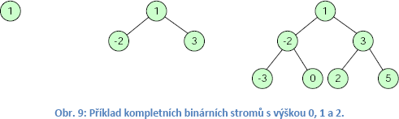

1) Správa paměti, statické přidělování paměti, dynamické přidělování paměti, garbage collector, reprezentace informace v paměti
===============================================================================================================================

Neviem prečo sem dal takúto otázku, pretože skriptá neobsahujú
informácie o týchto témach. Plus pojmy statická a dynamická alokácia
súvisia s C/C++ svetom (V managed jazykoch (Java.C\#,VB...) je tam ešte
runtime a je to trocha rozdielne = musí sa spustit runtime a až po ňom
sa hodí bytecode).

Statické přidělování paměti = Static allocation
-----------------------------------------------

Statická alokácia znamená že pamäť ktorá je potrebná pre určité premenné
je alokovaná pri štarte programu. Veľkosť pamäte ktorú bude potrebné
alokovať sa vypočíta pri kompilácii. Statická alokácia sa aplikuje na
globalne premenné (implicitne static) a static premenné. Statická
znamená aj to že táto pamät je alokovaná po celú dobu behu programu.

Dynamické prideľovanie pamäti = Dynamic allocation
--------------------------------------------------

Dynamická alokácia vám umožnuje kontrolu nad lifetime premennej. Pamäť
sa priradí až pri behu programu.

Java je vysokoúrovňový jazyk, ktorý sa prekladá do strojového kódu až
keď spustíte aplikaćiu. Pri kompiláci vytvoríte iba bytecode ktorý je
potom potrebné cez runtime JavaVM (obsahuje JIT kompilátor bytecode =\>
machine code) skompilovať na strojový kód.

V Jave sa statická alokácia robí pre primitívne globálne statické
premenné a kopu java „metadát" ktoré sú potrebné pre JavaVM (runtime).

V skratke povedzte že statická alokácia je taká, že program si pri
štarte alokuje určité miesto pre globálne statické premenné. Dynamickú
alokáciu zase používa program na alokáciu pamäti už keď beží a táto
alokácia sa deje na heap.

Môžeme ju brať z pohľadu OS -- OS sa stará o alokáciu a dealokáciu
operačnej pamäte pre procesy. Proces môže o operačnú pamäť požiadať
systém, alebo mu pridelenú pamäť vrátiť. Ak proces stále iba pýta pamäť
a nič nevracia systému môže to znamenať memory leak -- v taktom prípade
\*unix OS tento proces milosrdne zabijú (občas sa netrafía a zabijú
fungujúci process). Windows OS nemá zabíjátko na procesy, a iba swapuje
a unswapuje pamäť medzi RAM a úložiskom (SSD/HDD) až sa naserete
a proces zabijete ručne.

Toto je dosť zjednodušený pohľad na to ako to v reále funguje

Podstatný pohľad je z pohľadu programu. OS vám pridelí pamäť (kus RAM +
virtuálna pamäť) ktorá je „rozdelená" na 2 časti na Heap (halda) a Stack
(zásobník - LIFO) ktorý sa presnejšie nazýva Call Stack.

Ak vytvárate metódu, tak sa vytvorí na call stacku tzv. Stack Frame
a ten obsahuje informácie o metóde a jej lokálne premenné. Pamäť pre
tieto lokálne premenné sa alokuje na stacku (ich hodnoty sú v tom stack
frame) -- toto platí v prípade JAVA o primitívnych typoch. Pre
referenčné typy (objekty) sa v stack frame nachádza iba pointer (adresa
niekam) na pamäť kde je uložený celý objekt.

Stack frame obsahuje lokálne premenné fce, argumenty fce, návratovú
hodnotu fce a hodnoty registrov potrebné pre predchádzajúci stackframe.

Heap má veľkosť virtuálnej pamäte (podstatne viac ako je kapacita RAM)
a obsahuje data ktoré vytvárame pomocou dynamickej alokácie. Na heape sa
nachádzajú objekty. Pre stack je špecifické to že má fixnú veľkosť a ak
niečo poseriete dostanete stack overflow -- napchali ste naň príliš veľa
stack framemov.

Pri programovaní je to myslený memory management z pohľadu práce s heap
= či alokujeme a dealokujeme „ručne" programom (jazyky C/C++/Rust) alebo
na to máme automatizovanú správu pamäti -- kde za nás niekto alokuje
pamäť (runtime) a niekto sa stará o dealokáciu pamäte (Garbage
Collector/ion - GC) (jazyky Java, C\#, Python).

GC sa stará o to aby sa pamäť ktorú už náš program nebude potrebovať
vrátila operačnému systému. GC nerieši alokáciu to za vás rieši runtime.

(zjednodušený popis) GC vie ktoré objekty už nebudete používať a „zmaže"
ich (reálne vráti pamäť OS, alebo si ju nechá a zrecykluje pre iné
objekty(častejšie)). **GC je teda časť automatickej správy pamäte ktorá
sa stará o dealokáciu pamät**e

Java má 2 dátové typy =

1.  **primitívne** (v skriptách sa na to označuje ako na elementárne,
    triviálne, jendnoduché, ale **vždy** tým myslí primitívne) -- int,
    float, etc. , ktoré sa alokujú na **stacku** (zásobníku - konkrétne
    v stack frame =\> každá metóda má vlastný stackframe)

2.  **referenčné** (napr. objekty)**,** kde je na stacku alokovaný iba
    pointer (adresa) a reálne je pamäť alokovaná na **heap
    (**halde**)**.

Ak by ste stále nechápali ako java pracuje s pamäťou a rozdiely heap vs
stack pozrite si toto <https://www.youtube.com/watch?v=UcPuWY0wn3w>

GC beží v runtime na vlastnom threade a nemali by ste forcovať collect.
Funkcionalita GC je napísaná inžiniermi ktorých tak ľahko nepreštíte
a je dobré nechať GC nech žije sám.

Pri priradený null do objektu ho nedealokujete z heapu = to je úplna
debilina. Priradením null iba pointer objektu odkážete na nejaké magic
value (reálne pre runtime to má hodnotu 0).

2) Jazyk UML a objektově orientovaný návrh - dědičnost, generalizace, asociace 1:n, n:1, n:n, agregace a kompozice.
===================================================================================================================

Objektovo orientované programovanie 
------------------------------------

OOP je programovacie paradigma ktoré uľahčuje prepoužiteľnosť logických
častí kódu.

### Abstrakcia 

postup ako z konkrétnej veci vytvoríte všeobecný popis. Na základe tohto
všeobecného predpisu dokážete zoskupovať reálne objekty a priradiť im
jednotné vlastnosti a funkcie.

### {width="1.9870133420822398in" height="0.9329669728783903in"}Trieda 

Abstrakcia reálnej veci, „šablóna" pre vytvorenie reálneho prvku. Trieda
zoskupuje všeobecný predpis logickej funkcionality reálnej veci. Trieda
=\> Plán domu alebo Mazda6 (==Továrenský typ - nie je to konkrétne auto,
**je to** **abstrakcia**)

### Objekt 

(instancia triedy) = reálny prvok vytvorený na základe triedy. Objekt je
napr. dom postavený podľa plánu domu, alebo konkrétne auto mazda 6
jedinečným číslom VIN (**reálna vec**).

### Zapúzdrenie 

objekt je pre nás black box, ku ktorému pristupujeme iba na základe
rozhrania ktoré nám poskytuje. Ak chcete ísť dopredu zaradíte 1 a idete,
nemusíte vedieť ako presne motor alebo prevodovka funguje.

### {width="2.4618055555555554in" height="1.5583333333333333in"}Dedičnosť 

Abstrakciu ktorú vytvárame, tak je väčšinou hierarchická -- napríklad
moje auto s číslom XYZ (reálna vec - objekt) je typ mazda 6 (abstrakcia
-- trieda Mazda6) a to je auto (abstrakcia trieda Auto). Trieda Auto je
rodič a trieda Mazda6 je potomok.

Táto hierarchia umožnuje lepšiu abstrakciu reálnych objektov do
abstraktnej hierarchie čím sa umožnuje zdieľanie funkcionality.

Pre príklad Auto by definovalo vlastnosť Motor a funkcionalitu
PohybDopredu() ktoré sú spoločné pre všetky značky áut (každé auto vie
ísť dopredu a má motor -- Mazda6, SkodaFelicia).

Pri dedičnosti sa teda využíva abstrakcia -- vytvoríte rôzne úrovne
abstrakcie. Má to výhodu v tom že kohokoľvek kto vie šoférovať posadíte
do auta, vie ísť dopredu bez znalosti toho aký presne má motor (diesel,
benzin, elektrika).

Dedičnosť je aj to za čo sa najviac kritizuje OOP (kritici porušujú
často pravidlo composition over inheritance)

### Polymorfizmus

Mnohotvárnosť -- potomka môžeme použiť rovnako ako rodiča (potomok má
tie isté metódy a vlastnosti ako rodič). Ak viete šoférovať auto (rodič)
je vám jedno aký je to továrenský typ (potomok) a dokážete ho ovládať na
základe spoločných znakov ktoré majú.

### Generalizácia

je vzťah medzi nadradenou(trieda Auto) a podriadenou triedou (trieda
Mazda6) pri dedení

### Konštruktor

Metóda ktorá vytvára instanciu triedy -- objekt. Jej názov je rovnaký
ako je názov triedy a nemá návratový typ.

### Kompozícia -- „Skladaní" (v OOP terminológii)

Pri vytváraní abstrakcie je okrem dedičnosti častou používaná
kompozícia. Pre príklad trieda auto obsahuje vlastnosť Motor. Tento
motor je ďalšia trieda ktorá sa stará o chod motora. Vzťah že auto
**má** motor je nazývaný kompozícia. Je to „opačný" prístup ako
dedičnosť -- pri dedičnosti používame vzťah je (**mazda6 je auto**)
a pri kompozícii vzťah má (**auto má motor**).

UML
---

UML je zkratkou pro Unified Modeling Language, což je grafický jazyk pro
vizualizaci, specifikaci, návrh a dokumentaci programových systémů.
Hlavní myšlenka která celý vývoj UML provází je, aby bylo vše především
snadno srozumitelné.

### Class diagram

Základním stavebním kamenem diagramu tříd je třída samotná. Je zde
uveden název třídy, atributy této třídy a jejich viditelnost. Dále potom
metody a jejich viditelnost. Mezi třídami mohou být asociace. Asociace
je vztah mezi dvěma třídami. Může být pojmenována. Ke každé asociaci
může být přidána násobnost, která může nebývat libovolných hodnot.
Nejběžnější případy jsou 1, 0..1, 1..n, n. Číslo n zde v tomto případě
značí libovolný počet a často se používá také symbol „\*". Asociace může
být orientovaná, či neorientovaná. V našem případě se jedná o asociaci
orientovanou, tj. z třídy **Order** (objednávka) ke třídě **Customer**
(zákazník). Tato informace nám říká, že vazbu bude udržovat pouze třída
Order a nikoli třída Customer.

**Agregace -** Agregace má velmi podobný význam jako asociace
(orientovaná či neorientovaná). V tomto případě ale posilujeme význam
vztahu, kde Company obsahuje objekty typu Employee.

**Kompozice -** je ještě silnější obdobou agregace. V tomto je třída
definována přímo v těle předchozí třídy. Zrušením kontejneru automaticky
zrušíme i obsažený element. Daný element může být součástí právě jednoho
kontejneru.

Diagram užití (Use case diagram)
--------------------------------

Diagramy užití jsou používány v první fázi vývoje systému analytikem a
slouží pro uvědomění si veškerých souvislostí a požadavků na systém.
Díky své názornosti a jednoduchosti je vhodný pro komunikaci se
zákazníkem, který není s notací UML seznámen vůbec. Účastník (actor)
zastupuje nějaký druh role, který v systému vystupuje (například v IS
FEKT -- student, učitel, garant, administrátor, atd.).

Diagram sekvencí (Sequence Diagram)
-----------------------------------

Znázorněňuje objekty, životní linie objektů, zasílání zpráv a ukončení
platnosti objektu. Dává důraz na modelování časové závislosti a přesné
interakci mezi objekty.

{width="2.9632392825896763in"
height="0.915in"}{width="2.4403291776027998in"
height="1.085in"}{width="6.340972222222222in"
height="1.7944444444444445in"}

**3) Třídy složitosti paměťové a časové. Třídy P, NP, NP úplné. Church Turingovat teze. Problém zastavení Turingova stroje. Notace Theta. Notace Omega. Notace velké-O. Asymptotický popis složitosti algoritmu. Posouzení složitosti známých algoritmů. Posouzení složitosti algoritmu vyhledávání. Srovnání lineárních a nelineárních struktur. Vztah časové a paměťové složitosti. Teorie spočitatelnosti, Teorie automatů, stavový automat, zásobníkový automat, Turingův stroj, varianty Turingova stroje**
================================================================================================================================================================================================================================================================================================================================================================================================================================================================================================================

Algoritmus označujeme jako efektivní, jehož složitost je maximálně
polynomiální (např. n^127^) nikoliv však exponenciální 2^n^. Efektivita
algoritmu může být zajímavým kritériem ve vědních disciplínách, jako je
kryptografie, kde naopak usilujeme o nalezení takového problému, kde
neexistuje efektivní algoritmus. Příkladem je asymetrické šifrování
pomocí RSA (iniciály autorů Rivest, Shamir, Adleman), kde se jedná o
problém rozkladu čísla na prvočísla (faktorizace) \[1\]. Dalším
problémem, ke kterému není dosud znám (není jisté, zdali vůbec existuje)
efektivní algoritmus je problém diskrétního logaritmu. Ten se s výhodou
používá pro Diffie-Hellman výměnu klíčů.

Hodnocení algoritmů
-------------------

Složitost algoritmů se klasifikují na základě dvou kritérií: paměťová
náročnost a časová náročnost. Popis, který se k tomu může použít je:
absolutní složitost a asymptotická složitost.

Algoritmus a jeho implementace jsou rozdílné věci. Zpravidla bývá
problémem čas.

Základní složitostní funkce a jejich kvalifikace
------------------------------------------------

hodnota proměnné *n* je v intervalu \<0, ∞\>, *c* reprezentuje
konstantní číslo

{width="5.533777340332459in"
height="2.371874453193351in"}{width="2.4159722222222224in"
height="2.847916666666667in"}

Asymptotická složitost
----------------------

Je to spôsob klasifikácie zložitosti algoritmu, kde určujeme ako sa
odvíja časová zložitosť algoritmu na základe veľkosti () vstupných dát.

Ne vždy je ale možno určit přesnou složitost algoritmu. Složitost
algoritmu může záviset například na hodnotách vstupních dat. Z toho
důvodu byla zavedena takzvaná [asymptotická složitost]{.underline},
která aproximuje chování funkce a to z pohledu buď nejlepšího možného
chování, průměrného chování či nejhoršího chování.

Notace Omikron (Landauova notace , notace velké O)
--------------------------------------------------

je notace používaná v matematice pro porovnávání asymptotického chování
funkcí, tj. chování funkcí pro „velké" hodnoty parametru. V matematické
informatice se tato notace používá pro porovnání asymptotické časové
nebo prostorové složitosti algoritmů, případně pro omezení složitosti
algoritmu.

značí horní asymptotický odhad. Tedy, jinými slovy, v žádném případě
nemůže nastat případ, kdy by

{width="6.204457567804025in"
height="0.20395778652668417in"}skutečná složitost algoritmu byla větší
než tato hodnota. S tímto druhem notace se setkáte v 98% případů.

Notace Θ (Theta)
----------------

Θ(f(n)), neboli theta notace je průměrný odhad chování funkce.

Omega notace
------------

Ω (f(n)), neboli Omega notace je dolní odhad aneb „lepší už to nebude".

Posouzení složitosti známých algoritmů řazení \[u dalších otázek\]
------------------------------------------------------------------

Srovnání lineárních a nelineárních struktur
-------------------------------------------

*Lineární struktura* = každý prvek má právě jednoho předchůdce a právě
jednoho následníka. Např. lineární seznam (viz další otázka)

*Nelineární struktura* = prvek může mít více následníků případně
předchůdců. Např. binární vyhledávací strom (viz otázka **5**)

Porovnání časových složitostí pro lineární seznam a stromy je v tabulce
u otázky 7. Obecně ale platí, že u nelineárních datových struktur (s
výjimkou grafů) je možné dosáhnout lepších výsledků např. pro
vyhledávání než u lineárních datových struktur.

Vztah časové a paměťové složitosti
----------------------------------

Většinou platí, že jednotlivé algoritmy jsou kompromisem mezi časovou a
paměťovou složitostí. Dobrý algoritmus z hlediska časové složitosti bude
mít (většinou) větší nároky na paměť než algoritmus pomalejší.

Například u prohledávání grafů metodou BFS (prohledávání do hloubky)
můžeme algoritmus urychlit využitím množiny navštívených stavů. Ty si
ale musíme ukládat a tím vzroste paměťová složitost. (viz otázka 9
**??**). Podobně to platí i u řadících algoritmů.

Třídy P, NP, NP úplné
---------------------

Sú to triedy zložitosti

### **P**

množina problémov riešiteľných pomocou deterministického Turingového
stroja v poly-nominálnom čase

### **NP**

množina problémov riešiteľných pomocou nedeterministického Turingového
stroja v poly-nominálnom čase

### **NP úplné**

Spadá sem problém obchodného cestujúceho, podmnožina NP

### **Problém P vs NP**

Existujú úlohy ktoré je zložitejšie vyriešiť ako overiť platnosť
riešenia =\> P≠NP (na toto spolieha kryptografia)

Church Turingovat teze
----------------------

Ku každému algoritmu existuje ekvivalentný turingov stroj

Turingův stroj
--------------

Turingův stroj (TS) je teoretický model počítače popsaný matematikem
Alanem Turingem. Každý algoritmus je možné popísať turingovym strojom.

Problém zastavení Turingova stroje
----------------------------------

Je to logický problém, že neexituje stroj ktorý by riešil halting
problem (problem zastavenia) (skurvená rekurzia).

Halting problem je taký, či dokážeme vytvoriť jeden algoritmus, ktorý by
riešil, že program A (čokoľvek), ktorý je daný vstupom B (čokoľvek) sa
skončil alebo nie (či by sme dostali výsledok). Tento algortimus by ste
dali ako vstupy na samého seba z čoho vám vznikle blbosť čo nemá
riešenie.

Turing dokázal že takýto algoritmus nemôže existovať, pretože minimálne
v jednom prípade nedostaneme odpoveď (nekonečná slučka)

Takýto algoritmus nemôže existovať, pretože existuje minimálne jeden
prípad kedy dokážeme vymyslieť že algoritmus nebude fungovať a nie je to
logický podvod.

PS -- ak to chcete naozaj pochopiť pozrite si
<https://www.youtube.com/watch?v=macM_MtS_w4>

V skratke, turingov stroj dokázal teoreticky vyriešiť akýkoľvek logický
problém, čo sám turing vyvrátil s halting problem.

Varianty Turingova stroje
-------------------------

-   TS s 2 rozmernou páskou (ide tam taký hadík)

-   TS s 1 rozmernou páskou (ten „klasický" typ -- dlhá páska)

-   Univerzální Turingový stroj

-   Nedeterministický Turingův stroj

-   Paralelní Turingův stroj

-   Kvantový Turingův stroj

Teorie spočitatelnosti (asi to má byť Teorie vyčíslitelnosti)
-------------------------------------------------------------

Skúma či sa dá algoritmus vyriešiť.

Teorie automatů
---------------

Teorie automatů je studium abstraktních strojů a automatů, včetně
výpočetních problémů, které mohou být pomocí nich řešené. Jedná se o
obor teoretické informatiky, která patří do diskrétní matematiky. Súvisí
s teóriou formálnych jazykov

Stavový automat (konečný automat)
---------------------------------

Množina jeho stavov je konečná. Je to základný prostriedkov

Zásobníkový automat
-------------------

Je to ako konečný automat ale má to ešte „špeciálny" typ pamäte zásobník

4) Abstraktní datový typ (ADT). ADT lineární seznam. ADT cyklický seznam. Operace vkládání, mazání a vyhledávání prvku v ADT lineárním seznamu. ADT zásobník, ADT fronta.
=========================================================================================================================================================================

ADT je to forma abstrakcie podobne ako triedy -- občas je to zlievané
dohromady, ale nesprávne

ADT je definovaný tým že má názov, operácie na vytvorenie, kombináciu
a „pozorovanie" hodnôt abstrakcie a skrytú reprezentáciu (dáta).

Pre príklad sa sem zaraďujú primitívne dátové typy ako integer alebo
boolean (týmto si nie som úplne istý = podľa mňa sem patria iba stack,
queue, etc\...). Niektoré jazyky podporujú vytváranie vlastných
abstraktných dátových typov.

Reálne ADT princípy implementujú všetky moderné „OOP" jazyky.

ADT sú dátové typy ktoré sú nezávislé na vlastnej implementácii.

Rozdiel medzi ADT a triedou je taký, že ADT nikdy neposkytuje svoj
hodnoty napriamo -- trieda často poskytuje svoje hodnoty pomocou
properties.

Lineární seznam
---------------

Problém se statickou velikostí pole řeší ADT seznam. ADT seznam
umožňuje, aby počet jeho prvků rostl či klesal do libovolné délky, která
je aktuálně nutná. To přináší efektivní využití z hlediska nároků na
paměť, nicméně je náročnější na implementaci a operace nad ním mají
horší časovou složitost. "Lineární" znamená, že každý prvek má právě
jeden prvek předcházející (**předchůdce** - predecessor) a právě jeden
prvek následující (**následník** - successor).

Jednosměrně vázaný lineární seznam
----------------------------------

{width="4.412017716535433in"
height="1.9820833333333334in"}{width="1.3095997375328083in"
height="0.6999989063867017in"}

ACT je iterátor, tedy pomocnou proměnnou, kterou se dá přistupovat i k
datům uvnitř seznamu. Tedy nejen na první pozici.

{width="5.762125984251968in"
height="2.8771872265966754in"}

Cyklický jednosměrně vázaný seznam
----------------------------------

Cyklický jednosměrně vázaný seznam je ve všech ohledech identický s
klasickým jednosměrně vázaným seznamem s jedinou výjimkou a to, že
poslední položka seznamu odkazuje na první prvek.

{width="2.656165791776028in" height="1.3459897200349957in"}Obousměrně vázaný lineární seznam
---------------------------------------------------------------------------------------------------------------------------

Další variantou lineárního seznamu je obousměrně vázaný seznam. Přináší
s sebou větší složitost provádění operací, nicméně umožňuje pohyb
plovoucí proměnné ACT oběma směry -- na předchůdce i následníka.

Výhodou je, že se pomocí ACT můžeme pohybovat v obou směrech a díky tomu
u některých algoritmů například řazení získat významné urychlení (z
kvadratické na lineární časovou složitost).

{width="5.488194444444445in"
height="4.590277777777778in"}

Fronta (FIFO, queue)
--------------------

{width="1.7856922572178477in"
height="1.168830927384077in"}Fronta (neboli FIFO = First In First Out)
je ADT, na její konec přicházejí prvky a na druhé straně (tj. na začátku
fronty) jsou prvky odebírány.

Operace, které lze provádět nad ADT frontou, tedy jsou:

Enqueue() = pridanie prvku na koniec

Dequeue() = odobratie prvého prvku

K implementaci ADT fronty můžeme s výhodou použít ADT oboustranně vázaný
seznam.

Zásobník (LIFO, stack)
----------------------

{width="1.8484820647419073in"
height="1.331169072615923in"}Zásobník - LIFO (Last In First Out) je ADT,
kde je možné vrátiť iba posledný prvok ktorý sme vložili. Využíva sa
napríklad v Call Stacku, čo je stack ktorý slúži na ukladanie informácii
o volaných metódach.

Definované operácie sú:

Push() = vloženie prvku na vrch zásobníka

Pop() = odobratie prvku z vrchu zásobníka

5) Abstraktní datový typ strom. Abstraktní datový typ binární strom. Úplný binární strom. Abstraktní datový typ binární vyhledávací strom (operace vložení, odstranění, smazání uzlu stromu). Průchody stromy in-order, pre-order, post-order.
==============================================================================================================================================================================================================================================

ADT Strom
---------

(def:) Strom T je konečná množina nula nebo více prvků (uzlů), z nichž
jeden je označen jako kořen r (root) a zbývající uzly jsou rozděleny do
n≥0 disjunktních podmnožin T1,T2,\...Tk, které jsou také stromy a
jejichž kořeny r1,r2,\...,rk jsou následníky kořene r.

Definovány jsou následující **operace**: Vkládání prvku, Mazání prvku,
Vyhledávání prvku Příklady použití stromů:

-   jeden z možných způsobů indexování klíčů v databázích (systémech
    řízení báze dat)

-   reprezentace znalostí, stavového prostoru v umělé inteligenci

-   metody distribuce klíčů v kryptografii (broadcast encryption)

-   jakékoli řazené struktury, množiny, atp.

-   popis scény v oblasti zpracování a analýza obrazu, počítačová
    grafika

-   vyhledávací stromy v databázových systémech

-   rozhodovací stromy -- expertní systémy

-   organizace adresářů a souborů v souborovém systému OS

-   komprese dat (Hufmannovy kódovací stromy, fraktálová komprese)

**Kořen** je uzel, který nemá předchůdce, v celém stromu může být pouze
jediný kořen. **Listy** (vnější uzly) jsou uzly, které nemají žádného
následníka. **Vnitřní uzly** jsou uzly, které mají alespoň
jednohonásledníka.

{width="5.141666666666667in"
height="2.767361111111111in"}**Cesta** je: je-li n1,n2,\...nk množina
uzlů ve stromu takových, že ni je předchůdce ni+1, pro 1 ≤ i ≤ k, pak se
tato množina nazývá cesta z uzlu n1 do nk. **Délka cesty je** počet
hran, které spojují uzly cesty. **Hloubka stromu** je maximální délka
cesty ve stromu. **Sousedé** (siblings) jsou takové uzly, které mají
společného předka (přímého). Počet přímých potomků uzlu se nazývá
**stupe**ň **uzlu**. **Stupe**ň **stromu** je maximální stupeň uzlu v
celém stromu. **Hloubka uzlu** je délka cesty od kořene do uzlu.

**Výška stromu** je největší délka cesty od kořene k uzlu ve stromu.
**Velikost uzlu** (size) je počet následníků, které uzel má + 1 (počet
uzlů podstromu). Strom je **vyvážený**, jestliže v celém stromu
neexistuje rozdíl v absolutní hodnotě kterýchkoli dvou cest od uzlu ke
kořenu stromu větší než 1. Alternativní definice může být, že pro každý
uzel je rozdíl hloubky levého a pravého podstromu v intervalu \<-1;1\>.

### Reprezentace programem

Stromy je možné reprezentovat více způsoby a analogicky jako u ADT
seznam je možné použít jednosměrně vázané stromy či obousměrně vázané
stromy. Základní stavební blok:

{width="6.028472222222222in"
height="1.7916666666666667in"}

**A**) zobrazuje nejjednodušší variantu kde i stromová hierarchie i
bratři (siblings) jsou spojeny jednosměrně. V **B**) jsou hierarchie
stromu provázány obousměrně a v případě **C**) jsou obousměrně provázáni
jak bratři, tak i hierarchie.

Binární stromy
--------------

Binární stromy jsou speciálním případem N-árního stromu. Jsou nejčastěji
používanou datovou strukturou v počítačové vědě a zbytek textu bude
věnován výhradně jim, nebude-li explicitně řečeno jinak. Jejich výhoda
spočívá v redukci časové složitosti vyhledávání prvků z lineární O(n) na
(v ideálním případě) logaritmickou O(log~2~n).

Reprezentace binárních stromů v paměti:

{width="6.179861111111111in"
height="1.2979166666666666in"}

Metody průchodu ADT stromem
---------------------------

Zatímco průchod lineárním seznamem je triviální a jednoduchý, u ADT
strom existuje několik přístupů, jak pocházet celý strom a navštívit
každý prvek právě jednou. Ze základních metod to jsou Pre-order,
Post-order a In-Order.

{width="5.661111111111111in"
height="2.3854166666666665in"}

Před zahájením průchodu stromem je nutné představit si obálku stromu
(viz Obr. 5). Metodu **pre-order** si lze představit jako výčet prvků,
které míjíme zleva. Pro náš příklad by to odpovídalo uzlům v pořadí **1,
2, 3, 4, 5, 6** a říká se mu prefixový zápis.

Další metodu, **In-Order**, si lze představit jako výčet prvků v pořadí,
jak bychom je míjeli zespod, tedy **2, 1, 4, 3, 5, 6**. Všimněte si, že
je v tomto pořadí zachováno levo-pravé pořadí. Poslední metodou je
**post-order**, která by prvky míjela zprava a výsledná posloupnost by
byla **2, 4, 5, 3, 6, 1** - postfixový zápis.

### Nároky na imlementaci

Implementaci průchodu stromem lze provést rekurzivní funkcí. V tomto
případě bychom se opřeli o přítomnost ADT zásobníku přímo v překladači.
Pro jednotlivé typy průchodů se mění pouze pozice řádku, který provádí
výpis prvku.

Úplný binární strom
-------------------

(Definice) Úplný binární strom (Complete binary tree) je speciální
případ binárního stromu, kde uzly v každé úrovni s výjimkou té nejhlubší
vrstvy mají všechny uzly právě dva potomky. Na úrovni n (n = výška
stromu) nemá žádný z uzlů žádného potomka (viz Obr. 9).

{width="4.511111111111111in"
height="1.3472222222222223in"}

Binární vyhledávací stromy
--------------------------

V obecných binárních stromech není žádný požadavek na pořadí prvků. Z
toho důvodu stromy nemohou urychlit přístup k prvku. Pokud v obecném
binárním stromu chceme vyhledat některý prvek, musíme stejně některou z
metod projít všechny prvky. Časová složitost je tedy ekvivalentní
průchodu lineárním seznamem. Je tedy patrné, že pro vyhledávání prvků se
výše zmíněné metody příliš nehodí. S řešením přichází binární
vyhledávací stromy.

(Def:) Binární vyhledávací stromy jsou stromy, kde musí pro každý uzel
platit, že hodnota všech potomků z levého podstromu je menší než hodnota
rodiče, a hodnota všech potomků z pravého podstromu je větší než hodnota
rodiče.

{width="1.7444444444444445in"
height="1.4430555555555555in"}{width="4.163888888888889in"
height="1.4916666666666667in"}

### Vložení prvku

Důvodem proč jsme se nebavili o metodách vkládání a mazání prvků z
obecných stromů je, že zde neplatily žádná zvláštní pravidla a žádná
omezení. Vložení prvku mohlo být libovolné a na libovolné místo. Z toho
důvodu může být operace provedena téměř jakkoli, jen nesmí porušit
strukturu stromu. Díky tomu, že u vyhledávacích stromů jsou již kladeny
jisté nároky na pořadí prvků, je operace vkládání prvku o něco málo
složitější.

Proces vkládání začíná na kořeni stromu. Pokud se hodnota vkládaného
prvku rovná hodnotě aktuálního uzlu, hodnota se přepíše. V jiném
případě, pokud je hodnota vkládaného uzlu menší a uzel nemá levého
potomka, vloží se levý uzel. Pokud uzel levý uzel má, rekurzivně se
aplikuje předchozí pravidlo na levý podstrom aktuálního uzlu. Obdobně,
pokud je hodnota vkládaného uzlu větší, provádí se to stejné pro pravou
větev stromu.

Je důležité zmínit, že složitost vkládání je maximálně rovna O(log~2~
h), kde h je výška stromu. Pokud se jedná o závislost na počtu prvků ve
stromu, je bohužel stejná jako v případě seznamu O(n).

### Odstranění prvku

Při odstraňování prvku máme tři možnosti: mazaný uzel nemá žádného
potomka, má jednoho potomka anebo má levého i pravého potomka. V
[případě žádného potomka]{.underline} je operace triviální a prvek se
jednoduše odstraní. V případě [jednoho potomka]{.underline} se mazaný
uzel nahradí potomkem.

V třetím případě, tedy jestliže máme [levého i pravého
potomka]{.underline}, jsou dvě varianty -- levá a pravá. V případě
[levé]{.underline} nalezneme nejpravější prvek levého podstromu (musí se
tedy jednat o list, který má maximálně jednoho potomka) a ten vyjmeme
(dle operace uvedené výše) a nahradíme jej za mazaný prvek. Pravá
varianta je identická, jen zrcadlově otočená. Vyhledá se nejlevější list
pravého podstromu, kterým se nahradí mazaný prvek.

6) Problematika nevyvážených stromů. Vyvažování stromů AVL - rotace: jednoduchá levá, jednoduchá pravá, dvojitá levá, dvojitá pravá. Red-Black stromy. Posouzení z pohledu časové a paměťové složitosti. ADT hashovací tabulky. Rešení kolizí hashovacích tabulek. Srovnání výkonnosti binárních vyhledávacích stromů a hashovacích tabulek. 
=============================================================================================================================================================================================================================================================================================================================================

Nevyvážené stromy
-----------------

V extrémním případě může vlivem operací přidávání a mazání prvků dojít k
degradaci binárního stromu na lineární seznam (viz Obr. 13). To by mělo
za následek vyšší časovou složitost vkládání a při tom

{width="3.43in" height="1.63in"}stejnou
časovou složitost odstraňování prvků. To je také příčinou, proč se
standardní binární vyhledávací stromy téměř nepoužívají a AVL či
Red-Black stromy jsou lepší variantou.

### Vyhledání prvku

Jelikož jsou prvky v binárním vyhledávacím stromu seřazeny, je možné
urychlit vyhledávání. To je v případě stromů velice výrazné v porovnání
s ADT seznam. Vyhledávání probíhá tak,

že vždy začínáme v kořenovém uzlu. Porovnáme, zdali aktuální prvek je
hledaný. V případě, že nikoli, vydáme se doleva od aktuálního uzlu
(hledaná hodnota je menší než hodnota aktuálního uzlu), popřípadě
doprava (hodnota vyhledávaného prvku je vyšší než hodnota aktuální).
Stejné porovnání provedeme i u dalšího prvku a pokračujeme tak dlouho,
dokud prvek nenalezneme, či nenarazíme na konec stromu.

AVL stromy a rotace
-------------------

AVL strom je výškově vyvážený binární vyhledávací strom, pro který
platí, že pro libovolný vnitřní uzel stromu se hloubka levého a pravého
podstromu liší nejvýše o 1. K tomu, aby tyto podmínky byly dodrženy, je
nutné upravit funkci vkládání a funkci odstraňování prvků ze stromu.

### Vkládání prvku

Vkládání u AVL stromů probíhá ve dvou fázích -- v první dojde k vložení
prvku stejně jako u vyhledávacích stromů. Následuje kontrola vyváženosti
-- tedy, že rozdíl výšky levého a pravého podstromu je v intervalu
\<-1,1\>. Pokud tomu tak není, následuje vyvažování pomocí některé z
operací SLR, SRR, DLR a DRR \[2\]. Na Obr. 14 jsou znázorněny 3
nevyvážené stromy, vyznačeno místo nevyváženosti a vyznačena cesta

{width="5.201492782152231in"
height="2.3615912073490812in"}

### {width="4.320438538932634in" height="2.401945538057743in"}**SLR = Jednoduchá levá rotace**

Uzly si v tomto případě představte jako zavěšené na šňůrce. Ve stavu 1
je pověšeno vše za uzel A, ve stavu 2 za uzel B. T2 je přepojeno z uzlu
A na volné rameno uzlu B. Jednoduchou levou používáme, pokud vyvažujeme
přímou větev, tj. jsou-li znaménka stupně vyváženosti stejná (viz Obr.
15 a struktura bodů A,B,T3).

{width="4.044444444444444in" height="2.178472222222222in"}Jednoduchá pravá rotace
----------------------------------------------------------------------------------------------------------------

Jedná se o identickou operaci, jen zrcadlově otočenou. Jednoduchou
pravou používáme, pokud vyvažujeme přímou větev, tj. jsou-li znaménka
stupně vyváženosti stejná (viz Obr. 68 a struktura bodů A,B,T3).

{width="3.661855861767279in"
height="2.1940299650043746in"}

{width="3.536120953630796in"
height="2.149253062117235in"}

### Odstraňování prvku

Mazání prvku je z části identické s operací, která je známa z obecných
vyhledávacích stromů. Navíc je ale ještě nutné po smazání prvku, aby pro
nadřazené uzly bylo zkontrolováno, že strom je stále vyvážen a popřípadě
provést potřebné operace.

Red-Black stromy
----------------

Nevýhodou AVL stromů je, že vkládání anebo odstraňování prvku může
znamenat i více než jednu operaci rotace. Toto řeší Red-Black stromy,
kde maximální počet rotací je O(1). Stejně jako AVL stromy i Red-Black
stromy jsou samovyvažující se stromové datové struktury. Časová
složitost vyvážení je různě časově složitá, ale i přesto pracují v
konstantním čase.

Jsou celkem dva rozdíly mezi těmito dvěma strukturami. V případě n prvků
a AVL stromů je maximální výška 1.44\*log~2~ (n), zatímco u Red-Black
stromů je maximální výška 2\*log~2~ (n). Na druhou stranu, u AVL stromů
je možné i více rotací nežli jediná. Red-Black stromy garantují
maximálně 1 rotaci na vložený prvek.

Red-black stromy používají 4 operace pro vkládání a 6 operací pro mazání
z datové struktury. Operace jsou podobné AVL stromům, které zajišťují
vyváženost stromu. Red-Black trees jsou v praxi nejčastěji používané
stromové struktury. Pokud je v dokumentaci jazyka JAVA i standardní
knihovně C++ zmínka o stromových datových strukturách, jsou tím míněny
právě Red-Black stromy.

RB strom musí splňovat následující pravidla:

1.  Každý uzel je buď červený, nebo černý.

2.  Kořen je černý.

3.  Dva červené uzly se nesmí vyskytovat „nad sebou", tj. červený uzel
    má jedině černé potomky.

4.  Na cestě od kořene do libovolného uzlu s jedním nebo žádným synem je
    stejný počet černých uzlů. (Vnější uzly, tzv. *nil*, pokládáme za
    černé.)

(Více[:
http://www.cse.ohio-state.edu/\~gurari/course/cis680/cis680Ch11.html](http://www.cse.ohio-state.edu/%7Egurari/course/cis680/cis680Ch11.html)
)

{width="5.522222222222222in"
height="1.3208333333333333in"}

I přesto, že v případě notace Omikron se zdají být výsledky seznamu a
binárního stromu obdobné, průměrná složitost bude v případě binárního
vyhledávacího stromu výrazně lepší.

{width="5.966666666666667in"
height="4.21875in"}

ADT tabulka
-----------

ADT tabulka (v české terminologii také „tabulka s rozptýlenými
položkami"). Implementuje tzv. asociativní pole, tj. pole, které nemusí
být nutně indexováno pouze ordinálním datovým typem (každá hodnota má
předchůdce a následníka ), ale libovolným typem (např. řetězec).
Nejčastější implementace jsou založeny na použití statických polí ve
spojení s hashovací funkcí, nebo používají AVL stromy.

Přitom operace vkládání je v případě hashovací funkce výrazně rychlejší
a do jistého rozsahu dokonce dává lepší výsledky než AVL strom.

Příklad použití hashovaných funkcí:

-   Souborové systémy

-   Tabulky symbolů v překladačích

-   Algoritmy pro cache

-   

### Tabulka s přímým adresováním

Tabulku s přímým přístupem lze použít tehdy, je li znám celkový počet
klíčů K=\[K1,\...,KN\], které se budou v tabulce používat, a je-li možné
najít jednoznačnou mapovací funkci f(Ki)=i (pro i=1,2,\...N) pro všechny
prvky množiny K, je možné vytvořit tabulku s přímým přístupem.

{width="5.521527777777778in"
height="0.79375in"}

### Hashovací tabulky

**Hashovací tabulka** je datová struktura, která asociuje hashovací
klíče s odpovídajícími hodnotami. Hodnota klíče je spočtena z obsahu
položky podle takového pravidla (viz hashovací funkce), aby klíč byl co
nejjednoznačněji určen, tj. aby pravděpodobnost

přiřazení stejného klíče dvěma a více rozdílným položkám byla co
nejnižší a aby rozptyl hodnot klíčů pro dvě obsahově blízké položky byl
co nejvyšší.

[Využití]{.underline} je např. pro **rychlé vyhledávání** položky v poli
nebo v jiném homogenním datovém typu. Pomocí hashovací funkce
přiřazujeme hodnotě klíče index (ukazatel) do homogenní datové
struktury. Při zápisu obsahu položky zapíšeme položku na odpovídající
místo. Pokud je obsazeno, pak pomocí vhodného algoritmu přiřadíme pro
položku další volný index. Při vyhledávání položky spočteme s pomocí
klíče index hledané položky. Pokud již bylo odpovídající místo přepsáno
položkou s jiným klíčem, opět podle vhodného algoritmu prohledáváme
další položky. Při správně zvolené velikosti (počtu položek) homogenní
datové struktury a vhodně zvolené hashovací funkci má tento algoritmus
složitost zdola omezenou na O(1). \[wiki\]

Problém tabulky s přímým adresováním je zřejmý -- jestliže je počet
všech hodnot \|A\| velký, je nutné, aby byly udržovány všechny hodnoty z
množiny A, které budou obsaženy v tabulce T. Jestliže velikost množiny
\|K\| je dostatečně menší než velikost množiny všech hodnot\|A\|,
paměťové nároky mohou být redukovány na průměrnou složitost Θ(1) a
přitom složitost vyhledání prvku bude zachována O(1).

Uvažujme množinu A, množina veškerých prvků, a množinu K, množina všech
hodnot klíče. V případě hashovacích tabulek platí, že velikost množiny
klíčů je větší než množina všech hodnot klíčů │A│\<\<│K│. Pokud prvky
množiny resp. ukazatele či reference na ně budeme kvůli rychlosti
přístupu chtít uchovávat v poli, abychom nemrhali pamětí, toto pole by
mělo mít rozměr úměrný │A│. V tabulce budou nyní prvky množiny
identifikované svým klíčem zpřístupňovány pomocí indexu s hodnotami 0 až
n-1. Potřebujeme tedy hodnotu klíče prvku transformovat na hodnotu
indexu, jinými

{width="1.5965277777777778in"
height="0.16944444444444445in"}{width="3.6020833333333333in"
height="1.9618055555555556in"}slovy musíme definovat funkci, kterou
budeme nazývat rozptylovací funkcí (hash function). Prvek s klíčem k € K
bude mít v tabulce index h(k). Vzhledem k tomu, že m \<\<│K│, tedy počet
všech klíčů je daleko větší, než počet hodnot indexů, na které je
zobrazujeme, nevyhnutně musí rozptylová funkce zobrazit obecně dva a
více různých klíčů na stejný index, tj. pro u≠v a u,v Î K bude h(u) =
h(v). Tento jev nazýváme kolizí. V takovém případě by to znamenalo
přepsání stávající hodnoty a nesprávnou funkčnost tabulky. Z toho důvodu
je nezbytné problém kolizí řešit.

Řešení kolizí
-------------

### Hashovací tabulky se zřetězením

Řetězení je metoda, která řeší problém kolizí. Pokud dojde ke kolizi
výsledku hashovací funkce, jednoduše prvky navážeme za sebe s pomocí
lineárního seznamu. Získáme tím jakýsi kompromis mezi rychlostí a
množstvím paměti, které je nutné uchovávat (viz Obr. 4).

### Otevřené adresování -- linear probing

Pokud nastane případ kolize, tedy h(kA) = h(kB), kde kA ≠ kB, znamená
to, že výsledek hashovaní funkce ukazuje na již obsazené místo v
hashovací tabulce, vložíme prvek na následující místo, tedy h(k)+1.
Pokud i toto je obsazeno, tak se pokusí o h(k)+2. Při této metodě je
třeba dodržovat, aby se tabulka nezaplnila zcela, protože by se
vyhledávání v ní mohlo stát nekonečnou smyčkou. Čím více kolizí během
vkládání vznikne, tím se budou tvořit delší souvislé skupiny obsazených
buněk, kterým říkáme shluky nebo také klastry. Naším cílem ovšem je, aby
klastrů bylo co nejméně a byly co nejkratší.

### Otevřené adresování -- double hashing

V případě double hashing se jedná v podstatě o podobný princip jako u
linear probing s tím rozdílem, že pokud dojde ke kolizi, neposuneme se
na následující pozici v tabulce, ale použijeme druhou hashovací funkci.
Nejprve musíme vyloučit vyhodnocení druhé hashovací funkce jako 0 a dále
aby její hodnota byla vzhledem k tabulce relativně prvočíslo.

7) Grafy, formální definice. Vyhledávání v grafech. Algoritmus BFS (prohledávání do šírky). Reprezentace BFS v paměti. Algoritmus DFS (prohledávání do hloubky). Omezené prohledávání do hloubky (DLS). Iterativní prohledávání do šířky (IDLS), Dijkstrův algoritmus (Uniform Cost Search), A\*, Minimální kostra grafu, centralizovaný algoritmus, distribuovaný algoritmus 
==============================================================================================================================================================================================================================================================================================================================================================================

**Grafy** jsou struktury, které jsou tvořeny vrcholy a hranami, které
tyto vrcholy vzájemně spojují. Graf se obvykle znázorňuje jako množina
bodů spojených čarami. Formálně je graf uspořádanou dvojicí množiny
vrcholů V a množiny hran E:

{width="1.9895833333333333in"
height="0.3472222222222222in"}

Grafy jsou nejobecnější strukturou a do jejich podmnožiny spadají
všechny ostatní datové struktury. Dají se s jejich pomocí reprezentovat
pole, lineární seznamy, stromy i tabulky. Grafy mají bohaté zastoupení v
rozmanitých oborech jak počítačových tak i nepočítačových. Dají se
pomocí nich reprezentovat znalosti pro umělou inteligenci, počítačové
sítě nebo kupříkladu vzájemné reference odborných článků.

{width="1.0777777777777777in"
height="0.4083333333333333in"}Struktura grafu může být rozšířena o
ohodnocení hran (označováno jako váha) a její význam může být různý,
např. vzdálenost mezi městy, počet „hopů" v počítačových sítích,
propustnost atd. Výsledkem je model reálné sítě. Takové modely se
používají pro analýzu dopravy nebo počítačových sítí.

{width="1.0743055555555556in"
height="0.6430555555555556in"}Další variantou je ohodnocení vrcholů.

Popřípadě se může jednat o kombinaci předchozích dvou

variant, kde jsou ohodnoceny jak hrany grafu, tak vrcholy grafu:
{width="1.3208333333333333in"
height="0.2388888888888889in"}

Vlastnosti ADT graf
-------------------

Abstraktní datový typ graf je nejkomplexnější datovou strukturou pro
reprezentaci informace. Informace může být libovolně vzájemně provázána
a je pomocí nich možné modelovat téměř každý model.

Jejich velkou nevýhodou je časová i paměťová expanze a z tohoto pohledu
i ne příliš dobré výsledky. Tyto vlastnosti se projeví zejména při
větších počtech prvků.

### Způsoby reprezentace ADT graf

-   Maticí sousednosti

-   Vektory sousednosti

Průchod a vyhledávání v ADT graf
--------------------------------

Pro průchod grafem existují 2 skupiny algoritmů. První skupina algoritmů
prochází stavový prostor beze snahy odhadnout optimální cestu k nalezení
cíle a prochází prostor náhodně. Druhým extrémem je skupina algoritmů
využívající informované metody průchodu grafy. V takovém případě naopak
dochází k odhadu cesty, která (v ideálním případě) nejoptimálněji povede
k cíli. To bude mít za následek menší počet procházených stavů. Na Obr.
11 a Obr. 12 jsou znázorněny trendy, jak je v případě jednotlivých
algoritmů prohledáván stavový prostor.

{width="5.940277777777778in"
height="3.9402777777777778in"}

### Slepé prohledávání (Neinformované metody)

Slepé metody prohledávání fungují na principu postupného procházení
stavového prostoru. Neřídí se žádnou prioritou pro pořadí procházení
stavů. Výhodou tohoto přístupu je, že nemusíme implementovat žádnou tzv.
fitness funkci.

Prohledávání do šířky, BFS
--------------------------

Prohledávání do šířky (Breadth First Search) probíhá, jak už název
napovídá, způsobem, kde jsou nejdříve prohledávány stavy blízké počátku
a pokud algoritmus nedospěje k řešení, postupně prochází vzdálenější a
vzdálenější uzly.

Variantou algoritmu BFS je i varianta bez kontroly opakování průchodu
stavů. Taková varianta se hodí jen v případě, že je nemožné popřípadě
jen velmi málo pravděpodobné, že nastane cyklus. V takovém případě by
algoritmus nemusel konvergovat k řešení vůbec. Pokud si můžeme dovolit
odstranit kontrolu navštívených stavů, získáváme časovou úsporu a
paměťovou úsporu, která nemusí být bezvýznamná.

Nevýhodou algoritmu je poměrně velký nárok na paměťové prostředky.

### Vlastnosti algoritmu BFS

**Úplnost** -- algoritmus je úplný, tj. jestliže existuje řešení, BFS
jej nalezne. Jedná-li se o nekonečný graf, algoritmus bude konvergovat k
řešení (v praxi ale dříve nebo později dojde k vyčerpání paměťových
prostředků, které jsou vždy konečné).

**Optimálnost** -- Algoritmus je optimální, tj. vybere cestu s nejmenším
počtem kroků.

**Prostorová složitos**t -- BM, kde B je max. počet větvení, M je
maximální hloubka v grafu od počátečního uzlu.

**Časová složitost** -- O(\|V\| + \|E\|), kde \|V\| je počet vrcholů,
\|E\| je počet hran

{width="2.720833333333333in"
height="2.0083333333333333in"}{width="2.5430555555555556in"
height="2.408333333333333in"}

Prohledávání do hloubky, DFS
----------------------------

Prohledávání do hloubky (Depth First Search) probíhá v porovnání s BFS
odlišně -- jsou naopak upřednostněny uzly, které jsou nejvzdálenější
počátku. Pseudokód chování algoritmu je velice podobný předchozímu s
drobným rozdílem: prvky při regenerování prohledávaného stavu nejsou
odebírány z počátku, ale z konce seznamu. Tato drobná změna má i poměrně
významný rozdíl v chování a časových charakteristikách:

{width="2.9520833333333334in"
height="1.5965277777777778in"}

{width="2.779166666666667in"
height="4.122222222222222in"}

### Vlastnosti algoritmu DFS

**Úplnost** -- algoritmus je úplný (tj. vždy nalezne řešení, pokud
existuje).

**Optimálnost** -- algoritmus DLS není optimální, upřednostňuje jednu
větev oproti druhé. Z toho důvodu je velice pravděpodobné, že bude
nalezeno řešení, ke kterému je velký počet kroků i když existuje řešení
bližší.

**Prostorová složitost** -- o mnoho lepší než je BFS -- O(d\*b), kde d
je hloubka a b je stupeň stromu.

**Časová složitost** -- obdobně jako DFS. O(\|V\| + \|E\|), kde \|V\| je
počet vrcholů, \|E\| je počet hran

Prohledávání do hloubky s omezenou hloubkou, DLS
------------------------------------------------

Algoritmus DLS (Depth Limited Search) je speciální variantou DFS, kde je
kontrolována

hloubka zanoření. Varianta je obzvláště výhodná, pokud známe, v jaké
hloubce se nachází řešení: (příklad: nalezněte v třetím tahu šach mat).
Dosáhneme tím nízkou spotřebu paměti (množství otevřených stavů je
nižší).

Iterativní prohledávání do hloubky s omezenou hloubkou, IDLS
------------------------------------------------------------

Algoritmus IDLS je rozšířenou variantou DLS. Začíná se na nízké hodnotě
hloubky. Pokud v ní je nalezeno řešení, algoritmus končí. Pokud ne,
hloubka se inkrementuje a algoritmus se spouští znovu (iteruje).

{width="5.301388888888889in"
height="1.9986111111111111in"}

**Vlastnosti algoritmu IDLS Úplnost** -- algoritmus je úplný.

**Optimálnost** -- algoritmus je optimální, je nalezeno takové řešení,
ke kterému vede nejmenší počet kroků.

**Prostorová složitost** -- Jako DFS.

**Časová složitost** -- suma jednotlivých iterací, kde v každé iteraci
je použit algoritmus DLS.

Uniform-cost search (UCS, Dijkstrův algoritmus)
-----------------------------------------------

UCS algoritmus se opírá o ohodnocení dosud procházené cesty. Z toho
důvodu se občas řadí i mezi informované metody. Díky tomu, že UCS je
vlastně speciálním případem BestFS se někdy také řadí i mezi metody
informované. Správně by měla být klasifikována jako metoda
neinformovaná, protože se nepokouší o odhad hodnoty stavu.

{width="6.290972222222222in"
height="0.2013888888888889in"}Dijkstrův algoritmus si uchovává všechny
uzly v prioritní frontě řazené dle vzdálenosti od zdroje -- v první
iteraci má pouze zdroj vzdálenost 0, všechny ostatní uzly nekonečno.
Algoritmus v prvním kroku vybere z fronty uzel s nejvyšší prioritou
(nejnižší vzdáleností) a zařadí jej mezi zpracované uzly. Poté projde
všechny jeho dosud nezpracované potomky, přidá je do fronty, nejsou-li
tam již obsaženi, a ověří, zda-li nejsou blíže zdroji, než byli před
zařazením právě vybraného uzlu mezi zpracované. To znamená, že pro
všechny potomky ověřuje:

Pokud nerovnost platí, tak danému potomkovi nastaví novou vzdálenost a
označí za jeho předka zpracovávaný uzel. Po průchodu přes všechny
potomky se vrací do prvního kroku. Algoritmus terminuje v okamžiku, kdy
jsou zpracovány všechny uzly (prioritní fronta je prázdná). Dijkstrův

algoritmus je použitelný jen tehdy, obsahuje-li graf pouze nezáporně
ohodnocené hrany, protože jinak by nebyl schopen garantovat, že při
zpracování uzlu byla již nalezena nejkratší možná cesta.

{width="0.9354166666666667in"
height="0.16527777777777777in"}Složitost Dijkstrova algoritmu závisí na
implementaci prioritní fronty. V případě její implementace pomocí
sekvenčního vyhledávání je složitost algoritmu
{width="0.6041666666666666in"
height="0.2388888888888889in"} , při použití binární haldy .

Algoritmus A\*
--------------

A\* (A Star) je velice podobný navíc bere v potaz i kompletní cestu,
kterou již algoritmus prošel. To má za následek kompletnost i
optimálnost algoritmu (na rozdíl od BestFS).

Algoritmus je v principu shodný s prohledáváním do šířky s tím rozdílem,
že namísto obyčejné fronty používá **frontu prioritní**, ve které jsou
cesty seřazeny podle hodnoty speciální funkce ***f***. Tato funkce je
definována pro každou cestu *p* a je součtem tzv. **heuristické funkce**
(*h*) posledního uzlu cesty *p* a její délky (*g*). Čím je hodnota
funkce *f(p)* nižší, tím vyšší má daná cesta *p* prioritu. Stručně
řečeno, algoritmus se dívá do „minulosti" (jak daleko musel ujít, než na
konec cesty *p* došel) i do „budoucnosti" (jak daleko ještě zhruba zbývá
ujít z posledního uzlu cesty *p* do cíle). Dále se předpokládá, že cesty
ve frontě neobsahují kružnice a pro každý cílový uzel se v ní nachází
nanejvýš jedna cesta, a to ta nejkratší doposud nalezená. Pořadí cest ve
frontě je určeno následující funkcí:

**f(x) = h(x) + g(x)**

-   *f(x)* -- předpokládaná délka cesty *x*

-   *h(x)* -- hodnota heuristické funkce pro koncový uzel cesty *x*

-   *g(x)* -- délka cesty *x*

Heuristická funkce musí splňovat důležité podmínky -- musí být větší než
nula a tzv. **p**ř**ípustná** (admissible). To znamená, že její hodnota
pro libovolný uzel musí být **nižší nebo rovna** skutečné vzdálenosti z
daného uzlu do cíle. Jinými slovy, její hodnota nikdy nemůže být větší
než je skutečná vzdálenost z daného uzlu do cíle.

**h(x)≤ h(y) + cost(x,y)**

Heuristická funkce vzniká na základě (alespoň hrubé) znalosti struktury
problému. Hledá- li se tedy například nejkratší cesta z města *S* do
města *G*, lze jako heuristickou funkci města *X* použít zbývající
vzdálenost z města *X* do města *G*. V tomto (idealizovaném) případě
bude hodnota heuristické funkce přibližně rovna skutečné hodnotě.

**Kroky algoritmu**

-   Vytvoř prázdnou množinu cest *F*.

-   Do množiny *F* vlož cestu nulové délky obsahující počáteční uzel
    *s*.

-   Dokud není množina *F* prázdná, opakuj:

    -   Z množiny *F* vyber nejkratší cestu *p* (s nejnižší hodnotou
        *f(p)*) a odeber ji.

    -   Končí-li cesta v cílovém uzlu, vrať ji a ukonči výpočet.

    -   Vytvoř nové cesty použitím všech možných operátorů na koncový
        uzel cesty *p*, které neobsahují smyčky.

    -   Jestliže dvě cesty končí ve stejném uzlu, odstraň všechny kromě
        té nejkratší (s nejnižší hodnotou *f(x)*).

    -   Přidej cestu *p* do množiny *F*.

-   Je-li množina *F* prázdná, tak oznam, že žádná cesta z počátečního
    do cílového uzlu neexistuje.

Centralizovaná kostra grafu:
----------------------------

-   **Kruskalův algoritmus (přednáška 6 grafy)**

**<https://www.youtube.com/watch?v=Yo7sddEVONg>**

{width="6.238888888888889in"
height="8.522222222222222in"}

*(poslední obrázek je i výsledkem, proč? viz. Přednáška)*

Distribuovaná kostra grafu :
----------------------------

V telekomunikačních systémech -- mnoho výpočetních jednotek (směrovače =
vrcholy grafu) =\> DISTRIBUOVANÝ ALGORITMUS

{width="6.236111111111111in"
height="8.985416666666667in"}

8) Dolování znalostí z báze dat, křížová validace, neuronová síť, systémy podpůrných vektorů, rozhodovací stromy. 
==================================================================================================================

**Táto otázka je stejnak bez šance**

Dolování znalostí z báze dat
----------------------------

Uplatnění dolování znalostí z báze dat je široké a pokrývá téměř všechny
obory. Zahrnuje oblast rozhodování (veškeré finanční instituce při
rozhodování o poskytnutí úvěru / hypotéky, rozhodování o investici,
marketing, prodej, ...), diagnóza (expertní systémy, předpověď selhání
stroje v kritických částech výrobního řetězce, analýza medicínských dat,
rozpoznávání a identifikace osob v kamerových dohledových systémech,
strojová identifikace nevyhovujících součástek na výrobní lince, ...),
předpověď dalšího vývoje (investice do finančních trhů, počasí,
elektrická rozvodná síť), klasifikace (určení mluvčího z hlasu, určení
emoce v hlase, identifikace mluvčího), identifikace mimořádných událostí
(identifikace útoku v síti, ...).

Křížová validace - Cross-validace a její varianty
-------------------------------------------------

Cross-validace je metoda, s pomocí které lze efektivně ohodnotit kvalitu
naučeného algoritmu (a správnosti nastavených parametrů) na omezeném
vzorku dat. Jak pracuje, je naznačeno na obrázku níže. V cross-validaci
jsou data určená pro trénování současně daty testovacími. Data jsou
nejprve rozdělena do *n* skupin. Nejčastějším počtem těchto skupin je
**10**, jak je také vyobrazeno na obrázku. Následně je 9 skupin použito
pro učení a jedna zbývající pro otestování.

{width="4.207638888888889in"
height="1.2118055555555556in"}To je možné opakovat n- krát tak, že se
vystřídají všechny skupiny pro testování právě jedenkrát.

**Speciálním případem** cross-validace je, když počet skupin *n* je
roven počtu vzorků v množině. Taková metoda je označována „jeden
vynechej", neboli **leave-one-out.** Jedná se tak o nejpřesnější možné
zhodnocení. Na druhou stranu je pro množinu čítající 1000 vzorků nutné
1000x natrénovat a 1000x testovat, což sebou přináší značné časové
nároky (uvažme, že zpravidla chceme otestovat přesnost s různými
nastaveními učícího se algoritmu).

{width="6.340972222222222in"
height="0.8652777777777778in"}Rozdělení metod pro vytváření těchto
množin je následující:

{width="3.96in" height="2.08in"}Neuronová síť
-----------------------------------------------------------------------------

Učení neuronové sítě potom závisí na přizpůsobení vah jednotlivých
neuronů, resp. aktivační funkce a prahování. Nejčastějším algoritmem je
backpropagation.

*Parametry:*

-   Skryté vrstvy -- popisuje počet a velikost skrytých vrstev.

-   Počet cyklů -- počet trénovacích cyklů pro algoritmus
    backpropagation.

-   Rychlost učení -- Jak rychle se mění váhy při každém cyklu.

-   Hybnost -- přidává k aktuálnímu výsledku váhy zlomek z předchozí
    hodnoty váhy (je prevencí proti uvíznutí v lokálním minimu).

-   Epsilon -- hodnota chyby, při které má být učení ukončeno. Výchozí
    nastavení v prostředí RapidMiner :

-   1 skrytá vrstva, sigmoidní typ, počet neuronů skryté vrstvy se
    počítá automaticky při hodnotě -1 (počet atributů + počet tříd) /
    (2 + 1)

Podpůrný vektorový stroj (SVM)
------------------------------

{width="6.0777777777777775in"
height="2.1381944444444443in"}Algoritmy podpůrných vektorů (Support
Vector Machine, SVM) patří k poměrně novým metodám strojového učení,
které tvoří kategorii tzv. jádrových algoritmů (kernel machines). Tyto
metody vychází z matematické teorie pro nalezení lineární hranice a
zároveň jsou schopny reprezentovat vysoce složité nelineární funkce.
Základním principem je převod daného původního prostoru do jiného,
vícedimensionálního, kde již lze od sebe oddělit třídy lineárně.

{width="3.9565813648293964in"
height="2.2605588363954507in"}Princip této myšlenky je znázorněn na
Obrázek 14. Otázkou je, jak nejlépe zvolit oddělovací hranici těchto
prostorů tak, aby byly vedeny efektivně z hlediska kategorizace
budoucích dat, které při trénování nebyly použity. Samotná optimalizace
se opírá o matematický aparát, který je nad rámec tohoto textu. B1.

SVM řeší tento problém nalezením poloroviny, která se snaží o
maximalizaci okrajů vůči podpůrným vektorům a potom tedy rozdělení
pomocí B1 je lepší než pomocí B2.

{width="5.425in"
height="4.059027777777778in"}

{width="5.845833333333333in"
height="2.464583333333333in"}V těch případech, kdy oddělovací pravidlo
nemá nelineární charakter, je prostor převeden do vyšší dimenze, kde je
možné oddělení:

Ve výše popsaném případě vycházíme z lineárního jádra SVM algoritmu.
Další varianty jsou: Radiální, Bodové, Neuronové, Anova, Gausovské...

Parametrů pro optimalizaci klasifikace je celá řada a mnoho z nich
závisí na typu zvoleného jádra. Ve všech systémech podpůrných vektorů se
však setkáme s parametrem C (složitost) a . Výkonnost SVM zobecnění
(přesnost odhadu) výrazně závisí na vhodném nastavení parametrů C, a
parametrů jádra. Výsledná složitost navrženého modelu bohužel závisí na
všech těchto parametrech současně. Výběr hodnot těchto parametrů bývá
zpravidla ponechán na uživateli klasifikátoru a měl by mimo jiné odrážet
i distribuci vstupní trénovacích dat.

Parametr C určuje kompromis mezi složitostí modelu (jeho hladkostí) a
mírou odchylek větších než , které jsou tolerovány optimalizační
rovnicí. Například, jeli C příliš velké (nekonečno), potom je snahou
optimalizace minimalizovat riziko na základě zkušenosti (počet použitých
podpůrných vektorů roste), bez ohledu na složitost takového modelu v
optimalizační rovnici.

### Trénování a testování

Za účelem dosažení co nejlepších výsledků by data měla být rozdělena na
data trénovací a data testovací. Obecný postup je, že se následně
nastavují parametry učícího se algoritmu tak, aby se při natrénování s
pomocí trénovacích dat a ověření na testovacích datech, dosáhlo co
nejlepších výsledků. Tím se ovšem nezávislost dat částečně vytrácí a pro
objektivní posouzení přesnosti by měla existovat data validační.

Pokud je množství dat dostatek, tak s přípravou těchto tří množin
problém není. Pro všechny ostatní případy (nastává ve většině případů)
je nutné použít některou z více sofistikovaných metod posouzení
natrénovaného modelu, jako je například cross-validace.

Je v každém případě nutné dodržet, aby data validační byla zcela
nezávislá

Rozhodovací stromy
------------------

{width="2.6680555555555556in"
height="1.3416666666666666in"}Problematika rozhodovacích stromů je
technika známá již řadu let. Největší předností této metody je snadná
interpretovatelnost člověkem a to i v případech, kdy se nejedná o
experty v oblasti dolování znalostí. Nevýhodou je relativně

malá míra přesnosti a nepříliš uspokojivé výsledky.

Algoritmů pro indukci stromových struktur je v současné době řada. Mezi
nejvýznamnější patří Huntův algoritmus, CART, ID3, C4.5, SLIQ, SPRINT.

Podoba rozhodovacího stromu může vypadat následovně:

Při vytváření rozhodovacího stromu se vychází z trénovacích dat. Při
posuzování stromů se berou v potaz vztahy:

{width="6.4052023184601925in"
height="2.798507217847769in"}

{width="2.85in" height="2.43in"}Obrázek2
- Srovnání hodnot pro rozdělení prvku. Entropie má tendenci generovat
komplexnější stromy

Parametry:

-   Minimální velikost rozdělení -- minimální velikost uzlu, který může
    být ještě rozdělen.

-   Minimální velikost listu stromu -- minimální velikost všech listů
    stromu.

-   Minimální zisk -- minimální hodnota zisku, aby bylo povoleno
    rozdělení.

-   Maximální hloubka -- maximální povolená hloubka stromu.

-   Důvěryhodnost -- úroveň důvěryhodnosti použitý pro rozhodnutí o
    prořezávání stromu (pruning).

9) Evlouční algoritmy. Genetické algoritmy, genetické programování. Pojmy populace, mutace, krížení, chromozom. Princip evolučních algoritmů. 
==============================================================================================================================================

Genetické algoritmy
-------------------

Genetický algoritmus (GA) je heuristický postup, který se snaží aplikací
principů evoluční biologie nalézt řešení složitých problémů, pro které
je obtížné nalézt přesný algoritmus. Genetické algoritmy patří do
skupiny evolučních algoritmů a jako takové se opírají o principy
evolučních procesů známé z biologie (Jsou založeny na **Darwinově**
**teorii** o vývoji druhů a simulují boj jednotlivých organismů
(jedinců) o přežití). Patří mezi ně dědičnost, mutace, přirozený výběr a
křížení. Obecný genetický evoluční algoritmus je založen na principu,
jak je naznačen na obrázku.

{width="2.2506944444444446in"
height="3.515277777777778in"}

Každý jedinec je kandidátním řešením daného problému a jeho kvalita je
kvantitativně vyjádřitelná pomocí tzv. **ohodnocovací funkce** (fitness
funkce).

1.  Vytvoř **počáteční populaci** *P(0)* (obvykle náhodnou).

2.  Vyhodnoť kvalitu každého jedince v populaci P pomocí

> **ohodnocovací funkce**.

3.  Vytvoř novou prázdnou populaci*P(T)*.

4.  Použitím **operátoru výběru** vyber jedince z předchozí populace
    *P(T-1)*, aplikuj na ně **operátor křížení** a/nebo **operátor
    mutace** a vytvoř tak nového jedince.

5.  Vyhodnoť kvalitu výsledného jedince a vlož jej do nové populace
    *P(T)*.

6.  Nahraď starou populaci *P(T-1)* novou populací *P(T)*.

7.  Opakuj *N*-krát od bodu 3.

8.  Jedinec z poslední populace *P(T)* s nejvyšší kvalitou je nejlepší
    nalezené řešení.

{width="4.552083333333333in"
height="2.957638888888889in"}

Vytvoření počáteční populace (initial population)
-------------------------------------------------

Počáteční populace se zpravidla vytváří náhodně, aby algoritmus pokryl
co možná největší část stavového prostoru. Při generování jedinců lze
využít i nějaké znalosti o problému a vygenerovat některé jedince tak,
aby byly co „nejblíže" očekávanému optimálnímu řešení.

Kódování řešení (coding)
------------------------

Kódování určuje, jak je potenciální řešení v jedinci vyjádřeno. Dříve se
pro jednoduchost často používalo kódování do binárních řetězců (např.
011101110), ale to je pro mnoho problémů až příliš obecné. Řešení může
být reprezentováno prakticky jakoukoliv datovou strukturou, jakmile jsou
pro ni definovány další operátory genetického algoritmu.

Kódování je klíčové pro kvalitu a rychlost výpočtu. Pokud genetický
algoritmus navzdory všem optimalizacím nenalézá dobrá řešení, bývá na
vině právě nevhodně zvolené kódování.

### Operátor výběru (selection operator)

Operátor výběru vybírá jedince, kteří „mohou přežít" do další generace.
Aby byl genetický algoritmus podobný evoluci, musí upřednostňovat řešení
„kvalitní" na úkor řešení

„nekvalitních". Kvalita řešení je vyjádřena **ohodnocovací funkcí**.
Operátor výběru má velký vliv na konvergenci kvality populace v čase a
jeho nesprávným použitím se zvyšuje riziko, že genetický algoritmus
„uvázne" v lokálním optimu a nenajde optimum globální.

Nejčastěji se používají tyto operátory výběru:

{width="5.656944444444444in"
height="0.15694444444444444in"}

-   {width="1.5375in"
    height="0.15138888888888888in"}ruleta založená na pořadí (vrátí
    jedince s pravděpodobností odpovídající jeho po řadí v

-   turnaj (náhodně vybere N jedinců a vráti toho najlepšieho z nich

{width="4.126388888888889in" height="2.3305555555555557in"}Operátor křížení (crossover operator)
-------------------------------------------------------------------------------------------------------------------------------

Křížení je proces, který z několika (nejméně dvou) jedinců (rodičů)
vytvoří jedince nového (potomka). Tento jedinec pak obsahuje „smíšené"
charakteristiky všech svých rodičů. Operátor křížení velmi jednoduše
modeluje křížení ze skutečného života -- např. dítě má obličej po matce,
ale barvu vlasů a očí po otci. Ve skutečnosti je křížení daleko
složitější, ale pro genetický algoritmus toto zjednodušení zpravidla
bohatě stačí.

{width="3.8854166666666665in"
height="1.6458333333333333in"}Pro kódování založená na posloupnosti
symbolů se používají tyto operátory výběru:

-   **jednobodové** (0011 + ABBA = 00.BA)

-   **vícebodové** (01101101 + ABBBAABA = 01.BBA.10.A)

-   **uniformní** (01101101 + ABBBAABA = 0.B.1.0.1.A.0.1)

{width="3.78in" height="2.35in"}Operátor mutace (mutation operator)
---------------------------------------------------------------------------------------------------

Mutace obecně je (obvykle malá) změna v genetickém kódu jedince, která
zapříčiní viditelnou nebo neviditelnou změnu v jeho struktuře. Mutace
někdy přinese nečekané zlepšení, ale také může jedince poškodit. Většina
biologů věří, že právě mutace je oním hnacím motorem evoluce, v níž nové
vlastnosti jinak než mutací vzniknout nemohou.

Mutace jsou vhodné zejména pro ten případ, kdy konvergujeme k

nějakému řešení, které uvázne v nějakém lokálním optimu. Díky mutaci lze
zanést do chromozomu takovou „chybu", která je schopna překonat lokální
optima a hledat i v jiných oblastech. Jeho nevýhoda je, že většinou
nevede ke zlepšení a proto se také používá s menší pravděpodobností.
Velice často se používá jen s velice malou pravděpodobností, aby
zbytečně neměl podstatný vliv na zdokonalování současné populace.

### Křížení vs. Mutace

Nasazení křížení či mutace závisí na konkrétním typu problému, který má
genetický algoritmus řešit. Obecně se ale považuje za optimální nasazení
jak křížení tak mutace současně a to z toho důvodu, že každý z nich má
jinou roli. Dále platí, že zatímco **křížení** může být nasazeno
samostatně, pouhá mutace fungovat nebude.

*Nechápem čo tým chcel autor povedať, mutácia vzniká v priebehu delenia
bunky, ktorého súčasťou je kríženie a mutácie môžu nastávať vo viacerých
fázach delenia bunky. Preto nechápem, čo myslel tým samostatným
nasadením kríženia.*

Jednalo by se o neinformovanou metodu náhodného hledání a tomu by také
odpovídala úspěšnost a časové nároky algoritmu. Úkolem křížení je
posunout řešení blíže směrem k předpokládanému řešení a kombinuje výhody
dvou potomků.

Naopak **mutace** vytváří drobné odchylky a zanáší do řešení náhodnost
neboli novou informaci. Pokud mutace převážila efekt křížení, eliminoval
by konvergenci k řešení a algoritmus by nekonvergoval k řešení.

Naopak, pokud bude mutace velmi malá, popřípadě žádná, je více
pravděpodobné, že algoritmus uvázne v lokálním minimu a globální optimum
se nepodaří nalézt. To ale bohužel v případě genetických algoritmů hrozí
vždy a je k tomu zapotřebí náhoda. Jakmile proběhne operace křížení, je
zapotřebí odstranit nepovedené geny. K tomu slouží tzv. **fitness
funkce.**

Existuje několik přístupů Soutěžení, Přežití. V případě soutěžení se
vyhodnocují geny na základě statistik celé skupiny. Zde nastává problém
s paralelizací na víceprocesorových architekturách. Současně musí
existovat některá fitness funkce, která vyhodnocuje jednotlivé
vlastnosti.

Algoritmus přežití je přítomen v přírodě. Zde rozhoduje o přežití
schopnost přežití a schopnost reprodukce. Výběr bývá volen buď s
náhodným výběrem „úmrtí" genu (nedoporučuje se). Anebo jsou geny
založeny na ADT FIFO a odstraněny jsou nejstarší potomci. Další přístup
je na základě fitness funkce, kde po překročení jistého hlídaného
parametru dojde k zániku jedince.

### Ohodnocovací funkce (fitness function)

Ohodnocovací funkce (také fitness funkce) kvantitativně vyjadřuje
kvalitu každého řešení. Obvykle je touto hodnotou kladné reálné číslo a
platí, že čím vyšší toto číslo je, tím je řešení kvalitnější.

Genetické programování
----------------------

Jak již bylo řečeno, genetické algoritmy (GA) jsou založena na principu
počátečních jedinců, kteří jsou reprezentováni jako řetězce binárních
hodnot. Další přístupem mohou být evoluční strategie (ES), které obecně
pracují nad oborem reálných hodnot (reálných čísel). Obě tyto techniky
se po léta vyvíjely, a přestože obě vzniky jako samostatné obory dnes se
hranice mezi nimi víceméně prolínají. Zpravidla se tyto techniky
používají k optimalizaci parametrů. Příklad -- hledání optimálního
rozložení stanic v síti, známe-li pouze jejich RTT vzdálenosti. Hledání
sub-optimálního řešení problému obchodního cestujícího, atd.

Genetické programování se na rozdíl od GA a ES vyznačují tím, že se
modifikují symboly, které představují program. Tyto symboly mohou mít
proměnlivou délku a samozřejmě proměnlivý tvar. V obecnějším smyslu
můžeme genetické programování dokonce považovat za způsob strojového
učení, tedy vědního oboru, který se zabývá výzkumem algoritmů schopných
se učit na základě předchozí zkušenosti. Podobnost je vidět zejména u
algoritmů, které stály na počátku této vědy.

Genetické programování je ve svém principu schopno zastoupit ostatní
techniky používané pro strojové učení (jako například neuronové sítě).
Nicméně dnes se v reálném nasazení používají téměř výhradně pro data
mining a optimalizační problémy. Genetické programování lze použít k
tomu, aby se vypořádal s širokou škálou problémů, počínaje u satelitních
ovladačů, jako odvětví umělé inteligence, či řešení složitých problémů,
které závisí na spoustě parametrů a vzájemně se ovlivňují.

Genetické programování je obecně daleko mocnější než genetické
algoritmy. Zatímco v případě genetických algoritmů byly výstupem
optimální parametry, v případě genetického programování to jsou
programy. Je to tedy počátek počítačových programů, které píšou
počítačové programy.

Genetické programování dává výborné výsledky zejména pro takové
problémy, pro které neexistuje ideální řešení.

Základní princip
----------------

Základní princip fungování je podobný jako v případě GA. Nejprve se
vytvoří počáteční populace s náhodným složením operátorů a terminálů. V
následujícím kroku jsou spuštěny jednotlivé programy a je jim přiřazena
hodnota fitness na základě toho, jak dobře řeší problém. V třetím kroku
dojde ke:

-   Kopírování nejlepších existujících programů

-   Vytváření nových programů na základě mutací

-   Vytváření nových programů na základě křížení existujících programů.
    Řešením je potom vybrán takový program, který ze všech populací
    dával nejlepší výsledky.

10) Procesy, vlákna, uvíznutí, synchronizace, uvíznutí, sdílení paměti
======================================================================

Proces
------

Proces je inštancia počítačového programu. Je to abstrakcia ktorá
umožnuje OS ovládať tento program. Proces typicky obsahuje viac vlákien,
ktoré slúžia na paralelizáciu výpočtov. Každý proces v OS obsahuje PID
čo je jeho identifikátor.

Kedysi OS umožnoval beh 1 jednoho procesu. Dnes beží v OS plná prdel
procesov a tie sa bijú o systémové prostriedky (CPU a Pamäť). Procesy
môžeme rozdeliť do 2 hlavných kategórii:

1.  **Systémové** -- starajú sa o systémové programy a kernel

2.  **Užívateľské** - realizujú užívateľské programy

{width="2.4005435258092738in"
height="2.298507217847769in"}

**Užívateľský kontext procesu obsahuje premenné a programový kód =\>**

Threads (vlákna)
----------------

1.  HW =\> simultaneous multithreading (Intel / HyperThreading), je to
    feature CPU (býva to rozdelené na fyzické a logické) = efektivnejšia
    práca CPU, umožnuje speculative execution (Spectre ‍️) -- rýchlejšie
    vykonávanie procesov.

2.  SW =\> sú managované OS. Jeden process máva 1 a viac threads, slúžia
    na paralelizáciu činnosti jedného procesu. **Vytvoriť vlákno je
    menej náročná oeprácia ako vytvoriť process. Vlákna zdielajú s
    materským procesom určité časti a sú teda pamäťovo efektívnejšie ako
    nový process.** S týmto pritupom je tiež jednoduchšie deliť prácu
    programu medzi viacero logických procesorov a tým zefektívniť beh
    procesu.

{width="2.779324146981627in" height="2.0746270778652667in"}Deadlock (Uvíznutí procesu)
---------------------------------------------------------------------------------------------------------------------

Skupina procesov je v stave deadlock, ak každý z nich čaká na udalosť
ktorú môže obslúiť iba iný proces z tejto čakajúcej skupiny.

Deadlock môžeme riešiť predchádzaním, alebo náhodným odpálením nejakého
procesu ktorý je v stave čakanie (je to docela nebezpečné).

Synchronizácia procesov 
------------------------

Základné požiadavky na synchronizáciu

1.  Vylúčenie konfliktu kritických činností

2.  Zaistenie časovej súslednosti -- ak proces A pripravuje data pre
    tlačenie, musí druhý proces B ktorý tlačí tieto data počkať kým
    proces A dokončí svoju činnosť.

Synchronizácia proces a deadlock spolu súvisia, synchronizácia rieši
deadlocky.

Zabránie deadlocku je možné napríklad pomocou mutual exclusion MUTEX, čo
je prístup kedy k zdieľaným prostriedkom môže mať pristup iba jeden
proces (lock súboru napr.)

Mutual exclusion zaistíme tak, že v kóde určíme časť ktorá má prístup
k zdieľaným prostriedkom a túto časť označíme ako critical section. Táto
sekcia pri vykonávaní zamkne zdroje s ktorými pracuje a ostatné procesy
nemôžu zdroje použiť až pokým proces neprejde touto sekciou.

Paradoxne ak jeden proces zamkne zdroje a nepustí do nich iné môže tiež
nastať deadlock. Reálne je v OS poistka, napríklad timeout pre držanie
zdrojov procesom v critical section.

{width="3.692361111111111in" height="2.0965277777777778in"}Zdielanie pamäti
----------------------------------------------------------------------------------------------------------

Thready zdieľajú medzi sebou časť excecution context, konkrétne
programový kód a data =\>

***Ak tomuto nebudete chápať, odporúčam perfektné skriptá od Komosného
z predmetu BSOS***

***<https://www.youtube.com/watch?v=JRaDkV0itbM>***
