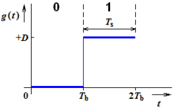
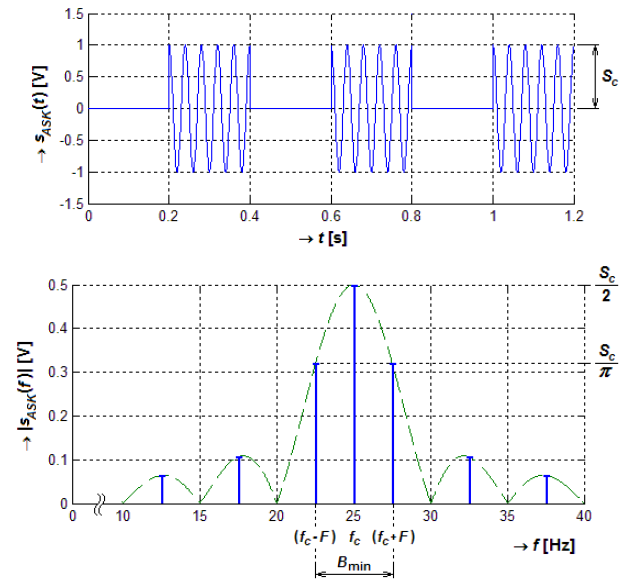
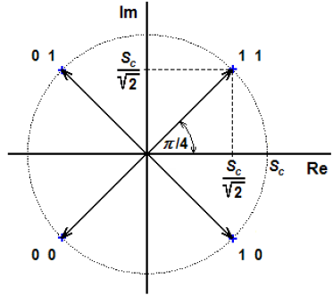

Signály ve sdělovacích systémech (se spojitým a diskrétním časem), základní typy binárních signálů (unipolární a bipolární, RZ a NRZ). Sdělovací soustava (obecné blokové schéma). 
===================================================================================================================================================================================

Rozdělení signálů:

Spojité -- definovány v každém časovém okamžiku

Analogové -- spojité funkce

{width="2.15625in"
height="1.0871358267716535in"}

Impulzní -- **ne**spojité funkce

{width="2.0625in"
height="1.0660115923009623in"}

Diskrétní -- pouze v periodicky se opakujících momentech

Analogové -- nekvantované posloupnosti

{width="2.09375in"
height="1.05870406824147in"}

Číslicové -- kvantované posloupnosti

{width="2.258274278215223in"
height="1.09375in"}

Základní typy binárních signálů (unipolární a bipolární, RZ a NRZ)
------------------------------------------------------------------

Binární signály vyjadřují posloupnost jedniček a nul. Dělí se na
unipolární, bipolární, s návratem k nule, bez návratu k nule. Pro přenos
0 a 1 na velké vzdálenosti se však nemusí příliš hodit z přílišně velké
šířky spektra, existence stejnosměrné složky, poměru špičkového a
středního výkonu, nebo kvuli tendenci tvorby dlouhých úseků signálu
s konstantní hodnotou.

Pro dálkové přenosy se proto používají linkové kódy.

Druhy binárních signálů:

Unipolární NRZ -- pouze jedna polarita, bez návratu k nule

{width="1.6041666666666667in"
height="1.0154319772528433in"}

Unipolární RZ -- pouze jedna polarita, s návratem k nule

{width="1.5833333333333333in"
height="0.990246062992126in"}

Bipolární NRZ -- 0 -- jedna polarita, 1 -- opačná polarita. Bez návratu
k nule

{width="1.4583333333333333in"
height="1.0553718285214349in"}

Bipolárná RZ -- 0 -- jedna polarita, 1 -- druhá polarita, vždy se vrátí
na nulovou úroveň

{width="1.6666666666666667in"
height="1.2233442694663168in"}

Obecné blokové schéma digitálního komunikačního systému
-------------------------------------------------------

2) Linkové kódy (AMI, HDB3, 2B1Q, 4B3T, kódy typu mBnB), požadované vlastnosti linkových kódů. Modulační a přenosová rychlost, vztah mezi modulační rychlostí a potřebnou přenosovou šířkou pásma kanálu. 
==========================================================================================================================================================================================================

Linkové kódy (AMI, HDB3, 2B1Q, 4B3T, kódy typu mBnB)
----------------------------------------------------

Digitální přenos v základním pásmu (není modulován na nosnou o vyšší
frekvenci). Slouží k reprezentaci digitálních symbolů pro přenos na
dálku.

### AMI

Alternate mark inversion. Bipolární kódování, 0 -- nulová úroveň, 1 --
střídavě kladná nebo záporná úroveň. V praxi spíše MAMI, kde je to
s úrovněmi naopak (u ISDN)

{width="2.46875in"
height="0.8248807961504812in"}

### HDB3

High density bipolar. Vychází z AMI. Nesmí však po sobě následovat tři
intervaly trvání bitu Tb s úrovní 0 -- předcházení ztrátě synchronizace.

Případná čtvrtá 0 je vyjádřena impulzem **V** **stejné** polarity(to
odliší, že nejde o další 1), jakou měl předcházející impulz. Aby se tím
nezvyšovala ss složka signálu následuje druhé pravidlo

Pokud mezi dvěma po sobě následujícími impulzy **V** není lichý počet 1,
je první z následující skupiny čtyř 0 vyádřena impulzem **B** opačné
polarity, než **V**

Využito v ISDN u primárního účastnického přístupu.

{width="3.3229166666666665in"
height="0.8882360017497812in"}

### 2B1Q

Vícestavový kód, využívající 4 úrovně signálu. Jedna úroveň je
zastoupena dvěma bity. Sousedící kombinace se liší jen v jednom bitu --
to minimalizuje bitovou chybovost.

Jedním signálovým prvkem jsou přeneseny 2 bity, platí:

$$M = \frac{1}{T_{s}} = \frac{1}{2T_{b}} = \frac{R}{2}$$

Využito například u základní přípojky ISDN

{width="4.770833333333333in"
height="1.606580271216098in"}

### 4B3T (?)

Další vícestavový kód, má 3 úrovně, +U, 0, -U.

Vstupní posloupnost je rozdělena po 4 bitech. Ty jsou kódovány kombinací
tří signálových prvků. A dál to nejde pochopit.

$$M = \frac{3}{4}R$$

### mBnB

Zpráva je rozdělena do m-bitových skupin. Každé skupině je pak přidělena
n-bitová značka kódu. Platí, že m \< n. Z těchto značek je vypočítaná
disparita(1 substitujem za **+1**, 0 substitujem za **-1** ... součet je
potom hodnota disparity) Kódování probíhá podle módu 1, dokud se
nevyskytne výstupní značka s disparitou 2. Po této značce probíhá
kódování podle módu 2, dokud není použita značka s disparitou -2. Od
této značky opět podle módu 1.

{width="4.104166666666667in"
height="1.8068832020997376in"}

Tohle střídání pomáhá minimalizovat stejnosměrnou složku výsledného
signálu a zároveň se zde nevyskytují delší úseky stejné úrovně. Pokud
přijímač přijme značku, kterou nemá v kódovací tabulkce, znamená to že
nastala chyba při přenosu.

Požadované vlastnosti linkových kódů
------------------------------------

Vlastnosti:

Minimalizace stejnosměrné složky signálu (ta se blbě přenáší --
energeticky náročné, nebo nemožné z principu přenosového systému --
galvanické oddělení)

Zabrání vzniku delších časových úseků o stejné úrovni (ty vedou ke
ztrátě synchronizace)

Určitá základní detekce chyb, vzniklých přenosem

Modulační a přenosová rychlost
------------------------------

### Modulační rychlost

Počet signálových prvků za sekundu, Ts je doba trvání jednoho symbolu.

$$M = \frac{1}{T_{s}}\lbrack Bd\rbrack$$

### Přenosová rychlost

Počet bitů za sekundu, Tb je doba trvání bitu

$$R = \frac{1}{T_{b}}\lbrack b/s\rbrack$$

Pokud je doba trvání signálového prvku větší, než doba trvání bitu,
platí vzájemný vztah:

Q je celkový počet možných stavů signálu

$$R = M \bullet \log_{2}Q\lbrack b/s\rbrack$$

Vztah mezi modulační rychlostí a potřebnou přenosovou šířkou pásma kanálu.
--------------------------------------------------------------------------

Pro unipolární signál bez návratu k nule, přenášející sekvenci 01010101
... bude mít signál nejširší spektrum, které bude tvořeno pouze lichými
harmonickými. Základní kmitočet je při přenosu signálu
$f_{0} = \frac{1}{T_{0}} = \frac{1}{2T_{s}}$. Čím větší bude šířka pásma
(víc přenesených harmonických), tím se výstup bude více blížit
obdélníkovému průběhu. Nejhůř však stačí:

$$B_{\min} = f_{1} = \frac{1}{2T} = \frac{M}{2}$$

Pokud bude šířka pásma menší, než Bmin, kanálem neproje žádná harmonická
složka signálu a přenos bude ukončen.

{width="3.8958333333333335in"
height="2.4924398512685912in"}

3) Rušivé signály ve sdělovací soustavě, přenos zarušeného binárního signálu v základním pásmu kanálem s AWGN, pravděpodobnost chybného příjmu, snižování pravděpodobnosti chybného příjmu (opakovaný přenos, použití přizpůsobeného filtru, korelační přijímač). 
==================================================================================================================================================================================================================================================================

Přenos zarušeného binárního signálu v základním pásmu kanálem s AWGN
--------------------------------------------------------------------

Model s jediným rušivým vlivem -- bílý šum (konstantní výkonová
spektrální hustota). Okamžité hodnoty šumu mají Gaussovo rozdělení
hustoty. Model kanálu s šumem:

{width="3.1875in"
height="1.3364468503937008in"}

Model přenosu zarušeného binárního signálu v základním pásmu:

{width="4.25in"
height="0.8006222659667541in"}

Signál před a po přičtení šumu vypadá následovně:

{width="3.6041666666666665in"
height="2.8886570428696414in"}

Pravděpodobnost chybného příjmu
-------------------------------

Okamžitá hodnota ve chvíli rozhodování o hodnotě signálu je součet
užitečného binárního signálu a aktuální hodnoty rušivého signálu.
Hodnoty rušivého signálu mají normální rozdělení. Pokud je
pravděpodobnost přijetí 0 a 1 stejná, je pravděpodobnost přijetí
chybného binárního znaku:

$$P_{\text{ch}} = F_{0}\left( \frac{D_{0} - D_{1}}{2\sigma} \right)$$

D0, D1 jsou hodnoty, kterých nabývá užitečný signál při 0, nebo 1

F0 je distribuční funkce -- převod hodnot z tabulek

$\sigma$ je směrodatná odchylka

Určení optimální hodnoty rozhodovací úrovně:

$$h_{\text{opt}} = \frac{D_{0} + D_{1}}{2}$$

Snižování pravděpodobnosti chybného příjmu (opakovaný přenos, použití přizpůsobeného filtru, korelační přijímač).
-----------------------------------------------------------------------------------------------------------------

Několik způsobu:

### Opakovaný přenos

Vysílač signálový prvek **k-***krát* zopakuje. Přijímané vzorky jsou pak
hodnoty opakovaných impulzů sečtené s aktuálními hodnotami šumu.

Odstup signál-šum je opakováním navýšen o hodnotu 10 log **k** oproti
SNR jednoho vzorku, tedy:

$$S\text{NR}_{k} = 10 \bullet \log k + \text{SNR}_{1}$$

### Přizpůsobený filtr 

Na jeho vstup se přivádí signál x(t), který je součtem užitečného
signálu s(t) a bílého aditivního šumu s normálním (Gaussovým)
rozdělením. Pokud se jedná o užitečný signál v podobě bipolárního NRZ
signálu, má přizpůsobený filtr tu vlastnost, že v určitém okamžiku,
během každé bitové periody, dosáhne maximálního SNR. Tento okamžik
nastává vždy v době t = T, kde t je doba integrace a T je symbolová
perioda. Za tímto filtrem následuje vzorkovač, který právě v době t
navzorkuje signál a pomocí rozhodovacího obvodu, jenž následuje, se
rozhodne na základě stanovené optimální rozhodovací úrovně l o výsledném
stavu. Pokud má vzorek větší úroveň než je úroveň rozhodovací, objeví se
na výstupu vysoká úroveň, která vypovídá o tom, že kromě šumu je na
vstupu přizpůsobeného filtru i užitečný signál odpovídající přenášenému
bitu 1. Pro úrovně menší než úrovně rozhodovací platí vše obráceně, což
znamená, že se na výstupu objeví nízká úroveň odpovídající přenášenému
bitu 0.

{width="4.424527559055118in"
height="0.8081397637795276in"}

### Korelační přijímač

Na vstupu korelačního přijímače je analogová násobička spolu s
integrátorem plnící funkci

korelátoru. Vstupní signál x(t) je tak korelován se známou replikou
užitečného signálu s(t),

který je uložen v paměti přijímače. V případě bipolárního NRZ signálu
lze tento korelátor

realizovat pomocí vybíjeného integrátoru. Jde o integrační článek, jenž
je nastaven na nulovou hodnotu v době t = T, kde t je doba integrace a T
je symbolová perioda. Dále je pak rozhodování stejné jako v předchozím
případě u přizpůsobeného filtru. Vzorek je odebírán před nastavením
integrátoru na nulovou hodnotu a rozhodování o výsledném stavu probíhá
na základě stanovené optimální rozhodovací úrovně.

{width="4.584904855643044in"
height="1.1462259405074366in"}

### Porovnání

{width="4.669812992125984in"
height="3.7937095363079614in"}

4) Amplitudová, kmitočtová a fázová modulace (AM, FM, PM). Amplitudové a kmitočtové klíčování (ASK, FSK). Dvoustavové fázové klíčování (BPSK), demodulace signálu BPSK součinovým demodulátorem, způsoby obnovy nosné v přijímači BPSK signálu, vztažné fázové klíčování (DPSK). Klíčování QPSK, 8PSK, OK-QPSK, MSK, FFSK, GMSK, pi/4-DQPSK, MQAM, vektorové a konstelační diagramy. 
=====================================================================================================================================================================================================================================================================================================================================================================================

Amplitudová, kmitočtová a fázová modulace (AM, FM, PM)
------------------------------------------------------

Modulace -- ovlivňování některého z parametrů nosného signálu(amplituda,
fáze, frekvence) signálem modulačním.

### AM

Amplitudová modulace. Ovlivňování amplitudy nosné modulačním signálem.
Modulační signál, nosná a amplitudové spektrum AM:

{width="4.0527679352580925in"
height="5.452830271216098in"}

Zvláštní případy AM:

{width="4.622641076115485in"
height="2.8325907699037622in"}

{width="6.295834426946632in"
height="1.7481496062992126in"}

### FM

Modulačním signálem je ovlivňován okamžitý kmitočet nosného signálu.

{width="4.075471347331583in"
height="2.6345767716535433in"}

### PM

Modulačním signálem ovlivňována počáteční fáze nosného signálu.
{width="4.547169728783902in"
height="2.866694006999125in"}

Amplitudové a kmitočtové klíčování (ASK, FSK)
---------------------------------------------

### ASK

Změnou amplitudy vyjádřená přenášená hodnota 0/1 a kmitočtové spektrum:

{width="4.188678915135608in"
height="3.9398140857392825in"}

{width="5.150001093613298in"
height="2.801504811898513in"}

Modulační rychlost $M = \frac{1}{T_{s}}$

Minimální potřební šířka pásma $B_{\min} = 2F = M$

Sudé postranní složky jsou nulové

Výsledný signál je součin obdélníkového modulačního signálu a
harmonického nosného.

### FSK

Binární symboly 0 a 1 jsou vyjádřeny kmitočty f0 a f1. Změny kmitočtu
mohou probíhat:

Spojitě -- přepínáním kmitočtu na jednom oscilátoru, nenastává skoková
změna fáze a to se dobře projeví na spektru.

Nespojitě -- přepínáním nezávislých oscilátorů, fáze se mění skokem

Minimální šířka pásma
$B_{\min} = f_{0} - f_{1} + 2F = f_{0} - f_{1} + M$

{width="4.74in"
height="3.391461067366579in"}

Dvoustavové fázové klíčování (BPSK)
-----------------------------------

Složka na nosném kmitočtu a sudé postranní složky jsou nulové.

Minimální šířka pásma $B_{\min} = 2F = M$

{width="2.726415135608049in"
height="1.2103554243219599in"}{width="3.4056594488188976in"
height="1.2060126859142608in"}

Demodulace signálu BPSK součinovým demodulátorem
------------------------------------------------

Na výstupu demodulátoru dostáváme zesílený modulační signál

{width="3.23584864391951in"
height="1.2606332020997375in"}

Způsoby obnovy nosné v přijímači BPSK signálu
---------------------------------------------

Nedá se přímo použít klíčovaný signál BPSK, jeho fáze se mění podle
modulace. Umocněním tohoto signálu získáme signál nezávislý na
modulačním signálu. Tento přivedeme na dělič kmitočtu. Výstupem je
požadovaný nosný signál, jehož fáze je 0° nebo 180°, podle toho kde se
dělič chytne. Další metody:

Umocňující smyčka

Costasova smyčka

Vztažné fázové klíčování (DPSK)
-------------------------------

Jedničky a nuly jsou vyjádřeny obrácením počáteční fáze klíčovaného
signálu. Porovnání s BPSK:

{width="4.688678915135608in"
height="2.7242093175853017in"}

Při přenosu může dojít k nežádoucí změně počáteční fáze obnovené nosné.
To se projeví pouze izolovanou chybou a ne inverzí celého následujícího
průběhu

Klíčování QPSK, 8PSK, O-QPSK, MSK, FFSK, GMSK, pi/4-DQPSK, MQAM
---------------------------------------------------------------

### QPSK

Kvadraturní fázové klíčování. Každému signálovému prvku odpovídá dvojice
bitů. Celkem 4 signálové prvky jsou každý vyjádřený nosnou vlnou
s odlišnou počáteční fází. V konstelačním diagramu se fáze signálových
prvků liší vždy o π/2 rad (čtvrtka kruhu)

{width="1.5660378390201224in"
height="1.3897003499562555in"}

### 8PSK

Přenášejí se 3 bity a je definováno 8 diskrétních hodnot fáze. Používá
se v EDGE.

{width="1.73in"
height="1.6712084426946632in"}

### O-QPSK

Offset-QPSK. Nedochází zde ke změnám počáteční fáze o π rad, ale pouze o
π/2 rad. Menší skoky mají příznivý vliv na šířku spektra klíčovaného
signálu.

### MSK

Minimum shift keying. Zvláštní případ FSK se spojitou fází -- na
rozhraních signálových prvků se nevyskytují žádné fázové skoky.

{width="3.65in"
height="1.4500010936132983in"}

### FFKS

Fast frequency shift keying -- MSK s diferenčním kodérem na vstupu.
Kódování zajišťuje přímou souvislost mezi kmitočtem signálových prvků a
datovou posloupností.

### GMSK

Gaussian minimum shift keying -- opět klíčování se spojitou fází. Místo
sinusoidy však využívá tvaru Gaussovy křivky. Využívá se v GMS.

### Pi/4 - DQPSK

Differential quadrature phase shift keying. Systémem se přenáší
informace o diferenciálních úhlech místo absolutních hodnot fázových
úhlů.

### MQAM

Kvadraturní amplitudová modulace využívá vyšší počet signálových prvků a
kvadraturní způsob modulace jako u QPSK.

{width="2.6698118985126857in"
height="2.260158573928259in"}

Konstelační diagramy a diagramy přechodů (vektorové diagramy) (?)
-----------------------------------------------------------------

5) Působení aditivního rušení na sdělovací signály v přeloženém pásmu (úzkopásmový šum, poměr S/N u AM a FM, pravděpodobnost chybného příjmu u základních klíčování). 
======================================================================================================================================================================

### Úzkopásmový šum

Je takový šum, pro který platí: Šířka pásma podělená frekvencí šumu je
mnohem menší než 1:

$$\frac{B}{f_{0}} \ll 1$$

{width="2.9716994750656167in"
height="1.1857972440944882in"}
{width="3.2327909011373577in"
height="1.202318460192476in"}

### Poměr S/N u AM a FM

**AM** -- Porovnání středních výkonů užitečného signálu a šumu před a za
demodulátorem:

$$\left( \frac{P}{N} \right)_{výst} = 2\left( \frac{P}{N} \right)_{\text{vst}}$$

**FM** -- Vztah mezi poměry signál-šum na vstupu a na výstupu
demodulátoru:

$$\left( \frac{P}{N} \right)_{výst} = 3\left( \frac{\text{Δω}}{\Omega_{m}} \right)^{3}\left( \frac{P}{N} \right)_{\text{vst}}$$

### Pravděpodobnost chybného příjmu u základních klíčování

ASK

Pokud jsou pravděpodobnosti výskytu 0 a 1 stejné, je rozhodovací hladina
$h = \frac{S_{c}}{2}$

Pravděpodobnost chybného příjmu je dána vztahem:

$$P_{\text{ch}} = F_{0}\left( - \frac{S_{c}}{2\sigma} \right)$$

FSK

V demodulátoru jsou dvě pásmové propusti. Každá je naladěná na jiný
úhlový kmitočet ω. Jeden odpovídá 0, druhý 1. Signál jedničky tvoří
součet harmonického signálu a šumu. Nule odpovídá jen šum. Rozhodovací
obvod rozhodne, zda se jedná o 0 nebo 1.

$$P_{\text{ch}} = F_{0}\left( - \frac{S_{c}}{\sqrt{2\sigma}} \right)$$

BPSK

Pokud je pravděpodobnost příjmu 0 a 1 stejná, je rozhodovací úroveň
$h = 0$ a:

$$P_{\text{ch}} = F_{0}\left( - \frac{S_{c}}{\sigma} \right)$$

DPSK

Dána souštem pravděpodobností dvou jevů. Prst. že prvek byl přenesek
správně a předchozí chybně **a** prst. že daný prvek byl přenesen chybně
a předchozí správně. Zjednodušený vzorec, který z ověření v praxi stačí:

$$P_{\text{ch}} = 2F_{0}\left( - \frac{S_{c}}{\sigma} \right)$$

### Shrnutí

BPSK je nejodolnější proti šumu

Nejméně odolné je ASK

Uvažujeme pouze AWGN -- bílý šum. V praxi je chybovost ovlivněna
spoustou dalších faktorů, viz nedokonalá kmitočtová filtrace vysílače i
přijímače, fázový šum oscilátorů, nelinearita výkonových stupňů,
vícecestným šířením, ...

6) Mezisymbolové přeslechy a jejich potlačení (tvarovací filtry). Diagram oka. Taktová synchronizace (detektor přechodů, early/late gate). Účel skramblování, druhy skramblerů (blokové schéma skrambleru a deskrambleru SSS a DSS). 
=====================================================================================================================================================================================================================================

Mezisymbolové přeslechy a jejich potlačení (tvarovací filtry)
-------------------------------------------------------------

Vzniká lineární zkreslení od průchodu kanálem. Toto zkreslení se u
digitálních signálů projevuje časovým rozšířením signálových prvků -- to
vede k mezisymbolovým přeslechům

{width="4.254716754155731in"
height="1.5200120297462818in"}

Tvarovací filtry:

Dolní propust

{width="3.6320767716535434in"
height="1.9069192913385826in"}

Činitel tvaru $\alpha = \frac{B - B_{0}}{B_{0}}$ nabývá hodnot
0$< = \alpha < = 1$.

B -- absolutní šířka pásma, B0 -- minimální Nyquistova šířka pásma pro
obdélníkové spektrum a -6dB šířka pásma (poloviční amplituda) pro
modifikované kosinusové spektrum.

Ideální dolní propust

Reálná dolní propust

Gaussovské dolní propusti

{width="2.452830271216098in"
height="1.4550699912510936in"}

Α určuje -3dB šířku pásma.

Ekvalizace -- účinnost ekvalizace je minimalizace mezisymbolových
přeslechů

Diagram oka
-----------

Používá se pro určení hladiny nad kterou znamená přijímaný signál 1 a 0.
Oko rozhodnutí, neboli rozhodovací oblast, představuje plochu, kterou v
době Ts vyhrazené jednomu symbolu vymezí posloupnost všech symbolů,
které se ve sledované době nějak projeví.

Základní parametry, které se u diagramu určují, je otevření oka a šířka
oka. Otevření oka charakterizuje vzdálenost mezi úrovní log1 a log0. Čím
je otevření větší, tím je pravděpodobnost vzájemné záměny log1 za log0
menší.

Vlivem rušení se rozhodovací oblast zmenšuje. Zmenší-li se otevření okna
(výška detekční oblasti) na 0, okno se uzavře. To může nastat v případě
že rozkmit r=A/2.

{width="3.45in"
height="2.1341929133858266in"}

Ideální hodnota odstupu signál šum je **6dB**. (Ar = 20log(A/r)).
Rozhodovací úroveň se volí v polovině oka rozhodnutí.

Taktová synchronizace (detektor přechodů, early/late gate)
----------------------------------------------------------

### Detektor přechodů

{width="2.9716983814523186in"
height="3.768705161854768in"}

### Early/late gate

{width="4.123655949256343in"
height="5.075471347331583in"}

Účel skramblování, druhy skramblerů (blokové schéma skrambleru a deskrambleru SSS a DSS).
-----------------------------------------------------------------------------------------

Skramblery:

odstraňují periodicity v binárních posloupnostech -- signál získá
pseudonáhodný charakter, to vede k eliminaci výrazných maxim ve
výkonovém spektru.

Odstranění úseků signálu s konstantní úrovní -- bezpečnější taktová
synchronizace

V přijímači obnovují původní posloupnost deskramblery

Druhy:

SSS -- self-synchronous scrambling -- samostatně synchronizované

DSS -- distributed sample scrambling -- s rozprostřeným vzorkováním

FSS -- frame synchronous scrambling -- rámcově synchronní

### SSS

Skramblovací polynom ovlivňuje parametry vytvořeného pseudonáhodného
signálu. Využívá se modulo 2 (XOR). Na výstupu deskrambleru je původní
posloupnost.

{width="3.7924529746281714in"
height="2.181330927384077in"}

### DSS

{width="4.386793525809273in"
height="1.328804680664917in"}

7) Příčiny vzniku přenosových chyb a způsoby protichybového zabezpečení (ARQ, FEC). Účel a metody prokládání (interleavingu). Účel a obecný princip ekvalizace kanálu, adaptivní lineární ekvalizér, ekvalizér DFE, Viterbiho ekvalizér (MLSE). 
================================================================================================================================================================================================================================================

Příčiny vzniku přenosových chyb a způsoby protichybového zabezpečení (ARQ, FEC)
-------------------------------------------------------------------------------

Příčiny vzniku přenosových chyb:

Aditivní šum

Mezisymbolové přeslechy

Nepřesná bitová synchronizace (zvýrazňuje pak obě předchozí příčiny)

Způsoby protichybového zabezpečení:

FEC -- dopředné potlačení chyb. Principem je přidání redundantních bajtů
do posloupnosti vyslaných dat. To umožní detekci a opravu určitého počtu
chyb. Tyto redundantní bajty tvoří jen zlomek vysílaných dat.

Např. využití Reed-Solomonova kódu -- vhodný proti shlukuvým chybám,
režie 6,7 % objemu dat

ARQ

{width="4.754716754155731in"
height="1.4650634295713036in"}

Účel a metody prokládání (interleavingu)
----------------------------------------

Ochrana proti shlukovým chybám, způsobených při přenosu. Bity, nebo i
několikabitové symboly z FEC jsou v prokladači zpožděny o různý čas --
tím se jednotlivé symboly oddělí a nejsou těsně zasebou. Shluk chyb je
pak rozprostřen do více kódových slov a izolované chyby je již
jednodušší a možné opravit. Metody:

Blokové prokládání -- jednotlivá slova neposíláme v původním pořadí, ale
prokládáme je s bajty sousedních kódových slov (pošlem první bajt
z každýho, pak druhý bajt z každýho, ...) v přijímači jsou přijaté bajty
poskládány zpět do původního pořadí aby tvořily slova. Případná shluková
chyba se tedy rozdělí na menší části do všech slov a tyto menší části je
možné opravit.

Konvoluční prokládání -- stejně jako blokové, avšak ve vysílači jsou
kódová slova ještě vzájemně posunuta. To má za následek nižší dopravní
zpoždění.

Diagonální prokládání

Interblokové prokládání

Účel a obecný princip ekvalizace kanálu
---------------------------------------

Ekvalizace potlačuje kmitočtové(lineární) zkreslení vzniklé přenosem.
Toto zkreslení se u digitálních signálů projevuje časovým rozšířením
signálových prvků, které vede k přeslechům. Ekvalizace minimalizuje
Mezisymbolové přeslechy.

Princip:

Ekvalizační obvod s přenosovou funkcí je zařazen na výstup kanálu. Tato
přenosová funkce musí kompenzovat přenosovou funkci kanálu. Ekvalizační
obvod je také označován jako inverzní ekvalizační filtr.

Adaptivní lineární ekvalizér
----------------------------

{width="4.056604330708661in"
height="0.9157764654418198in"}

Pracuje ve 2 režimech.

Trénovací režim -- vysílač odesílá trénovací posloupnost. Ta je
zkreslena přenosovou funkcí kanálu. Adaptivní filtr od přijatého signálu
odečte známou trénovací posloupnost a dostane chybový signál. Podle něj
pak nastaví parametry filtrace.

Režim sledování -- po nastavení parametrů filtrace, při vysílání datové
posloupnosti. Na výstupu ekvalizéru se tato datová posloupnost jen málo
liší od vyslané vysílačem

Ekvalizér DFE
-------------

S rozhodovací zpětnou vazbou. Využívá předchozí detekované symboly
k eliminaci mezisymbolových přeslechů v aktuálně přijímaném symbolu.

Myšlenka -- podle známého symbolu na výstupu rozhodovacího obvodu můžeme
zpětnovazebním filtrem získat Mezisymbolové přeslechy. Ty pak odečteme
od následně přijatých symbolů. Chybový signál získáme odečtením
opravdového tvaru signálu symbolu od tvaru přijatého signálu symbolu.

Nejsou tak citlivé na aditivní šum

Fungují i u signálů, přenášejících nulové hodnoty

Příliš citlivé na rozhodovací chyby. Chybně odhadnutý symbol ovlivní
rozhodování u následných přijatých symbolů -- vznik shlukových chyb.

{width="3.392840113735783in"
height="1.726415135608049in"}

Viterbiho ekvalizér (MLSE)
--------------------------

Vypočítává nejvíce pravděpodobný odhad sekvence symbolů MLSE.

Porovnává reakci kanálu na vysílanou sekvenci určitého počtu symbolů
s reakcemi odhadnutého modelu kanálu na všechny možné kombinace stejného
počtu symbolů.

Nejpravděpodobnější sekvence je Viterbiho algoritmem vybrána.

Zaručuje nejnižší pravděpodobnost chyby

Pro vícestavové symboly se stává příliš výpočetně složitým.

Využit v systému GSM

{width="4.541666666666667in"
height="2.9166666666666665in"}

8) Impulzové modulace (PAM, PDM, PPM, PWM), přirozené a uniformní vzorkování, vzorkování sample&hold, aperturové zkreslení. Číslicové vyjádření analogových signálů (vzorkování, kvantování, kvantizační šum, kompandory), kódované impulzové modulace (PCM, DPCM, DM, SDM ). 
==============================================================================================================================================================================================================================================================================

Nekódované impulzové modulace (PAM, PWM, PPM)
---------------------------------------------

### PAM

Pulzně amplitudová modulace

Přirozené vzorkování -- intervaly snímání kopírují snímaný průběh

Uniformní vzorkování -- intervaly snímání mají amplitudu snímaného
průběhu v jednom časovém okamžiku

{width="4.792451881014873in"
height="0.8843219597550306in"}

### PWM

Pulzně šířková modulace

Symetrická -- oboustranná. Mění se poloha vzestupné i sestupné hrany
impulzů

Asymetrická -- jednostranná. Mění se pouze poloha (většinou) vzestupné
hrany

{width="4.150943788276465in"
height="1.626609798775153in"}

Spektrum PWM obsahuje nekonečné množství harmonických složek.

### PPM

Pulzně polohová modulace. Hodnota signálu je vyjádřena časovou polohou
impulzu v rámci jedné vzorkovací periody. Využívá se v optických
systémech -- případná vidová disperze způsobuje jen zanedbatelné
Mezisymbolové přeslechy.

Vzorkování sample&hold
----------------------

Sejmutí hodnoty snímaného průběhu a zachování této hodnoty po dobu
trvání signálového prvku. V dalším okamžiku snímání sejmuta nová
hodnota, která je následně stejně zachována.

Výsledkem je schodovitý signál -- dochází ke zkreslení původního signálu
(vadnutí spektra).

Potlačit zkreslení lze zvýšením frekvence snímání.

{width="4.575479002624672in"
height="1.4716983814523183in"}

Aperturové zkreslení
--------------------

Viz vzorkování Sample&Hold -- vadnutí spektra. Demodulací signálu za
použití **dolní propusti** nezískáme původní modulovaný signál, ale
pouze zkreslenou repliku (přijdeme o vyšší harmonické).

{width="2.5566032370953633in"
height="3.984122922134733in"}

Kódované impulzové modulace (PCM, DPCM, DM, ADM, SDM )
------------------------------------------------------

### PCM

Pulzně kódová modulace

{width="5.518867016622922in"
height="0.8711450131233596in"}

Na vstupu zpravidla Sample&Hold vzorkovač. Kvantizátor tvoří diskrétní
hodnoty kvantizačních hladin. Tyto hodnoty jsou kódovány příslušnou
posloupností bitů.

### DPCM

{width="5.05625in"
height="0.98125in"}Vztažná impulzová kódová modulace. Vhodné pro podobné
po sobě jdoucí hodnoty vzorků. Přenáší pouze rozdíly po sobě jdoucích
vzorků -- ty jsou menší, než celé hodnoty vzorků. To vede k potřebě
menšího počtu kvantovacích hladin a menšího počtu bitů než u PCM.

Přenášením rozdílů však dochází ke kumulaci chyb oproti PCM, kde se
projeví jen na okolních vzorcích.

### DM

Delta modulace. Využívá schodovité aproximace. Jak se modulovaný signál
změní o polovinu velikosti schodu, je vzorkování aproximováno nahoru,
nebo dolů podle průběhu modulovaného signálu. Výstupem jsou potom
impulzy kladné nebo záporné hodnoty, podle toho, kterým směrem se
modulovaný průběh mění. Pokud se úroveň modulovaného signálu nemění, tak
pořád dochází ke střídavé schodovité aproximaci (tvoří granulační šum)

{width="2.7358497375328086in"
height="0.9766426071741032in"}

Zkreslení nastává při:

tzv. přetížení DM kodéru, kdy se modulovaný signál prudce mění a
schodovitá aproximace jej nestíhá sledovat. Toto lze minimalizovat ale
ne zcela odstranit vyšší vzorkovací frekvencí.

Konstantní hodnotě modulovaného signálu -- aproximace stále probíhá
(schodový průběh skáče tam a zpět) a dochází k tvorbě *granulačního
šumu*

DM modulace se hodí jen pro digitalizaci signálů s nízkým mezním
kmitočtem. U vyšších kmitočtů by musela být vzorkovací frekvence
neúnosně vysoká,

### ADM (?)

### SDM

Snižuje pravděpodobnost přetížení z DM. Integruje modulační signál.

{width="6.113207567804024in"
height="0.96832895888014in"}

Kvantování (rovnoměrné, nerovnoměrné)
-------------------------------------

**Rovnoměrné** -- kvantovací hladiny jsou rozloženy *ekividistantně* --
se stejným kvantizačním krokem. Hodnoty jsou pak buď zaokrouhleny nebo
useknuty k nejbližší kvantizační hladině.

**Nerovnoměrné** -- kvantizační hladiny jsou v oblasti nízké amplitudy
rozmístěny s nižším kvantovacím krokem (blíže k sobě), než v oblasti
vysoké amplitudy, zde jsou od sebe více vzdáleny. To se dělá za účelem
získání stejného SNR (odstup signál-šum) v celém rozsahu A/D převodníku.

Nerovnoměrný Kvantizátor by byl příliš složitý. Využívají se tedy
kompresory(expandory na přijímací straně) spolu s rovnoměrnými
kvantizátory -- stejný efekt.

Kvantovací šum
--------------

Vzniká rozdílem mezi skutečnou a kvantovanou hodnotou. Kvantovaná
hodnota vzniká zaokrouhlením nahoru nebo dolů k nejbližší kvantovací
hladině.

Kompandory
----------

Kombinace **kompresoru** na vysílací straně a **expandoru** na přijímací
straně. Využívá se k docílení nerovnoměrného kvantování, kdy je za danou
komponentu zařazen lineární kvantizátor. Druhy komprese:

Podle µ-zákona -- severoamerické a japonské telefonní sítě

Podle A-zákona -- evropské telefonní sítě

9) Multiplexy a mnohonásobné přístupy (FDMA, TDMA, ALOHA, CDMA), ortogonální kmitočtový multiplex. Modulace v optoelektronice (OOK, unipolární Manchester, PPM). 
=================================================================================================================================================================

Multiplexy a mnohonásobné přístupy (FD, TD, ALOHA, CD)
------------------------------------------------------

Multiplexy -- Multiplexování/demultiplexování je vratný proces sdružení
signálu do jednoho složeného. Tento je pak přenášen přenosovým kanálem a
v cíli je rozložen na dílčí signály.

Z hlediska komunikačního modelu probíhá na fyzické a spojové vrstvě.
Druhy:

FDM -- s kmitočtovým dělením. Každý dílčí signál má přiděleno kmitočtové
pásmo. Tyto pásma se nepřekrývají a jsou odděleny ochrannými pásmy.

TDM -- s časovým dělením. Obdoba FDM, signály však mají vyhrazený časový
interval (timeslot)

CDM -- s kódovým dělením. Mohou se časově i kmitočtově překrývat při
přenosu společným kanálem. Jsou odlišeny podobou průběhů signálu.
Označovány jako *systémy s rozprostřeným spektrem (SS -- spread
spectrum)*. Varianty:

DS-SS -- s přímou modulací kódovou posloupností

FH-SS -- s rozprostřeným spektrem s kmitočtovým skákáním

Mnohonásobné přístupy -- k umožnění sdílení přenosového média nebo
zařízení. Zahrnují i síťovou vrstvu komunikačního modelu -- jsou schopny
překlenou rozdílné vlastnosti přenosových okruhů.

**FDMA** -- s kmitočtovým dělením. Každý účastník má osobní kmitočtové
pásmo, které nesdílí. Pásma jsou oddělena bezpečnostními intervaly.
Nevyžaduje synchronizaci mezi vysíláním jednotlivých uživatelů.

Jednoduchý

Špatně využívá potenciální přenosovou kapacitu. Nevyužívaný kanál je
zbytečně blokovaný.

**TDMA** -- uživatelům jsou přiděleny periodicky se opakující kanálové
intervaly (timesloty). Vyžaduje synchronizaci mezi vysíláním uživatelů
(aby si do toho navzájem nekecali)

**ALOHA** -- Modifikovaná metoda TDMA. Při kolizi stanice náhodně dlouho
čeká před opakovaným vysíláním. Pakety přenášeny s centralizovaným
řízením.

Při kolizi paketů je vyžadován opakovaný přenos, s náhodně dlouhým
zpožděním.**\
CDMA** -- přístup s kódovým dělením. Využívá DS-SS.

Ortogonální kmitočtový multiplex
--------------------------------

OFDM. Vysílání současně na velkém počtu nosných signálů. Jeden datový
proud původně na jedné nosné se rozdělí na několik nosných. Tím pádem
lze jednotlivé přenosové rychlosti snížit tolikrát, na kolik nových
nosných je rozdělen.

OFDM v základním pásmu využívá BPSK, QPSK, 16QAM, nebo 64 QAM

Intenzitní modulace používané v optoelektronice (OOK, unipolární Manchester, PPM, PWM).
---------------------------------------------------------------------------------------

Modulovanou veličinou je výkon světla. Technicky snažší a rozšířenější
než jiné optoelektronické modulace.

{width="3.4811318897637795in"
height="2.0419630358705163in"}\
{width="3.557286745406824in"
height="2.037736220472441in"}

10) Množství informace, entropie, redundance, přenesená informace, kapacita kanálu, Shannon-Hartleyův teorém. Konvoluční kódování, mřížkově kódovaná modulace
=============================================================================================================================================================

Množství informace
------------------

Množství informace *I* obsažené ve zprávě *z~j~* platí:

$$I\left( z_{j} \right) = - \log_{2}{P\left( z_{j} \right)\lbrack Sh\rbrack}$$

P(z\_j) -- pravděpodobnost výskytu zprávy

Čím menší je pravděpodobnost výskytu nějaké zprávy, tím více je v ní
informace.

Entropie
--------

Střední hodnota množství informace jednoho kódovaného znaku.

**Entropia je miera neusporiadanosti**

$$H\left( Z \right) = \sum_{j = 1}^{N}{P\left( z_{j} \right) \bullet I\left( z_{j} \right)} = - \sum_{j = 1}^{N}{P\left( z_{j} \right) \bullet \log_{2}P\left( z_{j} \right)}\lbrack Sh/znak\rbrack$$

### Maximální entropie

Entropie je maximální, když je pravděpodobnost výskytu všech prvků
stejná.

$$H_{0}\left( Z \right) = - N \bullet \left\lbrack \frac{1}{N} \bullet \log_{2}\frac{1}{N} \right\rbrack = \log_{2}N\lbrack Sh/znak\rbrack$$

### Poměrná entropie

Podíl entropie a maximální entropie, nazýván účinost:

$$H_{p}\left( Z \right) = \mu = \frac{H\left( Z \right)}{H_{0}\left( Z \right)}\lbrack - \rbrack$$

Redundance
----------

Jinak nadbytečnost. Může být užitečná, pokud díky ní můžeme zjišťovat
nebo dokonce opravovat chyby zprávy, např vzniklé přenosem. Přirozená
nadbytečnost zdroje však zbytečně prodluzuje délku zprávy, takže se ji
snažíme potlačit zdrojovým kódováním.

$$R = 1 - H_{p}\left( Z \right) = 1 - \mu = 1 - \frac{H\left( Z \right)}{H_{0}\left( Z \right)}\lbrack - \rbrack$$

Vzájemná (přenesená) informace
------------------------------

Pro kvantitativní hodnocení přenosu informace.

$$I\left( X,Y \right) = H\left( X \right) - H\left( X \middle| Y \right)\left\lbrack \text{Sh} \right\rbrack$$

H(X\|Y) -- tzv. podmíněná entropie.

Kapacita kanálu
---------------

Schopnost kanálu přenášet informaci. Na vstup kanálu připojíme zdroje
s různými rozloženími pravděpodobnosti výskytu znaků. Hledáme maximum
vzájemné informace, což je kapacita kanálu:

$$C = 1 + \left( 1 - P_{\text{ch}} \right)\log_{2}{\left( 1 - P_{\text{ch}} \right) + P_{\text{ch}}\log_{2}P_{\text{ch}}}\lbrack Sh/znak\rbrack$$

P\_ch -- pravděpodobnost chybně přeneseného znaku

Pokud je polovina znaků přenesena správně a polovina chybně, je kapacita
kanálu rovna nule.

Shannon-Hartleyův teorém
------------------------

Schopnost kanálu přenášet informaci je závislá na jeho kmitočtové šířce
*B* a na odstupu signálu od šumu *S/N* -- poměr výkonů užitečného
signálu a šumu. Tut schopnost však není možné neomezeně zlepšovat
zvětšováním šíře kmitočtového pásma propustnosti, protože zvětšování
šířky pásma je zpravidla provázeno zvětšováním výkonu šumu.

Konvoluční kódování
-------------------

Řadí se mezi korekční kódy. Ty umí určit polhu chybného bitu v bloku a
tento bit lze pak opravit. Realizace je složitější, než detekčí kódy.
Vyžadují taky větší počet kontrolních bitů -- zvyšuje redundanci kódu a
snižuje účinnost přenosu. Je výhodnější zabezpečovat delší bloky.

Konvoluční kodéry jsou vybaveny pamětí a kódování úseku zprávy není
určeno jen tímto úsekem, ale také předcházejícím průběhem zprávy.

{width="3.7641502624671914in"
height="2.2168832020997375in"}

Mřížkově kódovaná modulace
--------------------------

Podle hodnoty vstupu se prochází kódovým diagramem a z toho je určena
nová posloupnost.

{width="4.028301618547681in"
height="1.8987029746281714in"}
